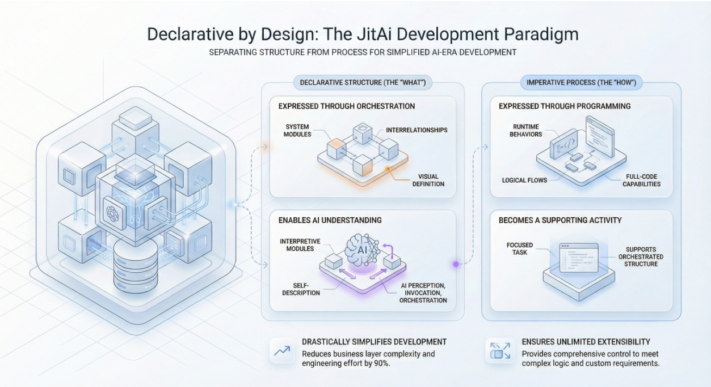

## Introduction

In the rush to adopt **AI**, many engineering teams are hitting a wall. They connect a powerful Large Language Model (LLM) to their codebase via APIs, write extensive prompts, and expect an intelligent **AI agent** that can act like a senior developer or a business operator. Instead, they get a fragile "add-on"—a chatbot that hallucinates business logic, fails to maintain state across transactions, and breaks whenever the underlying API signature changes.

The problem isn't the model's intelligence; it's the architecture. For most LLMs, your application code is a "black box" of text. The AI predicts tokens based on syntax, but it cannot inherently "see" the structural relationships, data flow, or business intent buried within thousands of lines of imperative code. To move beyond simple copilots and build resilient enterprise agents, we must rethink **software architecture** to make business intent machine-readable.

<!--truncate-->

## The "Add-on" Trap: Why Wrappers Break

The dominant paradigm for integrating AI today is the "Wrapper" or "Plugin" approach. Developers treat the AI as an external consultant, feeding it snippets of code or database schemas via a context window and asking it to perform a task.

This approach faces three critical failures in a production environment:

1.  **Context Fragmentation:** An LLM cannot ingest a monolithic codebase in real-time to understand the ripple effects of a business rule change. It sees only the fragment you feed it.
2.  **Semantic Collapse:** Variable names and function signatures (`update_user_v2`) rarely convey the full business constraints (e.g., "users cannot be updated if their account is frozen"). The "intent" is lost in translation between the business requirement and the code implementation.
3.  **Fragile Integration:** When AI is an add-on, it operates outside the system's core runtime. It triggers APIs blindly. If the system structure changes, the AI's "mental model" (the prompt) becomes obsolete instantly.

As noted in recent industry analyses of agentic workflows, the primary bottleneck for autonomous agents is not reasoning capability, but **grounding**—the ability to firmly anchor the AI's actions in the verified state and structure of the system \[Source: Sequoia Capital | Generative AI’s Act Two | 2023 | [https://www.sequoiacap.com](https://www.sequoiacap.com/)\].

## From Code-First to Structure-First

To solve the black box dilemma, architects must elevate **application structure** from an implicit concept (hidden in the architect's mind) to an explicit, first-class citizen that the AI can read, query, and manipulate.

### The Problem with Imperative Code

In traditional development, structure is implicit. A "Customer" entity might be defined across a SQL table, a Python class, a React component, and three different API endpoints. To an AI, these are four disconnected text files. It has to guess the relationship.

### The Solution: Declarative Structure

An AI-native architecture requires a protocol where the system *describes itself*. Instead of inferring relationships from code, the system should expose a metadata layer that explicitly defines:

- **Entities:** "Customer" is a Data Model with specific fields and constraints.
- **Capabilities:** "Approve Order" is a discrete Service Function with defined inputs and outputs.
- **Relationships:** "Order" belongs to "Customer".

When structure is explicit, the AI doesn't need to read every line of code to understand business intent. It reads the map.

## How JitAI Addresses This

**JitAI** fundamentally shifts the development paradigm by making the application structure machine-readable through the **JAAP (JitAI Ai Application Protocol)**. Unlike platforms that bolt AI onto existing codebases, JitAI builds the system around a structural definition that both humans and AI share.

### 1. Application Structure as a First-Class Citizen

In JitAI, an application isn't just a collection of files; it's a structured object graph defined by **Meta** (definition), **Type** (template), and **Instance** (implementation).

- **Self-Describing Elements:** Every element, whether a data model or a service function, has a self-describing configuration (e.g., `e.json`). An AI agent doesn't need to parse Python code to know what a function does; it reads the structured definition in `functionList`, which includes precise input/output specifications and descriptions.
- **Semantic Visibility:** Because the structure is explicit, JitAI's AI agents can "see" the entire application topology. They know that `CustomerModel` is connected to `OrderModel` not because they guessed it from variable names, but because the metadata explicitly declares the relationship.

### 2. Agents as System Participants

JitAI treats AI agents not as external callers but as internal system actors.

- **Direct Manipulation:** Agents can directly invoke **Service Functions** and **Model Functions** as native tools. There is no need to build a separate API layer just for the bot; the internal system functions *are* the tools.
- **Full-Stack Awareness:** Through the interpretive architecture, agents can perceive and manipulate both backend logic and frontend UI components, enabling "Human-AI Collaboration" where the AI can draft a UI form or execute a backend transaction within the same context.

### 3. Structural Guardrails

JitAI enables developers to define **Permission Controls** directly on agent tools. You can restrict an agent's ability to execute high-risk functions (like `delete_database`) based on application roles, ensuring that even if the AI hallucinates an intent, the structural guardrails prevent unauthorized execution.

## Implementation Playbook: Structuring for AI

Even if you aren't using a dedicated platform like JitAI, you can adopt these architectural principles to make your system more AI-friendly.

1.  **Define Explicit Interfaces (The "Tool" Pattern):**
    - Do not let AI generate raw SQL or arbitrary code.
    - Refactor business logic into discrete, atomic functions with strictly typed inputs and outputs (e.g., using Pydantic or TypeScript interfaces).
    - **Action:** Create a `tools.json` manifest that maps business intents to these atomic functions.

2.  **Centralize Metadata:**
    - Maintain a "System Map" that describes your data entities and their relationships in a format independent of the code (e.g., OpenAPI specs or a custom JSON schema).
    - **Action:** Feed this metadata to the AI's system prompt dynamically, ensuring it always knows the current state of the architecture.

3.  **Implement "Reasoning-Action" Loops (ReAct):**
    - Move from single-shot prompts to iterative loops where the AI plans an action, executes a tool, observes the output, and then decides the next step.
    - **Action:** Use frameworks that support state management to keep track of the conversation history and intermediate data execution results.

## Comparison: AI Wrapper vs. AI-Native

The following table highlights the operational differences between wrapping AI around legacy code versus building with an AI-native structure.

| **Feature**     | **AI Wrapper (Traditional)**        | **AI-Native (e.g., JitAI)**     |
| --------------- | ----------------------------------- | ------------------------------- |
| **Visibility**  | Opaque (Code as Text)               | Transparent (Structure as Data) |
| **Integration** | External API Calls                  | Internal System Participant     |
| **Maintenance** | High (Prompt breaks on code change) | Low (Auto-syncs with metadata)  |
| **Context**     | Fragmented / Token Limited          | Holistic / Architectural        |
| **Reliability** | Prone to Hallucination              | Grounded in Defined Tools       |

## How to Verify

To test if your current architecture is suffering from the "Black Box" dilemma:

1.  **The "Rename Test":** Rename a core business function in your code (e.g., change `calculateTax` to `func_123`). If your AI agent stops working or fails to understand the tool's purpose, it relies on surface-level text patterns rather than explicit structural definitions.
2.  **The "Dependency Test":** Ask your AI agent to "delete a user." Does it know it must first check for active orders? An AI-native system with defined relationships would be aware of these constraints through metadata or error handling in the tool definition; a wrapper would likely just try to force the deletion.

## FAQ

Q: Does "AI-Native" mean I have to use a low-code platform?

A: Not necessarily. AI-Native refers to the architecture, not the toolset. However, platforms like JitAI simplify this by enforcing a protocol (JAAP) that handles the structural definitions for you, allowing you to use full-code (Python/React) where necessary while keeping the architecture visible to the AI.

Q: Can AI agents really be trusted with business logic?

A: Only if they are constrained. Agents should never "guess" business logic. They should identify the user's intent and then invoke a deterministic Service Function that executes the logic. The AI handles the interaction; the code handles the transaction.

Q: How does this affect existing development workflows?

A: It requires a shift from writing imperative scripts to defining structured elements. Developers spend less time writing boilerplate and more time defining the capabilities (tools) and permissions that the AI orchestrator will utilize.

## Conclusion

The era of AI as a simple chatbot overlay is ending. To build enterprise-grade **software architecture** that leverages the full power of GenAI, we must break open the black box of our code. By adopting protocols that treat application structure as a first-class citizen, we transform AI from a confused outsider into a competent, integrated collaborator.

Ready to build systems that AI can actually understand?

- [Download JitAI Desktop](https://jit.pro/download) to start building AI-native apps.
- [Explore the Tutorial](https://jit.pro/docs/tutorial) to see JAAP in action.
