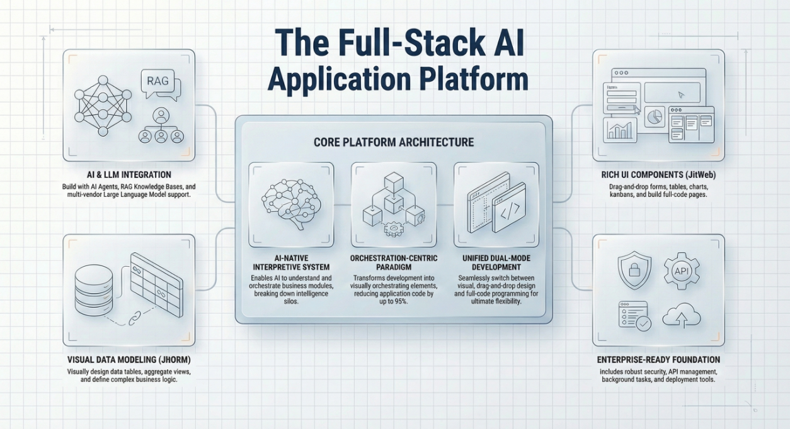

## Introduction

The explosion of low-code AI orchestration tools like Coze, Dify, and n8n has democratized the creation of AI bots. For a senior developer or architect, spinning up a Retrieval-Augmented Generation (RAG) bot that answers FAQs or summarizes PDFs takes mere minutes. However, a significant gap remains between these isolated "bots" and the robust **Enterprise System** requirements of a modern organization.

We call this the "Toy Application" ceiling. It represents the point where a project transitions from a stateless conversational interface to a complex business system requiring transactional integrity, fine-grained role-based access control (RBAC), and deep frontend-backend integration. While tools like **Coze** excel at the former, they often struggle to support the latter, leaving engineering teams in "Pilot Purgatory"—stuck with impressive demos that cannot be operationalized into core workflows.

This article analyzes the architectural limitations of current AI orchestration platforms and explores how to bridge the gap to production-grade AI-native applications.

<!--truncate-->

## The Architecture Gap: Bots vs. Systems

To understand why **AI applications** often feel like toys, we must look at their underlying architecture. Most orchestration tools are designed around a "Chat-First" paradigm.

### The Orchestration Model (e.g., Coze)

In this model, the AI is the center of the universe. The user talks to the AI, and the AI calls "Plugins" or "Workflows" to fetch data.

- **State:** Mostly ephemeral (conversation history).
- **UI:** Rigid chat interface, occasionally enhanced with card widgets.
- **Logic:** Linear DAGs (Directed Acyclic Graphs).
- **Data:** Often relies on external APIs; lacks an internal relational data model.

### The Enterprise System Model

In a real business system (like an ERP, CRM, or custom SaaS), the "Application Structure" is central. The AI is a participant, not just the interface.

- **State:** Persistent, multi-step transactional states (e.g., "Order Pending Approval").
- **UI:** Complex, interactive forms, dashboards, and custom components.
- **Logic:** Event-driven, cyclic, and conditional.
- **Data:** Strictly modeled relational databases with ACID properties.

## Why Orchestration Tools Hit the Ceiling

When you attempt to move a **Coze** bot into a complex business scenario, you encounter three primary friction points.

### 1. The "UI/UX" Disconnect

Business processes rarely happen entirely inside a chat bubble. A user updating a complex pricing table wants a spreadsheet-like interface, not a conversational turn-by-turn exchange.

- **Limitation:** Orchestration tools typically force all interaction through the chat window.
- **Requirement:** Real enterprise apps need AI that can *operate* the UI—navigating pages, highlighting fields, and triggering modal confirmations without user intervention.

### 2. Shallow Integration of Logic

Orchestration tools treat business logic as external "tools" or "skills." This separation creates latency and context loss.

- **Limitation:** The AI sees an API signature (e.g., `updateUser(id, data)`), but it doesn't understand the *implications* of that change on the wider system state.
- **Requirement:** The system needs self-describing elements where the AI understands the *structure* of the application, not just the API endpoints.

### 3. Permission and Security Fragments

In an orchestration tool, you often hardcode API keys for plugins.

- **Limitation:** It is difficult to map a complex organizational hierarchy (Department A vs. Department B) to specific AI actions dynamically.
- **Requirement:** A unified permission model where the AI Agent inherits the strict RBAC policies of the logged-in user.

## Data Comparison: Orchestration vs. Full-Stack AI

The following table qualitatively compares the capabilities of typical AI orchestration platforms against the requirements of a full-stack AI-native business system.

| **Feature Domain**    | **AI Orchestration (e.g., Coze)**     | **Enterprise System (Full-Stack AI)**              |
| --------------------- | ------------------------------------- | -------------------------------------------------- |
| **Primary Interface** | Conversational Chat Window            | Custom UI (React/Vue) + Embedded AI                |
| **State Persistence** | Conversation History (Vector/Session) | Relational Database (SQL) + Transaction Management |
| **Logic Complexity**  | Linear Workflows / Plugins            | Full Backend Services (Python/Java) + Event Bus    |
| **Access Control**    | API Key / Simple Auth                 | Granular RBAC (Row/Column/Function Level)          |
| **Development Mode**  | Prompt Engineering + Drag-and-Drop    | Professional Coding + Visual Orchestration         |
| **Deployment**        | Hosted Bot / Web SDK                  | Docker / Kubernetes / Private Cloud                |

## Implementation Playbook: Breaking the Ceiling

To move from a "toy" to a system, developers must shift their mindset from "building a bot" to "building an app with AI capabilities."

### Step 1: Define the Data Model First

Don't start with the prompt. Start with the database schema. Define your entities (e.g., `Customer`, `Order`, `Inventory`) and their relationships. This provides the "Ground Truth" for your AI.

### Step 2: Decouple Logic from the LLM

Do not ask the LLM to "calculate the tax." Write a deterministic service function (e.g., in Python) to calculate tax. Give the AI the *tool* to call that function.

- **Anti-Pattern:** Prompt: "Please look at this table and tell me the sum."
- **Best Practice:** Tool: `calculate_sum(column_name)`.

### Step 3: Integrate AI into the Frontend

Instead of a standalone chat window, embed the AI into the workflow.

- **Action:** When a user opens a "Purchase Request" form, the AI should proactively analyze the draft and suggest budget codes in the sidebar.
- **Technique:** Use event listeners on frontend components to trigger AI context updates.

## How JitAI Addresses This

JitAI offers a fundamentally different approach by treating the **application structure** as a first-class citizen, enabling the construction of production-grade **Enterprise Systems** rather than just chatbots.

### 1. Structural Understanding (JAAP)

Unlike tools that see "text in, text out," JitAI uses the **JAAP (JitAi Ai Application Protocol)**. This protocol abstracts the complexity of the application structure (Pages, Models, Services) into a format the AI can natively understand.

- **Impact:** The AI doesn't just "guess" which tool to use; it navigates the application's actual object graph, understanding that `OrderModel` is related to `CustomerModel`.

### 2. Full-Stack AI Agents

JitAI Agents are not limited to the backend. They possess "full-stack" capabilities:

- **Frontend Control:** Agents can manipulate the UI directly—filling forms, switching tabs, or highlighting data anomalies in real-time. This achieves true **Human-AI Collaboration** on the interface.
- **Backend Execution:** Agents invoke transactional Python service functions, ensuring data integrity is maintained just like a traditional app.

### 3. Unified "Three-Way" Collaboration

JitAI redefines interaction from "User → AI" to "User ↔ AI ↔ Business System."

- **Scenario:** A user asks, "Delete these 3 inactive customers."
- **JitAI Execution:** The AI identifies the customers via the Data Model, checks the user's RBAC permissions, performs the deletion via a Service Function, and finally triggers a UI refresh to reflect the changes immediately.

By unifying the development of the frontend, backend, and AI logic under one framework, JitAI eliminates the "glue code" typically required to make orchestration tools work in enterprise environments.

## How to Verify Architecture Suitability

Before committing to a platform for your next AI project, perform this "Toy vs. System" stress test:

1.  **The "Undo" Test:** Can the AI execute a multi-step transaction (e.g., "Approve invoice and update inventory") and robustly handle a failure in step 2 by rolling back step 1?
2.  **The "Boss" Test:** Can you restrict the AI so it answers sensitive HR questions for the CEO but refuses the same questions for an intern, using a single system prompt?
3.  **The "UI" Test:** Can the AI proactively open a specific modal window on the user's screen to ask for confirmation, or is it stuck asking "Please type yes"?

If the platform fails these, you are likely hitting the ceiling of an orchestration tool.

## FAQ

Q: Can I use Coze plugins inside an enterprise system?

A: Yes, typically via API calls. You can treat a Coze bot as a specialized "microservice" within a larger system, but it shouldn't host the core business logic or state.

Q: What is the main risk of using orchestration tools for complex apps?

A: The main risk is "State Drift." The conversation history (what the AI thinks happened) and the database (what actually happened) can get out of sync, leading to hallucinations about business data.

Q: Does JitAI replace code entirely?

A: No. JitAI supports a dual-mode approach (Visual Orchestration + Full Code). Complex business logic is often better written in code (Python/TS) and then exposed to the AI, rather than relying on the AI to generate it on the fly.

Q: Why is RBAC hard with standard LLMs?

A: LLMs are probabilistic. "Instructions" in a prompt to "deny access" can be jailbroken. True security requires deterministic checks (middleware/interceptors) before the tool is ever executed, which requires a system architecture that wraps the AI.

## Conclusion

Breaking the "Toy Application" ceiling requires acknowledging that AI is a component of the system, not the system itself. While orchestration tools like Coze are fantastic for rapid prototyping and specific bot use cases, **Enterprise Systems** demand a robust architecture where data models, business logic, and user interfaces are tightly coupled and governed.

By adopting a full-stack development paradigm—where AI is deeply integrated into the application structure rather than bolted on—developers can build systems that are not just conversational, but operational.

Ready to build real enterprise AI applications?

Download the [JitAI](https://jit.pro/download) to start building locally, or explore the JitAI [Tutorial](https://jit.pro/docs/tutorial) to see how structure and process come together.
