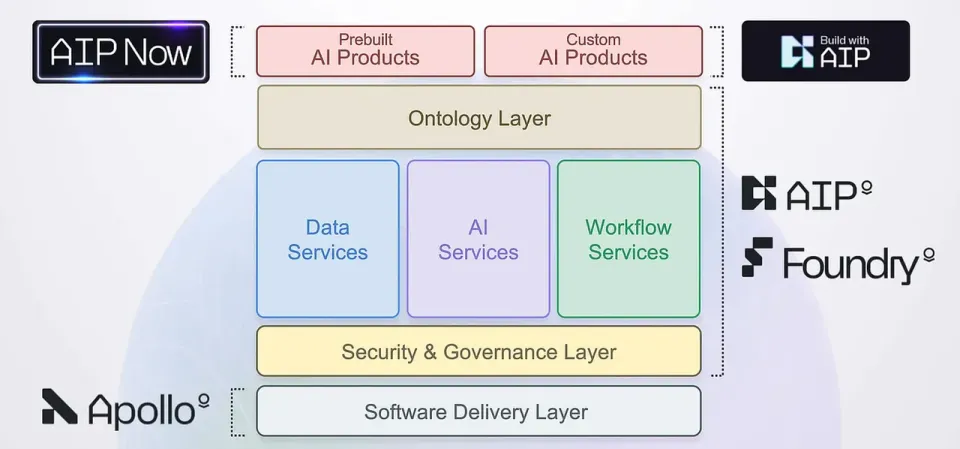
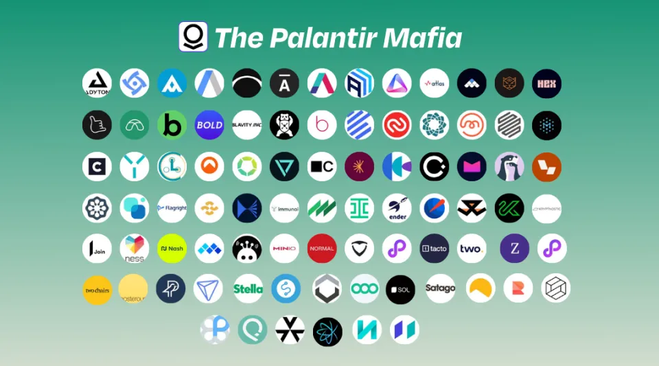

> In today’s rapidly evolving tech landscape, the demand for engineers who can translate cutting-edge AI capabilities into scalable enterprise applications is soaring. This role has a name: **Forward Deployed Engineer (FDE)** — a hybrid professional who blends software craftsmanship with product strategy, operating at the intersection of innovation and execution.

## What Is a Forward Deployed Engineer (FDE)?

A **Forward Deployed Engineer (FDE)** is a software engineer who works closely with enterprise clients to customize, deploy, and scale complex AI or data-driven systems. Unlike traditional backend or product engineers, FDEs operate in the “field” — directly with customers — to adapt powerful platforms (like AI development systems or low-code frameworks) to specific business contexts.

The title originated at **Palantir**, a company renowned for embedding engineers within client teams to ensure successful software adoption. The concept has since spread across the AI and enterprise software ecosystem, especially among companies developing AI-powered automation and low-code development platforms.

<!--truncate-->

> In essence, **FDEs don’t just write code**—they engineer impact.

## The Rise of the Forward Deployed Engineer Role

The need for FDEs stems from a critical market gap: enterprises increasingly adopt AI technologies but lack internal expertise to integrate them efficiently. According to a 2024 Gartner report, 72% of enterprises struggle to operationalize AI projects beyond the pilot phase, citing “deployment and integration complexity” as a top barrier.

This is precisely where FDEs thrive. By combining software engineering with domain-specific problem-solving, FDEs accelerate the deployment of AI-driven solutions that transform business operations — from predictive analytics in logistics to workflow automation in manufacturing.

Moreover, the*global AI software market, projected to exceed $900 billion by 2030 (Statista, 2024), is driving demand for professionals capable of bridging the “last mile” between AI platforms and production environments.

## Core Skills and Responsibilities of an FDE

A successful Forward Deployed Engineer is part developer, part consultant, and part strategist. Their work typically involves:

### 1. Solution Deployment

Implementing and customizing AI models or data pipelines for enterprise use cases — often using **low-code or AI development platforms** such as **JitAI**, which enable faster iteration and integration without extensive boilerplate coding.

### 2. Client Collaboration

Working alongside business teams to define requirements, refine workflows, and measure outcomes. FDEs translate technical capabilities into practical business logic.

### 3. Full-Stack Proficiency

While some focus on data pipelines or backend integration, most FDEs are expected to be full-stack engineers who can manage API orchestration, front-end prototyping, and DevOps.

### 4. Continuous Learning

As AI evolves, FDEs must keep up with emerging frameworks (e.g., LangChain, OpenAI’s API, vector databases) and leverage them in production-grade environments.

> An FDE is both a problem-solver and a product evangelist — driving real-world transformation, not just delivering code commits.

## Why Enterprises Are Adopting the FDE Model

Forward Deployment is not merely a staffing structure; it’s a **strategic shift in enterprise engineering culture**. Traditional software delivery models often fail to capture the contextual nuances of enterprise systems. FDEs fill this gap by ensuring AI adoption is outcome-oriented rather than feature-driven.

### Faster Value Realization

Because FDEs co-develop with client teams, time-to-value decreases dramatically — often cutting deployment cycles from months to weeks.

### Improved System Adoption

FDEs help tailor systems to user workflows, leading to up to 60% higher adoption rates (McKinsey, 2024).

### AI-Powered Automation at Scale

Through low-code environments like [**JitAI**](https://jit.pro), FDEs can integrate **AI-powered automation** into existing systems, eliminating repetitive work while maintaining flexibility and control.

This collaborative model ensures enterprises don’t just acquire AI tools — they absorb AI capabilities.

## How Low-Code AI Platforms Empower FDEs

Modern **low-code AI development platforms** like **JitAI** amplify FDE productivity by abstracting away routine setup and allowing engineers to focus on value creation.

### 1. Rapid Prototyping

FDEs can deploy functional prototypes in days, not weeks — testing hypotheses and iterating with stakeholders in real time.

### 2. Seamless Integration

Through unified APIs and AI agents, JitAI connects existing enterprise systems (CRM, ERP, databases) with intelligent automation workflows.

> Low-code doesn’t replace engineers — it multiplies their impact.

For teams interested in experimenting with this approach, you can [**download JitAI**](https://jit.pro/download) and explore how it enables rapid AI solution deployment at enterprise scale.

## The Future of FDEs in the AI-Driven Enterprise

As AI continues to evolve from model-centric research to business-centric implementation, **Forward Deployed Engineers** are emerging as key drivers of organizational transformation.

They will play a critical role in:

- Building **production-grade AI applications** that extend beyond prototypes.
- Orchestrating **cross-functional collaboration** between data science, engineering, and business units.
- Championing **AI ethics, reliability, and scalability** in deployment.

In the next five years, we can expect the FDE role to become a cornerstone of **AI enterprise strategy**, similar to how DevOps transformed software delivery a decade ago.

## Conclusion

The **Forward Deployed Engineer** represents a new era of engineering — one where AI capabilities meet business realities through skilled, adaptive, and product-minded professionals.  
Enterprises that embrace this model don’t just accelerate AI adoption; they future-proof their digital transformation.

To explore how **AI-powered low-code platforms like** [**JitAI**](https://jit.pro) can empower your engineering teams to act as modern FDEs, start your free trial or download the platform today.
