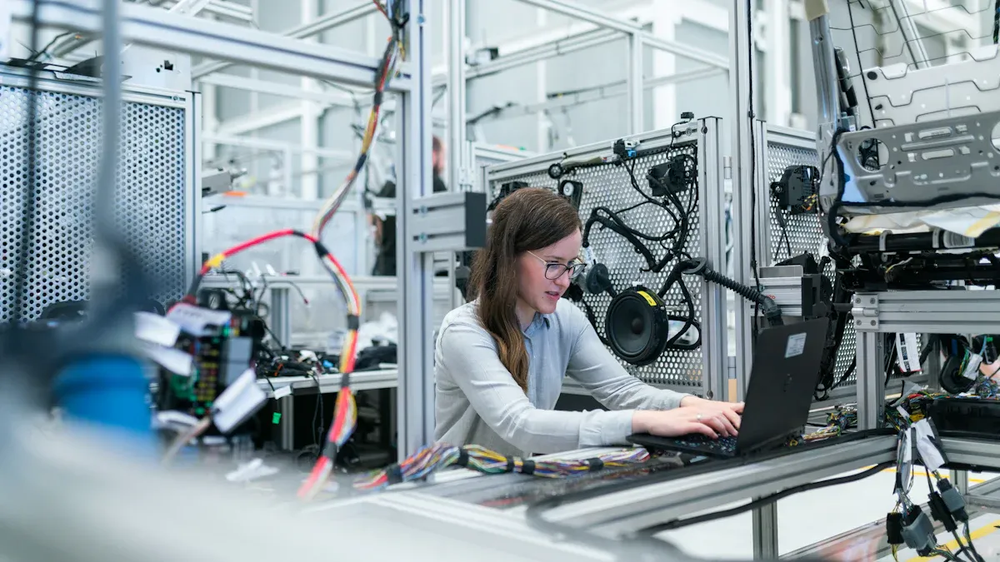

You see the [Forward Deployed Engineer role](https://www.linkedin.com/posts/scott-mo_forward-deployed-engineer-why-its-the-most-activity-7362152083631861762-EWnC) popping up everywhere in tech. Companies want people who can build smart AI solutions and make them work for customers.

*   You need to know how to code, fix tricky problems, and connect with different data sources.
    
*   You help teams use AI safely and make sure everything works well for real people.
    
<!--truncate-->

> _FDEs use both_ [_technical skills and customer communication_](https://opentools.ai/news/openai-and-anthropic-revolutionize-hiring-with-forward-deployed-engineers-surge) _to customize AI for each client. They help move projects from ideas to working products and focus on what customers actually need._

## Key Takeaways

*   Forward Deployed Engineers (FDEs) blend technical skills with customer focus to create tailored AI solutions.
    
*   This role offers faster career growth and higher pay compared to traditional engineering positions.
    
*   FDEs engage deeply with clients, ensuring that technology meets real business needs and drives innovation.
    
*   Strong communication and problem-solving skills are essential for success in this dynamic role.
    
*   The demand for FDEs is growing as companies seek customized AI solutions to stay competitive.
    

## Forward Deployed Engineer Role

### Definition and Key Traits

You might wonder what makes a Forward Deployed Engineer stand out. This role is all about working directly with customers and solving real problems. You don't just write code. You jump into new situations, learn fast, and build solutions that fit each client's needs.

> _As an OpenAI advert says, "_[_As an FDE, you'll embed with customers_](https://newsletter.pragmaticengineer.com/p/forward-deployed-engineers)_, understand their domain, and co-develop solutions to tackle real problems in often undefined or evolving problem spaces."_

You get to use your technical skills and creativity every day. You work with teams, help them use AI, and make sure everything runs smoothly. You also need to be independent and think outside the box. Here are some things you do as a Forward Deployed Engineer:

1.  Drive outcomes by building and launching solutions.
    
2.  Create new AI tools for customers.
    
3.  Engineer custom AI systems for each project.
    
4.  Manage data setup and integration from start to finish.
    
5.  Solve technical problems before they slow down progress.
    
6.  Lead innovation and try new ideas.
    
7.  Become a trusted partner for your clients.
    
8.  Dive deep into technical issues and fix them fast.
    
9.  Build quick prototypes and test them.
    
10.  Make sure everyone follows best practices.
    

You get a lot of freedom in this job. You use your creativity and technical skills to solve tough problems. You also work closely with customers and help shape the products they use.

### FDE vs. Traditional Engineer

You might ask, "How is a Forward Deployed Engineer different from a regular software engineer?" The answer is simple. You focus on the customer and the business, not just the code.

*   You show high user empathy and care about what people need.
    
*   You use creativity to solve problems in new ways.
    
*   You work independently and make decisions quickly.
    
*   You mix technical skills with business judgment and people skills.
    
*   You act more like a consultant than a coder.
    

Let's look at a table to see the main differences:

| **Role/Function** | [**Forward Deployed Engineers**](https://www.semafor.com/article/07/11/2025/how-a-generic-sounding-tech-job-will-transform-ai) | **Traditional Engineers** |
| --- | --- | --- |
| Primary Focus | Embedded within a single customer's company | Build products for a broader market |
| Approach to Business Processes | Improve business processes with new technology | Focus on product development |
| Required Skills | Blend of creativity and technical acumen | Primarily technical skills |
| Role Perception | Act as business consultants without conventional mindset | Typically do not engage in business consulting |
| Expectation | Challenge existing processes within the companies they serve | Follow established product development processes |

You see that Forward Deployed Engineers do more than just code. You help companies change how they work. You use your skills to make a real impact. You also get paid more and move up faster in your career. Here's another table to show how compensation and growth compare:

| **Aspect** | **Forward Deployed Engineers (FDEs)** | **Traditional Software Engineers (SWEs)** |
| --- | --- | --- |
| Compensation | [20-40% higher](https://www.sundeepteki.org/blog/forwarded-deployed-engineer) | Lower than FDEs |
| Career Progression | Faster promotion cycles | Slower promotion cycles |
| Skill Development | Technical depth + business acumen + communication skills | Limited to technical skills |

You can see that being a Forward Deployed Engineer means you get to learn more, earn more, and grow faster. You become a key player in both tech and business.

## Skills and Responsibilities

### Technical Excellence

You need strong technical skills to succeed as a Forward Deployed Engineer. You work with programming languages like Python and use machine learning frameworks such as PyTorch or TensorFlow. You also handle data science tasks and write SQL queries to manage data. You build and deploy AI solutions, often using tools like Docker and Git. You test your code and make sure everything works before sharing it with others.

Here's a table showing the [most common technical skills](https://www.lockheedmartinjobs.com/job/grand-prairie/al-ml-forward-deployed-engineer/694/88085316944) you need:

| **Skill Category** | **Specific Skills** |
| --- | --- |
| Programming | Python (pandas, scikit-learn, PyTorch/TensorFlow) |
| ML Frameworks | Training, evaluating, and tuning models |
| Software Engineering | Git, unit testing, CI/CD basics, Docker containers |
| Data Science | Data Science or Engineering Fundamentals |
| Experience | 2–5 years building or deploying AI/ML solutions |
| SQL | Query-writing & data-wrangling |
| Communication | Written & verbal communication; explain technical concepts |
| Stakeholder Management | Navigating matrixed organizations |
| Adaptability | Thrives in fast-changing, ambiguous environments |

You often work directly with users. You listen to their needs and build custom solutions quickly. You get feedback and improve your work fast.

> _One story shows this well: Jamie, an FDE,_ [_built a geospatial app for a customer_](https://vannevarlabs.com/blog/2024/08/29/forward-deployed-engineering/) _in just two days after learning about their data problem. The customer was thrilled and funded more development._

### Business Acumen

You need to understand business goals and how technology can help. You learn what customers want and build relationships across their teams. You explain complex ideas in simple ways so everyone understands the value of your work. You own the whole process, from planning to improving AI solutions.

Here's a table of important business skills:

| **Responsibility/Skill** | **Description** |
| --- | --- |
| Customer Understanding | Know what customers need to drive adoption and outcomes |
| Relationship Building | Build strong connections to influence adoption and find new opportunities |
| Communication Skills | Tell stories that show how tech brings business value |
| Technical Implementation | Deliver and improve AI-driven solutions from start to finish |

> _At its core, being forward deployed is about_ [_radical customer obsession_](https://jobs.insightpartners.com/companies/relevance-ai-2-3f66648a-7fb6-4900-be03-0371c51236b1/jobs/61376164-forward-deployed-engineer-fde)_, living, breathing in the customer environment and operational intensity._

You help shape business strategy. You make sure technology matches business needs. You solve real problems and help teams reach their goals.

### Customer Engagement

You spend time with customers to learn about their world. You build trust by delivering solutions that fit their needs. You create feedback loops so you can keep improving your products. You focus on custom solutions, not one-size-fits-all.

Here are some ways you engage with customers:

*   You embed yourself in the client's operations to understand their environment.
    
*   You deliver tailored solutions that create value and build trust.
    
*   You use prototypes to discover what works best for each customer.
    
*   You work closely with users to make sure your solutions solve real problems.
    

You build long-term partnerships by working side-by-side with clients. You help them succeed and grow with your technology.

## Industry Impact

### AI and Automation Trends

You see AI changing fast. Companies want smarter tools that fit their needs. You notice more demand for customized AI solutions. Engineers now need to know both tech and business. You also see new rules about ethics in AI. Generative AI is making jobs different. You work with business leaders and tech experts together. Teams need people who can adapt and learn new things. Many jobs in AI are growing, while some old roles are fading away.

Here are some trends shaping the Forward Deployed Engineer role:

*   Companies want AI solutions built just for them.
    
*   Engineers need to understand business strategy, not just code.
    
*   Ethics in AI matter more than ever.
    
*   Generative AI is changing what engineers do every day.
    
*   Teams mix business and tech skills for better results.
    
*   New jobs need people who learn fast and know their industry.
    
*   More companies hire for AI-focused roles.
    

You see [top companies like OpenAI, Anthropic, and Cohere hiring Forward Deployed Engineers](https://medium.com/%40amenawon/theres-a-new-kid-on-the-block-b70bca693305). Startups and big tech firms want people who can bring AI into real business problems. These engineers join client teams and [build solutions that fit each company's workflow](https://opentools.ai/news/forward-deployed-engineers-the-unsung-heroes-transforming-ai-in-business).

### Strategic Value for Companies

You help companies move faster with AI. You work side-by-side with clients and make sure solutions fit their needs. You act like a technical co-founder for each project. Your hands-on work leads to quick results and higher adoption. You help teams use AI in their daily work and solve tough problems.

Here's what you bring to the table:

| **Value Provided** | **What You Do** |
    | --- | --- |
| Fast Implementation | Build and launch AI tools quickly |
| High Adoption | Work with users to make sure solutions stick |
| Productivity Gains | Help teams work smarter and faster |
| Custom Solutions | Tailor AI to each business challenge |
| Bridge Gaps | Connect tech teams with business leaders |

You drive innovation by working directly with customers. You see how they use products and find new ways to help. You share feedback with your team and help shape new features. Your role makes sure technology solves real problems and helps companies grow.

> _You make AI work for people, not just for machines. Your work helps companies change how they do business and stay ahead in a fast-moving world._

## Future of Forward Deployed Engineer

### Career Opportunities

You see new doors opening for Forward Deployed Engineer roles every year. Companies want people who can blend technical skills with business sense. You start with a [strong foundation in machine learning](https://newsletter.bigtechcareers.com/p/the-role-of-forward-deployed-engineers), data engineering, and software development. You learn how to talk to customers and explain complex ideas in simple ways. You get practical experience by working on technical consulting and customer success projects. You keep learning about AI and build your network with other professionals.

Here's what you can expect as you grow in your career:

*   You move into leadership roles, guiding teams and shaping strategy.
    
*   You specialize in technical areas like AI, cybersecurity, or data science.
    
*   You become a trusted advisor for clients, helping them solve tough problems.
    
*   You stay up-to-date with new AI tools and trends.
    

> _Tip: If you keep learning and building relationships, you can move up fast and find exciting new roles._

### Challenges and Growth

You face challenges as technology changes. You need to understand how new AI tools fit into business processes. You work with different systems and rethink how services should work. Sometimes, you spend a lot of time at client sites, which can make it hard to focus on core projects. You may feel pressure to customize solutions for each client, but this can make it tough to scale your work.

[Burnout is a real risk](https://medium.com/%40amajjiga/forward-deployment-engineers-why-we-need-them-and-how-ps-should-adapt-64497a1d9a48) when you travel often and handle many client needs. You need clear role definitions to avoid losing focus on the bigger picture. You overcome these obstacles by staying hands-on, learning about customer workflows, and setting up feedback loops with your team.

[Here's a table showing what helps you succeed](https://medium.com/%40xiyang7/forward-deployed-engineering-7068735df67b):

| **Key Practice** | **Description** |
    | --- | --- |
| Hands-on engagement | You stay close to the problem and work directly on engineering tasks. |
| Deep immersion in customer workflows | You spend time learning what customers need and build trust. |
| Feedback loops | You share ideas with your team and improve solutions together. |
| Autonomy and presence | You keep a steady presence to solve problems and make changes quickly. |

You see the future bringing more complex threats and faster changes. Companies need skilled engineers to keep up. You play a key role in building strong detection systems and adapting to new challenges.

You see Forward Deployed Engineers changing how tech teams work. You blend technical skills with business sense and focus on customer needs. What sets you apart is your ability to [break down problems](https://www.linkedin.com/pulse/decoding-forward-deployed-engineer-fde-tal-golan-qr9yc), deliver fast results, and own every project.

| **What Drives Success for FDEs** | **Description** |
    | --- | --- |
| Hybrid Skills | You connect tech with business and user needs. |
| Customer Obsession | You solve real problems for clients. |
| Ownership | You take full responsibility for outcomes. |

If you want to prepare for this future, you can build [skills in AI](https://www.forwarddeployedengineer.site/roadmap), problem-solving, and user empathy. You find resources like Y Combinator videos, Palantir, and OpenAI to help you grow.

> _You shape the future by learning fast and caring deeply about customer success. Why not explore what Forward Deployed Engineering can offer you?_

## FAQ

### What does a Forward Deployed Engineer do?

You work with customers to solve real problems. You build custom AI solutions, connect data, and help teams use new technology. You make sure everything fits the client's needs.

### What skills do you need to become a Forward Deployed Engineer?

You need strong coding skills, business sense, and great communication. You learn fast, think creatively, and work well with others. You also need to understand how AI helps businesses.

### What makes this role different from a regular software engineer?

You focus on customers and business outcomes, not just code. You act like a consultant, build custom solutions, and work directly with clients. You help companies change how they work.

### What industries hire Forward Deployed Engineers?

You find jobs in tech, finance, healthcare, and government. Many companies want experts who can bring AI into their daily work and solve tough problems.

### What is the future for Forward Deployed Engineers?

You see more companies hiring for this role every year. You get to learn new skills, move up fast, and help shape how businesses use AI. 🚀
