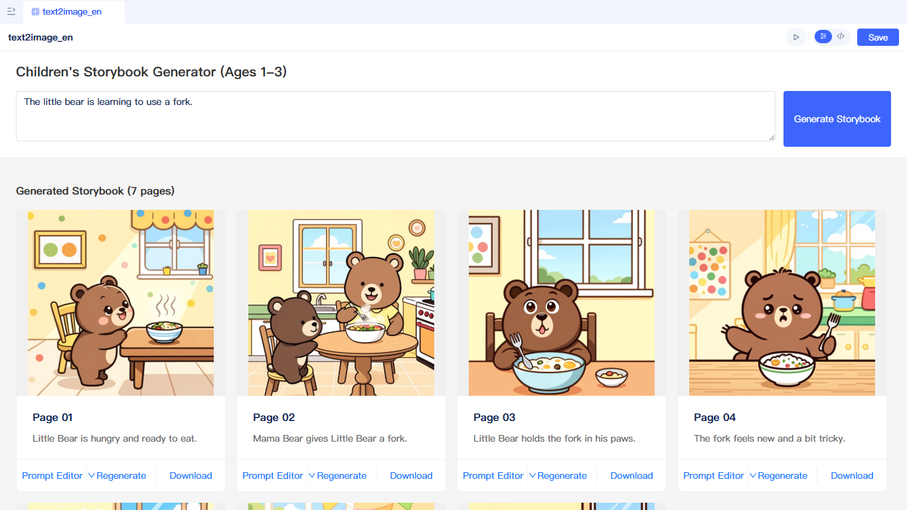

The era of intelligence is here, so why are your enterprise AI applications still stuck in the Demo stage?

Over the past two years, the AI wave triggered by ChatGPT has swept the globe, and the supply of intelligence is no longer a bottleneck. However, when enterprises try to introduce this powerful capability into core business systems, they encounter a common dilemma: **Intelligence supply is solved, but application engineering is lagging significantly.**

<!--truncate-->

So, how can we break the deadlock and truly transform AI intelligence into an enterprise's **native productivity**?

:::info Native Productivity
**Native Productivity** tools are new types of production tools that enterprises **cultivate internally** through technological innovation, digital transformation, and internal capability building, optimizing organizational structures, business processes, or production factors.

Unlike buying a standard production line as in the past, it is a capability that "grows" based on the enterprise's unique data, processes, and rules. Therefore, it cannot be generalized and must be developed independently or cultivated internally.
:::

## I. The Leap from Intelligence Experiments to Native Productivity

### How Does Intelligence Become Productivity?

Technological change never happens overnight. Looking back at every major technological revolution, we can see a similar evolutionary path: from the experimental phase to the engineering phase.

*   **Experimental Phase:** Basic technology plus application experiments explore application paradigms and create prototypes of new productivity, such as the various C-side chatbots, Demos, and prototype applications we have seen over the past two years.
*   **Engineering Phase:** Basic technology plus **application engineering**, combined with commercial products in specific scenarios, can develop inclusive new productivity.

For AI to truly enter the industry, the short board of **application engineering** must be filled.

### Historical Constant: Technology Reuse and System Reconstruction

Standing on the shoulders of giants. New generations of technology are the reuse and reconstruction of previous generations, which is almost an immutable law of history.

*   **Perspective of Power**: The power revolution directly led to the complete reconstruction of transportation tools.
*   **Perspective of Computing Power**: The layering of the von Neumann architecture, operating systems, and the Internet eventually exploded into today's enterprise information systems.
*   **Perspective of AI**: The emergence of AI technology has stimulated the demand for the intelligentization of application systems.

### Intelligence Supply and Demand

The upstream and downstream forms of the AI industry are clearly visible.

**Upstream: AI Intelligence Supply**

*  **Centralized Cloud Intelligence Factories**: Like power plants, providing computing power for general large models. Examples include OpenAI, Google, Anthropic.
*  **Standalone, Portable Intelligence Devices**: Like generators and power banks, providing edge and private computing power.

**Downstream: Productivity Application Tools**

*   **ToC Standard Market**: Standardized professional vertical software, such as **Midjourney**, **GitHub Copilot**. This is a combination of general models + professional tools + domain data.
*   **ToB Custom Market**: Specialized functional modules or subsystems that grow on enterprise systems. The formula is: **Vertical/General Large Model + Enterprise System + Specialized Tool Modules + Enterprise Data**.

This determines that the ToB market requires new custom development platforms and tools.

### Extension and Fusion of Application Engineering

In the AI era, the connotation of application engineering has undergone a fundamental extension. It must integrate capabilities from both the AI side and the IT side.

*   **AI-side Application Engineering**: Includes the output methods of AI intelligence, and methods for AI to perceive and drive external systems.
*   **IT-side Application Engineering**: Includes loading and running methods, build methods, interface specifications, and semantic expression methods for various tool technology modules and business modules in the system.

The fusion of these two sides leads to a key insight: **Carriers as Tools**.

In AI-native application engineering and architecture, traditional OS, browsers, Internet, databases, and IoT are both carriers and tools. JitAI's value lies in standardizing all these carriers into **elements perceivable by AI**, allowing AI to utilize all these tools. This is not improvement, but reconstruction.

## II. New Commercial Paradigm: FDE and Service-as-Software

What new value can filling the application engineering loop bring? The answer is new business models and new professional roles.

### The Leap in Business Models

The traditional software industry operates on a "selling software accounts" one-time contract model, but endogenous systems are completely different.

We will shift from "selling software accounts" to "selling business results", and from one-time contracts to subscription-based contracts.

Why? Because endogenous systems require long-term maintenance and iteration; they are not one-time delivery products but continuously evolving capabilities. The future service model is **long-term subscription** and **companion service**.

Under this model, the B-side endogenous AI development ecosystem will consist of three roles: enterprise self-research teams, software service providers (differentiated by industry), and general technology module providers.

### The Rise of Forward Deployed Engineers

**FDE** (Forward Deployed Engineer) is the scarcest new profession in the AI era.

A new division of labor is forming: general technology module providers are responsible for developing high-reuse underlying "building blocks"; FDEs do not need to reinvent the wheel. They use the JitAI platform and these "building blocks" to go deep into the frontline and quickly build endogenous systems that solve customer pain points.

They understand both business and technology, and know how to leverage the power of AI and platforms to quickly build endogenous capabilities.

### Atomization and Semantic Wrapping: Key Mechanisms for Bridging the Gap

To realize the above blueprint and commercial value, technical obstacles must first be solved. The core of this obstacle is that traditional software modules cannot be understood and used by AI.

The solution involves two key mechanisms:
1.  **Atomization**: Breaking down complex business functions into the smallest, independently executable units.
2.  **Semantic Wrapping**: Endowing these units with self-describing capabilities (through metadata and protocols), letting AI know the tool's capabilities, parameters, and usage methods.

## III. Engineering Gap: Why Old Containers Can't Hold New Intelligence

Let's face the core of the problem, which is the **engineering gap** hindering us.

### Root Cause: Traditional Modules Cannot be "Tool-ized"

The phenomenon is: large models are changing with each passing day, yet application engineering is dragged down by the traditional software ecosystem and progressing slowly.

**The core crux lies in not being AI-friendly enough.** Specifically, the runtime of compiled systems cannot be perceived and driven by AI. The more fundamental problem is that software modules under the classical software design theoretical system cannot be "tool-ized".

:::warning What does "Cannot be Tool-ized" mean?
It means modules **cannot be atomized, cannot be dynamic, cannot self-load, lack interpretability, and lack semantic self-description**. This is the fundamental problem preventing traditional software systems from integrating with AI technology.
:::

### Systemic Dilemma: Intertwined Dual Complexity

The problem goes further.

*   **Complexity Inversion**: The complexity of AI applications is far greater than that of IT applications. IT applications are static mappings and logical presets; AI applications are dynamic decisions and normal uncertainty.
*   **Difficulty Escalation**: From "record-oriented information management systems" to "task-executing transaction execution systems". AI's uncertainty superimposed on business complexity leads to an exponential increase in difficulty.
*   **Universality Paradox**: AI applications cannot be universal and must be customized because processes, data, rules, methods, and operating standards differ between enterprises.

This brings high costs: lack of AI engineering talent and long trial-and-error cycles.

### The Shortcut Trap

Many try to take shortcuts, but facts prove that shortcuts are often detours.

For example, **Consumer-facing (B2C) Agents**, although performing outstandingly in demos, **cannot be applied in serious enterprise scenarios** in essence. Furthermore, **pure Agent platforms** are also destined to fail because they lack deep integration capabilities with business systems.

> **AI must be natively integrated with enterprise business systems.**

## IV. Reconstructing the AI-Native Foundation

So what is the solution?

**JitAI**, as a new generation AI-native application engineering platform, was born to solve this fundamental problem. How does it achieve "tool-ization" from the bottom up?

### A New AI-Native Application Engineering Technology System

JitAI's vision is to build a new AI-native application engineering technology system. This includes **unified platform** (integration of IT application and AI application development), **interpreted architecture** (interpreted execution mechanism), and **standardized encapsulation** (unified and standardized technical module tool encapsulation methods).

### Core Protocol: JAAP

**JAAP** (JitAI AI Application Protocol) is the core of the entire system. It defines a new set of protocols that make software modules truly AI-usable tools, i.e., the **Element System**.

The Element System realizes the essence of tool-ization:
*   **Element Semantics** solve "AI Perception";
*   **Element Loading/Calling** solve "AI Driving";
*   **Element Orchestration** supports AI dynamically combining according to intent.

### Matrix Framework: Carrier for Reality Modeling and Technology Integration

If JAAP is the protocol, then the Matrix Framework is the **core carrier** that carries and implements this protocol.

The core definition of the **Matrix Framework** is: Reality Modeling and Technology Integration Platform. It performs digital modeling of enterprise business entities through **Reality Modeling**, and achieves **Technology Integration/Encapsulation**, encapsulating underlying technologies into "elemental tools", enabling AI capabilities to "grow" within business systems.

### Microkernel Runtime Platform and Dual-Mode Development Tools

Architecture requires efficient runtime environments and development tools.

*   **Microkernel Application Runtime Platform**: Full-stack interpreted, adapted to JAAP.
*   **Visual and Pro-Code Dual-Mode Development Tools**: The concept is structure orchestration (macro) plus process programming (micro). It transcends low-code, refuses DSL black boxes, and provides a more transparent, borderless white-box experience.

## V. Implementation Scenarios for Native Productivity

Let's see how the JitAI platform allows FDEs to quickly build AI applications and actually apply them to enterprise businesses.

### Core Workflow: Perceive, Drive, Collaborate

Given the objective existence of AI uncertainty, the **Human-AI Collaboration** mode has important practical significance.

**Perception-Drive Orchestration** is the core: AI can perceive and drive tools in the system and orchestrate dynamically according to task needs. At the same time, enterprise knowledge is natively integrated with AI through modeling.

### Three Major Application Scenarios

JitAI's view is: all scenarios with demand for AI intelligence must fall into one of the following three categories.

**1. Content Generation**

Scenarios include multi-modal generation of text, images, video, etc. AI can not only generate content but also directly output content to business systems.

    

**2. Decision Analysis**

Scenarios are data-driven decision analysis, including large data model applications. AI can directly access enterprise data, conduct in-depth analysis, and provide decision suggestions.

    

**3. Automation**

Scenarios are automating business system operations and executing tasks. The system transforms from "record-oriented" to "execution-oriented", and AI can execute operations on your behalf.

    

    <iframe src="https://www.youtube.com/embed/5GODQMNm4Y4?si=nVD7Ch-67P1doZ2t" style={{position: 'absolute', top: 0, left: 0, width: '100%', height: '100%'}} title="YouTube video player" frameBorder="0" allow="accelerometer; autoplay; clipboard-write; encrypted-media; gyroscope; picture-in-picture; web-share" allowFullScreen></iframe>
    

## Reshaping Enterprise DNA in the AI Era

Let's go back to the opening question: Large models are already so powerful, why are enterprise AI applications still stuck in the Demo stage?

Because intelligence supply is no longer the bottleneck; the bottleneck is **application engineering**.

**JitAI reconstructs the system bottom layer, upgrading traditional software into tools drivable by AI**, thereby releasing the enterprise's **native productivity**.

:::tip
Native productivity is not bought, but grown. It is based on your enterprise's unique data, processes, rules, methods, and operating standards, so it cannot be generalized and must be nurtured independently.
:::
