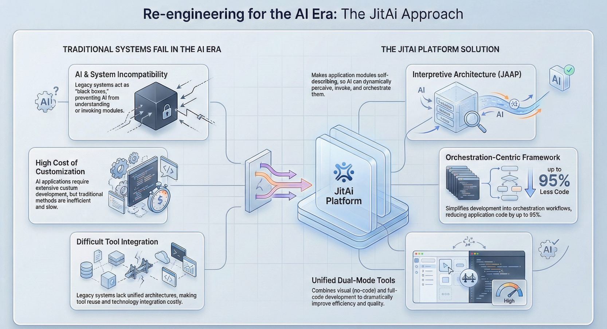

## Introduction

We spent the last decade decoupling our monoliths into microservices to help human teams scale. Now, we are trying to deploy AI agents onto that same infrastructure, and they are failing.

To a human architect, a microservices diagram represents a clear separation of concerns—Payment Service handles transactions, User Service handles profiles. To an AI agent consuming these services via **API**, this architecture often looks like a bag of disconnected tools without a user manual.

This phenomenon is **Semantic Collapse**: the loss of high-level business intent when a system is fragmented into purely technical interfaces. While humans bridge these gaps with documentation, tribal knowledge, and architectural diagrams, AI agents are left staring at a flat list of 500 endpoints, unable to discern that `POST /order` requires a successful `GET /inventory` check first.

This article explores why traditional interface design hinders AI from understanding your business full picture and how new paradigms—from the **Model Context Protocol (MCP)** to **JitAI’s JAAP**—are attempting to reconstruct the "structure" for the AI era.

<!--truncate-->

## The Problem: AI Sees Syntax, Not Semantics

In a typical enterprise environment, business logic is implicit. It lives in the "glue code" of frontend applications or the orchestration logic of a Backend-for-Frontend (BFF). The microservices themselves are stateless and dumb.

When you ask an AI agent to "refund the user for the last order if it hasn't shipped," the AI must:

1.  Search a vector database for relevant tools.
2.  Retrieve a massive **OpenAPI** specification.
3.  Guess the sequence of calls (`GET /orders`, `GET /shipping-status`, `POST /refund`).

### Why Microservices confuse Agents

1.  **Context Fragmentation:** The "Customer" entity is split across the Auth Service (credentials), Billing Service (credit cards), and CRM Service (history). The AI has to mentally "join" these tables via API calls, a task prone to hallucination.
2.  **Stateless Amnesia:** APIs are designed to be stateless. Agents, however, need state to reason. Without a persistent model of the "current transaction," the agent loses the thread of complex multi-step workflows.
3.  **Flat Tool Lists:** Agents typically have a "context window" limit. Feeding an agent 200 API definitions often degrades performance. This is known as the "Lost in the Middle" phenomenon, where LLMs struggle to select the right tool from a long, flat list \[1\].

## The Concept of Semantic Collapse

"Semantic Collapse" occurs when the *technical implementation* completely obscures the *business structure*.

In code-first development, the architecture is implicit. It exists only in the programmer's mind or in the folder structure of a git repository. Once compiled and deployed, that structure evaporates. The AI operates on the compiled artifacts (endpoints), which have lost their semantic relationships.

As stated in system engineering theory, **System = Structure + Process** . Traditional microservices expose the *Process* (functions) but hide the *Structure* (relationships).

### The Consequence: AI as an "Outsider"

Because of this collapse, most AI integrations today are "embedded" or "bolt-on." The AI is an external plugin that hits public APIs. It doesn't know that the `UserType` in the database is the same as the `User` in the permission system. It lacks a unified object model.

| **Feature**        | **Traditional Microservices** | **AI-Native Architecture**  |
| ------------------ | ----------------------------- | --------------------------- |
| **Logic Location** | Buried in code/controllers    | Explicit in metadata/schema |
| **AI Access**      | Via external API (OpenAPI)    | Internal structural access  |
| **Context**        | Fragmented per service        | Unified Object Model        |
| **Relationship**   | Implicit (FKs, ID refs)       | Explicit (Graph/Links)      |
| **Agent Role**     | Tool User (Guessing)          | System Operator (Knowing)   |

## Restoring Structure: MCP and the Industry Shift

The industry is waking up to this. We are seeing a shift toward protocols that help AI understand the "map" of the system, not just the tools.

### Model Context Protocol (MCP)

Anthropic’s **Model Context Protocol (MCP)** is a recent open standard designed to solve this connecting problem. It provides a standardized way for AI assistants to connect to data sources (like Google Drive, Slack, or internal databases) \[Source: Anthropic | Introducing the Model Context Protocol | 2024 | anthropic.com\].

MCP allows developers to expose resources and tools in a way that preserves some context. Instead of just "an API," an MCP server tells the LLM: "Here is a resource you can read, and here are the prompts you can use with it." It creates a standardized contract for context exchange.

## How JitAI Addresses Semantic Collapse

While MCP standardizes the *connection*, **JitAI** attempts to standardize the *application structure* itself to prevent semantic collapse at the source.

JitAI operates on a different premise: **Application structure should be a first-class citizen**. Instead of inferring structure from code, JitAI defines the application using **JAAP (JitAi Ai Application Protocol)**.

### 1. The Interpretive Architecture

JitAI uses an interpretive system architecture. The application is defined by metadata (Meta, Type, Instance) that is explicitly readable by both the runtime engine and the AI.

- **Self-Describing Elements:** An AI agent in JitAI doesn't just see a function named `updateUser`. It sees the `UserModel`, its fields, its permissions, and its relationship to the `DepartmentModel`.
- **No "Glue Code" Hiding:** The relationships between pages, services, and data models are defined in the JAAP structure, not hidden in imperative code. The AI can "read" the application blueprint.

### 2. Native AI-System Collaboration

Because the structure is explicit, JitAI Agents don't need to hallucinate how modules fit together.

- **Full-Stack Tools:** Agents can be configured with tools that span frontend pages, backend services, and data models seamlessly.
- **Unified Model:** The AI uses the same Type/Instance structural model as the human developer. This allows the AI to not just *call* APIs, but to *modify* the application structure itself (e.g., "Add a field to the Customer table").

## Implementation Playbook: Designing AI-Friendly Architectures

Whether you use JitAI or standard microservices, you must design your system to be "readable" by machines.

### Step 1: Explicitly Define Business Entities

Don't let your data schema be an implementation detail of a Postgres table.

- **Action:** Publish a unified "Data Dictionary" or "Knowledge Graph" that maps technical IDs (e.g., `user_id`) to business concepts (e.g., `Account Owner`).
- **JitAI approach:** Use Data Models (regular or aggregated) to define business objects that AI can natively query.

### Step 2: Group Tools by Intent

Avoid dumping all 50 API endpoints into the agent's context.

- **Action:** Use "Tool Routing" or a "Hierarchical Agent" pattern. Create a "Customer Service Agent" that only has access to customer-related APIs, and a "Billing Agent" for payments.
- **JitAI approach:** Use the **AI Assistant** component to orchestrate multiple specialized Agents using intelligent routing.

### Step 3: Use "System Prompts" as Architectural Documentation

Documentation is no longer for humans; it's for the System Prompt.

- **Action:** Your prompt should explain the *relationships* between services. "To refund an order, you must first check the status in Service A, then call Service B."
- **JitAI approach:** Use the "Universal prompt template" to define precise roles and tool constraints.

## Conclusion

The "Semantic Collapse" of microservices is a major bottleneck for AI adoption. When we strip away the structural context to make systems modular for humans, we make them unintelligible to AI.

To fix this, we must stop treating APIs as just endpoints and start treating them as part of a semantic graph. Technologies like **MCP** help bridge the gap for external data, while platforms like **JitAI** rebuild the application foundation using **JAAP** to ensure the structure is never lost in the first place.

**Next Steps:**

- **Audit your APIs:** Are they self-describing?
- **Explore JAAP:** Read the [JitAI Introduction](https://jit.pro/docs/tutorial) to see how structural protocols work.
- **Download JitAI:** Try building an AI-native app where the structure is explicit. [Download JitNode](https://jit.pro/download).

## FAQ

Q: Does using GraphQL solve semantic collapse?

A: Partially. GraphQL makes the relationships between data explicit (the graph), which is much better for AI than REST. However, it typically only covers data reading/writing, not business logic processes or workflows.

Q: How is JitAI different from LangChain or typical Agent frameworks?

A: LangChain is an orchestration library for calling tools. JitAI is a full-stack application platform where the application itself is built to be understood by AI. JitAI Agents run inside the application context, not as an external script.

Q: Can I use JitAI with my existing legacy microservices?

A: Yes. You can wrap existing APIs using External API Elements or integrate them via Service Elements, effectively giving your legacy systems a "semantic wrapper" that the JitAI Agent can understand.
