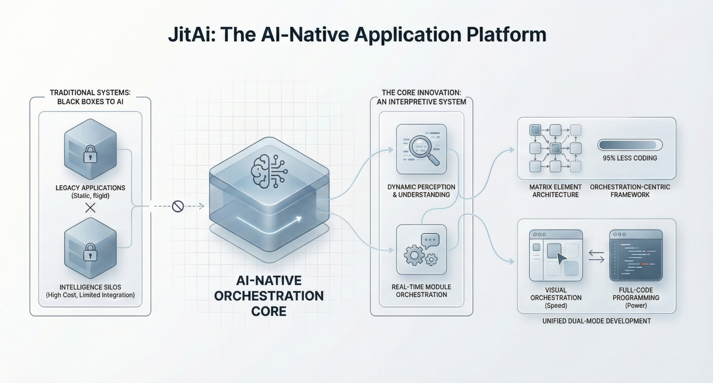

## Introduction

In the current wave of generative AI, developers have gained a powerful assistant for writing functions, generating boilerplate, and debugging specific errors. However, as organizations attempt to scale **AI-Native** development from simple scripts to complex enterprise systems, they hit a critical ceiling: **Structural Invisibility**.

While LLMs excel at processing local syntax (the "micro" level), they struggle profoundly with system architecture (the "macro" level). When an AI is asked to "refactor the billing module" in a legacy application, it often fails not because it doesn't know code, but because it cannot "see" the implicit dependencies, business rules, and architectural constraints buried across thousands of files.

This article explores the engineering background behind **JitAI**, a development platform designed specifically to solve this visibility crisis through a novel **Interpretive System Architecture** and the **JAAP** (JitAI Ai Application Protocol).

<!--truncate-->

## The Crisis of "Black Box" Systems in the AI Era

### The Disconnect Between Text and Structure

Traditional software engineering treats code as text files. The system's "structure"—the relationship between a User entity, an Order service, and a Payment gateway—is implicit. It exists only in the mental model of the senior architect or is scattered across disparate configuration files and code comments.

For an LLM, a codebase is a sequence of tokens. Even with retrieval-augmented generation (RAG) and large context windows, the AI receives fragmented "shards" of information rather than a coherent structural graph.

**Why this matters:**

- **Context Loss:** AI cannot reliably determine the impact of a change in `Module A` on `Module Z` if the relationship is defined implicitly in logic rather than explicitly in a schema.
- **Semantic Collapse:** As codebases grow, ensuring that "Customer ID" means the same thing across 50 microservices becomes a human governance task that AI cannot easily audit without structural awareness.
- **The "Plugin" Limit:** Most AI coding tools function as external plugins (Copilots). They suggest code *into* the editor, but they do not understand the *runtime state* or the *application lifecycle*.

### External Verification: The Cost of Complexity

Industry research underscores the severity of this issue. A study by *Stripe* found that developers spend approximately **42 hours per week** on "maintenance and dealing with bad code" rather than innovation \[Source: Stripe | The Developer Coefficient | 2018 | stripe.com\]. Furthermore, research on AI-generated code suggests that without structural guardrails, AI can accelerate the accumulation of technical debt by generating verbose, disjointed code that is harder to maintain \[Source: GitClear | AI-Generated Code Quality trends | 2024 | gitclear.com\].

## How JitAI Addresses This: The "Structure First" Paradigm

JitAI was born from the realization that for AI to be a true collaborator—not just a typist—the **application structure must be a first-class citizen**.

### 1. The Interpretive System Architecture

Unlike traditional frameworks where structure is compiled away or hidden in code, JitAI employs an **Interpretive System Architecture**. In this model, the application is not just a pile of code, but a structured object graph defined by the **JAAP** protocol.

- **Explicit Definition:** Every page, data model, service, and workflow is defined as an **Element** (an instance of a specific **Type**).
- **Runtime Visibility:** The JitAI runtime engine interprets these definitions directly. This means the "source code" and the "running system" share the exact same structural representation.
- **AI Accessibility:** Because the structure is explicit (JSON/YAML-based metadata combined with Python logic), the AI can "read" the entire system architecture instantly without needing to parse millions of lines of imperative code.

### 2. JAAP: The Common Language for Humans and AI

The **JitAI AI Application Protocol (JAAP)** serves as the unified architectural language. It abstracts the complexity of the underlying technology stack (databases, message queues, frontend rendering), allowing developers and AI agents to focus on business logic orchestration.

In JitAI, when an AI Agent needs to "add a field to the Customer table," it doesn't try to regex-match a SQL migration file. Instead, it interacts with the **Data Model Element** defined in JAAP. It understands the model's properties, validation rules, and relationships because they are self-describing.

### 3. From "Embedded AI" to "AI-Native"

Most platforms embed AI as a feature (e.g., a chatbot in the IDE). JitAI reverses this: the platform itself is built for AI to operate.

- **Self-Describing Elements:** Every component (Page, Service, Task) exposes a standard interface (`functionList`) that explicitly tells the AI what it does and how to use it.
- **Controlled Evolution:** AI can modify the application structure at runtime under controlled permissions, enabling self-evolving systems.

## Comparison: Traditional vs. JitAI Architecture

| **Feature**           | **Traditional Development**        | **JitAI (AI-Native)**                              |
| --------------------- | ---------------------------------- | -------------------------------------------------- |
| **System Structure**  | Implicit (buried in code logic)    | **Explicit** (defined via JAAP elements)           |
| **AI Integration**    | External Plugin (Copilot)          | **Internal Participant** (System Actor)            |
| **Context Awareness** | Limited by token window / RAG      | **Full Structural Awareness** (Meta/Type/Instance) |
| **Refactoring**       | High risk, manual dependency check | **Low risk**, AI sees graph dependencies           |
| **Codebase Growth**   | Linearly increases complexity      | **Modularity** keeps complexity manageable         |

## Implementation Playbook: Adopting a Structural Mindset

To leverage the power of an interpretive architecture like JitAI, development teams must shift their thinking from "writing scripts" to "orchestrating elements."

### Step 1: Define Business Entities as Models

Instead of creating database tables manually, define **Data Models** in JitAI.

- **Action:** Create a `Customer` model using the visual tool or JAAP JSON.
- **Benefit:** The AI immediately knows `Customer` has a `phone_number` field and can generate validation logic automatically.

### Step 2: Encapsulate Logic in Service Elements

Don't write spaghetti code in UI controllers. Create **Service Elements** with explicit `functionList` definitions.

- **Action:** Define a `CalculationService` and register its methods.
- **Benefit:** AI Agents can look up this service in the registry and invoke it autonomously to solve user requests.

### Step 3: Orchestrate with AI Agents

Use **AI Agents** to tie elements together. Because the system is self-describing, you can prompt the Agent: *"Use the Order Model and Payment Service to process a refund."*

- **Action:** Configure the Agent's tools to include the specific Model and Service elements.
- **Benefit:** The Agent executes the task by calling the actual system elements, ensuring the result is executable code, not just text generation.

## FAQ

Q: Does JitAI replace standard coding entirely?

A: No. JitAI supports a "Dual-Mode" approach. You can use visual orchestration for structure (high-level logic) and switch to full code (Python/React) for specific algorithms or complex UI components. The key is that both modes operate on the same JAAP structure.

Q: Can I use my own LLMs with JitAI?

A: Yes. JitAI acts as the structural gateway. You can integrate various LLM vendors (OpenAI, Anthropic, or private models) to power the intelligence layer, while JitAI provides the execution context.

Q: How does this differ from Low-Code platforms?

A: Traditional low-code creates rigid boundaries. JitAI uses JAAP to provide the ease of low-code but allows full-code extendibility. Crucially, JitAI is designed for AI to read and write the application, whereas low-code is designed for humans to drag and drop.

## Conclusion

The "Structural Invisibility" problem is the primary bottleneck preventing AI from building reliable enterprise systems. By treating application structure as a first-class citizen through **JAAP**, JitAI transforms the codebase from a black box into a transparent, manipulatable graph. This allows AI to act not just as a coding assistant, but as a true architect—understanding the system's intent, respecting its constraints, and evolving it safely.

Ready to see explicit structure in action?

Download [JitAI Desktop](https://jit.pro/download)

Read the[JAAP Specification](https://jit.pro/docs/reference/runtime-platform/JAAP)
