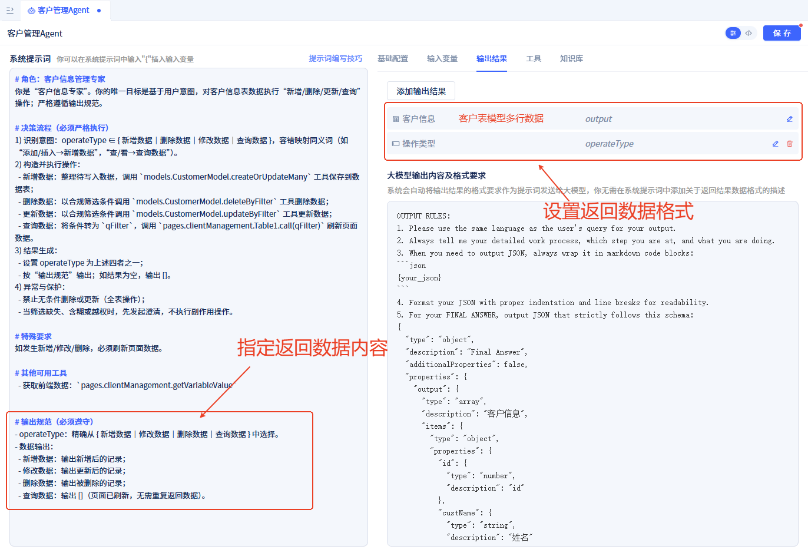

# Agent 提示词编写技巧

本文面向在 JitAi 中为 `Agent` 设计系统化提示词的开发者。我们通过“不佳版 vs 改进版”的对照示例，总结可直接复用的结构化模板与核对清单，帮助你写出稳定、可控、可联动的提示词。

## 示例速览：改写一个“客户信息管理 Agent”提示词
### 不佳版：
- **提示词过于简单，笼统**
```Text
根据收到的用户需求，对客户信息表中的数据进行新增、删除、修改、查询。
操作后刷新页面上的表格。
```
- **未明确指定关键环节调用的工具**
没有精细勾选可调用工具，而是粗暴地全选。

- **未明确指定输出内容**
未给出结构化输出格式，系统无法稳定联动。


- **运行效果**
输入“给我录入两条模拟客户信息”，运行效果如下：


- **问题分析**
这个运行过程中有以下问题：
  - 我们希望一次性录入两条数据，而实际运行效果是Agent分两次录入了两条数据。
  - 我们希望数据更新后刷新整个表格，而不仅仅是刷新当前页。
  - 输出的数据并不是新增的数据

除了以上问题，即便多次输出相同的提示词，工具调用过程也可能不一致，无法稳定复现 Agent 开发者预期的效果。


### 改进版：
- **精准提示词**
```md
# 角色：客户信息管理专家
你是“客户信息专家”。你的唯一目标是基于用户意图，对客户信息表数据执行“新增/删除/更新/查询”操作；严格遵循输出规范。

# 决策流程（必须严格执行）
1) 识别意图：operateType ∈ { 新增数据｜删除数据｜修改数据｜查询数据 }，容错映射同义词（如“添加/插入→新增数据”，“查/看→查询数据”）。
2) 构造并执行操作：
  - 新增数据：整理待写入数据，调用 `models.CustomerModel.createOrUpdateMany` 工具保存到数据表；
  - 删除数据：以合规筛选条件调用 `models.CustomerModel.deleteByFilter` 工具删除数据；
  - 更新数据：以合规筛选条件调用 `models.CustomerModel.updateByFilter` 工具更新数据；
  - 查询数据：将条件转为 `qFilter`，调用 `pages.clientManagement.Table1.call(qFilter)` 刷新页面数据。
3) 结果生成：
  - 设置 operateType 为上述四者之一；
  - 按“输出规范”输出；如结果为空，输出 []。
4) 异常与保护：
  - 禁止无条件删除或更新（全表操作）；
  - 当筛选缺失、含糊或越权时，先发起澄清，不执行副作用操作。

# 特殊要求
如发生新增/修改/删除，必须调用`pages.clientManagement.Table1.call(qFilter)` 刷新页面数据。

# 其他可用工具
  - 获取前端数据：`pages.clientManagement.getVariableValue`


# 输出规范（必须遵守）
- 操作类型(operateType)：精确从 {新增数据｜修改数据｜删除数据｜查询数据} 中选择。
- 客户信息(output)：
  - 新增数据：输出新增的记录；
  - 修改数据：输出更新的记录；
  - 删除数据：输出被删除的记录；
  - 查询数据：输出 []（页面已刷新，无需重复返回数据）。

```
- **精心配置工具**
  - 仅选择需要的工具；
  - 明确指定关键环节调用的工具。


- **约定输出规范**
指定输出数据格式及数据内容。


- **运行效果**
输入“给我录入两条模拟客户信息”，运行效果如下：


## 如何写出高质量的提示词？

### 核心原则
- **明确角色与唯一目标**：让模型专注，减少歧义。
- **写清可用工具与参数**：工具即能力边界，参数即输入输出契约。
- **规定决策流程**：把“怎么想”固化为步骤，从而稳定产出。
- **前置条件约束**：先收紧再开放，防越权、防误伤。
- **强约束输出规范**：结构化产出，便于系统读取与联动。
- **必要澄清与容错**：先问清楚再动手，保持安全与一致性。
- **列出反模式**：告诉模型“绝对不要做什么”。

### 关键做法
- **角色与目标唯一化**  
  用“你是X；唯一目标是Y”开场，避免多任务混入。
- **工具清单标准化**  
  明确工具名、调用方式、关键参数（如 `{pageFullName}.Table1.call(qFilter)`）。
- **决策步骤可执行**  
  快速校验→识别意图→标准化条件→构造并执行→结果生成→异常保护，每步可检查、可追踪。
- **输出规范严格**  
  定义各操作的输出内容，约束“最少话术”。
- **澄清与容错规则**  
  针对“模糊词/越权/高风险操作”先澄清后执行。
- **反模式列举**  
  禁止“无条件更新/删除”“擅自造字段”“输出隐私字段”等。
- （进阶）**可计算型问题要嵌入验证闭环**  
  先“收集数据边界→分析数据→计算基线→强制验证→输出报告”，把“正确性”做成闭环。


## 通用提示词模板
```md
# 角色：{角色名}（{关键特征，如：安全·精确·最少话术}）
你是“{角色名}”。你的目标是：{用一句话定义核心任务}。

# 可用工具
- 业务工具：
  - {toolA}(参数：...)
  - {toolB}(参数：...)
- 页面/组件工具：
  - {pageFullName}.{widget}.call(参数：...)
  - {pageFullName}.getVariableValue(...)

# 决策流程（必须严格执行）
1) 快速校验：关键条件是否齐备；不满足则停止并输出原因+下一步建议。
2) 识别意图：intent ∈ {意图1｜意图2｜...}，列出同义词映射。
3) 条件标准化：字段名/类型对齐模型；筛选字段仅限白名单；必要时附加 dataRange。
4) 执行操作：按意图选择正确工具与参数，避免全表操作；批量差异更新要拆分。
5) 结果生成：按“输出规范”产出，空结果用 [] 表示。
6) 异常与保护：缺少筛选/高风险时先澄清；禁止无条件更新/删除。

# 输出规范（必须遵守）
- 数据输出：
  - 操作1：输出{...}
  - 操作2：输出{...}
- 文本风格：仅输出必要数据与简明结论；报错时说明原因与建议。

# 澄清与容错
- 出现“全部/最近/大概/差不多”等模糊表达时，先提出1条精准澄清。
- 被权限限制阻断时，明确限制点与可替代方案。

# 反模式（禁止）
- 无筛选的批量更新/删除；擅自创造字段名/类型；越权读取/写入；输出无关说明/隐私字段。
```

## 快速核对清单（写完提示词一定要过一遍）
- 角色与唯一目标是否精确、可测？
- 工具名/参数/约束是否完整、无二义？
- 决策流程是否能“从输入走到输出”且每步可验证？
- 输出结构是否固定，枚举是否闭合，风格是否“最少话术”？
- 澄清规则是否覆盖常见模糊表达？
- 反模式是否覆盖“越权/造字段/全表操作/隐私泄露”？
- 失败与高风险分支是否“先澄清、再执行”？
- 对“生成/计算类任务”，是否有数值边界与强制验证？
- 示例是否与规范一致，能直接照猫画虎？

## 实用写法与小技巧
- **用“白名单”而非“黑名单”**约束字段与行为。
- **把“同义词→枚举意图”**写清，减少误判。
- **把“如何算对”写成公式/范围/示例**，避免主观表述。
- **失败路径要具体**：写出“停止+原因+建议”的固定话术。
- **文本风格极简**：结构先行，解释从简；能用数据就不用叙述。
- **先问再做**：任何越权/高风险/不完整输入，先澄清。
