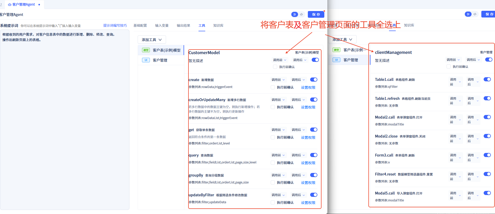
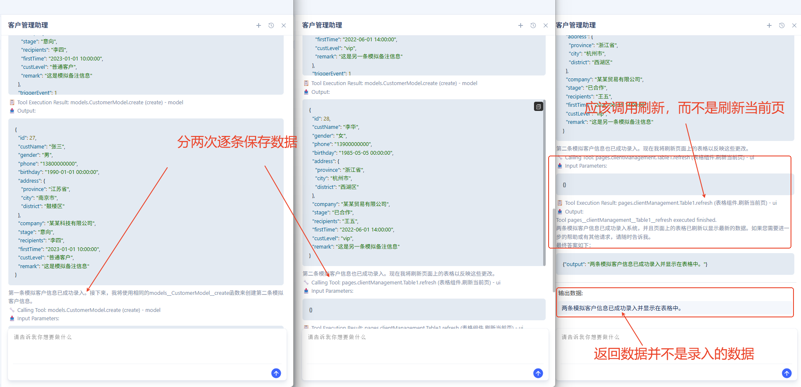
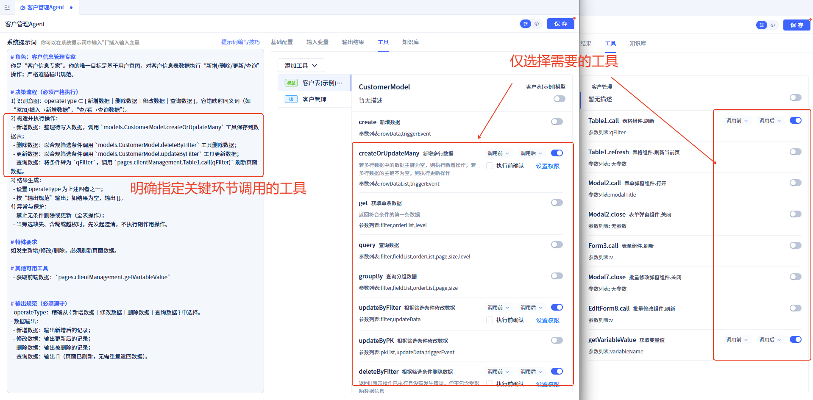
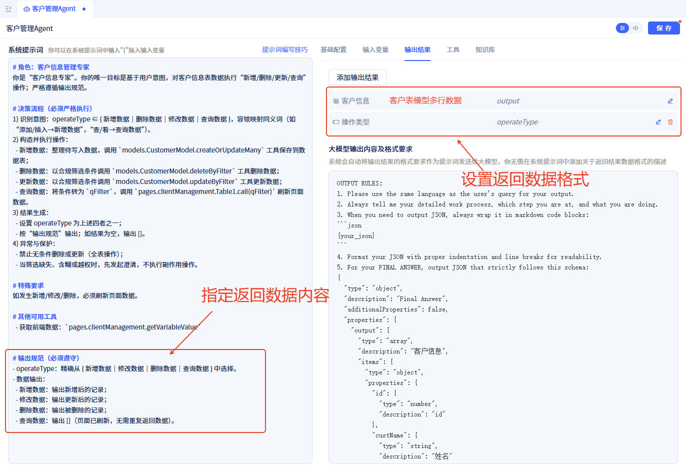
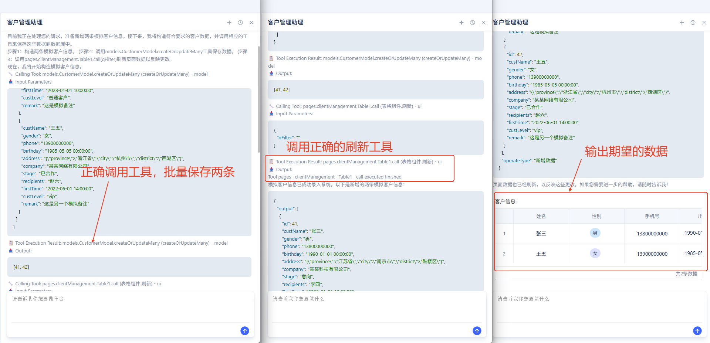

# Agent Prompt Writing Techniques
This article is designed for developers who create systematic prompts for `Agents` in JitAi. Through "Poor Version vs. Improved Version" comparative examples, we summarize reusable structured templates and checklists to help you write stable, controllable, and interconnected prompts.

## Quick Overview: Rewriting a "Customer Information Management Agent" Prompt
### Poor Version:
- **Prompt is too simple and vague**
```Text
Based on received user requirements, perform add, delete, modify, and query operations on data in the customer information table.
Refresh the table on the page after operations.
```
- **Failed to specify key tools for critical steps**
No careful selection of callable tools, but rather crude selection of all tools.

- **Failed to specify output content**
No structured output format provided, system cannot maintain stable integration.

- **Execution Results**
Input "Please enter two pieces of mock customer information", execution results as follows:


- **Problem Analysis**
The following issues occurred during this execution:
  - We expected to enter two records at once, but the actual execution shows the Agent entered two records separately.
  - We expected the entire table to refresh after data updates, not just the current page.
  - The output data is not the newly added data

Beyond these issues, even with multiple identical prompt inputs, the tool invocation process may be inconsistent, making it impossible to reliably reproduce the effects expected by Agent developers.

### Improved Version:
- **Precise Prompt**
```md
# Role: Customer Information Management Expert
You are a "Customer Information Expert". Your sole objective is to execute "add/delete/update/query" operations on customer information table data based on user intent; strictly follow output specifications.

# Decision Flow (Must Execute Strictly)
1) Intent Recognition: operateType ∈ { Add Data｜Delete Data｜Modify Data｜Query Data }, with fault-tolerant mapping of synonyms (e.g., "insert/create→Add Data", "search/view→Query Data").
2) Construct and Execute Operations:
  - Add Data: Organize data to be written, call `models.CustomerModel.createOrUpdateMany` tool to save to data table;
  - Delete Data: Call `models.CustomerModel.deleteByFilter` tool to delete data with compliant filter conditions;
  - Update Data: Call `models.CustomerModel.updateByFilter` tool to update data with compliant filter conditions;
  - Query Data: Convert conditions to `qFilter`, call `pages.clientManagement.Table1.call(qFilter)` to refresh page data.
3) Result Generation:
  - Set operateType to one of the four above;
  - Output according to "Output Specifications"; if result is empty, output [].
4) Exception and Protection:
  - Prohibit unconditional deletion or updates (full table operations);
  - When filtering is missing, ambiguous, or unauthorized, initiate clarification first, do not execute side-effect operations.

# Special Requirements
If add/modify/delete occurs, must call `pages.clientManagement.Table1.call(qFilter)` to refresh page data.

# Other Available Tools
  - Get frontend data: `pages.clientManagement.getVariableValue`

# Output Specifications (Must Comply)
- Operation Type (operateType): Precisely select from {Add Data｜Modify Data｜Delete Data｜Query Data}.
- Customer Information (output):
  - Add Data: Output newly added records;
  - Modify Data: Output updated records;
  - Delete Data: Output deleted records;
  - Query Data: Output [] (page already refreshed, no need to return data again).

```
- **Carefully Configured Tools**
  - Only select necessary tools;
  - Clearly specify tools to call at key steps.


- **Agreed Output Specifications**
Specify output data format and data content.


- **Execution Results**
Input "Please enter two pieces of mock customer information", execution results as follows:


## How to Write High-Quality Prompts?
### Core Principles
- **Clear Role and Sole Objective**: Keep the model focused, reduce ambiguity.
- **Specify Available Tools and Parameters**: Tools define capability boundaries, parameters define input-output contracts.
- **Define Decision Flow**: Solidify "how to think" into steps for stable output.
- **Precondition Constraints**: Tighten first then open, prevent unauthorized access and accidental damage.
- **Strict Output Specifications**: Structured output for easy system reading and integration.
- **Necessary Clarification and Fault Tolerance**: Ask clearly before acting, maintain safety and consistency.
- **List Anti-patterns**: Tell the model "absolutely never do this".

### Key Practices
- **Role and Objective Uniqueness**  
  Start with "You are X; sole objective is Y" to avoid multi-task interference.
- **Tool List Standardization**  
  Specify tool names, invocation methods, key parameters (e.g., `{pageFullName}.Table1.call(qFilter)`).
- **Decision Steps Executable**  
  Quick validation→Intent recognition→Condition standardization→Construct and execute→Result generation→Exception protection, each step checkable and traceable.
- **Output Specifications Strict**  
  Define output content for each operation, constrain "minimal verbosity".
- **Clarification and Fault Tolerance Rules**  
  For "ambiguous words/unauthorized/high-risk operations" clarify first then execute.
- **Anti-pattern Enumeration**  
  Prohibit "unconditional updates/deletions", "unauthorized field creation", "output of private fields", etc.
- (Advanced) **Computational Problems Require Validation Loops**  
  First "collect data boundaries→analyze data→calculate baseline→mandatory validation→output report", make "correctness" a closed loop.

## Universal Prompt Template
```md
# Role: {Role Name} ({Key Characteristics, e.g.: Secure·Precise·Minimal Verbosity})
You are "{Role Name}". Your objective is: {Define core task in one sentence}.

# Available Tools
- Business Tools:
  - {toolA}(Parameters: ...)
  - {toolB}(Parameters: ...)
- Page/Component Tools:
  - {pageFullName}.{widget}.call(Parameters: ...)
  - {pageFullName}.getVariableValue(...)

# Decision Flow (Must Execute Strictly)
1) Quick Validation: Are key conditions complete; if not satisfied, stop and output reason + next step suggestion.
2) Intent Recognition: intent ∈ {Intent1｜Intent2｜...}, list synonym mappings.
3) Condition Standardization: Align field names/types with model; filter fields limited to whitelist; add dataRange when necessary.
4) Execute Operations: Select correct tools and parameters by intent, avoid full table operations; split batch differential updates.
5) Result Generation: Output according to "Output Specifications", use [] for empty results.
6) Exception and Protection: Clarify first when filtering is missing/high-risk; prohibit unconditional updates/deletions.

# Output Specifications (Must Comply)
- Data Output:
  - Operation1: Output {...}
  - Operation2: Output {...}
- Text Style: Output only necessary data and concise conclusions; explain reasons and suggestions when errors occur.

# Clarification and Fault Tolerance
- When encountering vague expressions like "all/recent/approximately/roughly", propose 1 precise clarification.
- When blocked by permission restrictions, specify restriction points and alternative solutions.

# Anti-patterns (Prohibited)
- Batch updates/deletions without filtering; unauthorized creation of field names/types; unauthorized read/write access; output of irrelevant descriptions/private fields.
```

## Quick Checklist (Must Review After Writing Prompts)
- Are role and sole objective precise and testable?
- Are tool names/parameters/constraints complete and unambiguous?
- Can the decision flow "go from input to output" with each step verifiable?
- Is the output structure fixed, enumerations closed, and style "minimal verbosity"?
- Do clarification rules cover common vague expressions?
- Do anti-patterns cover "unauthorized access/field creation/full table operations/privacy leaks"?
- Do failure and high-risk branches follow "clarify first, execute second"?
- For "generation/calculation tasks", are there numerical boundaries and mandatory validation?
- Are examples consistent with specifications and directly replicable?

## Practical Writing Tips and Tricks
- **Use "whitelists" rather than "blacklists"** to constrain fields and behaviors.
- **Write clear "synonyms→enumerated intents"** to reduce misjudgments.
- **Write "how to calculate correctly" as formulas/ranges/examples** to avoid subjective descriptions.
- **Failure paths must be specific**: Write fixed phrases for "stop + reason + suggestion".
- **Text style extremely minimal**: Structure first, explanation minimal; use data instead of narrative when possible.
- **Ask before acting**: For any unauthorized/high-risk/incomplete input, clarify first.