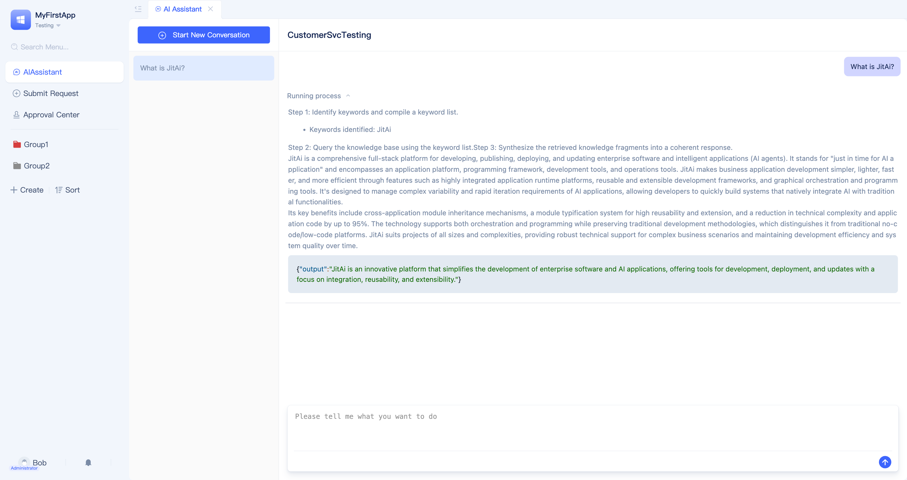
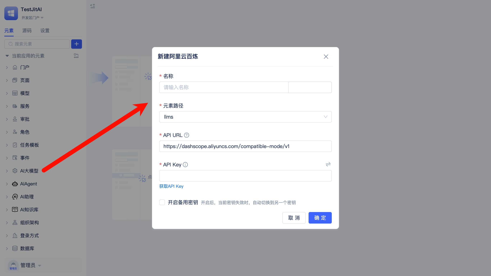
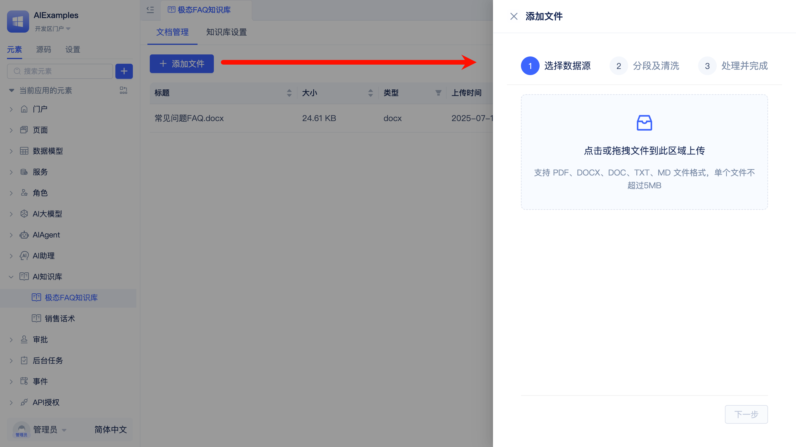
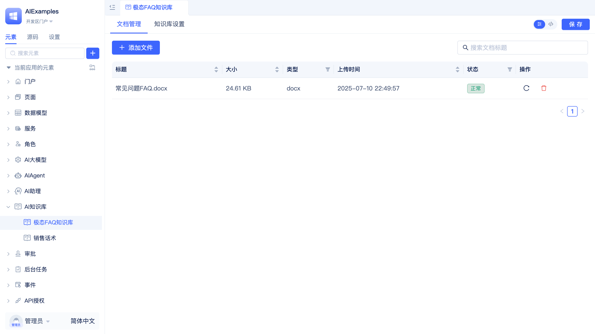
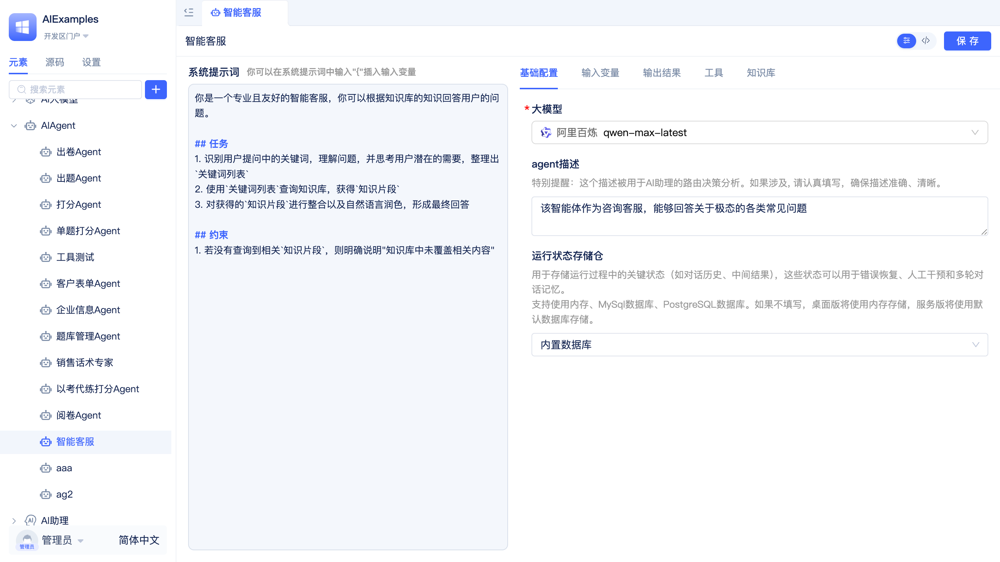
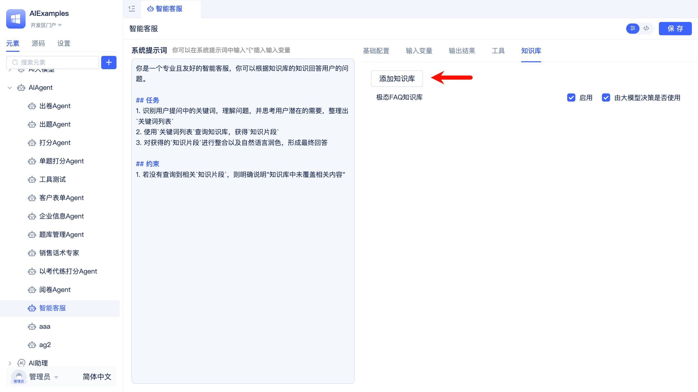
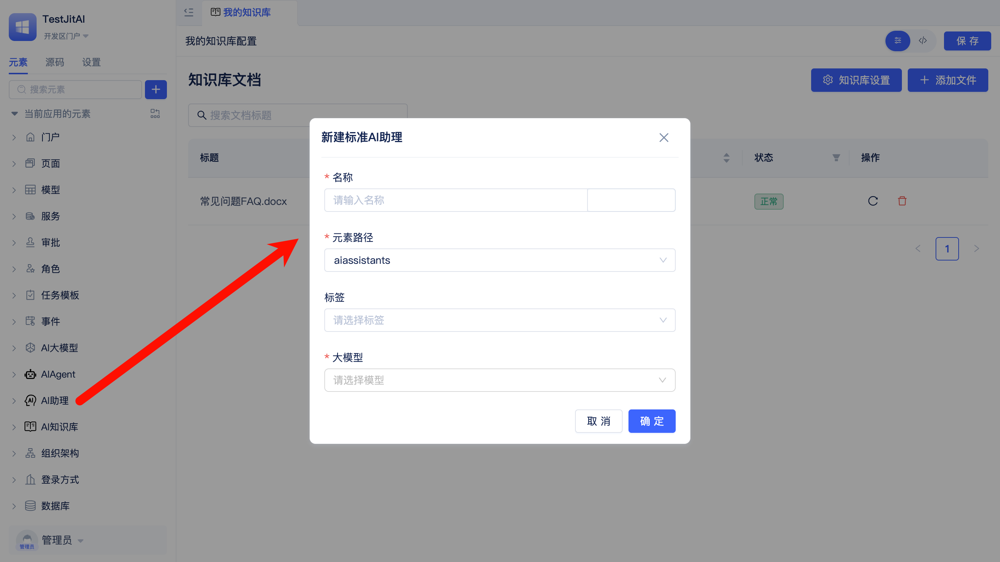
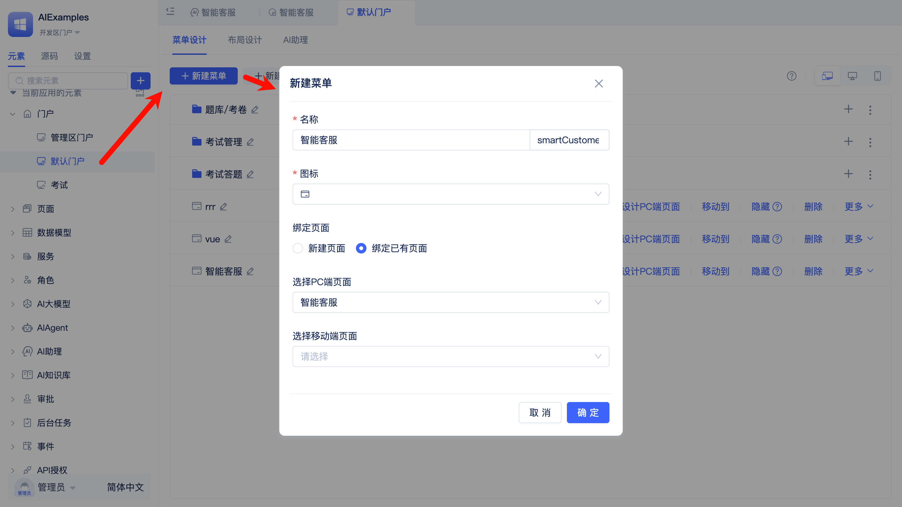

# AI Customer Service Agent

:::info
This guide is designed for beginners to quickly get up and running. By completing this tutorial, you will:
1. Master the fundamentals of the JitAi development platform.
2. Build an AI customer service agent from scratch and integrate it into your business application pages.
3. Note: SQLite database is not supported. Please configure MySQL as your default database. For database details, see [JitORM](../data-modeling/supported-database-vendors).
:::

## Preview {#preview}



--- 

## Let's Get Started! {#getting-started}
### Prerequisites {#prerequisites}
1. [Download the desktop installation package](../../tutorial/download-installation) (skip if already installed)
2. Obtain a large language model service API key - you'll need to register with a provider (this tutorial uses [Alibaba Cloud Bailian Platform](https://bailian.console.aliyun.com/?tab=model#/api-key))
3. Prepare a document to serve as your knowledge base content source (supports Word, PDF, TXT, and Markdown formats)

---

### Creating the Application {#creating-application}

1. Launch the desktop JitNode application and complete the activation process
2. Navigate to the application management page and create a new application named "TestJitAI"
3. Click `Develop` in the application list to access the development environment

    

---

### Creating AI LLM Instance Element {#creating-ai-llm-instance}

1. Navigate to AI LLM and select a large language model provider (this tutorial uses Alibaba Cloud Bailian)
2. Configure your API key and optionally set up a backup API key
3. Confirm the configuration

    

---

### Creating AI Knowledge Base Instance Element {#creating-ai-knowledge-base-instance}
1. Create a new knowledge base instance element
   
   

2. Configure vector model: Select the previously created AI LLM instance as your provider and choose text-embedding-v3 as the model
3. Configure rerank model: Select the previously created AI LLM instance as your provider and choose gte-rerank-v2 as the model
4. Confirm the configuration
5. Upload files to the knowledge base
   
   

6. Initiate document vectorization (server version automatically handles this process)

    For desktop installations, open a new browser tab and navigate to the following URL to trigger vectorization:
    ```shell
    http://127.0.0.1:8080/onTimer
    ```
    
    Allow time for the vectorization process to complete. The document status in your knowledge base will update to `Normal` once finished.

    

---

### Creating AI Agent Instance Element {#creating-ai-agent-instance}

1. Create a new AI Agent instance element and name it `Customer Service`
   
   

   ```text title="Agent Description"
   This agent functions as a customer service representative, capable of answering various common questions about JitAi
   ```

   

2. Select the previously created AI LLM instance element
3. Choose the model: qwen-max-latest
   
   

4. Link knowledge base: Select the previously created AI knowledge base instance element
5. Configure the system prompt
    ```markdown title="Sample Prompt"
    You are a professional and friendly AI customer service representative who answers user questions based on knowledge base information.

    ## Tasks
    1. Identify keywords in user questions, understand the issues, consider users' potential needs, and compile a `keyword list`
    2. Use the `keyword list` to query the knowledge base and retrieve `knowledge fragments`
    3. Synthesize the retrieved `knowledge fragments` and present them in clear, natural language to form your final response

    ## Constraints
    4. If no relevant `knowledge fragments` are found, clearly state "This information is not available in our knowledge base"
    ```

6. Save your configuration


---

### Creating AI Assistant Instance Element {#creating-ai-assistant-instance}

1. Create a new AI assistant instance element and name it `Customer Service`
   
   

2. Add an `AI Agent` node and select the previously created AI Agent instance element
3. Connect the `Start` node to the AI Agent node named `Customer Service`
4. Configure welcome message and opening statement (optional)
5. Save your configuration


---

### Creating Page and Enabling AI Assistant {#creating-page-enabling-assistant}

1. Create a new `Generic Page` instance element

   

2. Enable the AI assistant: Select the `Customer Service` AI assistant instance element you just created. This will make the AI assistant available directly in the development environment
   
   

   

3. To make the AI assistant available to end users, navigate to Portal → User Portal → Create New Menu → Bind Existing Page. Users will then be able to access the AI assistant through the user portal
    

    


---

## Congratulations! {#congratulations}

You have successfully mastered the fundamentals of the JitAi development platform and built your first AI customer service agent.


