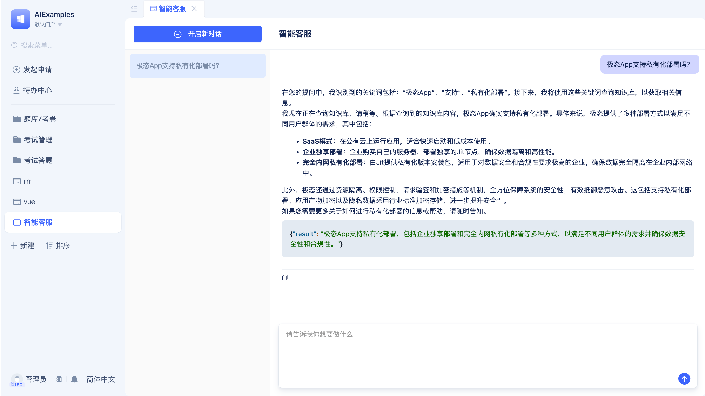

# AI Customer Service Agent

:::info
This guide is designed to help beginners quickly get started. By completing this tutorial, you will:
1. Master the fundamentals of the JitAI development platform.
2. Build an AI customer service agent from scratch and integrate it into your application portals.
:::

## Preview {#preview}



## Getting Started {#getting-started}

### Prerequisites {#prerequisites}

1. [Download and install the Desktop Version](../../tutorial/download-installation) (skip if already installed)
2. Obtain an API key for a large language model service.
3. Prepare a document to serve as your knowledge base content source (supports Word, PDF, TXT, and Markdown formats)

### Creating an application {#creating-application}

See [Creating an application](../creating-and-publishing-applications/creating-and-deploying-applications#creating-first-application)

### Creating an AI LLM element {#creating-ai-llm-element}

See [Creating AI LLM elements](../ai-llm/create-ai-llm#creating-llm-vendor-elements)

### Creating a knowledge base element {#creating-knowledge-base-element}

See [Creating knowledge base elements](../knowledge-base/create-knowledge-elements#create-ai-knowledge-base-element) and [Knowledge base document management](../knowledge-base/knowledge-base-document-management)

### Creating an AI agent element {#creating-ai-agent-element}

See [Creating AI agents](../ai-agent/create-flow-agent)

1. Create an AI Agent element and name it `Customer Service Agent`
2. Select the previously created AI LLM element and choose a model
3. Add the knowledge base: Select the previously created AI knowledge base element
4. Configure the system prompts:
    ```markdown title="Sample prompts"
    You are a professional and friendly AI customer service representative who answers user questions based on knowledge base information.

    ## Tasks
    1. Identify keywords in user questions, understand the issues, consider users' potential needs, and compile a `keyword list`
    2. Use the `keyword list` to query the knowledge base and retrieve `knowledge fragments`
    3. Synthesize the retrieved `knowledge fragments` and present them in clear, natural language to form your final response

    ## Constraints
    4. If no relevant `knowledge fragments` are found, clearly state "This information is not available in our knowledge base"
    ```
5. Save

### Enabling AI agent in a page {#enabling-ai-agent-in-page}

1. Create a generic page element
2. Enable AI in the page editor: select `AI Agent` and choose the previously created `Customer Service Agent`
3. In the portal, bind the page to a menu item so users can access the AI agent

See [Using AI elements in pages](../using-ai-in-portals-and-pages/using-ai-elements-in-pages#using-ai-agent-in-pages) for more details.

## Congratulations! {#congratulations}

You have successfully mastered the fundamentals of the JitAI development platform and built your first AI customer service agent.


