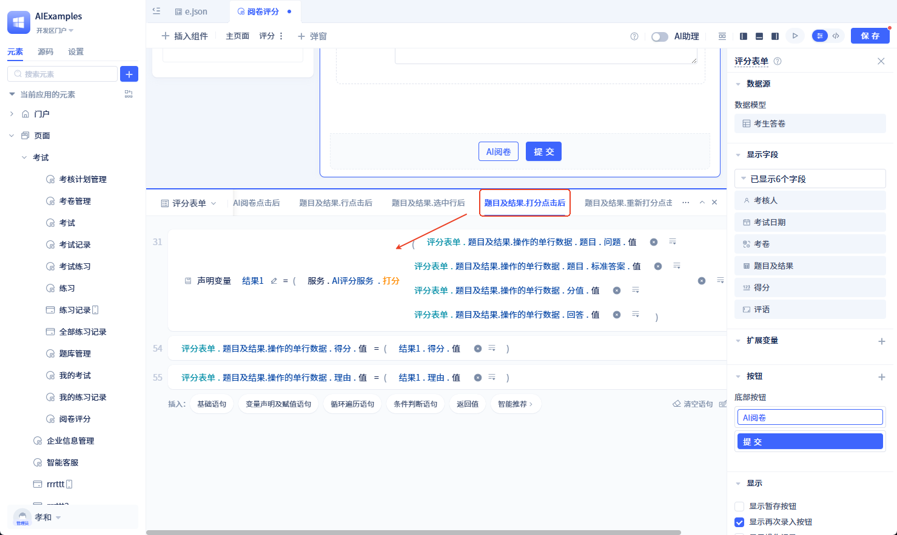
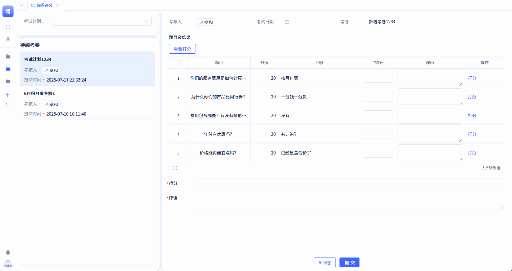
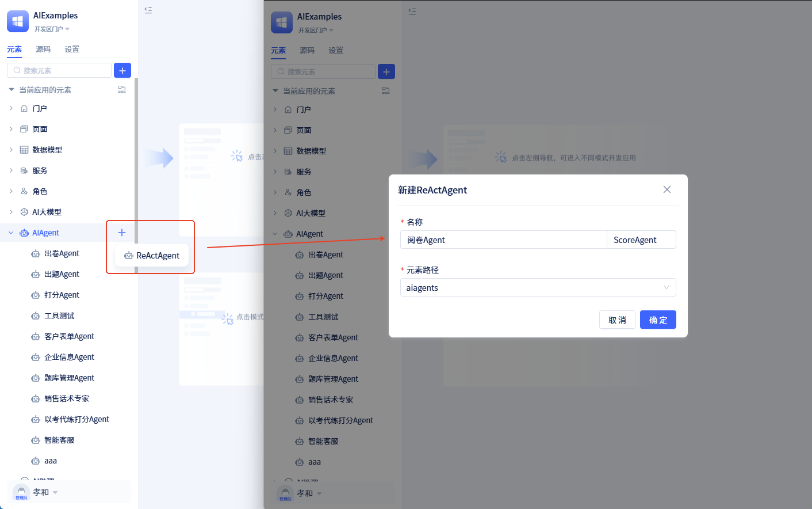
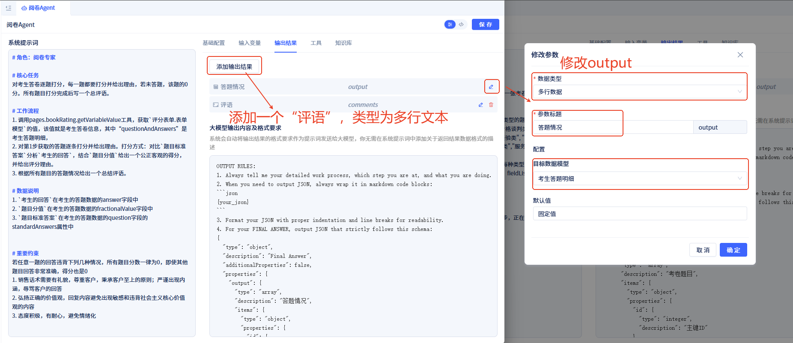
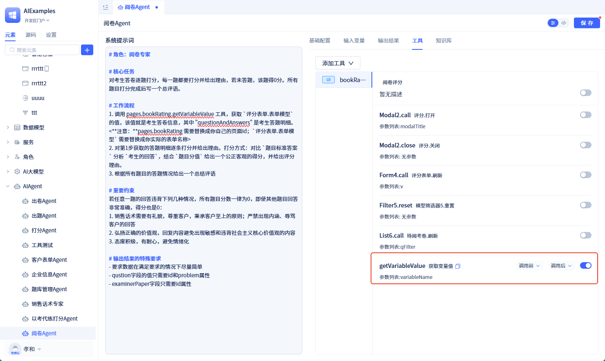
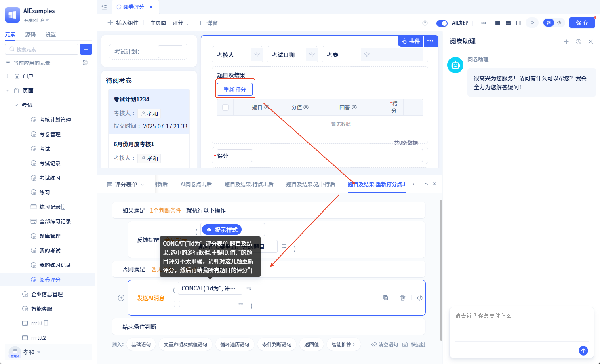
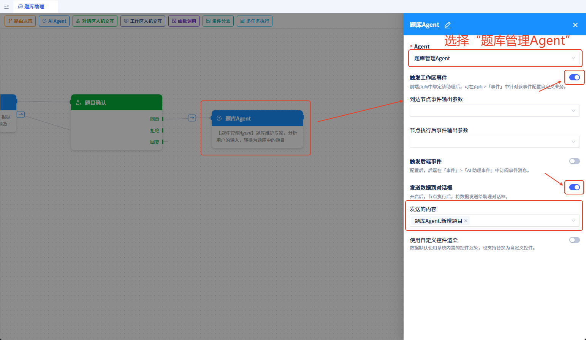
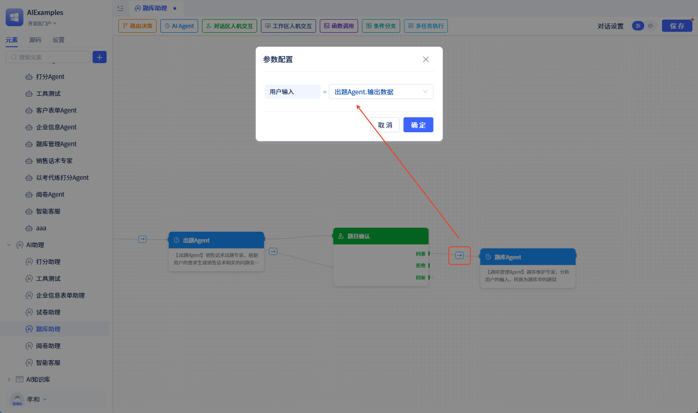

# AI-Powered Question Generation and Grading

## Industry Background {#industry-background}

In enterprise-level AI application development, we frequently encounter two critical challenges: AI needs to collaborate with humans, and AI needs to be deeply integrated with user interfaces.

**Human-AI Collaboration Challenge**: Many business scenarios require human confirmation, such as contract approvals, payment authorizations, data verification, and other sensitive operations. There are also complex business logic scenarios where AI cannot fully handle the processing and requires human judgment and intervention. AI and humans need to interact in real-time within the same workflow.

**Interface Integration Challenge**: AI needs to be able to capture user operation states on pages, such as what content has been entered in forms, what filtering conditions have been applied to tables, and then make corresponding decisions based on this information. AI behavior also needs to dynamically adjust according to user operations.

**Limitations of Existing Platforms**: While mainstream AI development platforms (such as Coze, Dify, etc.) have made AI application development simpler, they still have many limitations in practical use. For example, AI can only run on the server side, cannot directly operate user interfaces, and cannot access real-time data input by users on pages. When human confirmation is needed for certain operations, these platforms also cannot provide corresponding mechanisms.

## JitAi: Full-Stack Enterprise AI Application Development Framework {#jitai-framework}

### Framework Positioning {#framework-positioning}

JitAi is purpose-built for production-grade AI applications, providing developers with a **low-barrier, breakthrough** enterprise AI development experience.

### Core Features {#core-features}

#### 🚀 Zero-Code Visual Orchestration {#zero-code-visual-orchestration}
- **Drag-and-Drop Development**: Zero-code orchestration of complex multi-Agent collaboration workflows through visual interfaces
- **Flexible Configuration**: Freely design Agent prompts, input/output parameters, and tool chains

#### 🔧 Comprehensive Tool Integration {#comprehensive-tool-integration}
- **Full Technology Stack Coverage**: One-click integration with data models, service functions, external APIs, frontend page functions, and more
- **Frontend-Backend Integration**: Break through traditional Agent backend limitations to achieve full-stack AI capabilities

#### 📊 Deep Observability {#deep-observability}
- **End-to-End Monitoring**: Real-time monitoring of Agent execution status, tool invocation logs, and workflow node outputs
- **Runtime Transparency**: Fine-grained configuration of event handling logic with complete observability

#### 🤝 Human-AI Collaboration {#human-ai-collaboration}
- **UI-Agent Interaction**: Innovative interface and AI interaction design capabilities
- **Ready-to-Use Solutions**: Complete solutions for production scenarios requiring human collaboration

JitAi enables complex AI application development to transition from laboratory environments to real business scenarios, providing comprehensive technical solutions for enterprise-grade AI applications.

### Framework Components {#framework-components}

JitAi provides AI Large Language Model elements, AI Agent elements, AI Assistant elements, and Knowledge Base elements.

- **AI Large Language Model Elements**: Implement API encapsulation for mainstream large language models on the market. Developers can configure large language model calls by simply filling in API addresses and API_KEYs. Large language model elements can be called as functions by service/model elements.
- **AI Agent Elements**: Atomic AI application units that implement single AI functionalities through configuration of large language model elements, input parameters, output results, tools, and knowledge bases. AI Agents can be called independently like function calls or be invoked by assistant elements.
- **AI Assistant Elements**: Used to implement complex tasks through visual workflow orchestration, combining multiple nodes and multiple Agents to achieve complex server-side business processes. On the frontend, they provide a dialog box that can be embedded into pages and interact with the pages.
- **Knowledge Base Elements**: Used to implement RAG knowledge base encapsulation. Developers can build their own knowledge bases by uploading documents, and these knowledge bases can be called by Agents.

## Case Study {#case-study}

The following demonstrates how to develop an AI grading/scoring functionality using the JitAi development framework, taking the grading feature in an examination system as an example.

### Prerequisites {#prerequisites}

This system contains 6 core data models:

1. **Question Bank Model** (QuestionModel): categoryOfTopics (question type), problem (question), standardAnswers (standard answers)
2. **Exam Paper Model** (ExamPaperModel): paperName (paper name), questions (question list), total (total score)
3. **Exam Question Detail Model** (ExamQuestionModel): examPaper (associated paper), question (associated question), fractionalValue (score value)
4. **Exam Plan Model** (ExamPlanModel): scheduleName (plan name), examPaper (associated paper), examiners (examination personnel)
5. **Examinee Paper Model** (ExaminerExamPaperModel): examPlan (associated exam plan), examiner (examinee), dateOfExamination (examination date), examPaper (associated paper), questionAndAnswers (answer details), score (score), comments (comments)
6. **Examinee Answer Detail Model** (ExaminerAnswerModel): examinerPaper (associated examinee paper), question (associated question), fractionalValue (score value), answer (examinee answer), score (score), rationale (grading rationale)

The frontend implements a **grading and scoring** functionality page: the left side displays a list of ungraded papers, and the right side contains a scoring form. After clicking on a paper, answer details are displayed, allowing for question-by-question scoring and writing of grading rationales.

Next, we will add AI scoring/grading functionality to the **grading and scoring** feature page.


### Calling Large Language Models through Services {#calling-llm-through-services}

#### Creating Large Language Model Elements {#creating-llm-elements}

Create a large language model element and configure the API URL and API KEY.


#### Creating AI Scoring Service {#creating-ai-scoring-service}

Create an **AI Scoring Service** and add a **scoring** method that calls the large language model element for single-question scoring. The configuration is as follows:


#### Scoring Page Calling Scoring Service {#scoring-page-calling-service}

Add an operation column button **Score** in the **Questions and Results** list of the **Scoring Form**, with the following event logic:


The running effect is as follows:



### Directly Calling Agent {#directly-calling-agent}

#### Creating Grading Agent {#creating-grading-agent}

Create an Agent element and configure the large language model, output results, and tools.



- **AI Large Language Model**


- **Prompt Configuration**

```markdown
# Role: Grading Expert

# Core Task
Grade the student's answer sheet question by question, providing scores and rationales for each question. If a question is unanswered, assign 0 points. After grading all questions, write an overall evaluation comment.

# Workflow
1. Based on the exam paper number provided by the user, call the models.ExaminerAnswerModel.query tool to retrieve the exam answer details
2. Grade each answer detail obtained in step 1 and provide rationales. Grading method: Compare the `standard answer` with the `student's answer`, and considering the `question score value`, provide a fair and objective score with grading rationale.
3. Provide an overall evaluation comment based on all question responses

# Important Constraints
If any question's answer violates the following conditions, all questions will receive 0 points, even if other questions are answered very accurately:
1. Sales scripts must be polite, respectful to customers, and uphold customer-first principles; answers containing implications or insults to customers are strictly prohibited
2. Promote correct values; response content should avoid sensitive content that violates core socialist values
3. Maintain a positive attitude with patience, avoiding emotional responses

# Special Requirements for Output Results
- Data should be as simple as possible while meeting requirements
- The question field value should only include id and problem attributes
- The examinerPaper field should only include the id attribute
```

- **Tool Configuration**:
Tools available to the Agent include: service functions, data model functions, MCP services, external APIs, and page functions. In this example, we select the **Examinee Answer Detail Model** function as the Agent's tool, choosing the **query-data query** method.


- **Output Results**:
Change the Agent output result parameter type to **multi-row data**, select **Examinee Answer Details** as the model, and set the parameter title to **Answer Situation**;
Add a new output result: comments, multi-line text type.



- **Page Calling Grading Agent**
Add an **AI Grading** button to the grading form and configure the button event to call the **Agent.GradingAgent.Run** method with the parameter set to formula value:
`CONCAT("Grade the exam paper with ID ",ScoringForm.FormModel.PrimaryKeyID.Value)`, fill the agent return results into the form model fields, and update the total score.


At this point, we have completed the AI grading functionality. Let's see the effect!


### Process Monitoring and Human-AI Collaboration {#process-monitoring-human-ai-collaboration}

Calling large language models through services or directly calling Agents has the following two issues:
- Users cannot understand AI execution progress, resulting in long waits without feedback
- Agent execution results directly update pages, lacking human review processes

The following demonstrates how to use AI assistants in pages to achieve process monitoring and human confirmation.

#### Creating Assistant Elements {#creating-assistant-elements}

Create an assistant element named **Grading Assistant**.


Add two nodes to the assistant workflow (drag nodes from the top to the canvas) and connect them in sequence:

- **Grading Agent**: AI Agent type, configured as follows:


- **Human Confirmation for Adopting Grading Results**: Workspace human-AI interaction node, configured as follows:


Configure the assistant to output content in the dialog box, which is used to monitor the AI execution process.


#### Using AI Assistant in Scoring Page {#using-ai-assistant-in-scoring-page}

- Enable the AI assistant in the grading scoring page and bind the **Grading Assistant**


- Subscribe the page to the **Agree** event of **AI Assistant - Human Confirmation for Adopting Grading Results**, and update the grading results to the scoring form. The event handling logic is as follows:


- Modify the **AI Grading** button event to call the **Send AI Message** method with the parameter set to formula value: `CONCAT("Grade the exam paper with ID ",ScoringForm.FormModel.PrimaryKeyID.Value)`


Development is now complete. Let's see the effect!


### Deep Integration of AI and Frontend {#deep-integration-ai-frontend}

The deep integration of AI and frontend is reflected in:
- Page functions can serve as Agent tools, and page data can serve as Agent context
- User page operations can dynamically adjust AI behavior

The following demonstrates how AI achieves deep integration with the frontend.

#### Adjusting Grading Agent {#adjusting-grading-agent}

- Modify step 1 of the prompt workflow as follows:

```markdown
...
# Workflow
1. Call the pages.bookRating.getVariableValue tool to get the value of `ScoringForm.FormModel`, which is the `examinee paper information`, where the `questionAndAnswers` field contains the examinee's answer details. <**Note:** pages.bookRating needs to be replaced with your own page ID; `ScoringForm.FormModel` needs to be replaced with your actual form name>
...
```

- Adjust the calling tools, select Page Functions - Grading Scoring Page - getVariableValue. This function is used to get page data, and the Agent calls this tool to obtain page data as context.




#### Adjusting Grading Assistant {#adjusting-grading-assistant}

- Remove the **Human Confirmation for Adopting Grading Results** node and add a **Workspace Human-AI Interaction** node after the **Grading Agent** node, configured as follows:


- Add a **Condition Judgment** node after the **Workspace Human-AI Interaction** node to determine whether the reply content when the workspace human-AI interaction resumes is empty.


- If the **Workspace Human-AI Interaction** node reply content is not empty, continue to have the **Grading Agent** node process it and input the reply content


#### Adjusting Scoring Page {#adjusting-scoring-page}

- Adjust the **AI Grading** button event, change the **Send AI Message** parameter content to the fixed value `Grade current exam paper`

- Subscribe to the **AI Assistant Paused** event of the **Workspace Human-AI Interaction** node, with the following event logic:


- Add a toolbar button "Re-score" to the **Questions and Results** in the scoring form, with the following event logic settings:



At this point, the integration of AI and frontend is complete. Agents can call frontend functions and use frontend data; frontend pages can control AI behavior.


### Multi-Agent Collaboration {#multi-agent-collaboration}

This example demonstrates how to use multiple Agents in AI assistants to collaborate on complex tasks.

The workflow is as follows:
1. **User Input Requirements**: User sends question generation requirements to the AI assistant
2. **Question Generation Agent Processing**: The question generation Agent receives the request and generates questions and answers
3. **Human Confirmation**: Through the dialog area human-AI interaction node, the generated questions and answers are submitted for human confirmation
4. **Workflow Pause**: At this point, the workflow pauses, displaying questions and answers in the dialog area, waiting for human confirmation
5. **After Human Confirmation**: After human confirmation, the workflow resumes execution
6. **Question Bank Agent Processing**: Enter the question bank Agent, convert questions and answers into question bank model data, deduplicate and save
7. **Result Output**: Output the newly added questions and send them to the dialog box for display

#### Setting Up Question Generation Agent {#setting-up-question-generation-agent}

Add an Agent element named **Question Generation Agent** and configure the large language model and prompts.

The prompt content is as follows:

```markdown
# Role: Question Generation Expert

## Objective:
Based on existing knowledge and user descriptions, generate sales script-related questions, question categories, and standard answers.
Available question types: <List the question types in your question bank model>

## Output Requirements:
- Questions and answers (output) should be a markdown format string
- Questions and answers (output) should be a comprehensive output of all questions and answers, not a summary statement

## Example of output value:

User question: Give me 10 commonly used sales scripts for e-commerce agency services.

Correct output value example:
\`\`\`markdown
### Requirement Discovery Category
#### Question 1
**Question**: xxxxx?
**Answer**: xxxxx.

#### Question 2
**Question**: xxxxx?
**Answer**: xxxxx.

### Competitor Comparison Category
#### Question 3
**Question**: xxxxx?
**Answer**: xxxxx.

#### Question 4
**Question**: xxxxx?
**Answer**: xxxxx.
\`\`\`

Incorrect output value example:
"The above content contains 10 commonly used sales scripts for e-commerce agency services, comprehensively covering questions that customers may be concerned about and professional answers."
```


#### Setting Up Question Bank Management Agent {#setting-up-question-bank-management-agent}

Add an Agent element named **Question Bank Management Agent**.

- **Prompt Configuration**:

```markdown
# Role: Question Bank Management Expert

## Objective:
Analyze user input and convert it into questions in the question bank

## Workflow:
- **Step 1: Convert questions and scripts into questions**
- **Step 2: Compare with question bank for deduplication**: Call the models.QuestionModel.query tool to query the database based on all questions generated in step 1, check if the questions you generated already exist in the database, and if they exist, perform deduplication processing. Note that when calling the query tool, query all questions at once, do not query one by one.
- **Step 3: Save questions to question bank**: Call the models.QuestionModel.createOrUpdateMany tool to save new questions to the database
- **Step 4: Output new questions**: Step 3 will get the ID numbers of the new questions, update them into the questions to get the final new questions - questions
```

- **Output Results**:
Change the Agent output result parameter type to **multi-row data**, select **Question Bank** as the model, and set the parameter title to **New Questions**


- **Tool Configuration**:
Add **Question Bank Model** as a callable tool for the Agent, enable **createOrUpdateMany-Add Multi-row Data** and **query-Query** tools


#### Setting Up Question Bank Assistant {#setting-up-question-bank-assistant}

Add an AI assistant element named **Question Bank Assistant** and add three nodes in sequence:

- **Question Generation Agent**: AI Agent type, configured as follows:


- **Question Confirmation**: Dialog area human-AI interaction type, configured as follows:


- **Question Bank Agent**: AI Agent type, configured as follows:



After **Question Confirmation** `Agree`, connect to **Question Bank Agent** and set the input parameter to `Question Generation Agent.Output Data`



#### Using Question Bank Assistant in Question Bank Management Page {#using-question-bank-assistant}

Enable the AI assistant in the **Question Bank Management Page** and select the **Question Bank Assistant** element


Subscribe the page to the **Node Completed** event of **AI Assistant - Question Bank Agent**, and refresh the question bank list after capturing this event


At this point, we have completed the AI question generation functionality. Let's see the effect!

