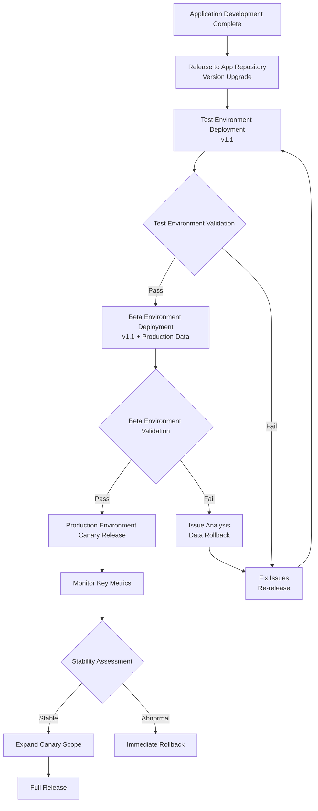
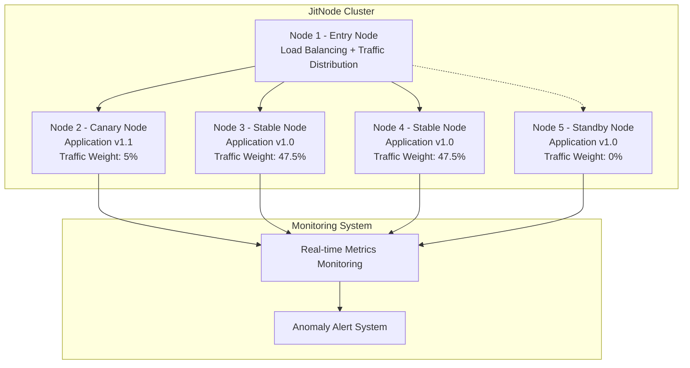
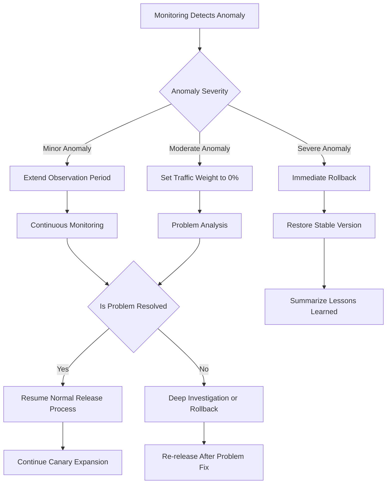
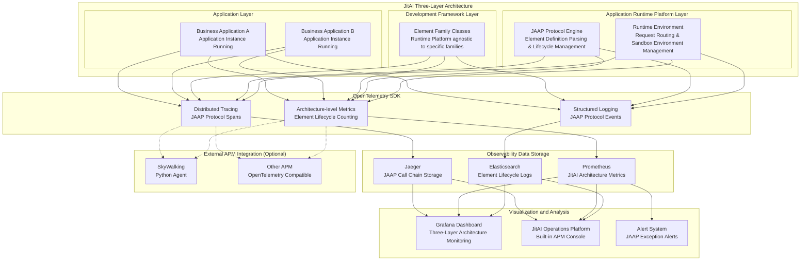

import Tabs from '@theme/Tabs';
import TabItem from '@theme/TabItem';

# Application Layer Stability Guarantee

JitAI supports industry-standard and advanced stability assurance measures at the application layer.

Application layer updates are characterized by **relatively localized impact, high update frequency, and sensitivity to user experience**. This requires balancing stability with the ability to iterate rapidly.

:::tip 
- 🎯 **Localized Impact**: Updates to single or few applications with controllable risk
- ⚡ **Rapid Iteration**: Supports frequent updates in response to business needs  
- 👤 **User Control**: Users choose when to upgrade, reducing forced upgrade risk
- 🔄 **Independent Deployment**: Updates don't affect other applications, enabling fault isolation
:::

## Progressive validation process {#progressive-validation-process}

### Multiple runtime environments {#multiple-runtime-environments}

Create multiple runtime environments in the JitAI operations platform, adopting a progressive validation workflow: **Test Environment → Beta Environment → Production Environment**.

### Environment configuration strategy {#environment-configuration-strategy}

<Tabs>
<TabItem value="test" label="🧪 Test Environment" default>

:::info Test Environment Configuration
**Purpose**: Functional validation and basic performance testing

🔧 **Environment Characteristics**
- **Data Source**: Simulated or desensitized data
- **Traffic Source**: Testing team and developers
- **Resource Allocation**: Medium-scale resources for functional testing

✅ **Validation Focus**
- Business logic correctness
- User interface and interaction experience
- Basic performance and response time
- Integration with other systems
:::

</TabItem>
<TabItem value="beta" label="🚀 Beta Environment">

:::info Beta Environment Configuration  
**Purpose**: Real-world validation with production data

🔧 **Environment Characteristics**
- **Data Source**: Production data (read-only mode or replica)
- **Traffic Source**: Internal users and limited external users
- **Resource Allocation**: Near-production scale

✅ **Validation Focus**
- Real data compatibility
- Production-grade performance and stability
- End-to-end business process validation
- Data security and consistency
:::

</TabItem>
<TabItem value="prod" label="🌐 Production Environment">

:::info Production Environment Configuration
**Purpose**: Live service for actual users

🔧 **Environment Characteristics**
- **Data Source**: Production data
- **Traffic Source**: All user traffic
- **Resource Allocation**: Production-grade configuration

✅ **Validation Focus**
- Overall system stability
- User experience and satisfaction metrics
- Critical business metrics
- 24/7 availability
:::

</TabItem>
</Tabs>

### Version management and release strategy {#version-management-and-release-strategy}

| Release Stage | Version Status | Validation Cycle | Pass Criteria | Failure Handling |
|---------|---------|---------|---------|---------|
| **App Repository** | Development completed | Code review | Code standards + functional completeness | Return to development for fixes |
| **Test Environment** | Functional testing | 1-2 days | Functional correctness + basic performance | Return to development stage |
| **Beta Environment** | Pre-production | 3-5 days | Real data compatibility + production performance | Analyze data issues |
| **Production Environment** | Production | Continuous monitoring | Stability metrics + user experience | Canary rollback |

## Canary release mechanism {#canary-release-mechanism}

### Node-level canary release {#node-level-canary-release}

In the JitAI cluster architecture, one JitNode serves as the load balancer, controlling traffic distribution. The runtime environment entry address resolves to this node.

### Controlling canary release process {#controlling-canary-release-process}

#### Assessing stability and availability {#assessing-stability-and-availability}

Canary releases require simultaneous assessment of two dimensions: **stability** and **availability**.

- **Stability**: Technical metrics such as error rates and response times
- **Availability**: Business function uptime and user experience metrics

| Canary Stage | Canary Nodes | Traffic Ratio | Observation Period | Stability Standard | Availability Standard | Exception Handling |
|---------|----------|---------|--------|----------|----------|----------|
| **Initial canary** | 1 node | 5% | 2 hours | Error rate &lt; 0.01% | Business availability &gt; 99.9% | Set traffic weight to 0% |
| **Small-scale expansion** | 2 nodes | 20% | 4 hours | Error rate &lt; 0.005% | Business availability &gt; 99.95% | Set traffic weight to 0% |
| **Medium scale** | 50% of nodes | 50% | 8 hours | Error rate &lt; 0.001% | Business availability &gt; 99.98% | Immediate rollback or set traffic to 0% |
| **Full release** | All nodes | 100% | Continuous monitoring | System stable | Business functioning normally | Emergency rollback |

:::tip Traffic zeroing mechanism
When canary nodes exhibit abnormal behavior, **immediately set their traffic weight to 0%** for instant fault isolation:
- 🚨 **Instant Response**: Cut off traffic to abnormal nodes without waiting for rollback deployment
- 🛡️ **User Protection**: Ensures user requests aren't routed to problematic nodes
- 🔄 **Quick Recovery**: Traffic can be rapidly restored once issues are resolved
- 📊 **Data Retention**: Nodes remain running for analysis and debugging
:::

### Operating canary release process {#operating-canary-release-process}

**Standard release workflow:**

1. **Select canary node**: Choose one node as the initial canary
2. **Adjust traffic weight**: Set the node's traffic weight to 5%
3. **Deploy new version**: Deploy the new application version on the canary node
4. **Start monitoring**: Enable comprehensive monitoring and alerting
5. **Dual assessment**: Simultaneously assess stability and availability metrics
6. **Execute decision**: Determine next steps based on assessment results
7. **Gradual expansion**: Progressively increase canary nodes and traffic ratio after stabilization
8. **Complete release**: Upgrade all nodes and restore normal traffic distribution

**Exception handling workflow:**

**Traffic zeroing steps:**

1. **Anomaly detection**: Monitoring system detects stability or availability metric anomalies
2. **Instant isolation**: Set canary node traffic weight to 0% (takes &lt; 10 seconds)
3. **Status confirmation**: Verify user traffic has completely switched to stable nodes
4. **Problem diagnosis**: Analyze and debug issues in the isolated state
5. **Fix verification**: Validate functionality after resolving problems
6. **Traffic recovery**: Gradually restore traffic allocation to the node after verification

## Observability {#observability}

:::info
Observability features are currently under development and will be available soon.
:::

### Integrating with OpenTelemetry and APM ecosystem {#integrating-with-opentelemetry-and-apm-ecosystem}

The JitAI Application Runtime Platform supports [OpenTelemetry](https://opentelemetry.io/), the industry-standard framework for observability. OpenTelemetry plays an essential role in technology evolution, ecosystem integration, and industry best practices.

