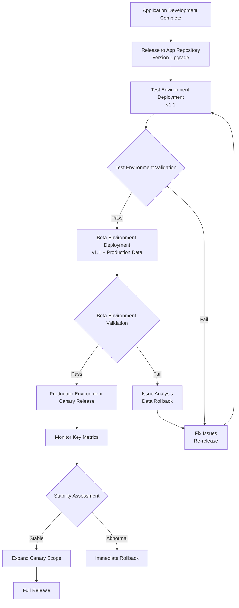
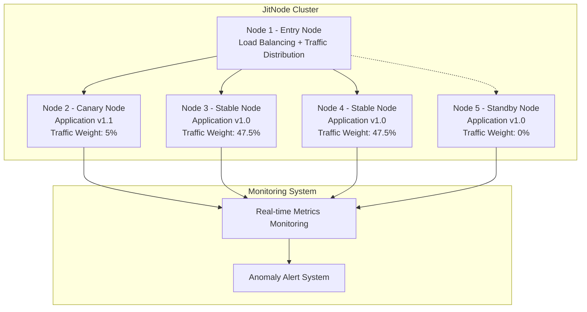
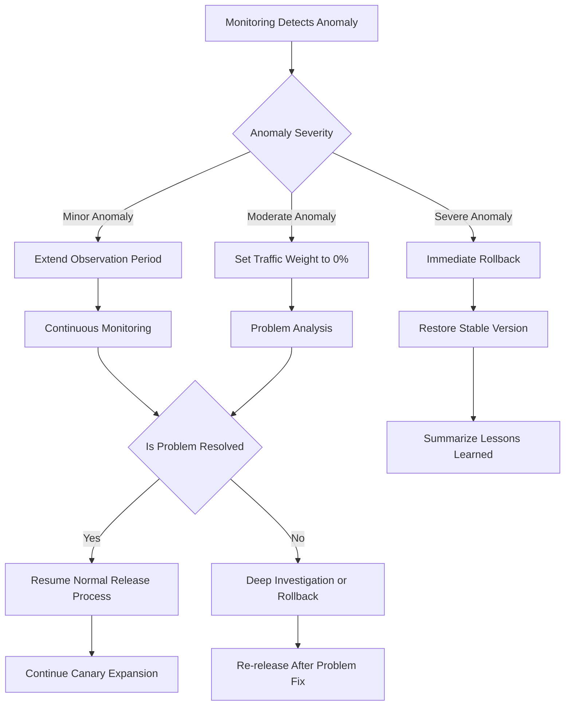

import Tabs from '@theme/Tabs';
import TabItem from '@theme/TabItem';

# Application Layer Stability Guarantee
JitAi has the capability to support mainstream and leading application layer stability assurance measures in the industry.

Application layer updates have the characteristics of **relatively localized impact, high update frequency, and user experience sensitivity**, requiring support for rapid iteration while ensuring stability.

:::tip 
- 🎯 **Localized Impact**: Single or few application updates with controllable risks
- ⚡ **Rapid Iteration**: Support frequent updates to respond to business needs  
- 👤 **User Control**: Users can choose upgrade timing, reducing forced upgrade risks
- 🔄 **Independent Deployment**: Does not affect other application operations, fault isolation
:::

## Progressive Validation Process
### Multiple Runtime Environments
Create multiple runtime environments in the JitAi operations platform, adopting a progressive validation process of **Test Environment → Beta Environment → Production Environment**:



### Environment Configuration Strategy
<Tabs>
<TabItem value="test" label="🧪 Test Environment" default>

:::info Test Environment Configuration
**Functional Positioning**: Function validation and basic performance testing

🔧 **Environment Characteristics**
- **Data Source**: Simulated data or desensitized data
- **Traffic Source**: Testing team and developers
- **Resource Configuration**: Medium scale, meeting functional testing requirements

✅ **Validation Focus**
- Business logic correctness validation
- User interface and interaction experience testing
- Basic performance and response time testing
- Integration function testing with other systems
:::

</TabItem>
<TabItem value="beta" label="🚀 Beta Environment">

:::info Beta Environment Configuration  
**Functional Positioning**: Real environment validation, connected to production environment data

🔧 **Environment Characteristics**
- **Data Source**: Production environment data (read-only mode or replica)
- **Traffic Source**: Internal users and a small number of external users
- **Resource Configuration**: Close to production environment scale

✅ **Validation Focus**
- Real data compatibility validation
- Production-level performance and stability testing
- Complete business process end-to-end validation
- Data security and consistency checks
:::

</TabItem>
<TabItem value="prod" label="🌐 Production Environment">

:::info Production Environment Configuration
**Functional Positioning**: Production service, serving real users

🔧 **Environment Characteristics**
- **Data Source**: Production data
- **Traffic Source**: Full user traffic
- **Resource Configuration**: Production-level resource configuration

✅ **Validation Focus**
- Overall system stability monitoring
- User experience and satisfaction metrics
- Business key metrics monitoring
- 7x24 hour availability assurance
:::

</TabItem>
</Tabs>

### Version Management and Release Strategy
| Release Stage | Version Status | Validation Cycle | Pass Criteria | Failure Handling |
|---------|---------|---------|---------|---------|
| **App Repository** | Development Complete Version | Code Review | Code Standards + Functional Completeness | Redevelopment and Fix |
| **Test Environment** | Functional Test Version | 1-2 days | Functional Correctness + Basic Performance | Return to Development Stage |
| **Beta Environment** | Pre-production Version | 3-5 days | Real Data Compatibility + Production Performance | Data Issue Analysis |
| **Production Environment** | Production Version | Continuous Monitoring | Stability Metrics + User Experience | Canary Rollback |

## Canary Release Mechanism
### Node-level Canary Release
In the JitAi cluster architecture, one of the JitNode nodes acts as a load balancer, responsible for traffic distribution control. The runtime environment entry address resolves to this node.



### Canary Release Process Control
#### Dual Assessment of Stability and Availability
Canary releases need to simultaneously assess two dimensions: **stability** and **availability**:

- **Stability**: Technical metrics such as system error rates and response times
- **Availability**: Normal service capability of business functions and user experience metrics

| Canary Stage | Canary Nodes | Traffic Ratio | Observation Period | Stability Standard | Availability Standard | Exception Handling |
|---------|----------|---------|--------|----------|----------|----------|
| **Initial Canary** | 1 node | 5% | 2 hours | Error rate &lt; 0.01% | Business availability &gt; 99.9% | Set traffic weight to 0% |
| **Small Scale Expansion** | 2 nodes | 20% | 4 hours | Error rate &lt; 0.005% | Business availability &gt; 99.95% | Set traffic weight to 0% |
| **Medium Scale** | 50% nodes | 50% | 8 hours | Error rate &lt; 0.001% | Business availability &gt; 99.98% | Immediate rollback or set traffic to 0% |
| **Full Release** | All nodes | 100% | Continuous monitoring | System stable | Business normal | Emergency rollback |

:::tip Canary Node Traffic Zero Mechanism
When canary nodes exhibit abnormal behavior, you can **immediately set their traffic weight to 0%** to achieve second-level fault isolation:
- 🚨 **Instant Response**: No need to wait for rollback deployment, directly cut off abnormal node traffic
- 🛡️ **User Protection**: Ensure user requests are not routed to abnormal nodes
- 🔄 **Quick Recovery**: Traffic allocation can be quickly restored after issue resolution
- 📊 **Data Retention**: Nodes continue running for problem analysis and debugging
:::

### Canary Release Operation Process
**Standard Release Process:**

1. **Select Canary Node**: Choose 1 node as the initial canary node
2. **Adjust Traffic Weight**: Adjust the node's traffic weight to 5%
3. **Deploy New Version**: Deploy the new version application on the canary node
4. **Start Monitoring**: Enable comprehensive monitoring and alerting
5. **Dual Assessment**: Simultaneously assess stability and availability metrics
6. **Decision Execution**: Decide next steps based on assessment results
7. **Gradual Expansion**: Gradually increase canary nodes and traffic ratio after stabilization
8. **Complete Release**: All nodes upgraded, restore normal traffic distribution

**Exception Handling Process:**



**Traffic Zero Operation Steps:**

1. **Anomaly Detection**: Monitoring system detects stability or availability metric anomalies
2. **Instant Isolation**: Set canary node traffic weight to 0% (takes &lt; 10 seconds)
3. **Status Confirmation**: Confirm user traffic has completely switched to stable nodes
4. **Problem Diagnosis**: Perform problem analysis and debugging in isolated state
5. **Fix Verification**: Perform functional verification after problem resolution
6. **Traffic Recovery**: Gradually restore the node's traffic allocation after verification passes

## Observability
:::info
Observability-related capabilities are under construction and will be launched soon
:::

### OpenTelemetry and APM Ecosystem Integration
JitAi application Runtime Platform supports [OpenTelemetry](https://opentelemetry.io/), which is the core standard in the observability field and holds an irreplaceable position in technological evolution, ecosystem integration, and industry practices.

```mermaid
graph TB
    subgraph "JitAi Three-Layer Architecture"
        subgraph "Application Layer"
            App1[Business Application A<br/>Application Instance Running]
            App2[Business Application B<br/>Application Instance Running]
        end
        
        subgraph "Development Framework Layer"
            Framework[Element Family Classes<br/>(Runtime Platform agnostic to specific families)]
        end
        
        subgraph "Application Runtime Platform Layer"
            JAAP[JAAP Protocol Engine<br/>Element Definition Parsing & Lifecycle Management]
            Runtime[Runtime Environment<br/>Request Routing & Sandbox Environment Management]
        end
    end
    
    subgraph "OpenTelemetry SDK"
        Tracer[Distributed Tracing<br/>JAAP Protocol Spans]
        Metrics[Architecture-level Metrics<br/>Element Lifecycle Counting]
        Logs[Structured Logging<br/>JAAP Protocol Events]
    end
    
    subgraph "Observability Data Storage"
        Jaeger[Jaeger<br/>JAAP Call Chain Storage]
        Prometheus[Prometheus<br/>JitAI Architecture Metrics]
        ES[Elasticsearch<br/>Element Lifecycle Logs]
    end
    
    subgraph "Visualization and Analysis"
        Grafana[Grafana Dashboard<br/>Three-Layer Architecture Monitoring]
        JitAiConsole[JitAi Operations Platform<br/>Built-in APM Console]
        AlertManager[Alert System<br/>JAAP Exception Alerts]
    end
    
    subgraph "External APM Integration (Optional)"
        Skywalking[SkyWalking<br/>Python Agent]
        Others[Other APM<br/>OpenTelemetry Compatible]
    end
    
    %% Runtime Platform layer to OpenTelemetry connections
    App1 --> Tracer
    App2 --> Tracer
    Framework --> Tracer
    JAAP --> Tracer
    Runtime --> Tracer
    
    App1 --> Metrics
    App2 --> Metrics
    Framework --> Metrics
    JAAP --> Metrics
    Runtime --> Metrics
    
    App1 --> Logs
    Framework --> Logs
    JAAP --> Logs
    Runtime --> Logs
    
    %% OpenTelemetry to storage connections
    Tracer --> Jaeger
    Metrics --> Prometheus
    Logs --> ES
    
    %% Storage to visualization connections
    Jaeger --> Grafana
    Prometheus --> Grafana
    ES --> Grafana
    Jaeger --> JitAiConsole
    Prometheus --> JitAiConsole
    ES --> JitAiConsole
    
    %% Alert connections
    Prometheus --> AlertManager
    
    %% External APM integration
    Tracer -.-> Skywalking
    Metrics -.-> Skywalking
    Tracer -.-> Others
    Metrics -.-> Others
```
