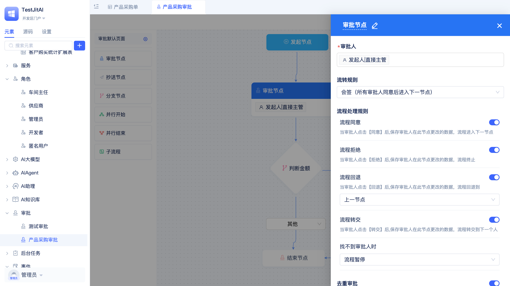
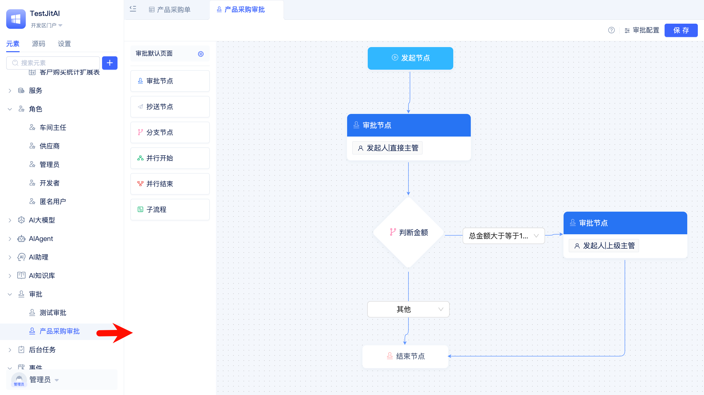
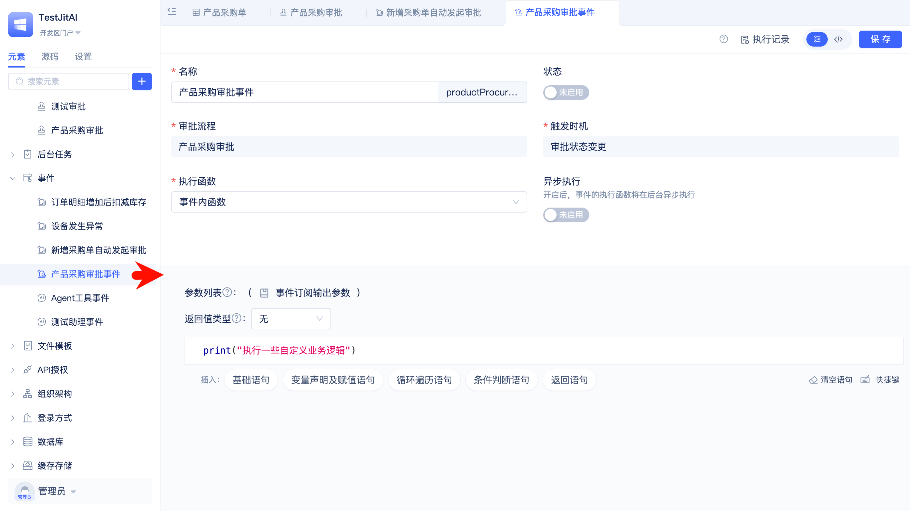
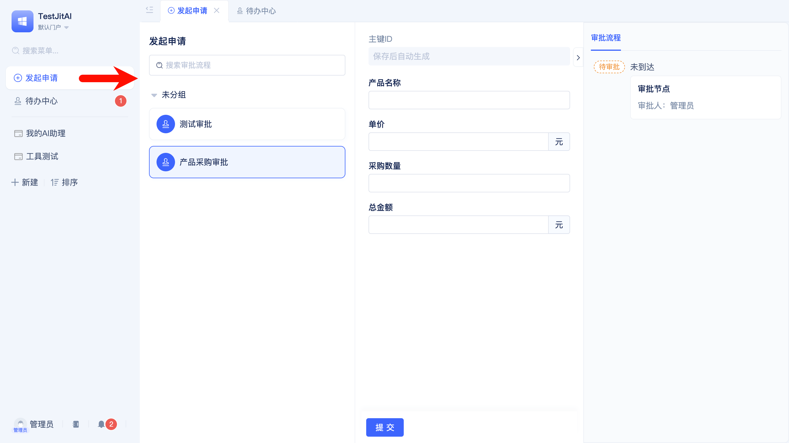
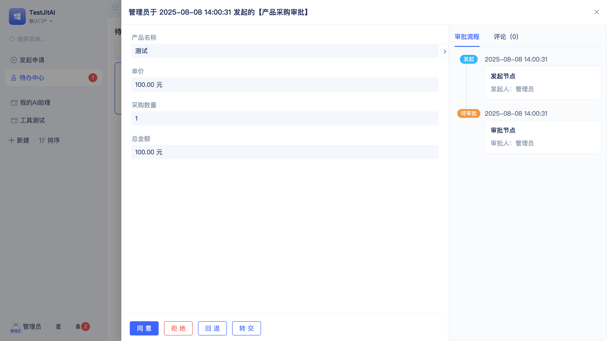

# 审批流程编排与自定义审批事件
在采购审批场景中，采购申请发起后进入审批流程，先由直属经理审批，若金额超过阈值再进入财务审批；流程完成后根据审批结果更新“审批状态”。

## 创建一个数据表模型用于存储采购单数据
使用[数据模型](../../reference/framework/JitORM/data-models)存储采购单信息，在后续审批流程中，将使用该模型中的数据，审批人可以看到采购单信息。

关于业务实体建模，可以参考[业务实体建模与数据分析](./business-entity-modeling-and-data-analysis)。

## 创建采购审批流程
在创建审批流程时选择刚才创建的模型。

## 拖拽配置审批流程
在画布中添加审批节点、分支节点，并完成连线。

配置审批节点

配置分支节点

配置完成的审批流程

## 审批状态变更时触发自定义逻辑
新建一个审批事件，当审批状态变更时触发自定义的业务逻辑。

相关文档：[业务实体建模与数据分析](./business-entity-modeling-and-data-analysis)

## 用户发起申请
用户发起审批流程。

## 审批人在待办中心审批
审批人在待办中心查看待办事项，并进行审批。

