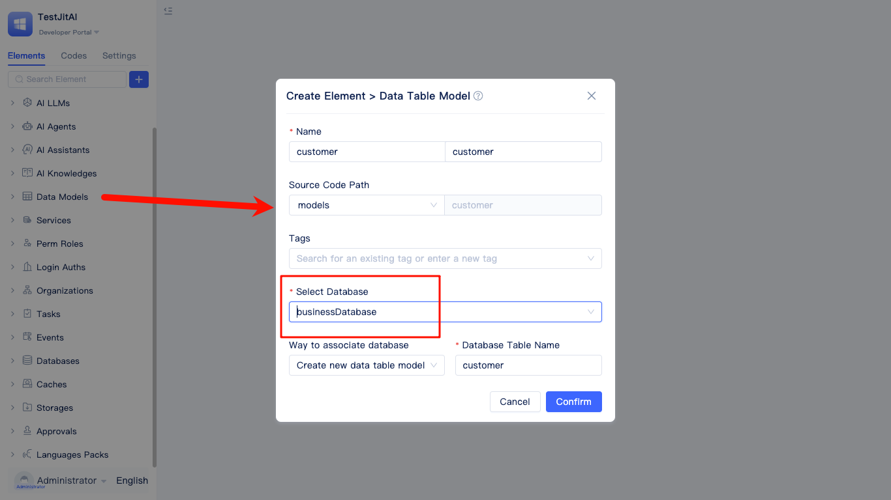

# Business Entity Modeling and Data Analysis
Build a sales data analysis system that manages entities such as customers, stores, sales representatives, products, and orders. Support multi-database configuration (historical data archived to separate database instances), extended statistical fields in customer information, multi-dimensional aggregation analysis, and automated business rule processing when data changes.

## Creating Database Instances
Create primary business database and historical database (optional), supporting mapping to existing database tables.

1. Create primary business database: Configure MySQL database instance for business data storage during system runtime
   
    
   
2. Create historical database (optional): Configure MySQL database instance for analyzing archived historical data

## Modeling Business Entities and Data Types
Entities: Customer, Order, Order Detail, Product, Store, Sales Representative.

Relationships: Customer/Store/Sales Representative → Order (one-to-many), Order → Order Detail (one-to-many), Product → Order Detail (one-to-many).

1. Create Customer data table model: Name (Single Line Text), Company Name (Single Line Text), Detailed Description (Multi-line Text), Contact Phone (Mobile Number), Address (Address), ID Number (ID Number), Customer Type (Option Group Single Select), Cooperation Status (Checkbox)
   
   

   

2. Create Store data table model: Store Name (Single Line Text), Address (Address), Contact Information (Mobile Number), Store Category (Option Group Single Select), Business Status (Checkbox)
3. Create Sales Representative data table model: Employee Name (Single Line Text), Employee ID (Single Line Text), Contact Phone (Mobile Number), Associated Store (Related Data Single Select), Employment Status (Checkbox)
4. Create Product data table model: Product Name (Single Line Text), Product Category (Option Group Single Select), Price (Currency), Inventory Quantity (Number), Product Image (Image), Specification Parameters (Rich Text), Listing Status (Checkbox)
5. Create Order data table model: Order Number (Serial Number), Sales Amount (Currency), Order Date (Date Time), Payment Status (Option Group Single Select), Associated Customer (Related Data Single Select), Associated Store (Related Data Single Select), Associated Sales Representative (Related Data Single Select)
6. Create Order Detail data table model: Associated Customer (Related Data Single Select), Associated Order (Related Data Single Select), Associated Product (Related Data Single Select), Purchase Quantity (Number), Unit Price (Currency), Subtotal Amount (Currency)

When creating models, you need to select the correct database instance element.

## Configuring Customer Information Extension Table
Without modifying the customer model structure, associate order data to generate statistical fields. Based on customers, associate orders; extend cumulative consumption amount (sum) and purchase count (count).

1. Create customer purchase statistics extension table: Use customer model as base model
   
   

2. Add associated data tables: Establish association through the primary key ID field of the customer model and the associated customer field of the order model. When adding associations, you can configure filter conditions for the order model, such as payment status being paid.
3. Configure extension fields: Sum the sales amount field as a new "Cumulative Consumption Amount" field; count order records as a new "Purchase Count" field.

## Configuring Aggregate Tables (Grouping and Summarization)
Group by year, quarter, month, and week to calculate sales amount (SUM) and order quantity (COUNT). Utilize the province and city parsing functionality of address fields to group and calculate sales performance by region. Group based on product category fields to analyze sales performance and proportion of each category.

1. Create time dimension aggregate table: Use order model as data source, filter paid orders, group by order date field by year, quarter, month, and week, configure sales amount (sum of sales amount) and order count (count of order ID) aggregation
2. Create regional dimension aggregate table: Use customer model as data source, utilize province and city parsing functionality of address fields for grouping, associate order model to calculate sales amount, order count, and customer count
3. Create product category aggregate table: Use product model as data source, group based on product category field, associate order detail model to configure purchase quantity (SUM) and subtotal amount (SUM) aggregation

## Configuring Model Events (Business Rule Automation)
Create new model events

Automatically update product inventory quantity based on purchase quantity changes in the order detail table.
