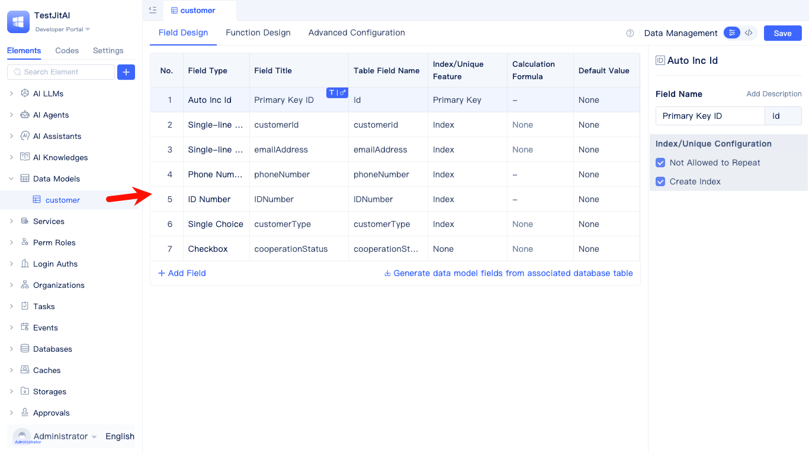

# 业务实体建模与数据分析
构建销售数据分析系统，管理客户、门店、销售员、产品、订单等实体，支持多数据库配置（历史数据归档到单独的数据库实例中）、客户信息中扩展常用统计字段、多维度聚合分析，以及数据变更时的业务规则自动化处理。

## 创建数据库实例
创建主业务数据库与历史数据库（可选），支持可映射已有库表。

1. 创建主业务数据库：配置MySQL数据库实例，用于系统运行时的业务数据存储
   
    
   
2. 创建历史数据库（可选）：配置MySQL数据库实例，用于分析归档后的历史数据

## 建模业务实体与数据类型
实体：客户、订单、订单明细、产品、门店、销售员。

关系：客户/门店/销售员 → 订单（一对多），订单 → 订单明细（一对多），产品 → 订单明细（一对多）。

1. 创建客户数据表模型：姓名(单行文本)、公司名称(单行文本)、详细描述(多行文本)、联系电话(手机号)、地址(地址)、身份证号(身份证号)、客户类型(选项组单选)、合作状态(检查框)
   
   

   

2. 创建门店数据表模型：门店名称(单行文本)、地址(地址)、联系方式(手机号)、门店分类(选项组单选)、营业状态(检查框)
3. 创建销售员数据表模型：员工姓名(单行文本)、工号(单行文本)、联系电话(手机号)、关联门店(关联数据单选)、在职状态(检查框)
4. 创建产品数据表模型：产品名称(单行文本)、产品分类(选项组单选)、价格(金额)、库存数量(数字)、产品图片(图片)、规格参数(富文本)、上架状态(检查框)
5. 创建订单数据表模型：订单编号(流水号)、销售金额(金额)、订单日期(日期时间)、支付状态(选项组单选)、关联客户(关联数据单选)、关联门店(关联数据单选)、关联销售员(关联数据单选)
6. 创建订单明细数据表模型：关联客户(关联数据单选)、关联订单(关联数据单选)、关联产品(关联数据单选)、购买数量(数字)、单价(金额)、小计金额(金额)

在创建模型时需要选择正确的数据库实例元素。

## 配置客户信息扩展表
在不改动客户模型结构的前提下，关联订单数据，生成统计字段。以客户为基础，关联订单；扩展累计消费金额(求和)与购买次数(计数)

1. 创建客户购买统计扩展表：以客户模型为基础模型
   
   

2. 添加关联的数据表：通过客户模型的主键ID字段与订单模型的关联客户字段建立关联，在添加关联关系时可以配置对订单模型的筛选条件，如支付状态为已付款等。
3. 配置扩展字段：对销售金额字段求和，作为新的"累计消费金额"字段；对订单记录计数，作为新的"购买次数"字段。

## 配置聚合表（分组与汇总）
按年、季度、月、周分组，统计销售金额(SUM)、订单数量(COUNT)。利用地址字段的province、city解析功能，按地区分组统计销售业绩。基于产品分类字段分组，分析各品类销售表现和占比。

1. 创建时间维度聚合表：以订单模型为数据源，筛选已支付订单，基于订单日期字段按年、季度、月、周分组，配置销售金额(对销售金额求和)、订单数(对订单ID计数)聚合
2. 创建地区维度聚合表：以客户模型为数据源，利用地址字段的province、city解析功能分组，关联订单模型统计销售金额、订单数、客户数
3. 创建产品分类聚合表：以产品模型为数据源，基于产品分类字段分组，关联订单明细模型配置购买数量(SUM)、小计金额(SUM)聚合

## 配置模型事件（业务规则自动化）
新建模型事件

根据订单明细表中的购买数量变化，自动更新产品库存数量。
