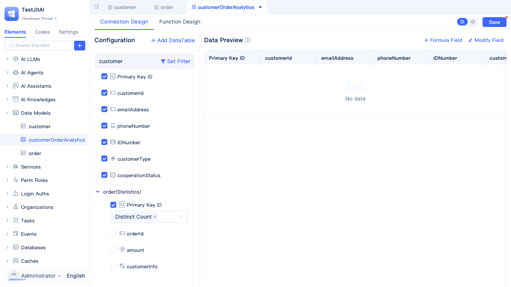
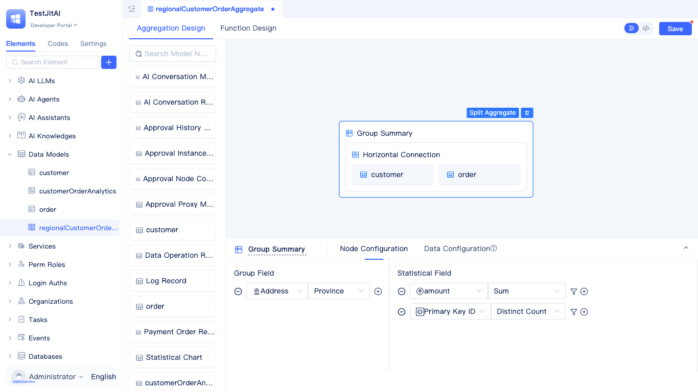

# Business Entity Modeling and Data Analysis

Build a comprehensive sales data analysis system that manages key business entities including customers, stores, sales representatives, products, and orders. The system supports multi-database configurations (with historical data archived to separate database instances), extended statistical fields within customer records, multi-dimensional aggregation analysis, and automated business rule processing triggered by data changes.

## Creating database instances {#creating-database-instances}

Create a primary business database and an optional historical database, with support for mapping to existing database tables.

1. **Create the primary business database**: Configure a MySQL database instance for storing operational business data during system runtime.
   
    
   
2. **Create the historical database (optional)**: Configure a MySQL database instance dedicated to analyzing archived historical data.

## Modeling business entities and data types {#modeling-business-entities}

**Entities**: Customer, Order, Order Detail, Product, Store, Sales Representative.

**Relationships**: Customer/Store/Sales Representative → Order (one-to-many), Order → Order Detail (one-to-many), Product → Order Detail (one-to-many).

1. **Create the Customer data table model**: Include fields such as Name (Single-line Text), Company Name (Single-line Text), Detailed Description (Multi-line Text), Contact Phone (Phone Number), Address (Address), ID Number (ID Number), Customer Type (Single Choice), and Cooperation Status (Checkbox).
   
   

   

2. **Create the Store data table model**: Include fields such as Store Name (Single-line Text), Address (Address), Contact Information (Phone Number), Store Category (Single Choice), and Business Status (Checkbox).
3. **Create the Sales Representative data table model**: Include fields such as Employee Name (Single-line Text), Employee ID (Single-line Text), Contact Phone (Phone Number), Associated Store (Related Record), and Employment Status (Checkbox).
4. **Create the Product data table model**: Include fields such as Product Name (Single-line Text), Product Category (Single Choice), Price (Currency), Inventory Quantity (Number), Product Image (Image), Specification Parameters (Rich Text), and Listing Status (Checkbox).
5. **Create the Order data table model**: Include fields such as Order Number (Serial Number), Sales Amount (Currency), Order Date (Date Time), Payment Status (Single Choice), Associated Customer (Related Record), Associated Store (Related Record), and Associated Sales Representative (Related Record).
6. **Create the Order Detail data table model**: Include fields such as Associated Customer (Related Record), Associated Order (Related Record), Associated Product (Related Record), Purchase Quantity (Number), Unit Price (Currency), and Subtotal Amount (Currency).

When creating models, ensure you select the appropriate database instance element.

## Configuring customer information extension tables {#configuring-extension-tables}

Without modifying the underlying customer model structure, you can associate order data to generate derived statistical fields. Using the customer as the base entity, associate order records to extend cumulative consumption amounts (sum) and purchase counts (count).

1. **Create the customer purchase statistics extension table**: Use the customer model as the base model.
   
   

2. **Add associated data tables**: Establish the association through the primary key ID field of the customer model and the associated customer field of the order model. When adding associations, you can configure filter conditions for the order model, such as restricting to orders with a payment status of "Paid".
3. **Configure extension fields**: Aggregate the sales amount field as a new "Cumulative Consumption Amount" field; count order records as a new "Purchase Count" field.

## Configuring aggregate tables (grouping and summarization) {#configuring-aggregate-tables}

Group data by time periods (year, quarter, month, week) to calculate sales amounts (SUM) and order quantities (COUNT). Leverage the province and city parsing capabilities of address fields to group and analyze sales performance by region. Group by product category fields to analyze sales performance and market share across different product categories.

1. **Create a time dimension aggregate table**: Use the order model as the data source, filter for paid orders, group by the order date field (year, quarter, month, week), and configure aggregations for sales amount (sum of sales amount) and order count (count of order IDs).
2. **Create a regional dimension aggregate table**: Use the customer model as the data source, leverage the province and city parsing functionality of address fields for grouping, and associate the order model to calculate sales amount, order count, and customer count.
3. **Create a product category aggregate table**: Use the product model as the data source, group by the product category field, and associate the order detail model to configure aggregations for purchase quantity (SUM) and subtotal amount (SUM).

## Configuring model events (business rule automation) {#configuring-model-events}

Create model events to automate business logic.

Automatically update product inventory quantities based on purchase quantity changes in the order detail table.
