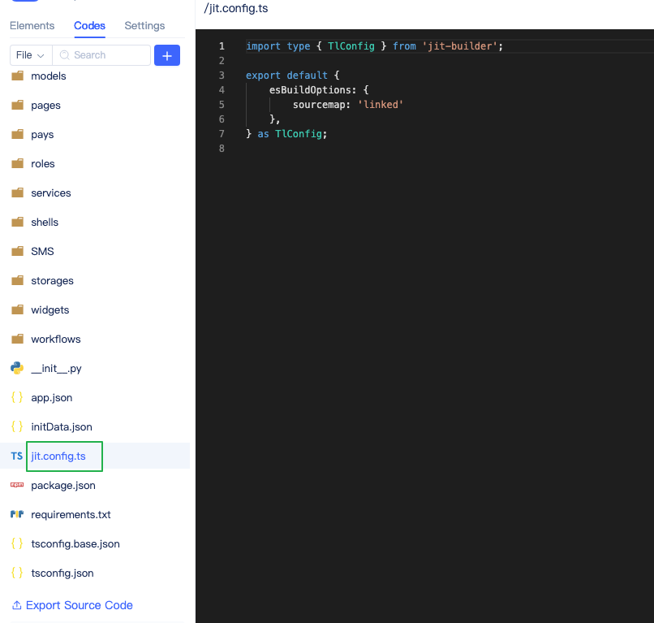
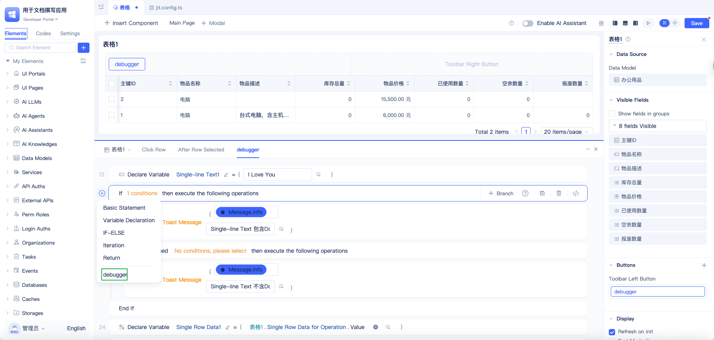
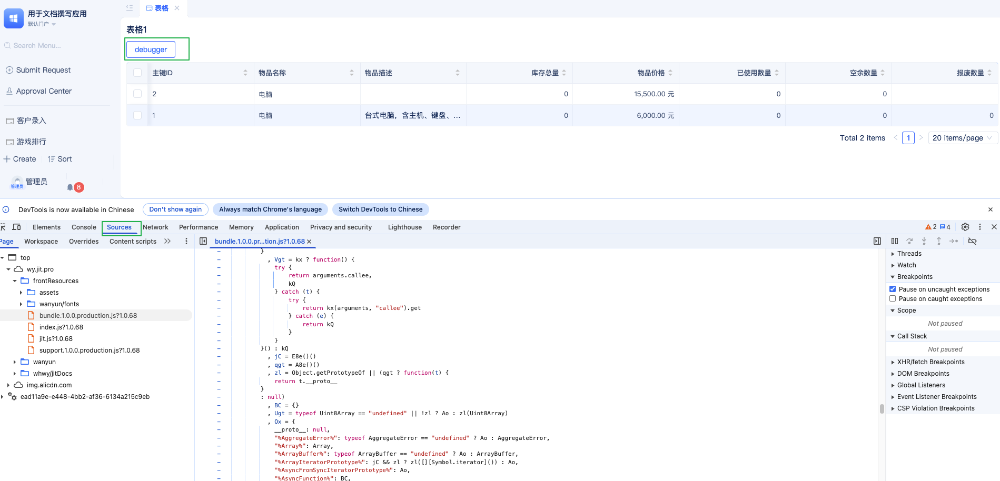
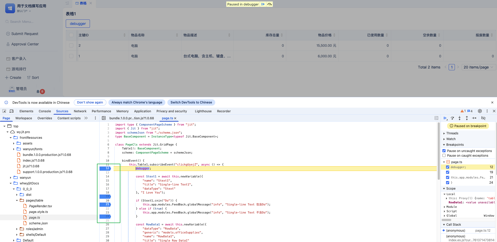
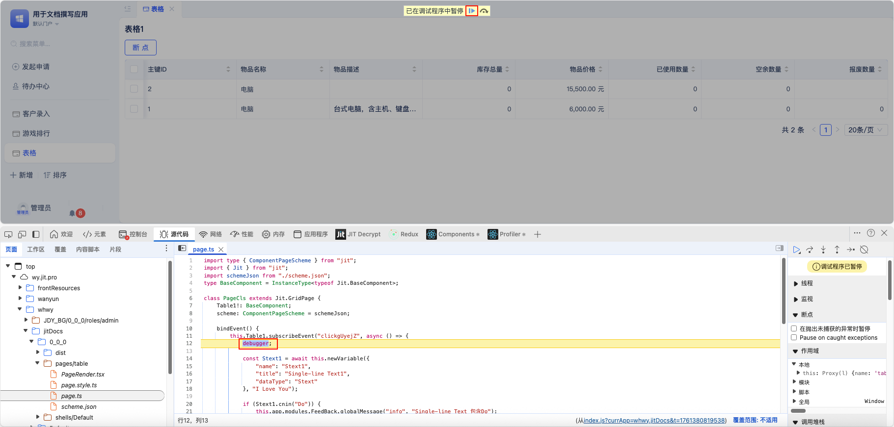
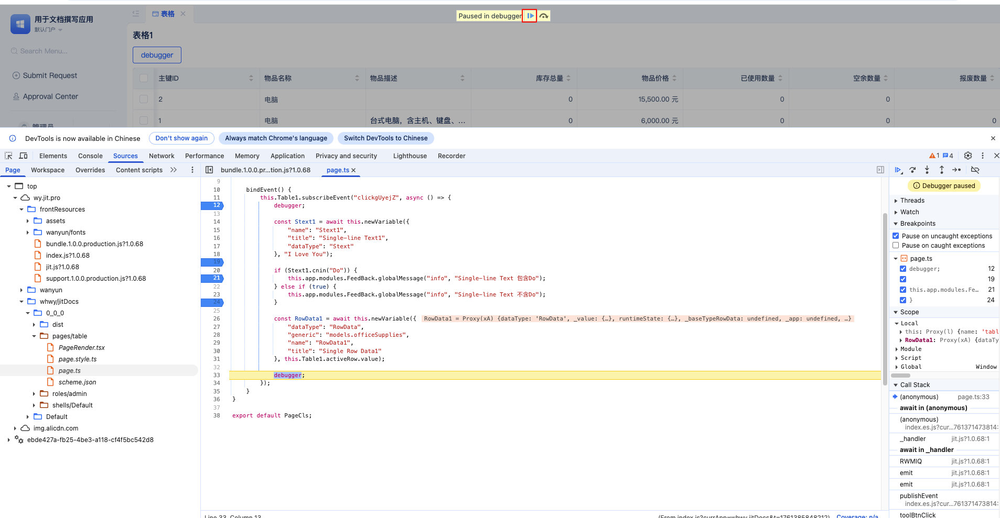
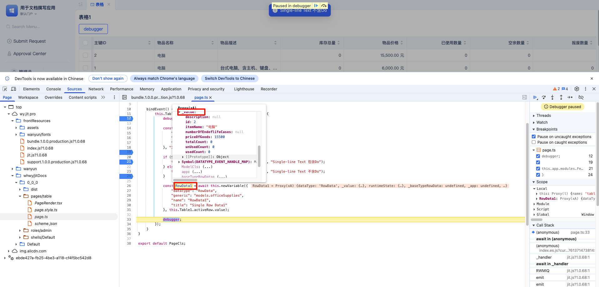
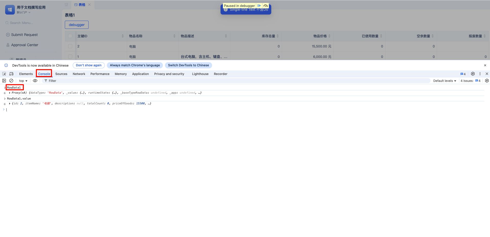

# Frontend Debugging Guide

## Overview

When developing with JitAI, developers frequently encounter situations where custom events fail to execute as expected. Frontend debugging tools are essential for identifying and resolving these issues effectively.

## Prerequisites

### 1. Configuration File Setup

First, verify that  `jit.config.ts` file exists in your source code directory. If it doesn't exist, create one with the exact filename.





### 2. Sourcemap Configuration

Configure the following settings, paying special attention to the sourcemap parameter:

:::tip
**Sourcemap Options:**
- `inline`: Used for debugging, may slightly impact runtime performance
- `linked`: Improves runtime performance; remember to switch back to linked mode after debugging is complete
:::


```typescript
import type { TlConfig } from "jit-builder";

export default {
  esBuildOptions: {
    // sourcemap: 'linked',
    sourcemap: 'inline',
  },
} as TlConfig;

```

## Debugging Process

### Step 1: Set Breakpoints in IDE

Add breakpoints to your event handlers in the development area to pause execution at specific points.



### Step 2: Debug in Runtime Area

1. **Navigate to the target page**: Open the runtime area and navigate to the page that requires debugging.



2. **Open Developer Tools**: Press `F12` to open the browser's developer tools panel. We recommend using Chrome for the best debugging experience.



3. **Trigger the event**: Click the button or perform the action that triggers your custom event.




4. **Set breakpoints**: Click on the line number below the conditional statement to add a red breakpoint marker.



5. **Step through code**: Click the debug play button to execute code step by step, allowing you to inspect each line.



6. **Inspect variables**: Hover over variables in the source code to display their current values in a popup tooltip.



7. **Console debugging**: Alternatively, you can paste `variable.value` into the debugging console and press Enter to view the results of conditional statement execution.

## Summary

By following these debugging techniques, you can systematically examine variable values at each step of event execution, making it easier to identify and resolve issues in your JitAI applications.