# Model Performance Optimization

When working with large datasets or high-concurrency scenarios, leveraging data model built-in functions and optimization strategies can significantly boost application performance. This guide uses a **Product Table** model as a practical example to demonstrate common performance optimization techniques and best practices.

## Example model definition {#example-model}

All code examples in this guide are based on the following product table model:

```python
from models.NormalType import NormalModel
from datatypes.Meta import datatypes

class productTable(NormalModel):

    id = datatypes.AutoInt(name = "id" , title = "pk" , primaryKey = True , readOnly = 1)
    productName = datatypes.Stext(title = "productName" , isAllowScan = False , name = "productName")
    typeOfProduct = datatypes.Stext(title = "typeOfProduct" , isAllowScan = False , name = "typeOfProduct")
    productSpecifications = datatypes.Stext(title = "productSpecifications" , isAllowScan = False , name = "productSpecifications")
    code = datatypes.Stext(title = "code" , isAllowScan = False , name = "code")
    productEncoding = datatypes.Serial(title = "productEncoding" , name = "productEncoding" , unique = True , prefix = "" , connector = "" , dateTimeFormat = "" , incNum = 4 , startNumber = 1 , fieldId = "code" , readOnly = 1)
    f026 = datatypes.File(title = "attachment" , maxCount = 5 , maxSize = 20 , selectedDown = False , selectedDelete = False , selectedDownUser = None , selectedDeleteUser = None , name = "f026")
    number = datatypes.Numeric(title = "number" , decimal = 0 , unit = "" , placeholder = "" , name = "number")
    description = datatypes.RichText(title = "description" , name = "description")
    f894 = datatypes.RelateData(title = "relateField" , name = "f894" , relateType = "mto" , generic = "models.productTable" , relateField = "id" , relateFieldType = "AutoInt")
    class Meta:
        modelType = "NormalType"
        db = "databases.Default"
        dataTitle = "id"
        dbTable = "productTable"
        name = "productTable"
        baseModel = ""
        unionIndexList = []
        unionUniqueList = []
```

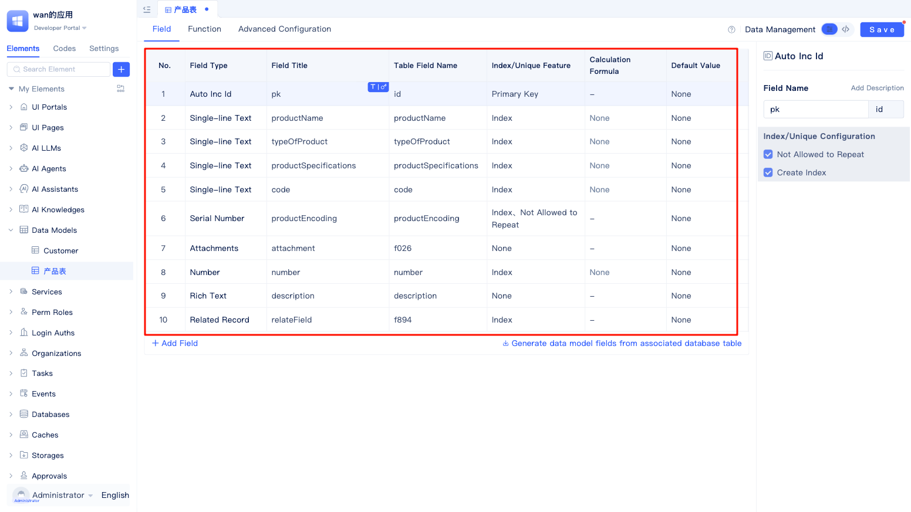

---

## Query optimization strategies {#query-optimization}

### Limiting query fields {#limit-query-fields}

Avoid querying unnecessary fields, particularly large fields like attachments (`f026`) and rich text (`description`). This simple change can dramatically reduce data transfer volume and processing time.

#### Page example {#limit-query-fields-page-example}

**❌ Bad practice:** Querying without specifying a field list returns all fields by default

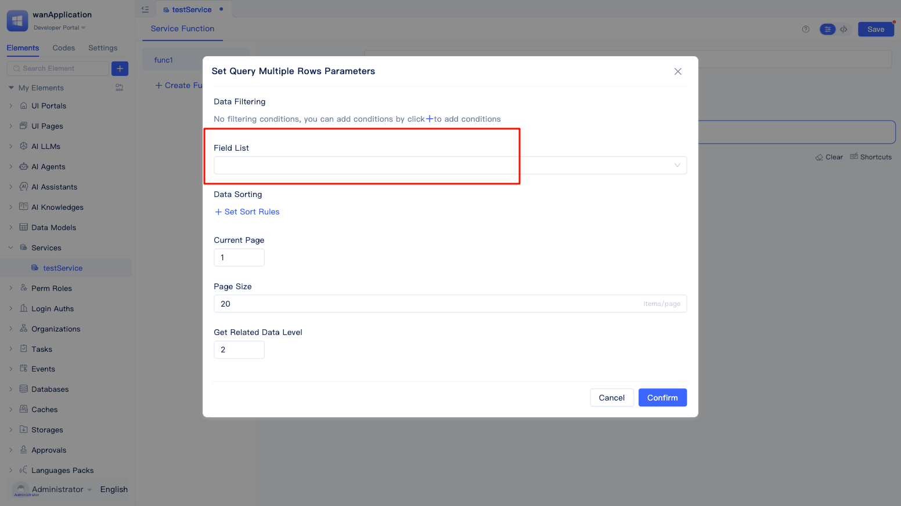

**✅ Best practice:** Select only the fields you need, excluding attachments and rich text


#### Code example {#limit-query-fields-code-example}

**Not recommended:**
```python
# Get product table model element, queries all fields (including large attachment fields)
productTable = app.getElement("models.productTable")
result = productTable.query(page=1, size=100)  # Returns all fields including attachments
```

**Recommended:**
```python
# Get product table model element, query only required fields
productTable = app.getElement("models.productTable")
result = productTable.query(
    fieldList=["id", "productName", "typeOfProduct", "productSpecifications", "number"],  # Exclude attachment and rich text fields
    page=1, 
    size=100
)
```

**Performance gain:** Excluding attachment fields can reduce data transfer by 50%-80%.

---

### Controlling relation data depth {#control-relation-level}

Model queries return 2 levels of related data by default. If you don't need related data or only need specific levels, use the `level` parameter to control this behavior.

#### Page example {#control-relation-level-page-example}

**❌ Bad practice:** Setting level too high (e.g., 3-5 levels) fetches large amounts of unnecessary related data

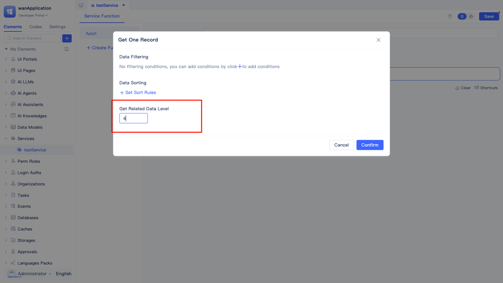

**✅ Best practice:** Set level based on actual needs; use 0 when no relations are needed


#### Code example {#control-relation-level-code-example}

```python
# Get product table model element
productTable = app.getElement("models.productTable")

# No related data (optimal performance)
product = productTable.get("Q(id=1)", [], level=0)

# One level of relations only
product = productTable.get("Q(id=1)", [], level=1)

# Two levels of relations (default)
product = productTable.get("Q(id=1)", [], level=2)
```

:::warning Note
The `level` parameter has a maximum value of 5. Set a reasonable level based on actual requirements to avoid over-fetching related data.
:::

**Performance impact:** Each additional relation level can increase query time by 30%-100%.

---

### Using pagination effectively {#pagination-strategy}

Setting an appropriate page size in pagination queries helps balance performance with user experience.

#### Page example {#pagination-strategy-page-example}

**❌ Bad practice:** Page size set too large (e.g., 1000+ records)


**✅ Best practice:** Use a reasonable page size (20-50 records)

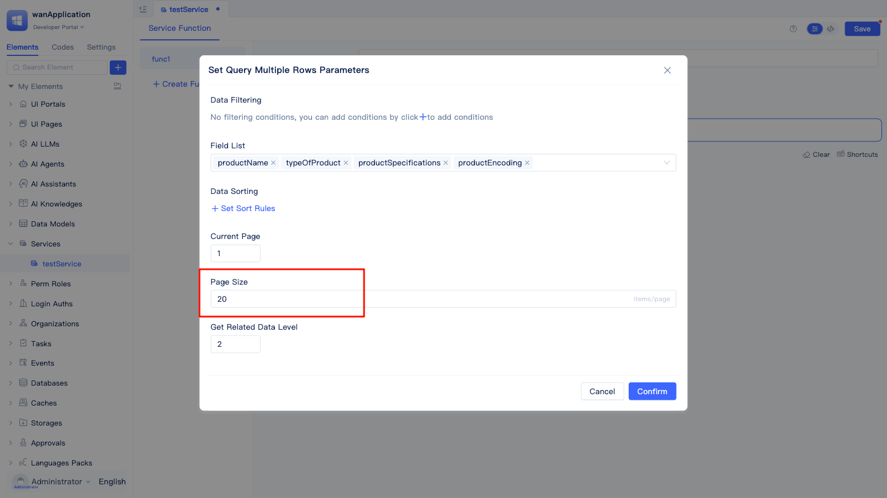

#### Code example {#pagination-strategy-code-example}

```python
# Get product table model element
productTable = app.getElement("models.productTable")

# List pages: recommend 20-50 records per page
result = productTable.query(page=1, size=20)

# Dropdown selectors: recommend 10-20 records per page
result = productTable.query(page=1, size=10)

# Avoid excessively large page sizes
# result = productTable.query(page=1, size=20000)  # ❌ Not recommended
```
---

### Optimizing filter conditions {#optimize-filters}

Use indexed fields as filter conditions and avoid complex nested conditions.

#### Page example {#optimize-filters-page-example}

**❌ Bad practice:** Using fuzzy queries or filtering on non-indexed fields

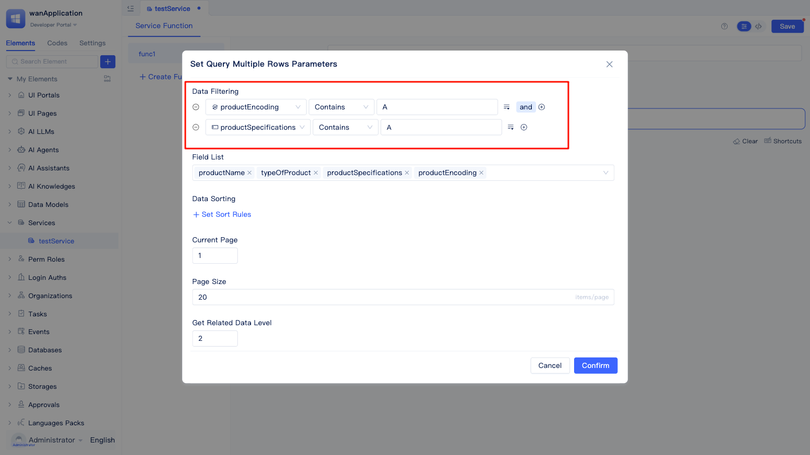

**✅ Best practice:** Filter using indexed fields for exact matches


**✅ Best practice:** Create indexes for frequently filtered fields

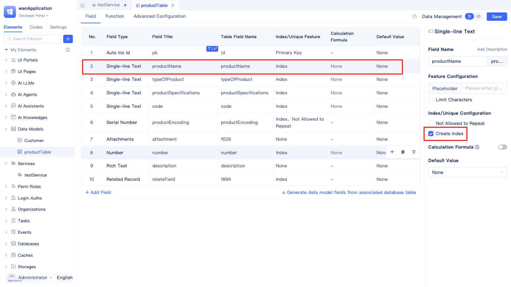

#### Code example {#optimize-filters-code-example}

```python
# Get product table model element
productTable = app.getElement("models.productTable")

# ✅ Recommended: Filter using indexed fields
result = productTable.query(
    filter="Q(productName='Phone') & Q(number__gt=0)",  # productName should be indexed
    page=1, 
    size=20
)

# ❌ Avoid: LIKE queries on large tables
# result = productTable.query(
#     filter="Q(productName__like='Pho')",  # May cause full table scan
#     page=1, 
#     size=20
# )
```
---

## Batch operation optimization {#batch-operations}

### Bulk creating data {#bulk-create}

When creating product data in bulk, batch functions are far more efficient than calling the create function in a loop.

#### Page example {#bulk-create-page-example}

**❌ Bad practice:** Calling the create function in a loop to insert records one by one

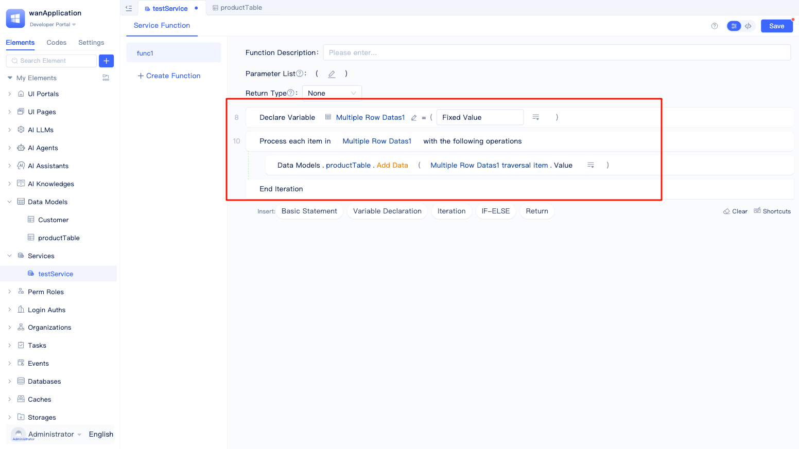

**✅ Best practice:** Use the batch create or update function

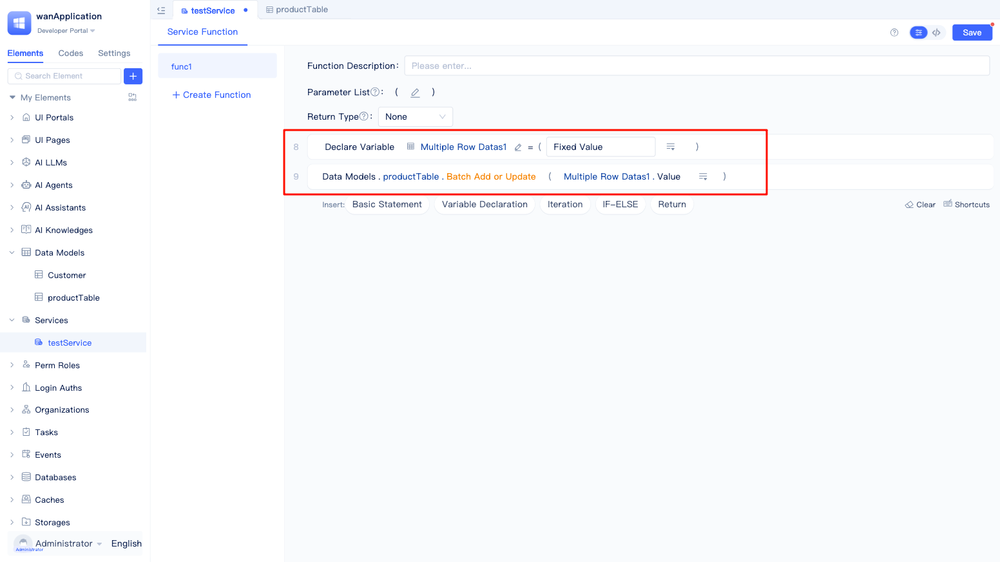

#### Code example {#bulk-create-code-example}

**Not recommended:**
```python
# Get product table model element
productTable = app.getElement("models.productTable")

# ❌ Loop create (slow)
product_list = [
    {"productName": "Phone", "typeOfProduct": "P001", "number": 100},
    {"productName": "Computer", "typeOfProduct": "P002", "number": 50},
    {"productName": "Tablet", "typeOfProduct": "P003", "number": 80},
    # ... more products
]

for product_data in product_list:
    productTable.create(product_data)  # Each call is a separate database operation
```

**Recommended:**
```python
# Get product table model element
productTable = app.getElement("models.productTable")

# ✅ Batch create (fast)
product_list = [
    {"productName": "Phone", "typeOfProduct": "P001", "number": 100},
    {"productName": "Computer", "typeOfProduct": "P002", "number": 50},
    {"productName": "Tablet", "typeOfProduct": "P003", "number": 80},
    # ... more products
]

productTable.createOrUpdateMany(product_list)  # Single batch operation
```
---

### Bulk updating data {#bulk-update}

When updating product data in bulk, choose the appropriate function based on your scenario. When updating **the same fields** to **the same values** across multiple records, use `updateByPK` or `updateByFilter` functions.

#### Page example {#bulk-update-page-example}

**❌ Bad practice:** Calling the save function in a loop to update records one by one

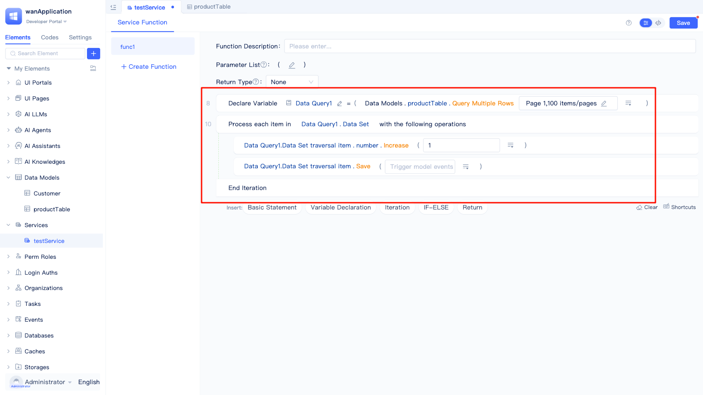

**✅ Best practice:** Use the update by primary key function for batch updates

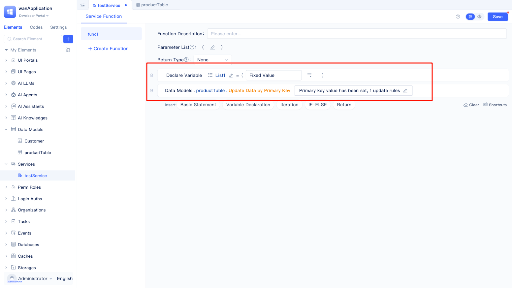

**✅ Best practice:** Use the update by filter condition function for batch updates

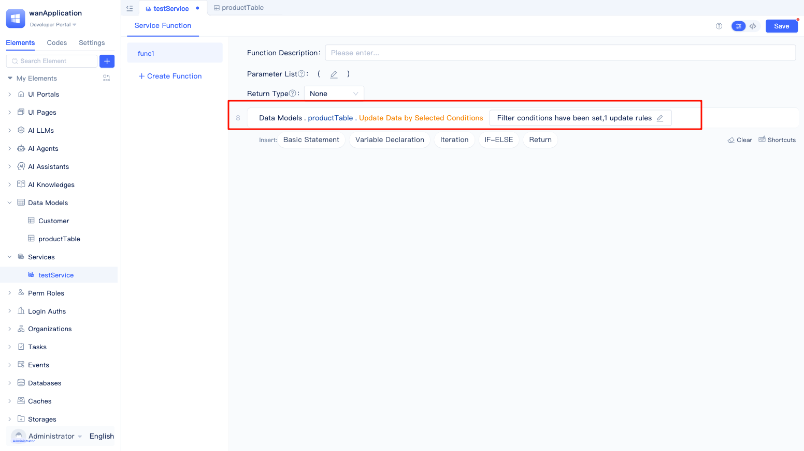

#### Code example {#bulk-update-code-example}

```python
# Get product table model element
productTable = app.getElement("models.productTable")

# ✅ Method 1: Batch update by primary key (recommended)
productTable.updateByPK(
    [1, 2, 3, 4, 5],  # Product ID list
    {"number": 200}    # Update quantity to 200
)

# ✅ Method 2: Batch update by condition
productTable.updateByFilter(
    "Q(typeOfProduct='P001') & Q(number__lt=50)",  # Products with type P001 and quantity < 50
    {"number": 100}  # Update quantity to 100
)

# ❌ Avoid: Loop update
# for product_id in id_list:
#     product = productTable.get(f"Q(id={product_id})", [])
#     product["number"] = 200
#     productTable(**product).save()  # slow
```

:::warning Note
The `updateByFilter` function does not trigger update events. If you need to trigger events, use `updateByPK` instead.
:::

---

### Bulk deleting data {#bulk-delete}

When deleting product data in bulk, batch functions significantly improve efficiency.

#### Page example {#bulk-delete-page-example}

**❌ Bad practice:** Calling the delete function in a loop to remove records one by one

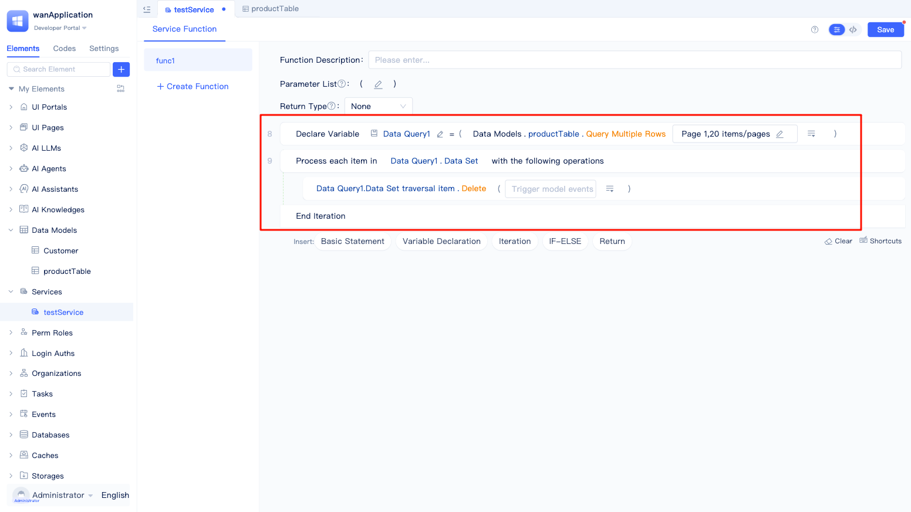

**✅ Best practice:** Use the delete by primary key function for batch deletion

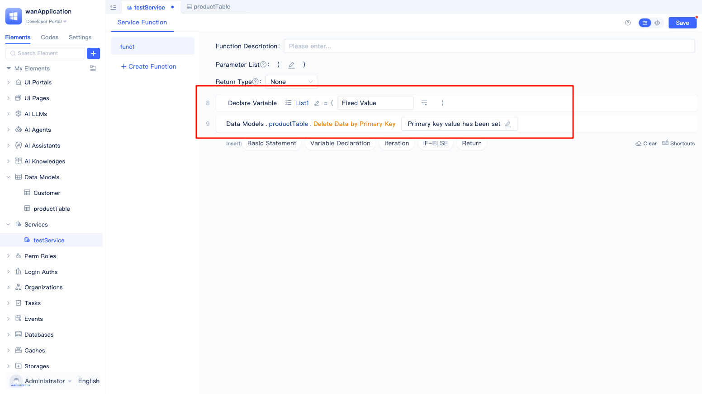

#### Code example {#bulk-delete-code-example}

```python
# Get product table model element
productTable = app.getElement("models.productTable")

# ✅ Method 1: Batch delete by primary key (recommended)
productTable.deleteByPK([1, 2, 3, 4, 5])  # Delete products with IDs 1-5

# ✅ Method 2: Batch delete by condition
productTable.deleteByFilter("Q(number=0)")  # Delete products with quantity 0

# ❌ Avoid: Loop delete
# for product_id in id_list:
#     product = productTable.get(f"Q(id={product_id})", [])
#     productTable(**product).delete()  # slow
```

---

### Large-scale data import {#bulk-import}

When importing or synchronizing large datasets (e.g., 1000+ records), choosing the right import method is critical. The system provides several high-performance batch import functions for this purpose.

#### Page example {#bulk-import-page-example}

**❌ Bad practice:** Using `createOrUpdateMany` to import large datasets (1000+ records)

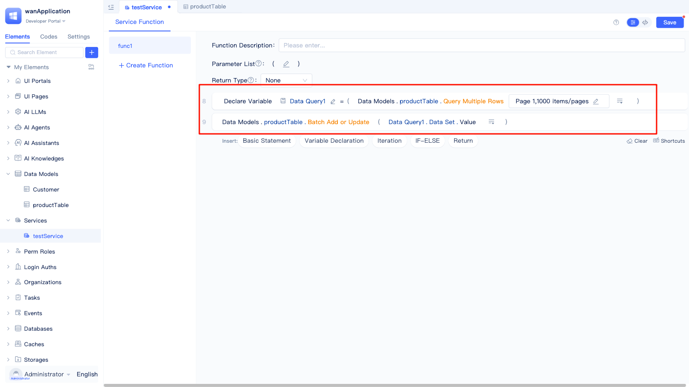

**✅ Best practice:** Use the batch import or replace function for high-performance imports

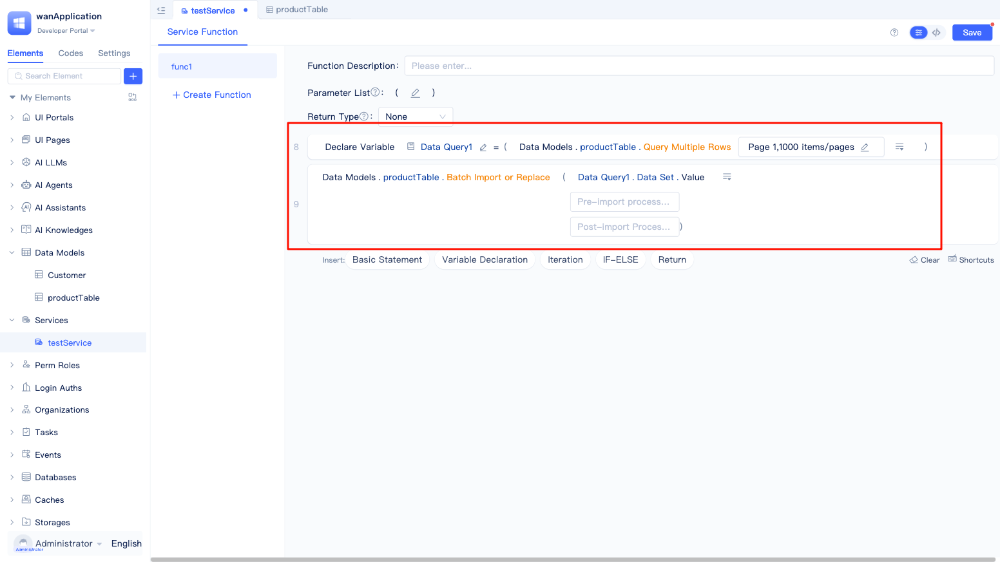

#### Code example {#bulk-import-code-example}

```python
# Get product table model element
productTable = app.getElement("models.productTable")

# Prepare product data
product_list = [
    {"productName": "Phone", "typeOfProduct": "P001", "productSpecifications": "6.1 inch", "number": 100},
    {"productName": "Computer", "typeOfProduct": "P002", "productSpecifications": "15.6 inch", "number": 50},
    # ... more product data
]

# Scenario 1: Insert only (recommended for data initialization)
productTable.queryset.insertImport(product_list, checkPkDuplicate=True)

# Scenario 2: Upsert (update if primary key exists, otherwise insert)
productTable.queryset.insertUpdateImport(product_list)

# Scenario 3: Import with pre/post processing hooks
productTable.insertUpdateImport(
    product_list,
    importBeforeFunc="services.ProductService.beforeImport",
    importAfterFunc="services.ProductService.afterImport"
)
```

:::tip Tip
The batch import/replace interface does not trigger model events, making it ideal for large-scale data initialization or synchronization. If your business logic requires event triggers, use the `createOrUpdateMany` function instead.
:::

---

## Event control optimization {#event-control}

### Skipping event triggers {#skip-events}

In batch operations or data import scenarios, setting `triggerEvent=0` skips event triggers and significantly improves performance.

#### Page example {#skip-events-page-example}

**❌ Bad practice:** Using `triggerEvent=1` during batch operations triggers events for every record

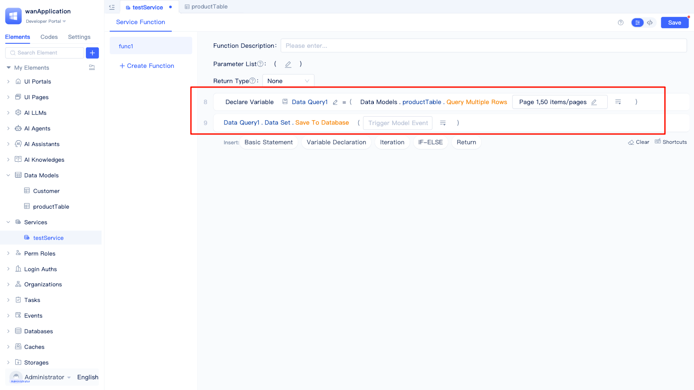

**✅ Best practice:** Using `triggerEvent=0` during batch operations skips event triggers

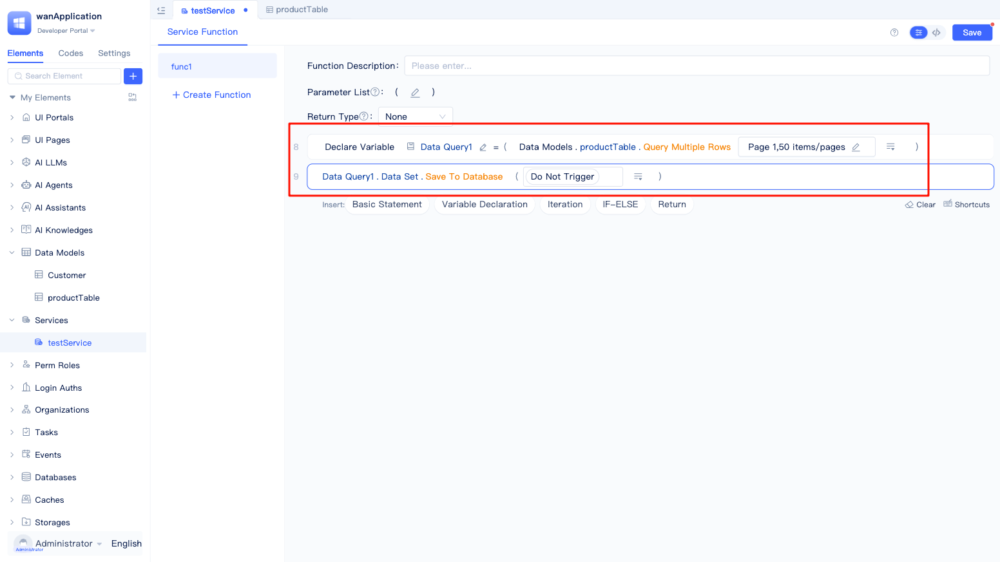

#### Code example {#skip-events-code-example}

```python
# Get product table model element
productTable = app.getElement("models.productTable")

# Skip events during batch create
product_list = [
    {"productName": "Phone", "typeOfProduct": "P001", "number": 100},
    {"productName": "Computer", "typeOfProduct": "P002", "number": 50},
]
productTable.createOrUpdateMany(product_list, triggerEvent=0)

# Skip events during batch update
productTable.updateByPK([1, 2, 3], {"number": 200}, triggerEvent=0)

# Skip events during batch delete
productTable.deleteByPK([1, 2, 3], triggerEvent=0)
```

**Performance gain:** Skipping event triggers can reduce execution time by 20%-50%.

:::warning Caution
Skipping event triggers means:
- Model pre/post events will not fire
- Data history will not be recorded
- Associated business logic will not execute

Ensure these side effects align with your business requirements.
:::

---

## Aggregation optimization {#aggregation-optimization}

When performing statistical analysis (sum, count, average, etc.), the model's built-in aggregation functions are far more efficient than querying all data and calculating in code. Aggregation runs directly at the database level, eliminating large data transfers and reducing memory usage.

### Single-field aggregation {#single-field-aggregate}

Use the `aggregate` function to perform calculations on a single field, supporting sum, average, maximum, minimum, count, and other aggregation types.

#### Page example {#single-field-aggregate-page-example}

**❌ Bad practice:** Query all data first, then calculate statistics in code loops

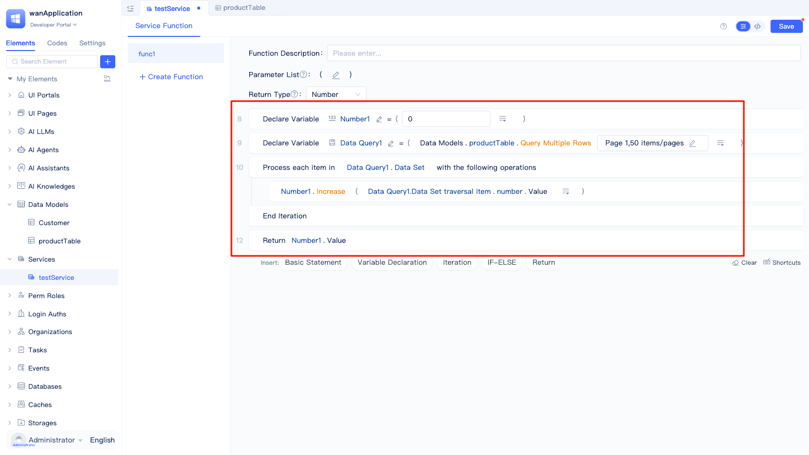

**✅ Best practice:** Use the aggregate function to calculate directly in the database

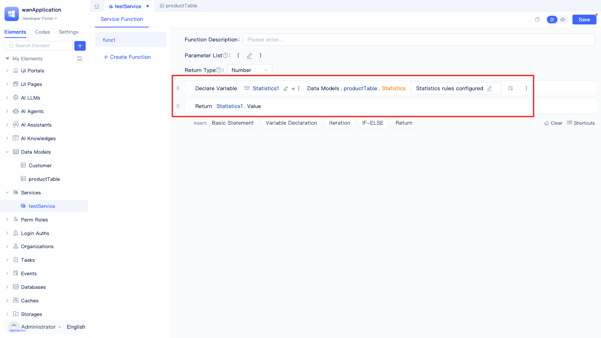

#### Code example {#single-field-aggregate-code-example}

```python
# Get product table model element
productTable = app.getElement("models.productTable")

# Calculate total quantity of all products
total_quantity = productTable.aggregate(
    "Q(number__gt=0)",  # Filter condition (empty string for no filter)
    "number",           # Field name
    "SUM"               # Aggregation type: SUM/AVG/MAX/MIN/COUNT
)
print(f"Total product quantity: {total_quantity}")

# Calculate average quantity
avg_quantity = productTable.aggregate(
    "",          # No filter condition
    "number",    # Field name
    "AVG"        # Aggregation type
)
print(f"Average quantity: {avg_quantity}")

# Count products
product_count = productTable.aggregate(
    "",
    "id",
    "COUNT"
)
print(f"Total products: {product_count}")
```

---

### Multi-table aggregation using datasets {#multi-table-aggregate-dataset}

When business scenarios require joint queries and aggregation across multiple tables, querying each table separately and performing associations in code results in poor performance. Instead, use **Datasets** to handle multi-table joins and aggregations at the database level.

#### Use cases {#dataset-use-cases}

- Multi-table statistical reports (e.g., Order + Product + Customer joint statistics)
- Cross-table data aggregation (e.g., Sales totals by product type)
- Complex grouped aggregation queries (e.g., Product quantity and amount by customer)

#### Page example {#dataset-page-example}

**❌ Bad practice:** Query multiple tables separately in code, then manually associate and calculate data

{/* TODO: Screenshot - Manual multi-table data association in code */}

**✅ Best practice:** Use datasets to configure multi-table joins and query aggregated results directly

{/* TODO: Screenshot - Dataset configuration interface */}
---

## Performance optimization checklist {#optimization-checklist}

**Query optimization:**
- ✅ Query only required fields; exclude attachments, rich text, and other large fields
- ✅ Control relation depth; set `level=0` when no related data is needed
- ✅ Create indexes for frequently filtered fields
- ✅ Use reasonable page sizes (20-50 records per page)

**Batch operations:**
- ✅ Use batch functions for bulk creates; avoid looping single creates
- ✅ Use batch functions for bulk updates; avoid looping single updates
- ✅ Use batch functions for bulk deletes; avoid looping single deletes
- ✅ Use high-performance import functions for large-scale data imports

**Event control:**
- ✅ Skip event triggers during batch operations when appropriate
- ✅ Understand the business implications of skipping events

**Aggregation:**
- ✅ Use aggregation functions for statistics; avoid calculating after query
---

## Case studies {#case-studies}

### Case 1: Product list query optimization {#case-product-list}

**❌ Bad practice:** Query all fields with high relation level and large page size

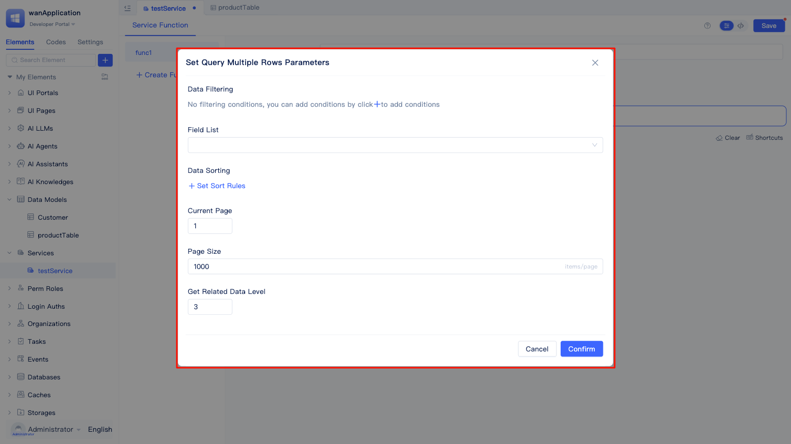

**✅ Best practice:** Query only required fields with `level=0` and `size=20`

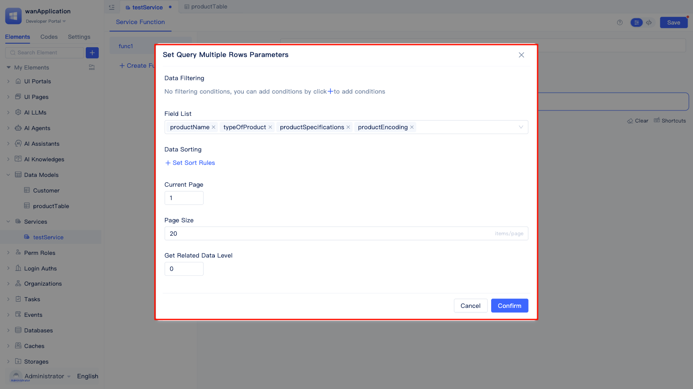

**Scenario:**
Product list page loads slowly, with each query taking 3-5 seconds.

**Problem analysis:**
- Querying all fields including attachment field `f026` and rich text field `description`
- Loading 3 levels of related data
- Displaying 100 records per page

#### Code example {#case-product-list-code-example}

**Before optimization:**
```python
# Get product table model element
productTable = app.getElement("models.productTable")

result = productTable.query(
    filter="Q(number__gt=0)",
    page=1,
    size=100,   # 100 records per page
    level=3     # 3 levels of relations
)
```

**After optimization:**
```python
# Get product table model element
productTable = app.getElement("models.productTable")

result = productTable.query(
    filter="Q(number__gt=0)",
    fieldList=[
        "id", "productName", "typeOfProduct", 
        "productSpecifications", "productEncoding", "number"
    ],  # Only fields needed for list page
    page=1,
    size=20,    # Reduced page size
    level=0     # No relations loaded
)
```

**Results:**
- Before optimization: ~4 seconds
- After optimization: ~0.5 seconds
- Performance improvement: **87% ↑**

---

### Case 2: Product inventory batch update optimization {#case-batch-update}

**Scenario:**
Need to increase the inventory quantity of 1000 products by 100.

#### Page example {#case-batch-update-page-example}

**❌ Bad practice:** Call save in a loop to update records one by one

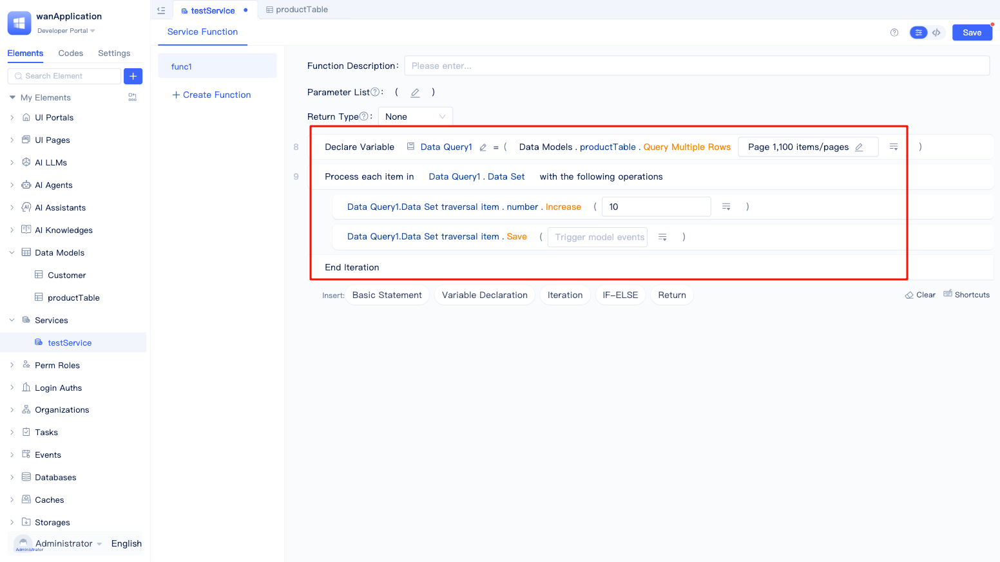

**✅ Best practice:** Use `updateByPK` or `updateByFilter` for batch updates

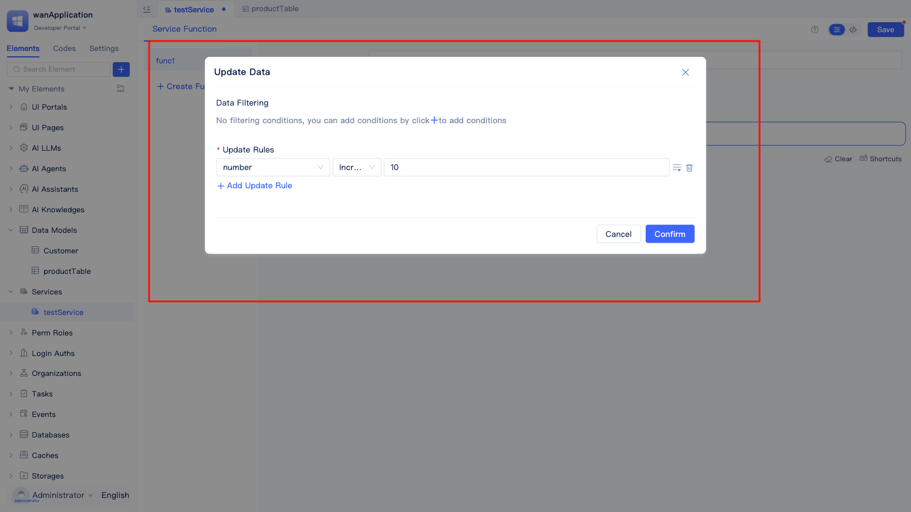

#### Code example {#case-batch-update-code-example}

**Before optimization:**
```python
# Get product table model element
productTable = app.getElement("models.productTable")

# ❌ Query first, then update in loop
products = productTable.query(
    filter="Q(typeOfProduct='P001')",
    page=1,
    size=1000
)

for product in products["rowDatas"]:
    product["number"] = product["number"] + 100
    productTable(**product).save()  # Each save is a separate transaction
```

**After optimization:**
```python
# Get product table model element
productTable = app.getElement("models.productTable")

# ✅ Method 1: Batch update by condition (for known conditions)
# Note: updateByFilter cannot increment fields; you must set a fixed value
productTable.updateByFilter(
    "Q(typeOfProduct='P001')",
    {"number": 200}  # Set to fixed value
)

# ✅ Method 2: Batch update by primary key (when events must be triggered)
# First query the ID list
products = productTable.query(
    filter="Q(typeOfProduct='P001')",
    fieldList=["id"],  # Only query ID
    page=1,
    size=1000,
    level=0
)
product_ids = [p["id"] for p in products["rowDatas"]]

productTable.updateByPK(
    product_ids,
    {"number": 200},
    triggerEvent=0  # Skip events if not needed
)
```
---

:::tip Summary
Core principles of performance optimization:
1. **Reduce data transfer** - Use `fieldList` to exclude attachments and other large fields
2. **Batch operations** - Use `createOrUpdateMany`, `updateByPK`, etc. instead of loops
3. **Control parameters** - Set appropriate `level` depth and `size` page size
4. **Skip events** - Use `triggerEvent=0` during batch operations when safe
5. **Chunk large operations** - Process large datasets in batches (e.g., 1000 records per batch)
6. **Use aggregation** - Perform calculations at the database level with aggregation functions
:::
