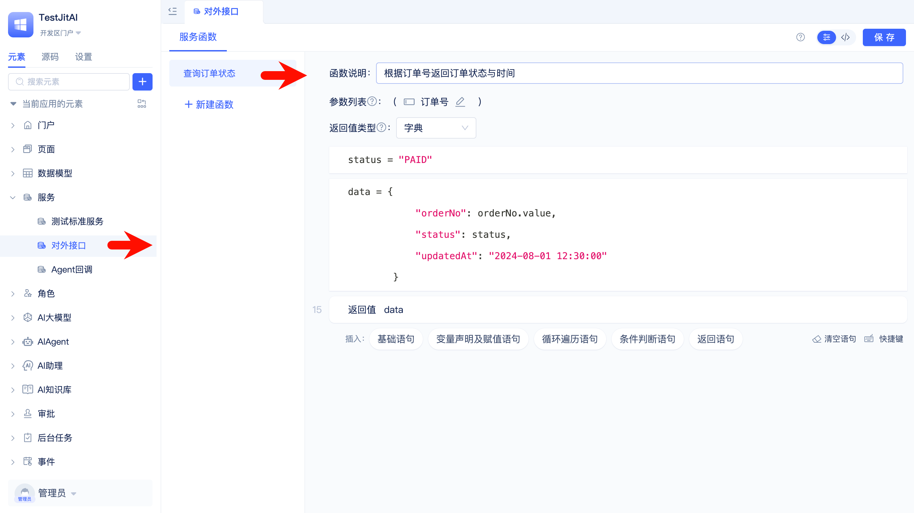
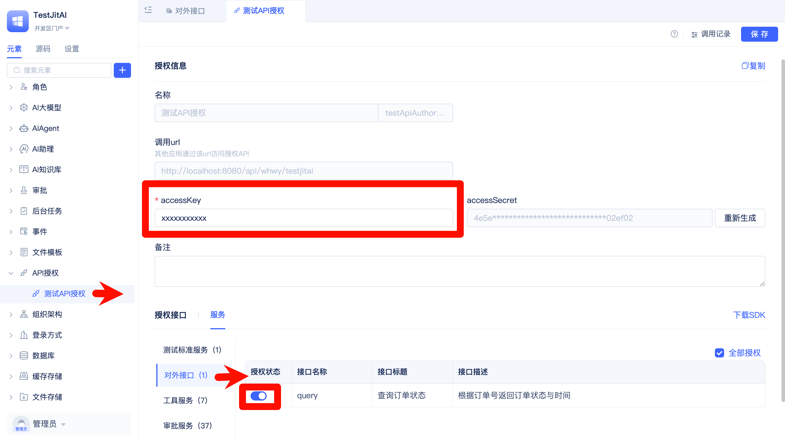

# 对外开放API接口
需要对合作方开放“按订单号查询订单状态”接口，并确保只有被授权的合作方才能调用。

## 新建服务元素并添加函数
在JitAi可视化开发工具中新建一个[标准服务](../../reference/framework/JitService/custom-business-service)元素实例，并添加一个函数，填写函数说明、参数列表、返回值类型，并实现函数逻辑。



## 对外授权服务函数
在JitAi可视化开发工具中新建一个[标准授权](../../reference/framework/JitService/api-authorization)元素实例，配置AccessKey和AccessSecret，并将服务函数的授权状态打开。



## 调用者使用SDK访问服务函数
- Python：从pypi获取SDK依赖包-[wanyun-JitSdk](https://pypi.org/project/wanyun-JitSdk/)
- Java：从Maven中央仓库获取SDK依赖包-[`pro.jit:jit-api-sdk`](https://mvnrepository.com/artifact/pro.jit/jit-api-sdk)
- Node.js：```npm install https://jit-front.oss-cn-hangzhou.aliyuncs.com/jitSdk/JitSdkForJs-0.0.3.tgz --save```

