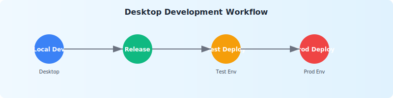
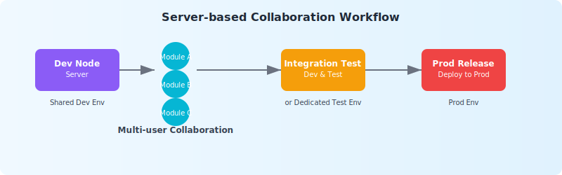

# Team Collaborative Development with JitAi Desktop

## Desktop development workflow (recommended) {#desktop-development-workflow}

1. **Local Development** → Develop applications locally using JitNode Desktop (Windows/Mac) for application development and debugging (source code managed via Git repository)
2. **Version Release** → Publish the application version upon completion of development
3. **Test Deployment** → Deploy the corresponding version to the test environment for validation
4. **Production Deployment** → Deploy the validated version to the production environment

## Server-based collaboration workflow {#server-based-collaboration-workflow}

1. **Development Node** → Use server-based nodes as a shared development environment
2. **Development Testing** → Business users build modules visually online with immediate effects and real-time testing
3. **Production Release** → Release the version and deploy it to the production environment

:::warning Production Environment Security
Although the platform supports making changes take effect immediately, it is strongly recommended not to modify the production environment directly. Always follow the development → testing → production deployment workflow.
:::
