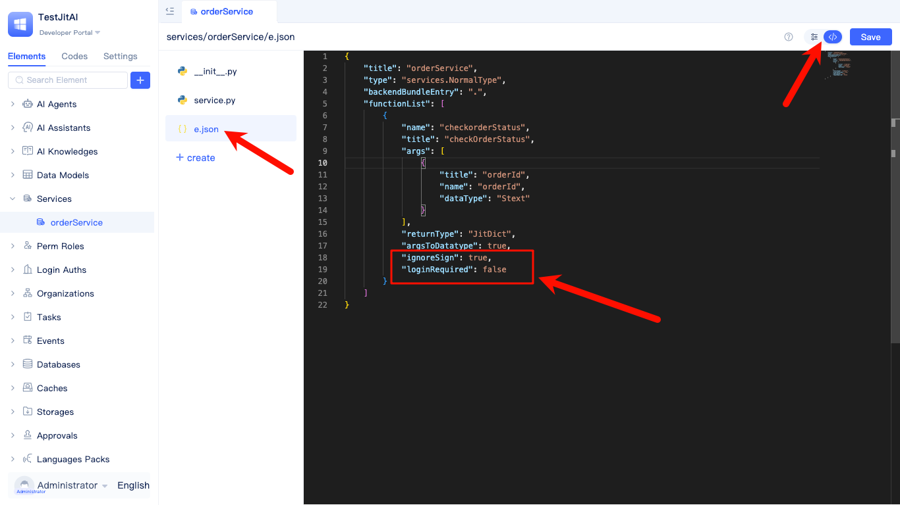

# Using Interceptors for Custom Request Authentication
When systems need to provide APIs to external partners, authentication is often required to restrict unauthorized access. While JitAi's API authorization elements can expose API interfaces to third parties (the recommended approach), this requires callers to use JitAi's client SDK. When callers cannot use the SDK, you can leverage [backend interceptors](../../reference/framework/JitService/backend-interceptor) to implement custom authentication methods that accommodate different calling patterns. This document demonstrates custom Bearer Token authentication as an example.

## Creating interceptor instance element directory {#creating-interceptor-directory}
Interceptor elements are not currently supported for creation in the visual development tool. Developers should use the desktop version for [local development and debugging](./local-development-and-debugging) and manually create the element directory within the application directory.

```text title="Interceptor Element Directory Structure"
interceptors/
└── BearerToken/
    ├── e.json
    ├── __init__.py
    └── interceptor.py
```

### Implementing interceptor logic {#implementing-interceptor-logic}
Inherit from `RequestInterceptor` and implement authentication logic in the `before` method: only perform validation when the target service function is in the whitelist; otherwise, allow the request to pass through.

```python title="interceptors/BearerToken/interceptor.py"
from interceptors.Http import RequestInterceptor

class BearerToken(RequestInterceptor):
    # Configurable: List of allowed Bearer Tokens (can be changed to read from configuration elements or data models in production)
    ALLOWED_TOKENS = {
        "testtoken123": "demoapp"
    }

    # Configurable: Whitelist of interface functions that enable authentication (element full name, function name)
    WHITELISTED_FUNCS = {
        ("services.OrderSvc", "query"),
        # ("element_full_name", "function_name"),
    }

    def _getElemAndFunc(self, request):
        """Parse request path to get element full name and function name"""
        path = request.path.replace("/api", "", 1).strip("/").replace("/", ".")
        element, func = path.replace(app.appId, "").strip(".").rsplit(".", maxsplit=1)
        return element, func

    def before(self):
        # If function definition cannot be resolved, allow it to pass through
        function_define = self.functionDefine
        if not function_define:
            return
        try:
            element, func = self._getElemAndFunc(self.request)
        except Exception:
            return

        if (element, func) not in self.WHITELISTED_FUNCS:
            return

        headers = getattr(self.request, 'headers', {}) or {}
        auth = headers.get('Authorization') or headers.get('authorization')
        if not auth or not isinstance(auth, str):
            raise PermissionError("Authentication failed")

        scheme, _, credential = auth.partition(' ')
        if scheme.lower() != 'bearer' or not credential:
            raise PermissionError("Authentication failed")

        token = credential.strip()
        if token not in self.ALLOWED_TOKENS:
            raise PermissionError("Authentication failed")
    
```

### Exporting the interceptor class {#exporting-interceptor-class}
```python title="interceptors/BearerToken/__init__.py"
# The exported class name must match the element directory name
from .interceptor import BearerToken
```

### Editing `e.json` {#editing-interceptor-ejson}
```json title="interceptors/BearerToken/e.json"
{
  "title": "BearerToken Authentication",
  "type": "interceptors.Http",
  "backendBundleEntry": ".",
  "icon": "lanjieqi1",
  "sort": 10
}
```

## Creating service functions {#creating-service-functions}
Developers can use JitAi's visual development tool to quickly create service elements and functions.


```text title="Service Element Directory Structure"
services/
└── OrderSvc/
    ├── e.json
    ├── __init__.py
    └── service.py
```

### Implementing function logic {#implementing-function-logic}
```python title="services/OrderSvc/service.py"

from services.NormalType import NormalService

class OrderSvc(NormalService):

    def query(self, orderId):
        result = {
            "status":"PAID"
        }
        return result

```

```python title="services/OrderSvc/__init__.py"
from .service import OrderSvc

```

### Editing e.json {#editing-service-ejson}
```json title="services/OrderSvc/e.json"
{
    "title": "Order Service",
    "type": "services.NormalType",
    "backendBundleEntry": ".",
    "functionList": [
        {
            "name": "query",
            "title": "Order Query",
            "args": [
                {
                    "title": "Order ID",
                    "name": "orderId",
                    "dataType": "Stext"
                }
            ],
            "returnType": "JitDict",
            "argsToDatatype": true,
            "desc": "Query order status",
            "ignoreSign": true,
            "loginRequired": false
        }
    ]
}
```

Note:
1. Declare `ignoreSign: true` to make the function skip the platform's default signature verification.
2. Declare `loginRequired: false` to make the function skip the platform's default login status validation.

These two configurations must be modified by switching to full-code mode.



## Testing and verification {#testing-and-verification}
First, delete the `dist` directory under the application directory, restart Jit, and then test using curl commands.

```shell title="Test curl Command"
curl -X POST \
     -H "Authorization: Bearer testtoken123" \
     -H "Content-Type: application/json" \
     -d '{"orderId": "1001"}' \
     "http://localhost:8080/api/whwy/testjitai/services/OrderSvc/query"
```

```json title="Success Response"
{
    "errcode": 0,
    "errmsg": null,
    "requestId": "29c8dc9ebfc843f29e8b7f3e472bb641",
    "sysTime": 1754983379088,
    "duration": 12531,
    "data": {
        "status": "PAID"
    },
    "jitNodeValid": {
        "valid": true,
        "data": {
            "expired": false,
            "willExpired": false,
            "specExceed": false,
            "stopped": false,
            "errorMsg": ""
        }
    }
}
```

```json title="Failure Response"
{
    "errcode": 20005,
    "errmsg": "interceptors.BearerToken【BearerToken Authentication】Element exception, please check element code or parameters. Error message: Authentication failed",
    "requestId": "92a83ecb785e41fa8c97e88ecf87545a",
    "sysTime": 1754983556693,
    "duration": 388,
    "data": {

    },
    "errHandler": "promptError",
    "traceBack": [
        {
            "filePath": ".home.environs.JED_c1tqsCN7Q5.whwy.testjitai.0_0_0.interceptors.BearerToken.interceptor.py",
            "lineNumber": 50,
            "funcName": "before",
            "errorMsg": "Authentication failed"
        },
        {
            "filePath": ".system.jit.elements.element.py",
            "lineNumber": 33,
            "funcName": "wrapper"
        }
    ]
}
```