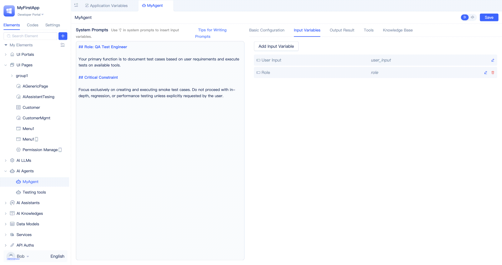

# Agent Input and Output

Agent input and output configuration is a key component for implementing intelligent interactions. Through proper configuration of input variables, Agent can receive diverse parameters and contextual information; through defining output result formats, Agent can return structured data for program logic use; through streaming output, you can obtain Agent's runtime status and results in real-time. This article will provide detailed instructions on these configuration methods and usage techniques.

## Configure Input Variables {#configure-input-variables}
Each Agent receives a default parameter when called, namely `User Input`. Developers can also customize other input variables and reference these variables in system prompts or program logic.

Developers can switch to the `Input Variables` tab in the Agent visual editor, click the `Add Input Variable` button, fill in the variable title and select the variable data type in the popup dialog, then click the `Confirm` button.

Input variables support JitAi [data types](../../reference/framework/JitORM/data-types) and their configuration options, including single-line text, multi-line text, numbers, amounts, dictionaries, etc.

### Use Variables in Prompts {#use-variables-in-prompt}
When calling Agent, in addition to passing user input content, you can also dynamically pass in variables. These variables can be referenced in prompts, enabling more flexible context customization and information filling, allowing Agent to dynamically adjust behavior and response content based on actual business scenarios.

Developers can trigger the variable selection list by typing `{` where they need to insert variables, then click on the corresponding variable to insert it into the prompt. During Agent runtime, variables will be automatically replaced with actual values.

By default, only `User Input` variable is available, but developers can add more in the input variables configuration.

## Configure Output Results {#configure-output-results}
By default, Agent outputs a dictionary containing only one `output` text field after completion. If you need to call Agent in program logic or orchestrate Agent with other nodes in AI Assistant, Agent's output results need to be structured data that can be parsed by program logic, rather than just a string.

Developers can switch to the `Output Results` tab in the Agent visual editor to modify the data type and title of the `output` field, or click the `Add Output Result` button to add new output fields.

Output results will be automatically converted to JSON Schema that large language models can accurately understand and sent to the large language model service as part of the system prompt. If there are no special requirements, developers do not need to write output specification-related content in the system prompt.

:::tip
The title and name of each output result field need to be carefully considered to be self-explanatory, so that the large language model can understand correctly.
:::

### Output Result Data Types
Output results support various [data types](../../reference/framework/JitORM/data-types) of the JitAi platform, including:

- **Single-line Text**: Suitable for short text output, such as titles, names, etc.
- **Multi-line Text**: Suitable for longer text content, such as descriptions, summaries, etc.
- **Number**: Suitable for numerical results, such as calculation results, statistical data, etc.
- **Amount**: Suitable for currency-related output
- **Dictionary**: Suitable for complex structured data output
- **Boolean**: Suitable for yes/no type judgment results
- **Date Time**: Suitable for time-related output

Choosing the appropriate data type helps the large language model understand output requirements more accurately and generate results that meet expected formats.

## Agent Streaming Output {#agent-streaming-output}
During Agent execution, it continuously receives information such as large language model reasoning progress, text content, and tool calls. Developers can obtain and process this data in real-time using streaming methods.

AI Assistant already supports streaming output when calling Agent. If developers call Agent's run method through code, they can also pass in custom streaming callback functions to subscribe to and process streaming output messages in real-time. Please refer to [Streaming Callback Processing](../../reference/framework/JitAi/AIAgent#streaming-callback-processing) in the reference manual for detailed usage.

## Call Agent in Frontend Functions {#call-agent-in-frontend-functions}
In actual business scenarios, it is often necessary to call AI capabilities in real-time based on user operations on pages (such as clicking buttons, filling forms, switching options, etc.) to implement intelligent recommendations, auto-completion, intelligent Q&A, and other functions. To meet these needs, the platform supports directly calling Agent in frontend function logic (page functions, page event functions, component event functions) and flexibly passing parameters, enabling AI capabilities to be seamlessly integrated into various frontend interactions, improving user experience and business intelligence levels.

As shown in the figure above, developers can insert a `Basic Statement` in the function logic, select to call the specified Agent's `Run` function, fill in user instructions in the parameter input box, then insert another `Basic Statement` to refresh the current page of the table. This achieves the functionality where clicking a button triggers the Agent to generate content based on user instructions and refresh the current page of the table.

:::tip
Agent execution usually takes some time. If users wait too long, it will affect the experience. It is recommended to combine with AI Assistant to optimize the interaction flow and achieve continuous interaction between AI and users, improving the overall user experience.
:::

## Call Agent in Backend Service Functions {#call-agent-in-backend-service-functions}
Backend service functions are commonly used for processing business flows, data processing, and other scenarios. When you need to introduce AI capabilities (such as intelligent analysis, content generation, automatic Q&A, etc.) into these processes, you can directly call Agent in service functions to combine AI with business logic, such as automatic approval, intelligent recommendations, content review, etc.

Developers can insert a `Basic Statement` in the service function editor, select to call the specified AI Agent's `Run` function, fill in user instructions in the parameter input box to implement the functionality of service functions calling Agent. Switching to source code mode shows that only one line of code is needed to complete the call.

## Test Agent in Page Assistant {#test-agent-in-page-assistant}
During Agent development, frequent debugging is required. Developers can create a simple AI Assistant that is internally orchestrated to directly call the target Agent, then integrate the assistant into a page. In the AI Assistant's dialog box, we can see the Agent's execution process and output results.

[How to call Agent in AI Assistant?](../ai-assitant/process-orchestration-node-configuration#ai-agent)

[How to integrate AI Assistant in pages?](../shell-and-page/component-based-page-development#integrate-ai-assistant-in-pages)