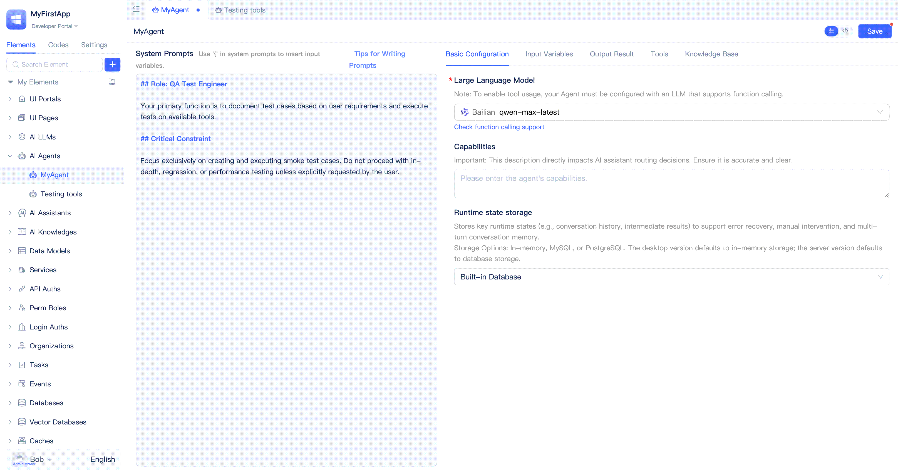
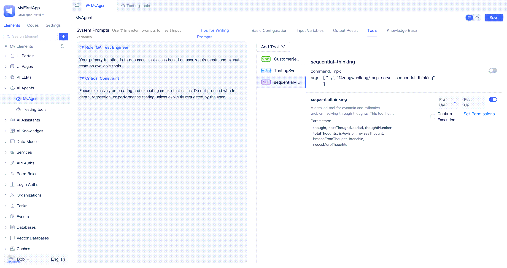
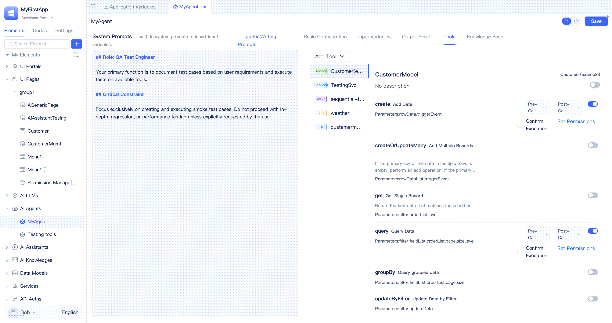

# Tools in Agent

Tools extend Agent's executable capabilities, enabling it to not only understand and process natural language but also actively call external services, databases, APIs, etc., to implement complex operations such as information querying, data processing, and task execution. By adding appropriate tools to Agent, developers can equip Agent with stronger business processing and automation capabilities to meet diverse application scenario requirements.

Applications built on JitAi's interpretive system architecture have self-describing elements that can be accurately understood by large language models, becoming tools available to Agent. Developers can add model functions, service functions, MCP services, external APIs, and page functions in the `Tools` section of the Agent visual editor, enabling AI to call full-stack elements across frontend and backend.

## Agent Call Model Functions {#agent-call-model-functions}
[Data models](../../reference/framework/JitORM/data-models#model-built-in-functions) come with common CRUD functions, and developers can also [customize model functions](../data-modeling/data-table-model#model-function-configuration) according to actual business needs. After adding data model functions as tools to Agent, Agent can implement data create, read, update, delete operations through these functions, meeting diverse data processing scenarios.

Developers can switch to the `Tools` tab in the Agent visual editor, click the `Add Tool` button, select `Data Model` from the list, then select the target model in the popup and click the `Confirm` button.

By default, all model functions will be added as tools. Developers should disable unnecessary functions based on actual needs. The interface provides one-click select all/deselect all buttons for convenient quick operations.

## Agent Call Service Functions {#agent-calling-service-functions}
Developers typically use service functions to encapsulate complex business logic processing. When service functions are added as tools, Agent can directly call these functions. This means that complex business logic processing can be accomplished by defining service functions, **providing Agent with powerful tools and being an important means to optimize Agent's execution capability and accuracy**.

Developers can switch to the `Tools` tab in the Agent visual editor, click the `Add Tool` button, select `Service` from the list, then select the target service in the popup and click the `Confirm` button.

By default, all service functions will be added as tools. Developers should disable unnecessary functions based on actual needs.

:::tip
Clear and unambiguous function names, function descriptions, and parameter declarations can improve the large language model's understanding accuracy and complete tasks more precisely.
:::

## Agent Call MCP Services {#agent-call-mcp-service}
MCP (Model Context Protocol) is an open standard protocol launched by Anthropic in November 2024, aimed at standardizing the interaction between large language models (LLM) and external data sources, tools, and services. It enables AI models to securely and flexibly access real-time data, APIs, databases, and other resources through unified communication specifications, thereby improving AI application execution capabilities and accuracy. JitAi supports developers in configuring MCP services visually and adding them as tools.

Developers can switch to the `Tools` tab in the Agent visual editor, click the `Add Tool` button, select `MCP Service` from the list, then fill in the service name and configuration in the popup and click the `Confirm` button. The platform will load the MCP Server, and after successful loading, it will display the MCP Server's function list for developers to select as needed.

For developer convenience, JitAi has built-in some verified MCP Servers in the MCP Server addition interface. Developers can quickly select from the built-in list by hovering over `Select MCP Service` in the popup, and configuration information will be automatically filled. For those not in the built-in list, developers need to manually fill in the configuration.

For already added MCP Servers, configuration can be modified at any time. The platform also provides a copy configuration feature that can copy MCP Server configuration to the system clipboard with one click for convenient pasting and use.

Hovering over the right side of the MCP Server title will show `Copy Configuration`, `Modify Configuration`, and `Set as Environment Variable` buttons.

:::warning
Currently, MCP Server implementations in the market are of varying quality. Developers need to carefully evaluate and ensure the security and reliability of the MCP Servers they use.
:::

### Convert MCP Configuration to Environment Variables {#convert-mcp-config-to-environment-variables}
In actual development, some MCP Server configuration items (such as API keys, tokens, etc.) involve sensitive information. For security purposes, it is recommended that developers convert such sensitive configurations to application environment variables for management. This not only avoids exposing sensitive information in plain text on the configuration interface but also facilitates flexible switching and unified maintenance across different environments.

After developers click the `Set as Environment Variable` button, they can fill in the environment variable name and variable value in the popup and click the `Confirm` button to store the configuration in application environment variables. Developers can also modify it back to JSON format configuration at any time.

## Agent Call External APIs {#agent-call-external-api}
JitAi supports developers in integrating various external system interfaces into the platform through [External API](../third-party-integration/external-api) elements and using these APIs as Agent tools.

Developers can switch to the `Tools` tab in the Agent visual editor, click the `Add Tool` button, select `External API` from the list, then select the target external API element in the popup and click the `Confirm` button.

By default, all external API functions will be added as tools. Developers should disable unnecessary functions based on actual needs.

## Agent Call Page Functions {#agent-call-page-functions}
Built-in functions in pages (such as getting page variables), component functions in pages (such as table refresh, opening popups), and developer-defined [page functions](../shell-and-page/component-based-page-development#page-functions) can all be called as tools by Agent, thus enabling AI operations on frontend interfaces.

:::tip
Page function calls cannot be verified in the developer portal; you need to switch to the portal that users actually access for verification. Refer to [Test Agent in Page Assistant](./agent-input-output#test-agent-in-page-assistant).
:::

## Tool Function Management {#tool-function-management}

### Enable/Disable Tool Functions {#enable-disable-tool-functions}
Each data model, service function, page, MCP Server, and external API element contains multiple functions. During Agent development, developers can enable functions that need to be called based on actual requirements and disable functions that are not needed.

:::warning
Do not simply and roughly enable all functions. Enable functions selectively based on actual needs, otherwise it will increase unnecessary token consumption, burden the large language model with understanding, and introduce unnecessary operational risks.
:::

### Tool Function Call Pre/Post Event Triggering {#tool-function-call-pre-post-event-triggering}
Each tool call by Agent can generate two backend events: pre-call event and post-call event. Developers can enable or disable one or all events and configure whether to carry event parameters for each event. Using the event mechanism, developers can execute custom business logic before/after tool calls, extending Agent's capabilities.

Developers can see `Pre-call` and `Post-call` event configuration entries on the right side of each tool function. Hovering over the entries will pop up a configuration panel where you can enable or disable `Trigger Event` and enable or disable `Include Data in Event Message`. Pre-call event message parameters include tool name and tool input parameters, post-call event message parameters include tool name and tool return results. Tool name is a required parameter, and only tool input parameters and tool return results are subject to the `Include Data in Event Message` switch.

Developers need to create [Agent Tool Event](../business-logic-development/event-handling#agent-tool-call-events) instance elements to subscribe to Agent's tool call events and execute event function logic.

### Manual Confirmation Before Tool Execution {#manual-confirmation-before-tool-execution}
For sensitive or high-risk operations, you can enable "Pre-execution Confirmation" for tool functions. When enabled, Agent will pause before execution and request user confirmation, continuing only after approval. This is suitable for scenarios requiring human oversight such as approvals and critical data changes, preventing misoperations and risks.

Developers can see the `Pre-execution Confirmation` switch on the right side of tool functions. After checking it, pre-execution confirmation is enabled. When Agent calls a tool, it will request user confirmation in the dialog box and continue execution only after approval.

:::tip
Page functions do not have a `Pre-execution Confirmation` switch and require no confirmation by default. This is because page functions typically already implement user confirmation through frontend interactions (such as popups, buttons, etc.), so there is no need to set it repeatedly in Agent tools.
:::

### Restrict User Roles for Tool Function Calls {#restrict-user-roles-for-tool-calls}
In enterprise-level AI applications, different user roles have different operational permissions. By restricting the callable roles of tool functions, you can prevent privilege escalation and misoperations, ensuring data security.

Developers can see the `Set Permissions` button on the right side of tool functions. After clicking, they can select [application roles](../user-and-permission/role-portal-menu-permissions) in the popup, supporting selection of multiple application roles.

When no roles are configured, all users using Agent can normally call the tool function. When roles are configured, only users with these roles can call the tool function.