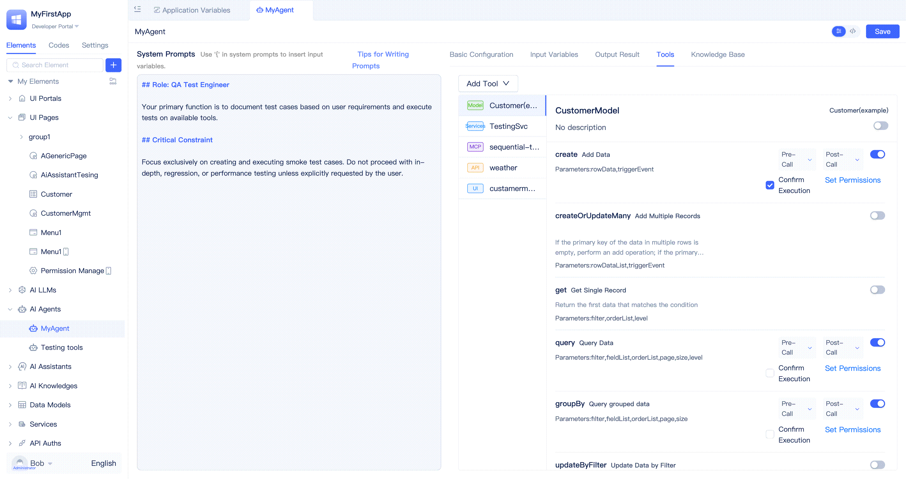

# Tools in Agent

Tools extend an Agent's capabilities beyond natural language understanding and processing, enabling it to actively invoke external services, databases, APIs, and other resources to perform complex operations including information retrieval, data processing, and task execution. By integrating appropriate tools with an Agent, developers can enhance its business processing and automation capabilities to address diverse application requirements.

Applications built on JitAi's interpretive system architecture feature self-describing elements that large language models can accurately understand and utilize as Agent tools. Through the Agent visual editor's `Tools` section, developers can integrate [Model Functions](../data-modeling/create-data-model-functions), [Service Functions](../business-logic-development/creating-service-elements#create-service-functions), [MCP servers](https://modelcontextprotocol.io/docs/getting-started/intro), [External APIs](../third-party-integration/external-api), and [Page Functions](../shell-and-page/component-based-page-development#page-functions), empowering AI to interact with full-stack elements across both frontend and backend systems.

## Calling model functions {#calling-model-functions}
[Data models](../../reference/framework/JitORM/data-models#model-built-in-functions) include standard CRUD functions, and developers can [create custom model functions](../data-modeling/create-data-model-functions) to meet specific business requirements. Once data model functions are added as Agent tools, the Agent can perform create, read, update, and delete operations through these functions, supporting various data processing scenarios.

To add model functions, navigate to the `Tools` tab in the Agent visual editor, click `Add Tool`, select `Data Models` from the list, choose the target model in the popup dialog, and click `Confirm`.

By default, all model functions are added as tools. Developers should selectively disable unnecessary functions based on their specific requirements. The interface provides convenient one-click select all/deselect all buttons for efficient batch operations.

## Calling service functions {#calling-service-functions}
Service functions serve as containers for complex business logic processing. When integrated as Agent tools, these functions enable the Agent to execute sophisticated business operations directly. **This approach provides Agents with powerful capabilities and represents a key strategy for enhancing Agent execution performance and accuracy**.

To add service functions, navigate to the `Tools` tab in the Agent visual editor, click `Add Tool`, select `Service Functions` from the list, choose the target service in the popup dialog, and click `Confirm`.

By default, all service functions are added as tools. Developers should selectively disable unnecessary functions based on their specific requirements.

:::tip
Well-defined function names, comprehensive descriptions, and clear parameter declarations significantly improve the large language model's comprehension and enable more precise task execution.
:::

## Calling MCP servers {#calling-mcp-servers}
The Model Context Protocol (MCP) is an open standard introduced by Anthropic in November 2024 to standardize interactions between large language models (LLMs) and external data sources, tools, and services. MCP enables AI models to securely and flexibly access real-time data, APIs, databases, and other resources through unified communication specifications, enhancing AI application execution capabilities and accuracy. JitAi provides visual configuration support for MCP servers, allowing developers to integrate them as Agent tools.

To add MCP servers, navigate to the `Tools` tab in the Agent visual editor, click `Add Tool`, select `MCP Servers` from the list, enter the server name and configuration in the popup dialog, and click `Confirm`. The platform will load the MCP server and, upon successful loading, display the available functions for selection.

For enhanced developer experience, JitAi includes pre-verified MCP servers in the addition interface. Developers can quickly select from these built-in options by hovering over `Select MCP Server` in the popup, which automatically populates the configuration information. For services not included in the built-in list, manual configuration entry is required.

Existing MCP server configurations can be modified at any time. The platform includes a convenient copy configuration feature that transfers MCP server settings to the system clipboard with a single click for easy reuse.

Hovering over the right side of the MCP server title reveals `Copy Config`, `Modify Config`, and `Generate Environment Variable` buttons.

:::warning
MCP server implementations currently vary significantly in quality across the market. Developers must carefully evaluate and verify the security and reliability of any MCP servers they integrate.
:::

### Converting MCP configuration to environment variable {#converting-mcp-config-to-environment-variable}
In production environments, MCP server configurations often contain sensitive information such as API keys and tokens. For security best practices, developers should convert these sensitive configurations to application environment variables. This approach prevents exposure of sensitive data in plain text within the configuration interface while enabling flexible environment-specific configuration management and centralized maintenance.

To convert configurations, click the `Generate Environment Variable` button, enter the environment variable name and value in the popup dialog, and click `Confirm` to store the configuration as an environment variable. Configurations can be reverted to JSON format at any time.

## Calling external APIs {#calling-external-apis}
JitAi enables developers to integrate various external system APIs into the platform through [External API](../third-party-integration/external-api) elements, making these APIs available as Agent tools.

To add external APIs, navigate to the `Tools` tab in the Agent visual editor, click `Add Tool`, select `External APIs` from the list, choose the target external API element in the popup dialog, and click `Confirm`.

By default, all external API functions are added as tools. Developers should selectively disable unnecessary functions based on their specific requirements.

## Calling page functions {#calling-page-functions}
Page-level functionality including built-in functions (such as retrieving page variables), component functions (such as table refresh and popup controls), and developer-defined [page functions](../shell-and-page/component-based-page-development#page-functions) can all be integrated as Agent tools, enabling AI-driven frontend UI operations.

:::tip
Page function calls cannot be tested in the developer portal and require verification in the actual user-facing portal. See [Test Agent in Page Assistant](./agent-input-output#testing-agent-in-page-assistant) for details.
:::

## Tool function management {#tool-function-management}

### Enabling/disabling tool functions {#enabling-disabling-tool-functions}
Each data model, service, page, MCP server, and external API element contains multiple functions. During Agent development, developers can selectively enable required functions and disable unnecessary ones based on specific use case requirements.

:::warning
Avoid enabling all functions indiscriminately. Selective function enablement based on actual needs prevents unnecessary token consumption, reduces cognitive load on the large language model, and minimizes operational risks.
:::

### Tool function call pre/post event triggering {#tool-function-call-pre-post-event-triggering}
Each Agent tool call can trigger two backend events: pre-call and post-call events. Developers can selectively enable or disable these events and configure event parameter inclusion. This event mechanism allows developers to execute custom business logic before and after tool calls, extending Agent capabilities.

The `Pre-Call` and `Post-Call` event configuration options appear on the right side of each tool function. Hovering over these options reveals a configuration panel for enabling or disabling `Event Triggering` and `Payload Inclusion`. Pre-Call event parameters include the tool name and input args, while Post-Call event parameters include the tool name and return results. The tool name is always included, while input args and return results are controlled by the `Payload Inclusion` setting.

To handle these events, developers must create [Agent Tool Event](../business-logic-development/event-handling#agent-tool-call-events) instance elements that subscribe to the Agent's tool call events and execute the corresponding event logic.

### Manual confirmation before tool execution {#manual-confirmation-before-tool-execution}
For sensitive or high-risk operations, tool functions can be configured with `Confirm Execution` When enabled, the Agent pauses before execution and requests user confirmation, proceeding only after approval. This feature is ideal for scenarios requiring human oversight, such as approvals and critical data modifications, helping prevent operational errors and mitigate risks.

The `Confirm Execution` toggle appears on the right side of tool functions. Once enabled, the Agent will prompt for user confirmation in a dialog box before executing the tool, continuing only after receiving approval.

:::tip
Page functions do not include a `Confirm Execution` option and require no confirmation by default, as they typically implement user confirmation through frontend interactions (such as popups and buttons), eliminating the need for duplicate confirmation in Agent tools.
:::

### Restricting user roles for tool function calls {#restricting-user-roles-for-tool-calls}
In enterprise AI applications, different user roles require different operational permissions. By restricting tool function access to specific roles, developers can prevent privilege escalation and unauthorized operations, ensuring robust data security.

The `Set Permissions` button appears on the right side of tool functions. Clicking this button opens a popup where developers can select [application roles](../user-and-permission/role-portal-menu-permissions), with support for multiple role selection.

When no roles are configured, all Agent users can access the tool function. When specific roles are configured, only users assigned to those roles can execute the tool function.