# Create AI Agent
Agent(智能体代理)具备自主决策和任务执行能力，能够根据用户输入和上下文信息，自动选择合适的工具完成复杂的业务流程。

JitAi的Agent实现与应用系统原生融合，高度集成。一个Agent的基本组成是系统提示词、工具（包括应用系统的模块函数）、大模型。在企业级场景中还需要对输入和输出参数及其格式进行设置、对接知识库实现检索增强生成（Retrieval-Augmented Generation, RAG）、将Agent作为应用模块在程序逻辑中进行调用。

## 创建ReActAgent {#create-react-agent}
ReAct（Reasoning and Acting）是一种结合“推理”与“行动”的Agent工作模式。它让AI在面对复杂任务时，能够交替进行思考和采取行动，并根据每一步的反馈动态调整后续决策。开发者使用JitAi可以快速开发调试出与应用原生融合的ReAct模式Agent，即ReActAgent。

开发者在元素目录树中依次点击`+`、`AI Agent`、`ReActAgent`，在表单弹窗中填写一个名称，点击`确定`按钮，即可创建一个ReActAgent并自动进入可视化编辑器。

ReActAgent中支持编写系统提示词、选择大模型、编写描述信息、配置运行状态存储仓、配置输入变量、配置输出结果的格式、添加工具、添加知识库。

## 编写系统提示词 {#write-system-prompt}
系统提示词是指导Agent行为和决策的重要依据。它为Agent提供任务目标、角色设定、行为规范等关键信息，指导Agent更准确地完成任务。合理设计系统提示词可以提升Agent的智能表现和交互体验。

### 基于模板编写系统提示词 {#write-system-prompt-based-on-template}
考虑到许多开发者并不擅长提示词的编写，JitAi提供了默认的系统提示词模版，开发者可以基于默认模版进行修改，在熟练掌握提示词编写技巧后也可以按照自己的格式进行编写。

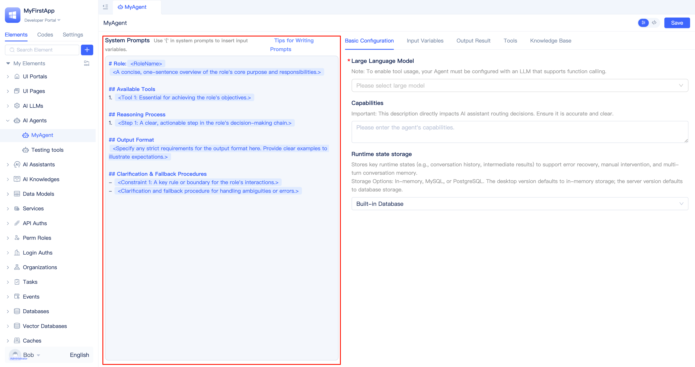

Agent可视化编辑器的整个左侧区域都用于提示词编写，开发者按需填写模版，将不需要的部分删除即可。

更多关于系统提示词的编写技巧，请参考[Agent提示词编写技巧](../advanced-guide/agent-prompt-writing-techniques)。

### 在提示词中使用变量 {#use-variables-in-prompt}
在调用Agent时，除了可以传递用户的输入内容，还可以动态传入变量。这些变量能够在提示词中被引用，实现更灵活的上下文定制和信息填充，使Agent能够根据实际业务场景动态调整行为和响应内容。

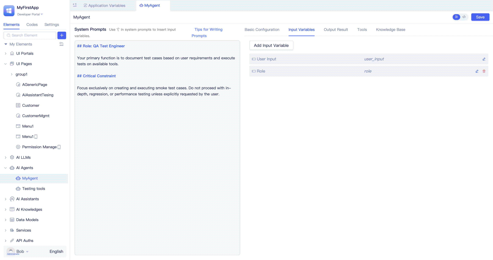

开发者在需要插入变量的地方输入`{`即可触发变量选择列表，单击对应的变量即可将其插入到提示词中，在Agent运行时会自动将变量替换为实际的值。

默认可以使用的变量仅有`用户输入`，但开发者可以在输入变量中进行添加，参考[配置输入变量](#configure-input-variables)。

## 选择模型并配置参数 {#select-model-and-configure-parameters}
大模型是Agent智能决策和任务执行的核心。它负责理解用户输入、结合提示词和上下文进行推理，并生成响应结果。选择合适的大模型和参数，能显著提升Agent的表现和适应性。反之，如果大模型选择不当，可能会导致Agent无法正确理解用户意图，生成错误的响应结果。

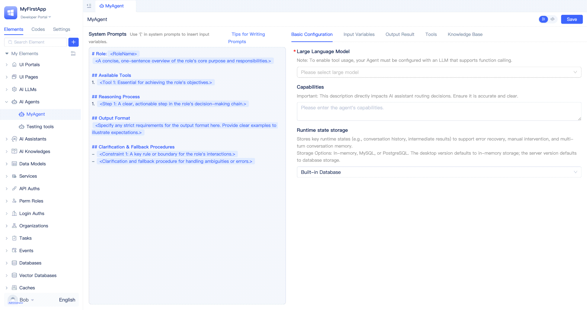

JitAi提供了[ai-llm元素](../ai-llm/create-ai-llm)用于对接市面上主流的大模型服务，而且支持私有化大模型服务的集成。在ReActAgent的基础配置中，从已经创建的大模型实例中选择并配置其参数即可。

:::tip
开发者需要先完成大模型实例元素的创建，才能在ReActAgent中选择使用。如果需要调用工具，则对应的模型必须支持Function Calling。

可以参考各大模型服务厂商的官方文档，了解模型能力以及参数配置。
:::

## 为Agent编写简介描述 {#write-agent-description}
`agent描述`是用于描述Agent的用途、功能、特点等信息的文本。在创建ReActAgent时，开发者可以编写一个简洁明了的描述。当Agent被AI助理编排时，描述信息将用于AI助理的路由决策分析，从而在多个Agent中选择最合适的Agent来处理用户请求。

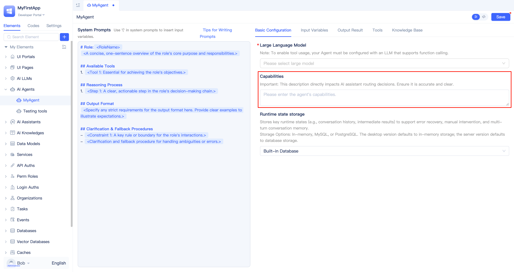

开发者在Agent可视化编辑器的`基础配置`-`agent描述`输入框中填写描述信息后点击`保存`即可。通常，描述信息和系统提示词中的角色描述可以保持一致。

## 配置运行状态存储仓 {#configure-runtime-state-storage}
Agent在执行过程中需要保存和更新状态信息，以便在对话中保持一致性和连续性。开发者需要选择一个合适的存储仓来保存Agent的运行状态。JitAi支持使用内存、MySQL或者PostgreSQL作为存储仓。如果开发者不进行配置，桌面版默认使用内存存储，服务器版默认使用内置的MySQL数据库存储。

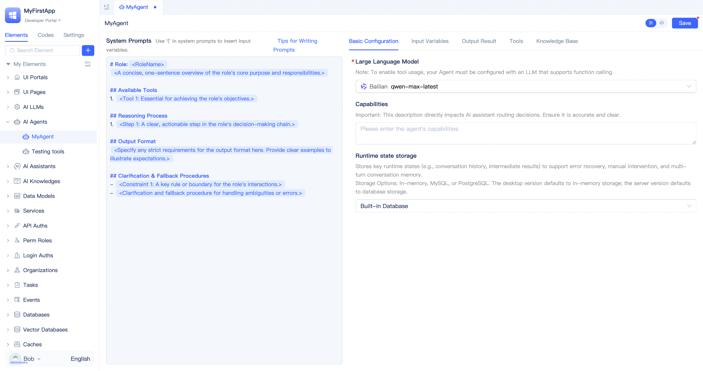

### 内存存储 {#memory-storage}
内存存储适用于测试和调试阶段，快速验证，不需要依赖数据库。一旦Jit节点重启，内存存储的会话上下文信息会丢失，不建议在生产环境中使用。

开发者在Agent可视化编辑器的`基础配置`-`运行状态存储仓`下拉列表中选择`内存存储`后点击`保存`即可。

### 数据库存储 {#database-storage}
数据库存储适用于生产环境，可以持久化保存Agent的运行状态，即使Jit节点重启，会话上下文信息也不会丢失。在集群模式下，数据库存储的会话上下文信息也可以被多个Jit节点共享。

开发者在Agent可视化编辑器的`基础配置`-`运行状态存储仓`下拉列表中选择目标数据库后点击`保存`即可。

:::tip
开发者需要先创建一个MySQL或者PostgreSQL数据库元素，才能在Agent中选择使用。

可以参考[管理数据库连接](../data-modeling/manage-database-connections)。
:::

## 配置输入变量 {#configure-input-variables}
每个Agent被调用时都会接收一个默认的参数，即`用户输入`。开发者也可以自定义其它输入变量，并在系统提示词或程序逻辑中引用这些变量。

开发者在Agent可视化编辑器中切换到`输入变量`页签，点击`添加输入变量`按钮，在弹出的对话框中填写变量标题、选择变量数据类型，点击`确定`按钮即可。

输入变量支持单行文本、多行文本、数字、金额、字典等JitAi[数据类型](../../reference/framework/JitORM/data-types)及其配置项。

## 配置输出结果 {#configure-output-results}
Agent运行完成后默认会输出一个字典，字典中仅包括一个`output`文本字段。如果要在程序逻辑中调用Agent，或者在ai-assistant中编排Agent和其它节点的流转关系，则Agent的输出结果需要是能够被程序逻辑解析的结构化数据，而不是仅有一段字符串。

开发者在Agent可视化编辑器中切换到`输出结果`页签，可以修改`output`字段的数据类型以及标题，也可以点击`添加输出结果`按钮添加新的输出字段。

输出结果会被自动转换为大模型能够准确理解的JSON Schema，并作为系统提示词的一部分发送给大模型服务。如果没有特别的要求，开发者就不需要在系统提示词中编写输出规范相关的内容了。

:::tip
每一个输出结果字段的标题和名称都需要仔细斟酌，做到见名知其意，以便大模型能正确理解。
:::

## 为Agent添加工具 {#add-tools-to-agent}
工具为Agent扩展了可执行的能力，使其不仅能理解和处理自然语言，还能主动调用外部服务、数据库、API等，实现信息查询、数据处理、任务执行等复杂操作。通过为Agent添加合适的工具，开发者可以让Agent具备更强的业务处理和自动化能力，满足多样化的应用场景需求。

JitAi作为企业级AI应用开发平台，自描述的应用模块可以被大模型准确理解并调用，成为Agent可用的工具。开发者可以在Agent可视化编辑器的`工具`中添加模型函数、服务函数、MCP服务、外部API、页面函数。

### Agent调用模型函数 {#agent-call-model-functions}
[数据模型](../../reference/framework/JitORM/data-models#model-built-in-functions)自带常用的增删改查函数，开发者还可以根据实际业务需求[自定义模型函数](../data-modeling/data-table-model#model-function-configuration)。将数据模型函数作为工具添加到Agent后，Agent便能够通过这些函数实现对数据的增、删、改、查等操作，满足多样化的数据处理场景。

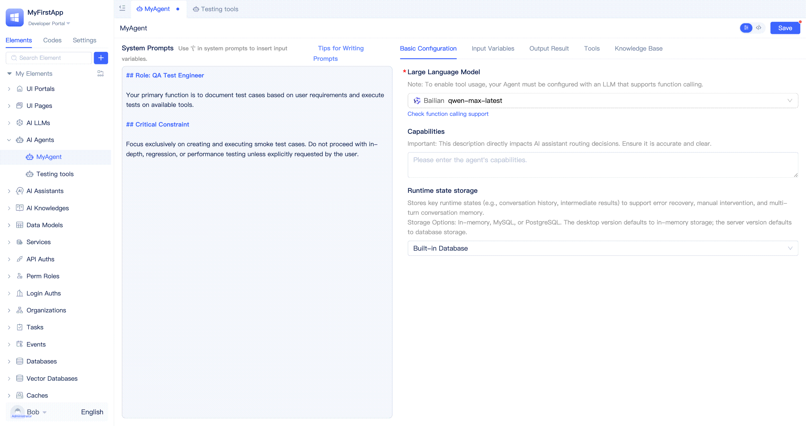

开发者在Agent可视化编辑器中切换到`工具`页签，点击`添加工具`按钮，在列表中选择`数据模型`，然后在弹窗中选择目标模型，点击`确定`按钮即可。

默认情况下会把模型所有函数都添加为工具，开发者应按照实际需要将不需要的函数关闭。界面上提供了一键全选/取消全选按钮，方便开发者快速操作。

### Agent调用服务函数 {#agent-calling-service-functions}
开发者通常使用服务函数来封装复杂的业务逻辑处理过程，当服务函数被添加为工具后，Agent就可以直接调用这些函数。这意味着可以通过定义服务函数来让Agent完成复杂业务逻辑处理，**为Agent提供强有力的工具，是优化Agent执行能力、准确度的重要手段**。

开发者在Agent可视化编辑器中切换到`工具`页签，点击`添加工具`按钮，在列表中选择`服务`，然后在弹窗中选择目标服务，点击`确定`按钮即可。

默认情况下会把服务所有函数都添加为工具，开发者应按照实际需要将不需要的函数关闭。

:::tip
清晰无歧义的函数名称、函数描述、参数声明，可以提高大模型的理解准确度，更精准地完成任务。
:::

### Agent调用MCP服务 {#agent-call-mcp-service}
MCP（Model Context Protocol，模型上下文协议）是Anthropic在2024年11月推出的一种开放标准协议，旨在标准化大型语言模型（LLM）与外部数据源、工具和服务之间的交互方式。它通过定义统一的通信规范，使AI模型能够安全、灵活地访问实时数据、API、数据库等资源，从而提升AI应用的执行能力和准确性。JitAi支持开发者以可视化的方式配置MCP服务，并将其添加为工具。

开发者在Agent可视化编辑器中切换到`工具`页签，点击`添加工具`按钮，在列表中选择`MCP服务`，然后在弹窗中填写服务名称和配置，点击`确定`按钮。平台会进行MCP Server的加载，加载成功后会展示MCP Server的函数列表，开发者按需勾选。

为了方便开发者使用，JitAi在MCP Server添加界面中内置了一些经过验证的MCP Server，开发者在弹窗中将鼠标放在`选择MCP服务`上即可在内置列表中进行快速选择，配置信息会被自动填写。不在内置列表中的则需要开发者手动填写配置。

对于已添加的MCP Server可以随时修改配置，平台还提供了复制配置的功能，可以一键把MCP Server配置复制到系统剪贴板中，方便开发者进行粘贴使用。

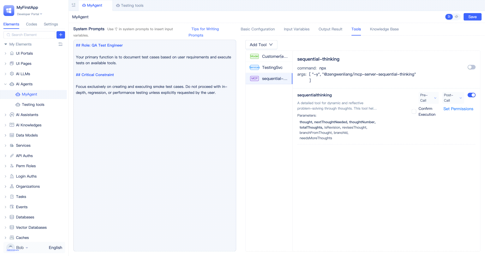

将鼠标放在MCP Server的标题右侧即可看到`复制配置`、`修改配置`以及`设置为环境变量`按钮。

:::warning
目前市面上的MCP Server实现良莠混杂，开发者需要仔细甄别，确保所使用MCP Server的安全性和可靠性。
:::

### 将MCP配置转为环境变量 {#convert-mcp-config-to-environment-variables}
在实际开发中，部分MCP Server的配置项（如API密钥、Token等）涉及敏感信息。为保障安全，建议开发者将这类敏感配置转为应用环境变量进行管理。这样不仅可以避免敏感信息在配置界面明文暴露，还便于在不同环境下灵活切换和统一维护。

开发者点击`设置为环境变量`按钮后，在弹窗中填写环境变量名称和变量值，点击`确定`按钮即可将配置存储到应用环境变量中，开发者也可以随时修改回JSON格式的配置。

### Agent调用外部API {#agent-call-external-api}
JitAi支持开发者通过[外部API](../third-party-integration/external-api)元素，将各类外部系统接口集成到平台中，并将这些API作为Agent的工具使用。

开发者在Agent可视化编辑器中切换到`工具`页签，点击`添加工具`按钮，在列表中选择`外部API`，然后在弹窗中选择目标外部API元素，点击`确定`按钮即可。

默认情况下会把外部API所有函数都添加为工具，开发者应按照实际需要将不需要的函数关闭。

### Agent调用页面函数 {#agent-call-page-functions}
页面中的内置函数（例如获取页面变量）、页面中组件的函数（例如表格刷新、打开弹窗）以及开发者自定义的[页面函数](../shell-and-page/component-based-page-development#page-functions)都可以作为工具被Agent调用，从而实现了AI对前端界面的操作。

:::tip
在开发者门户中无法验证对页面函数的调用，需切换到用户实际访问的门户中进行验证。参考[在页面助理中测试agent](#test-agent-in-page-assistant)。
:::

### 启用/关闭工具函数 {#enable-disable-tool-functions}
每个数据模型、服务函数、页面、MCP Server、外部API元素中都包含多个函数。开发者在Agent开发过程中，可以根据实际需求开启需要调用的函数，把不需要使用的函数关闭。

:::warning
不要简单粗暴地启用全部函数，要根据实际需要针对性启用函数，否则会增加不必要的Token消耗、给大模型带来理解负担、引入不必要的操作风险。
:::

### 工具函数调用前/后事件触发 {#tool-function-call-pre-post-event-triggering}
Agent的每一次工具调用都可以产生两个后端事件：调用前事件和调用后事件。开发者可以启用或关闭其中一个或全部事件，也可以针对每个事件配置是否携带事件参数。利用事件机制，开发者可以在工具调用前/后执行自定义的业务逻辑，延伸Agent的能力。

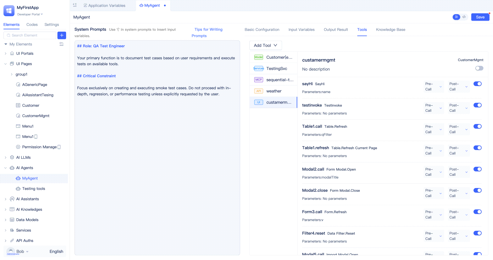

开发者在每个工具函数的右侧可以看到`调用前`和`调用后`两个事件配置入口，鼠标悬浮在入口上即可弹出配置面板，在面板中开启或关闭`触发事件`、开启或关闭`事件消息中包含数据`。调用前事件消息参数包括工具名称、工具入参，调用后事件消息参数包括工具名称、工具返回结果，工具名称是必传参数，只有工具入参和工具返回结果受`事件消息中包含数据`开关限制。

开发者需要通过创建[Agent工具事件](../business-logic-development/event-handling#agent-tool-call-events)实例元素来订阅Agent的工具调用事件并执行事件函数逻辑。

### 工具函数执行前的人工确认 {#manual-confirmation-before-tool-execution}
在涉及敏感或高风险操作时，可以为工具函数启用“执行前确认”。启用后，Agent会在执行前暂停，并向用户请求确认，只有同意后才继续执行。适用于审批、关键数据变更等需要人工把关的场景，可防止误操作和风险。

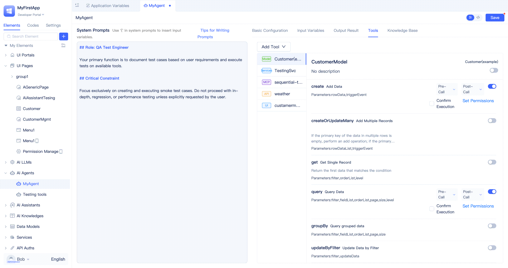

开发者在工具函数右侧可以看到`执行前确认`开关，勾选后即可启用执行前确认。当Agent调用工具之前，会在对话框中向用户请求确认，只有同意后才继续执行。

:::tip
页面函数没有`执行前确认`开关，默认无需确认。这是因为页面函数通常已通过前端交互（如弹窗、按钮等）实现了用户确认，因此无需在Agent工具中重复设置。
:::

### 限制工具函数调用的用户角色 {#restrict-user-roles-for-tool-calls}
在企业级AI应用中，不同用户角色拥有不同的操作权限。通过限制工具函数的可调用角色，可防止越权和误操作，保障数据安全。

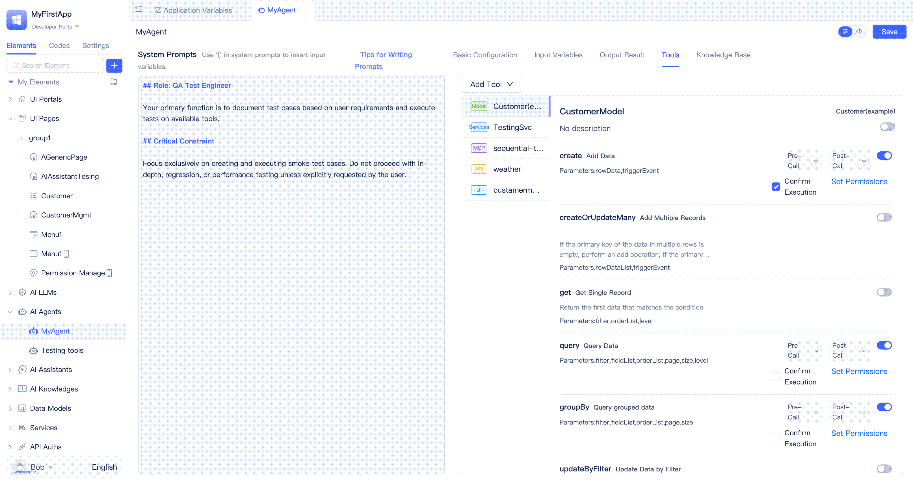

开发者在工具函数右侧可以看到`设置权限`按钮，点击后在弹窗中选择[应用角色](../user-and-permission/role-portal-menu-permissions)即可，支持选择多个应用角色。

没有配置任何角色时，所有使用Agent的用户都能正常调用该工具函数。当配置了角色后，只有拥有这些角色的用户才能调用该工具函数。

## 集成知识库实现检索增强生成（RAG） {#integrate-knowledge-base-rag}
RAG（Retrieval-Augmented Generation，检索增强生成）是一种结合了知识检索与大模型生成能力的AI解决方案。它通过在模型生成回答前，先从知识库中检索相关信息，将检索结果与用户问题一同输入大模型，从而提升回答的准确性和时效性。

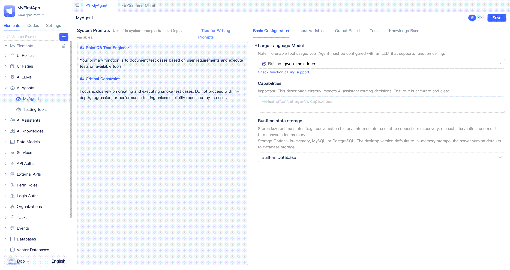

开发者在Agent可视化编辑器中切换到`知识库`页签，点击`添加知识库`按钮，在弹窗中选择目标知识库元素，点击`确定`按钮即可。Agent中支持添加多个知识库，每个知识库可以启用或关闭，默认是启用状态。当不再需要某个知识库时，开发者点击右侧的删除按钮将其从Agent中移除即可。

还有一个`由大模型决策是否使用`开关，默认是开启状态，开启时为非强制模式，关闭时为强制模式。强制模式下，Agent在首次请求大模型之前会使用用户输入的内容先查询一次知识库，将结果作为上下文的补充和增强。如果开发者将其关闭，则由大模型自行决策是否查询以及如何查询知识库。无论`由大模型决策是否使用`是开启还是关闭，开发者都可以在系统提示词中去设计知识库的使用策略，指导大模型对知识库的使用。

关于知识库的创建，请参考[AI知识库](../knowledge-base/create-knowledge-elements#create-ai-knowledge-base-element)。

## 在前端函数中调用Agent {#call-agent-in-frontend-functions}
在实际业务场景中，常常需要根据用户在页面上的操作（如点击按钮、填写表单、切换选项等）实时调用AI能力，实现智能推荐、自动补全、智能问答等功能。为满足这些需求，平台支持在前端函数逻辑（页面函数、页面事件函数、组件事件函数）中直接调用Agent，并灵活传递参数，使AI能力能够无缝集成到各类前端交互中，提升用户体验和业务智能化水平。

如上图所示，开发者在函数逻辑中插入一条`基础语句`，选择调用指定Agent的`运行`函数，在参数输入框中填写用户指令，紧接着再插入一条刷新表格当前页的`基础语句`，即可实现点击按钮后，Agent根据用户指令生成内容，并刷新表格当前页的功能。

:::tip
Agent的运行通常需要一定时间，若用户等待过久会影响体验。建议结合AI助理，优化交互流程，实现AI与用户的持续互动，提升整体使用感受。
:::

## 在页面助理中测试Agent {#test-agent-in-page-assistant}
在Agent开发过程中，需要频繁进行调试。开发者可以创建一个简单的AI助理，该助理内部编排为直接调用目标Agent，然后将助理集成到页面中即可。在AI助理的对话框中我们可以看到Agent的运行过程和输出结果。

[如何在AI助理中调用Agent?](../ai-assitant/process-orchestration-node-configuration#ai-agent)

[如何在页面中集成AI助理？](../shell-and-page/component-based-page-development#integrate-ai-assistant-in-pages)

## 在后端服务函数中调用Agent {#call-agent-in-backend-service-functions}
后端服务函数常用于处理业务流程、数据处理等场景。需要在这些流程中引入AI能力（如智能分析、内容生成、自动问答等）时，可直接在服务函数中调用Agent，实现AI与业务逻辑的结合，如自动审批、智能推荐、内容审核等。

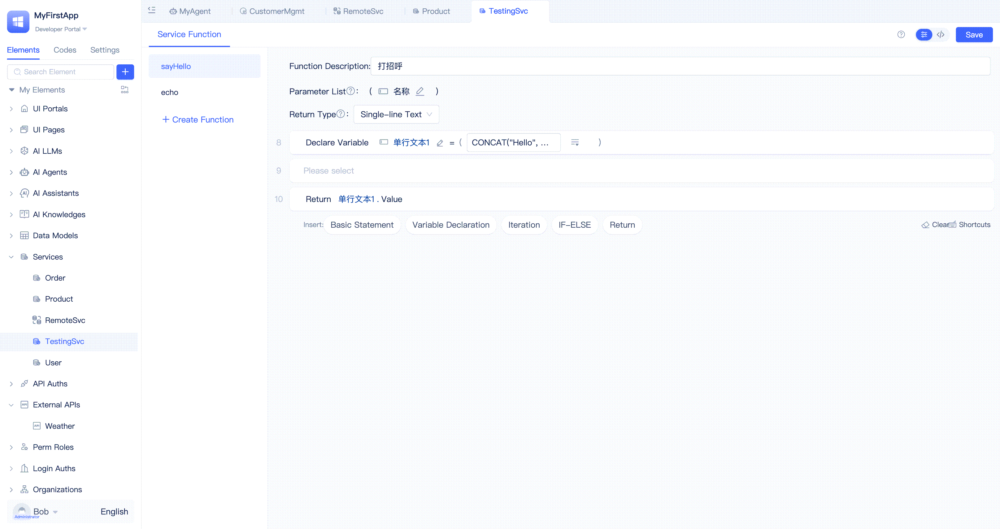

开发者在服务函数编辑器中插入一条`基础语句`，选择调用指定AI Agent的`运行`函数，在参数输入框中填写用户指令，即可实现服务函数调用Agent的功能，切换到源码模式后可以看到仅需一行代码就能完成调用。

## 源码模式修改Agent {#modify-agent-in-source-code-mode}
在Agent可视化编辑器中的所有配置都会生成对应的源码文件，开发者可以切换到源码模式进行修改，与可视化编辑器中修改的效果相同。

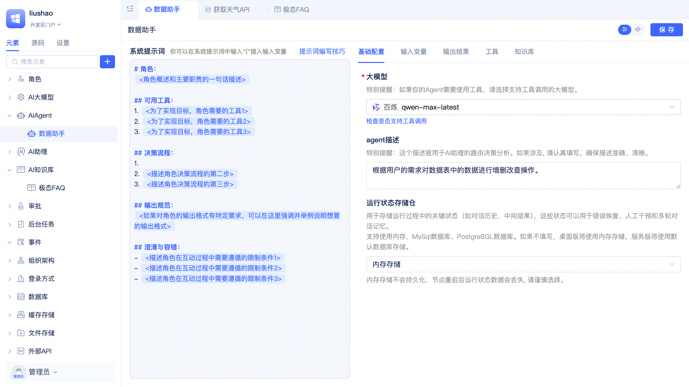

开发者在Agent可视化编辑器右上角点击`</>`按钮即可切换到源码模式。

## 自定义回调处理器 {#custom-callback-processor}
回调处理器为开发者提供了灵活的业务扩展能力。通过这些机制，开发者可以在Agent推理、工具调用等关键流程节点插入自定义逻辑，实现如日志记录、参数校验、上下文增强、权限控制、审计监控等业务需求。例如，可以在模型推理前后自动补充业务上下文，或在工具调用前后进行操作审计和结果处理。回调和钩子机制让Agent的行为更加可控和可观测，便于对企业级AI应用的深度定制化开发。

开发者需要以全代码方式创建自定义回调处理器，请查看参考手册中的[自定义回调处理器](../../reference/framework/JitAi/AIAgent#custom-callback-handlers)了解详细用法。

## Agent的流式输出 {#agent-streaming-output}
在Agent运行过程中，会不断接收到大模型推理进展、文本内容以及工具调用等信息，开发者可以以流式方式实时获取并处理这些数据。

AI助理调用Agent时已支持流式输出。如果开发者通过代码调用Agent的run方法，也可以传入自定义的流式回调函数，实时订阅和处理流式输出消息。
请查看参考手册中的[流式回调处理](../../reference/framework/JitAi/AIAgent#streaming-callback-processing)了解详细用法。
