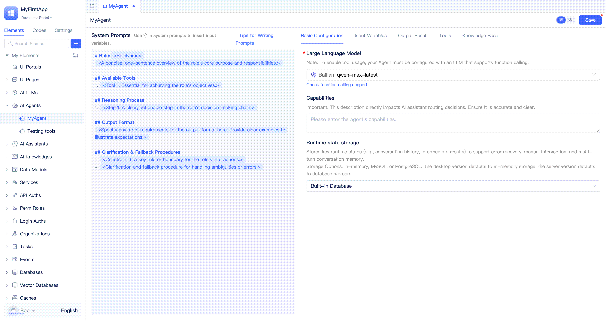

# Creating AI Agent
Agent (intelligent agent) possesses autonomous decision-making and task execution capabilities, automatically selecting appropriate tools to complete complex business processes based on user input and contextual information.

Agent consists of three core components: system prompts, tools, and large language models. To achieve deep integration between Agent and application systems, it needs to be able to identify, understand, and call existing system functional modules. In enterprise applications, it is usually necessary to precisely configure Agent's input and output parameters and their formats, enabling flexible parameter passing, result retrieval, and processing in program logic. Additionally, Agent can integrate with knowledge bases to implement Retrieval-Augmented Generation (RAG).

## Creating ReActAgent {#create-react-agent}
ReAct (Reasoning and Acting) is an Agent working mode that combines "reasoning" and "acting". It enables AI to alternately think and take actions when facing complex tasks, dynamically adjusting subsequent decisions based on feedback from each step. Developers can use JitAi to quickly develop and debug ReAct-mode Agents that are natively integrated with applications, known as ReActAgent.

Developers can create a ReActAgent by clicking `+`, `AI Agent`, `ReActAgent` in sequence in the element directory tree, filling in a name in the form popup, and clicking the `Confirm` button. This will create a ReActAgent and automatically enter the visual editor.

ReActAgent supports writing system prompts, selecting large language models, writing descriptions, configuring runtime state storage, [configuring input/output](./agent-input-output), [adding tools](./agent-tools), and [adding knowledge bases](./agent-knowledge-base).

## Write System Prompt {#write-system-prompt}
System prompts are important guidelines for Agent behavior and decision-making. They provide Agents with key information such as task objectives, role settings, and behavioral norms, guiding Agents to complete tasks more accurately. Properly designed system prompts can improve Agent's intelligent performance and interaction experience.

Considering that many developers are not skilled in writing prompts, JitAi provides default system prompt templates. Developers can modify based on the default templates, and after mastering prompt writing techniques, they can write according to their own format.

The entire left area of the Agent visual editor is used for prompt writing. Developers can fill in the template as needed and delete unnecessary parts.

For more system prompt writing techniques, please refer to [Agent Prompt Writing Techniques](../advanced-guide/agent-prompt-writing-techniques).

## Select Model and Configure Parameters {#select-model-and-configure-parameters}
Large language models are the core of Agent's intelligent decision-making and task execution. They are responsible for understanding user input, reasoning based on prompts and context, and generating response results. Selecting appropriate large language models and parameters can significantly improve Agent's performance and adaptability. Conversely, if the large language model is poorly selected, it may cause the Agent to fail to correctly understand user intentions and generate incorrect response results.

JitAi provides [AI Large Language Model](../ai-llm/create-ai-llm) elements for connecting to mainstream large language model services in the market, and also supports integration of private large language model services. In the basic configuration of ReActAgent, you can select from already created large language model instances and configure their parameters.

:::tip
Developers need to complete the creation of large language model instance elements before they can be selected and used in ReActAgent. If you need to call tools, the corresponding model must support Function Calling.

You can refer to the official documentation of various large language model service providers to understand model capabilities and parameter configuration.
:::

## Write Agent Description {#write-agent-description}
`Agent Description` is text used to describe the Agent's purpose, functionality, features, and other information. When creating a ReActAgent, developers can write a concise and clear description. When the Agent is orchestrated by AI Assistant, the description information will be used for AI Assistant's routing decision analysis, thereby selecting the most suitable Agent among multiple Agents to handle user requests.

Developers can fill in the description information in the `Basic Configuration` - `Agent Description` input box of the Agent visual editor and click `Save`. Usually, the description information can be consistent with the role description in the system prompt.

## Configure Runtime State Storage {#configure-runtime-state-storage}
Agents need to save and update state information during execution to maintain consistency and continuity in conversations. Developers need to select an appropriate storage repository to save the Agent's runtime state. JitAi supports using memory, MySQL, or PostgreSQL as storage repositories. If developers do not configure it, the desktop version defaults to memory storage, and the server version defaults to the built-in MySQL database storage.

### Memory Storage {#memory-storage}
Memory storage is suitable for testing and debugging stages, providing quick verification without relying on databases. Once the Jit node restarts, session context information in memory storage will be lost, so it is not recommended for production environments.

Developers can select `Memory Storage` from the `Basic Configuration` - `Runtime State Storage` dropdown list in the Agent visual editor and click `Save`.

### Database Storage {#database-storage}
Database storage is suitable for production environments and can persistently save the Agent's runtime state. Even if the Jit node restarts, session context information will not be lost. In cluster mode, session context information in database storage can also be shared by multiple Jit nodes.

Developers can select the target database from the `Basic Configuration` - `Runtime State Storage` dropdown list in the Agent visual editor and click `Save`.

:::tip
Developers need to create a MySQL or PostgreSQL database element first before they can select and use it in the Agent.

You can refer to [Manage Database Connections](../data-modeling/manage-database-connections).
:::

## Modify Agent in Source Code Mode {#modify-agent-in-source-code-mode}
All configurations in the Agent visual editor will generate corresponding source code files. Developers can switch to source code mode for modification, which has the same effect as modification in the visual editor.

Developers can click the `</>` button in the upper right corner of the Agent visual editor to switch to source code mode.

## Custom Callback Processor {#custom-callback-processor}
Callback processors provide developers with flexible business extension capabilities. Through these mechanisms, developers can insert custom logic at key process nodes such as Agent reasoning and tool calling, implementing business requirements such as logging, parameter validation, context enhancement, permission control, and audit monitoring. For example, you can automatically supplement business context before and after model reasoning, or perform operation auditing and result processing before and after tool calling. Callback and hook mechanisms make Agent behavior more controllable and observable, facilitating deep customized development of enterprise-level AI applications.

Developers need to create custom callback processors in full-code mode. Please refer to [Custom Callback Processors](../../reference/framework/JitAi/AIAgent#custom-callback-handlers) in the reference manual for detailed usage.
