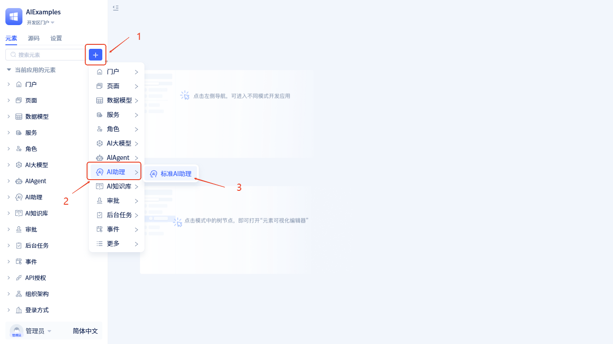
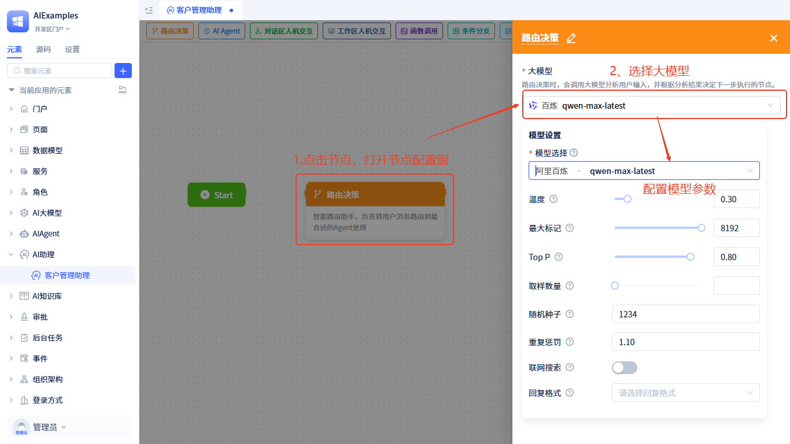
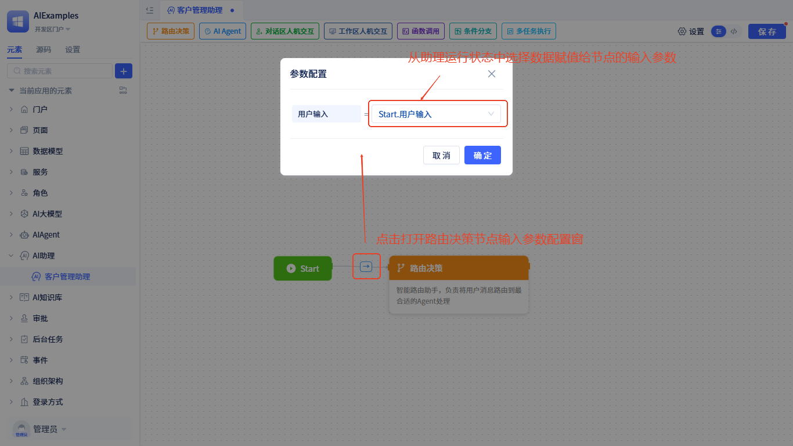
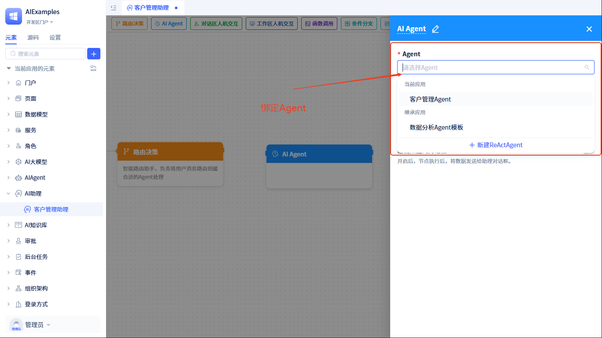
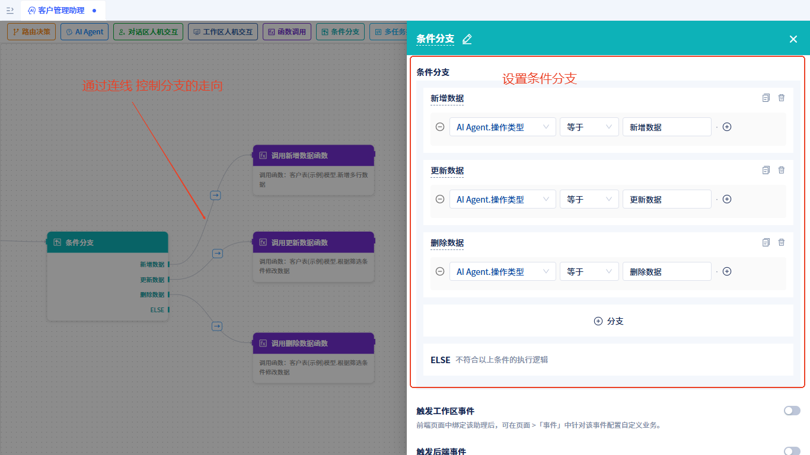
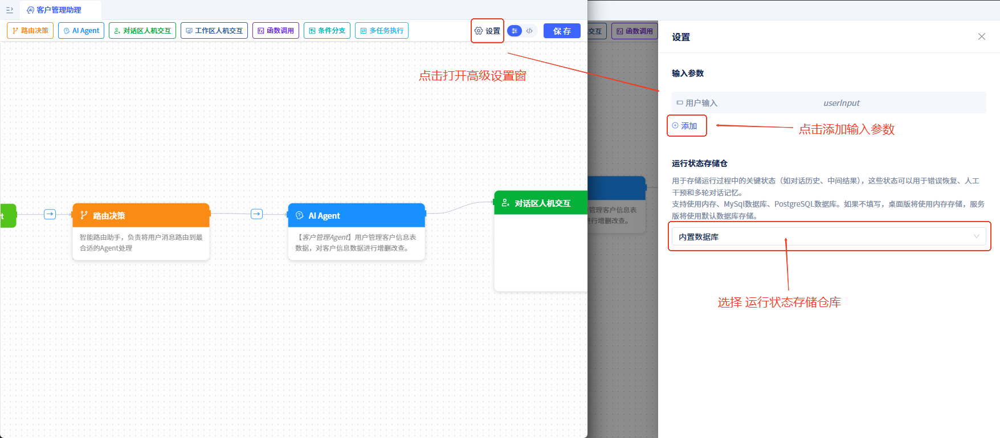
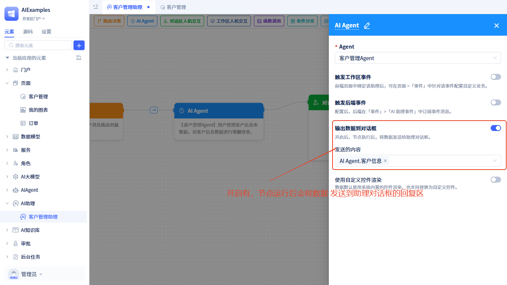
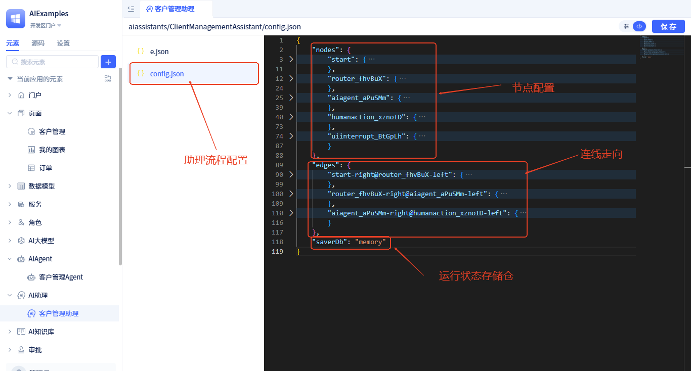
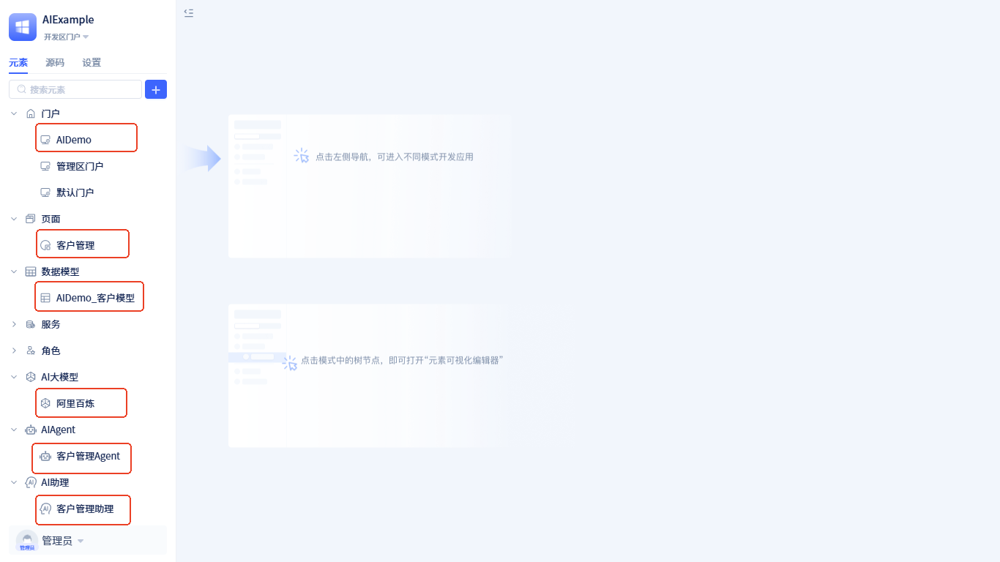
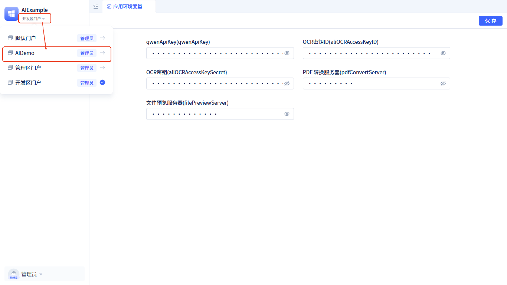

# ai-assistant
## 什么是ai-assistant
ai-assistant就像一个智能的项目经理，它能把复杂的任务拆解成一个个小步骤，然后按照你设计的流程一步步执行。你不用写复杂的业务逻辑代码，只需要设计好流程，剩下的ai-assistant帮你搞定。

## 快速开始
### 创建ai-assistant


在元素目录树上点击搜索框右边的`+`按钮，在弹出的菜单中选择`ai-assistant`-`标准ai-assistant`，选择完成后会弹出如下弹窗。


在弹窗中，填入**名称**，然后点击**保存**完成创建。

:::tip 命名建议
- 使用有意义的名称，如"客户服务助理"、"订单处理助理"
- 避免使用过于简单的名称，如"助理1"、"测试助理"
- 名称应该反映助理的主要功能或应用场景
:::

### 可视化编排
ai-assistant的可视化编排工具让您能够通过直观的拖拽操作设计复杂的业务流程，无需编写代码即可构建智能工作流。


**添加节点**：
1. 从顶部工具栏选择需要的节点类型
2. 拖拽到画布中的合适位置
3. 释放鼠标完成节点添加

**连接节点**：
1. 将鼠标悬停在源节点的输出端口上
2. 按住鼠标左键拖拽到目标节点的输入端口
3. 释放鼠标建立连接

:::tip 编排技巧
- **合理布局**：将相关节点放在相近位置，保持流程清晰
- **命名规范**：为节点设置有意义的名称，便于后续维护
:::

## 节点类型详解
### 开始节点
这是工作流的起点，就像项目的入口一样。它接收用户的输入和其他[自定义的输入参数](#输入参数)，把这些信息存到“记忆”里，然后开始执行任务。
每个ai-assistant中只能有一个开始节点，而且创建助理后会自动生成，你不需要手动添加。

### 路由决策
这个节点很聪明，它能根据用户的消息内容，决定下一步该调用哪个AI助手来处理。
:::tip 注意
路由决策节点的下一步只能是ai-agent节点，不能是其他类型。
:::
路由决策时会调用大模型来分析用户输入，然后智能地选择最合适的处理路径。

**绑定大模型**：路由决策需要大模型帮忙分析，所以我们要给它配一个大模型。配置方法如下：



在流程中点击路由决策节点，右侧会打开配置窗口；选择[大模型](ai-llm)，配置好参数就完成了。

**输入消息配置**：路由决策节点有个输入参数，运行时会根据这个参数来决定下一步怎么走；我们需要给这个参数赋值。配置方法如下：



从其他节点连线到路由决策节点时会自动弹出输入配置窗口，后续也可以通过点击连线上的` → `按钮打开。你可以把助理"记忆"中的变量传给它。

### ai-agent
ai-agent节点就是调用具体的ai-agent来处理特定任务。
我们需要在这个节点上绑定一个[ai-agent](ai-agent)，配置方法如下：



**输入参数配置**：节点运行时会调用Agent，并传入[Agent需要的参数](ai-agent#配置输入变量)。
我们需要给这些参数赋值，配置方法如下：


点击连线上的` → `按钮打开输入参数配置窗口。左边是Agent需要的变量，右边选择[运行状态数据](#运行状态数据)中的数据给Agent的变量赋值。
这个节点运行完成后会把[Agent的输出结果](ai-agent#配置输出结果)存储到运行状态中，供其他节点使用。

### 对话区人机交互
**什么是对话区**：对话区就是一个AI对话框，是用户和助理聊天的地方。


当任务流程运行到这个节点时会暂停，在对话框中显示数据，用户确认数据并进行相应操作后流程才能继续。如果没有下一步节点，流程就自动结束了。
在这个节点用户可以做**同意**、**拒绝**、**回复**及**编辑数据**(需要开启编辑功能)等操作。
运行时进行**同意**、**拒绝**、**回复**及**编辑数据**操作后会恢复流程，同时触发[对话区人机交互事件](#对话区人机交互事件)。

节点配置详解：
- **需展示的数据**：你可以自由定义需要用户确认的数据内容，这些数据来源于[运行状态数据](#运行状态数据)。
- **可编辑**：开启后，用户才能编辑展示的数据，编辑后的数据会自动更新到运行状态中。
- **使用自定义控件渲染**：默认会用平台内置的数据渲染控件显示数据，你也可以使用[自定义控件](#)渲染。
- **显示操作按钮**：你可以在这个节点自定义操作按钮，点击后可触发[对话区人机交互事件](#对话区人机交互事件)。


运行时效果如下：


### 工作区人机交互
和助理对话区配合的还有一个**工作区**：用户工作的功能页面。


工作区指的是用户工作的前端页面。
当任务流程运行到这个节点时，流程的后端会暂停，同时向前端发送暂停事件和相关信息。在工作区可以[订阅暂停后事件](#工作区人机交互事件)，在对应的事件处理函数中，用事件参数更新页面UI状态，然后等待用户做相关操作恢复流程继续执行。

节点配置详解：
- **事件携带的参数**：助理向前端工作区发送暂停事件时携带的参数，这些从[运行状态数据](#运行状态数据)中选择，前端可以通过这些参数更新UI状态。
- **操作提示**：一个用来引导用户的提示语，告诉用户在页面哪里执行什么操作来恢复流程；提示语会在助理对话框中显示。


**恢复流程**：在工作区订阅这个节点的暂停事件，进行相关处理逻辑后调用[发送AI消息](#发送ai消息)函数就能恢复流程。发送的消息内容会作为节点的输出参数存储到运行状态数据中，供其他节点使用。

### 函数调用
这个节点用来调用模型/服务函数对运行状态中的数据进行加工、清理或计算等处理。
这个节点需要绑定一个服务/模型函数。当任务流程运行到这个节点时会调用绑定的函数，并把函数的返回值存储到运行状态数据中，供其他节点使用。

**绑定函数**：


**输入参数配置**：函数调用节点的输入参数就是它绑定的函数的参数，参数配置方法和[ai-agent节点](#ai-agent)的输入参数配置方法一样。

### 条件分支
根据当前助理状态中的数据情况决定流程的下一步走向。

**条件分支配置详解**：
- **条件表达式**：使用简单的逻辑表达式判断数据
- **支持操作符**：等于、不等于、大于、小于、包含、为空等
- **多条件组合**：可以使用"且"、"或"组合多个条件
- **条件分支**：可以设置多个分支，满足不同条件时走不同路径



### 多任务执行
这个节点用来循环执行特定任务，需要设置一个循环的变量，从助理运行状态中选择`多行数据`或`列表`类型的数据。

**多任务执行配置详解**：
- **循环变量选择**：选择要循环处理的数据，必须是`多行数据`或`列表`类型
- **循环执行分支**：设置每次循环时要执行的任务流程
- **循环结束分支**：设置所有循环完成后的流程走向


这个节点有两个分支：**循环执行**：遍历循环的变量，依次执行某个任务；**循环结束**：循环完成后的流程走向。

**循环变量说明**：
这个节点运行时会向运行状态中存储两个数据：
- **`循环索引`**：当前循环的序号（从0开始）
- **`循环项`**：当前循环处理的数据项
- **使用场景**：在循环执行分支中，可以通过这两个变量访问当前循环的信息


## 事件处理
ai-assistant在运行过程中会触发多种类型的事件，这些事件可以在前端工作区和后端业务逻辑中订阅和处理，实现更灵活的流程控制和用户交互。

### 事件类型概览
ai-assistant支持以下主要事件类型：
- **节点运行事件**：节点到达和运行完成后触发
- **工具调用事件**：AI Agent使用工具前后触发
- **对话区人机交互事件**：用户在助理对话区中的确认操作触发
- **工作区人机交互事件**：助理运行至工作区人机交互节点时触发

### 前端工作区事件
前端工作区事件主要用于页面UI状态更新和用户交互处理。

#### 节点运行事件
AI Agent节点、函数调用节点、条件分支节点及多任务执行节点在到达节点时及运行后可触发工作区事件。前提是需要开启触发工作区事件，开启方式如下：


页面中绑定该助理后即可订阅节点运行事件，订阅方式如下：


在事件处理逻辑中，可使用事件输出的参数：


#### 工具调用事件
对于AI Agent节点，在Agent运行过程中如果会用到工具，那么在工具调用前和工具调用后也会触发工作区事件。前提需要Agent[开启工具触发事件](ai-agent#工具函数调用前后事件触发)。


工具事件携带的参数是字典(JitDict)类型，有以下属性:
- **toolName**：工具名称，如："services.ASvc.func1"。在事件处理逻辑中，开发者需要根据工具名称来做对应的处理。
- **toolType**：工具类型，可选值有：model-模型函数，service-服务函数，ui-页面函数，mcp-MCP服务，externalApi-外部API
- **args**：参数，如果是工具调用前事件，且开启了`事件消息中包含数据`，args的值就是调用工具的入参；如果是工具调用后事件，且开启了`事件消息中包含数据`，args的值就是工具的返回值。

目前，可视化工具中无法使用工具调用事件的输出参数，需要开发者在源码模式中通过写代码使用。使用方式如下：
```javascript
this.subscribeEvent("AI:aiagents.ClientManagementagent.callTool.preEvent", async ({ data}) => {
    // AI: ai-assistant事件固定前缀；aiagents.ClientManagementagent: 助理中的节点ID；callTool.preEvent: 工具调用前事件，callTool.postEvent: 工具调用后事件
    // data该工具事件携带的参数
    if(data.toolName.value === "services.ASvc.func1"){
        //TODO：如果工具名称是xxxx， do something 
    }
});
```

#### 对话区人机交互事件
当流程运行到对话区人机交互节点时，对话框中会显示`同意`、`拒绝`、`编辑`、`回复`确认操作按钮及自定义按钮。
用户做了确认操作或点击自定义按钮后，会触发工作区事件；事件中携带的参数是节点上展示的数据。
在页面中可订阅这些事件：


#### 工作区人机交互事件
当流程运行到工作区人机交互节点时，会触发助理暂停事件，该事件会携带节点上配置的参数。在页面中可以订阅该事件：


### 后端业务事件
后端业务事件主要用于业务逻辑处理、数据持久化和系统集成。

#### 节点运行事件
AI Agent节点、函数调用节点、条件分支节点及多任务执行节点在到达节点时及运行后可触发后端事件。前提是需要开启触发后端事件，开启方式如下：


后端如何订阅节点运行事件，参考：[ai-assistant事件](business-logic-development/event-handling#ai-assistant事件)

#### 工具调用事件
对于AI Agent节点，在Agent运行过程中如果会用到工具，那么在工具调用前和工具调用后也会触发后端事件。前提是工具需要开启[触发事件](ai-agent#工具函数调用前后事件触发)。

后端如何订阅工具调用事件，参考：[Agent工具调用事件](business-logic-development/event-handling#agent工具调用事件)

## 运行状态数据
运行状态数据是ai-assistant流程执行过程中的"记忆库"，存储了所有节点产生的数据，这些数据可以在整个流程中的任意节点使用，也可以发送到助理的对话框中展示。

### 数据内容
运行状态数据包含以下几类：
- **用户输入**：用户发送的消息和自定义参数
- **节点输出**：各节点执行后的结果数据
- **中间变量**：循环索引、循环项等流程控制数据
- **用户反馈**：人机交互时用户的操作结果

### 数据使用方式
运行状态数据在ai-assistant流程中的多种使用场景：

- **节点配置**：在节点配置时选择数据作为输入参数
- **条件判断**：在条件分支中基于数据值做判断
- **循环处理**：在循环节点中遍历数组类型数据
- **数据展示**：在对话区或工作区中展示数据给用户
- **事件传递**：事件触发时作为参数传递给其他组件

### 数据流向
ai-assistant中的数据流向遵循一个清晰的模式，数据在节点间传递和累积，形成完整的执行上下文。

#### 数据输入阶段
1. **用户输入**：用户发送的消息作为`userInput`参数传入
2. **自定义参数**：通过高级设置配置的其他输入参数
3. **初始数据**：所有输入数据存储在运行状态中，供后续节点使用

#### 节点间数据传递
1. **路由决策节点**：接收用户输入消息，传递给大模型分析内容

2. **ai-agent节点**：从运行状态读取输入参数，传递给绑定的Agent处理任务，将Agent返回结果存储到运行状态中。

3. **函数调用节点**：从运行状态读取函数参数，传递给绑定的函数，将函数返回值存储到运行状态。

4. **工作区人机交互节点**：从运行状态读取需要展示的数据，等待用户操作和输入，将用户操作结果存储到运行状态。

## 高级设置
### 输入参数
每个助理有一个固定的输入参数：用户输入(userInput)。除此之外，你还可以自定义其他输入参数。在使用助理时需要为这些参数赋值。

### 运行状态存储库
用来存储运行过程中的运行状态数据（比如助理输入参数、各节点的输出参数、对话历史、中间结果），这些状态可以用于错误恢复、人工干预和多轮对话记忆。
**存储选项对比**：
- **内存存储**：速度快，但重启后数据丢失，适合开发测试。
- **关系型数据库**：数据持久化，支持复杂查询，功能更强大，适合生产环境。目前支持MySQL数据库和PostgreSQL数据库。

如果不填写，桌面版会用内存存储，服务版会用默认数据库(MySQL)存储。

### 设置入口
高级设置操作如下：



点击流程编辑器右上方的`设置`按钮，打开设置窗口，添加输入参数，设置运行状态存储库。

## 使用指南
### 哪些地方可使用ai-assistant
- [门户中使用ai-assistant](portal-and-page-development/portal-navigation-design#在门户中集成ai-assistant)
- [常规页面中使用ai-assistant](portal-and-page-development/component-based-page-development#在页面中集成ai-assistant)

使用ai-assistant时，还需配置以下内容：

### 欢迎语与开场白
使用助理时，可灵活配置欢迎语与开场白。
- **欢迎语**：用户打开或首次进入 AI 助理界面时，未输入任何内容前显示的简短问候与引导文案。传递友好、专业、一致的品牌形象；概述助理能做什么/不能做什么，降低落差。
- **开场白**：提供预置问题，目的是给出可点击或可仿写的问话示例，引导用户进入主题、启发可问范围、加速意图收集、提升对话转化。


### 消息输出
**消息显示区域**：在助理对话框中，AI回复的消息有两个显示区域。
- **日志区**：通常用于显示与结果无关的一些运行过程信息、日志等；
- **回复区**：用于显示与运行结果相关的关键状态数据。

二者在对话框的显示上有明显区分，每个区域中显示的内容可以灵活指定。


**消息内容**：ai-assistant运行过程中会向前端对话框中输出以下内容：
- **助理运行过程日志**：各节点内部运行日志，错误信息等；可指定显示区域，默认在对话框日志区显示。
- **大模型思考过程及工具调用日志**：路由决策及ai-agent节点调用大模型时，大模型输出推理内容、工具调用过程；可指定显示区域，默认在对话框日志区显示。
- **大模型输出结果**：路由决策及ai-agent节点调用大模型时，大模型输出的结果内容；可指定显示区域，默认在对话框回复区显示。
- **节点自定义输出数据**：通过在节点上配置`输出数据到对话框`，当节点运行后会将指定的状态数据发送到对话框的回复区。支持该配置项的节点有：ai-agent节点，函数调用节点，条件分支节点和多任务执行节点。配置方式如下：



:::tip 
大模型输出：指调用大模型API返回的内容，包括：
- **思考过程**：推理、分析、思考的中间过程，帮助用户了解AI的决策思路；对应API返回消息中的 `reasoning_content` 字段。
- **输出结果**：最终的回答或处理结果，对应API返回消息中的 `content` 字段。

:::warning 重要提醒
不同大模型厂商的API返回格式可能不同，并非所有模型都支持 `reasoning_content` 字段。具体支持情况请参考所选大模型的官方API文档。
:::

### 输入参数
若ai-assistant配置了[自定义输入参数](#输入参数)，使用助理时需要为这些参数配置输入值。
配置方式参考：[门户中使用ai-assistant](portal-and-page-development/portal-navigation-design#在门户中集成ai-assistant)、[常规页面中使用ai-assistant](portal-and-page-development/component-based-page-development#在页面中集成ai-assistant)

### 发送AI消息
在页面中使用ai-assistant后，页面上会有一个`发送AI消息`的函数。函数有以下入参：
- **消息内容**：发送的文本消息内容
- **是否开启新对话**：开启后，会打开一个新的[对话](#对话记录管理)，并发送消息。如果未开启，则会在当前打开的对话中发送消息；如果此时助理在工作区人机交互节点处暂停，则会恢复流程。
- **自定义参数**： ai-assistant上配置的[自定义输入参数](#输入参数)


### 对话记录管理
对话记录就像是你和AI聊天的"完整备忘录"📝，它会记下你们每次交流的内容和状态，好让AI能"记住"之前聊过什么，从而更懂你的连续需求。"多个对话记录"之间的内容相互隔离，有效避免不同对话或用户间的记忆相互干扰，确保交流的准确性和连续性。
点击助理对话框右上角的 ` + `可开启新对话，在新对话中发送第一条问话后会保存对话记录，截取问话内容的前20个字作为对话标题；用户可以手动修改标题，也可以删除对话记录。


## 全代码开发
点击助理编辑器右上角`</>`按钮，切换到源码编辑模式。
源码模式下左侧展示源码文件，点击源码文件后右侧显示源码内容。
- **e.json**：助理元素的声明文件，其中"inputArgs"存储自定义输入参数配置


- **config.json**：助理元素的流程配置，记录流程节点及连线走向。



## 示例演示
本示例将展示如何构建一个智能客户信息管理助理，该助理能够理解用户的自然语言指令，并自动执行客户信息的增删改查操作。

**运行效果展示**：


**助理流程架构**：


- **客户管理Agent**：ai-agent节点，负责理解用户需求，通过分析用户描述来确定具体的数据操作类型和操作内容，并输出相应的操作指令。
- **数据操作类型判断**：条件分支节点，根据客户管理Agent输出的操作类型，智能判断后续应该执行哪个处理流程。
- **新增数据确认**：对话区人机交互节点，当需要新增数据时，该节点会向用户展示即将新增的数据内容，等待用户确认。
- **新增数据**：函数调用节点，调用新增客户信息的业务函数，将确认后的数据保存到系统中。当**新增数据确认**节点获得用户同意后，流程会流转到该节点。
- **修改数据确认**：对话区人机交互节点，当需要修改数据时，该节点会向用户展示修改后的数据内容，等待用户确认。
- **修改数据**：函数调用节点，调用修改客户信息的业务函数，将确认后的修改数据保存到系统中。当**修改数据确认**节点获得用户同意后，流程会流转到该节点。
- **删除数据确认**：工作区人机交互节点，当需要删除数据时，该节点会在前端页面弹出删除确认对话框，等待用户操作。
- **删除数据**：函数调用节点，调用删除客户信息的业务函数，执行数据删除操作。当用户在**删除数据确认**的确认框中点击`删除`按钮后，系统会发送"删除"指令，然后流程流转到该节点。

当用户需要查询数据时，**客户管理Agent**会直接触发前端页面中的客户列表查询功能，因此无需在流程中单独体现查询操作。

**示例源码获取与配置**

下载地址：<a href="https://jit-www.oss-cn-beijing.aliyuncs.com/AIDemo.zip">演示示例源码</a>

**源码导入步骤**：


1. 进入IDE开发环境，切换到`源码`模式
2. 点击` + ` -> `导入文件夹`，选择下载的示例源码进行导入
3. 导入完成后，切换到 `元素` 视图，可以看到以下内容：



如果元素列表没有显示，请刷新页面重新加载。

**环境配置**：

该示例使用的大模型是阿里云百炼平台的qwen-max-latest，需要先<a href="https://bailian.console.aliyun.com/?tab=model#/api-key" target="_blank">申请API Key</a>，然后配置到应用环境变量中：


1. 打开`设置` -> `应用环境变量`
2. 将获取的API Key更新到`qwenApiKey`变量中
3. 保存配置即可

**运行演示**：

配置完成后，进入`AIDemo`门户即可体验完整的客户信息管理助理功能。




## 常见问题解答
### 如何选择合适的节点类型？
根据任务需求选择：
- 需要处理多种任务时：使用路由决策节点 + ai-agent节点
- 需要AI处理：使用ai-agent节点
- 需要用户确认：使用对话区人机交互节点
- 需要页面操作：使用工作区人机交互节点
- 需要数据处理：使用函数调用节点
- 需要条件判断：使用条件分支节点
- 需要循环处理：使用多任务执行节点

### 流程卡住常见原因和解决方法
- 路由决策节点找不到合适的Agent：检查连接的ai-agent节点是否绑定了Agent，以及Agent是否正确填写了描述信息
- AI Agent节点运行错误：检查ai-llm及API调用是否正常
- 人机交互节点等待用户操作：检查对话区或工作区
- 条件分支没有匹配：检查条件表达式和数据值
- 循环节点无限循环：检查循环条件和退出条件
- 函数调用失败：检查函数配置和参数
