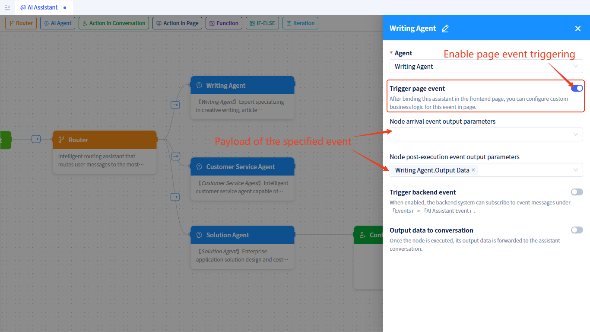
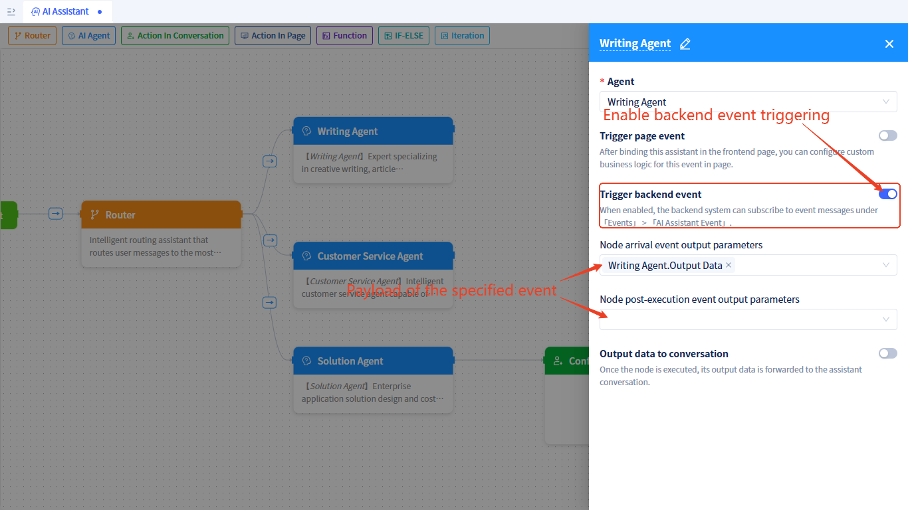

# AI Assistant Events

AI assistants trigger various types of events during execution, which can be subscribed to and handled in frontend workspaces and backend business logic, enabling more flexible process control and user interaction.

## Event Type Overview {#event-type-overview}
AI assistants support the following main event types:
- **Node Execution Events**: Triggered when nodes are reached and after execution is completed
- **Tool Call Events**: Triggered before and after AI Agent uses tools
- **Chat Area Human-Machine Interaction Events**: Triggered by user confirmation operations in the assistant chat area
- **Workspace Human-Machine Interaction Events**: Triggered when the assistant runs to a workspace human-machine interaction node

## Frontend Workspace Events {#frontend-workspace-events}
Frontend workspace events are mainly used for page UI state updates and user interaction handling. 

### Node Execution Events {#node-running-events}
AI Agent nodes, function call nodes, conditional branch nodes, and multi-task execution nodes can trigger workspace events when they are reached and after execution. The prerequisite is that workspace event triggering needs to be enabled, as shown below:

After binding the assistant in a page, you can subscribe to node execution events. For subscription methods, see [Subscribing to Node Execution Events in Pages](../using-ai-in-portals-and-pages/using-ai-assistants-in-component-pages#subscribe-node-running-events)

### Tool Call Events {#agent-call-tool-events}
For AI Agent nodes, if tools are used during Agent execution, workspace events will also be triggered before and after tool calls. The prerequisite is that the Agent needs to [enable tool trigger events](../ai-agent/agent-tools#tool-function-call-pre-post-event-triggering).

Tool call events carry parameters of dictionary (JitDict) type with the following attributes:
- **toolName**: Tool name, such as "services.ASvc.func1". In event handling logic, developers need to handle accordingly based on the tool name.
- **toolType**: Tool type, with optional values: model-model function, service-service function, ui-page function, mcp-MCP service, externalApi-external API
- **args**: Parameters. If it's a pre-tool-call event and "Include data in event messages" is enabled, args contains the tool's input parameters; if it's a post-tool-call event and "Include data in event messages" is enabled, args contains the tool's return value.

After binding the assistant in a page, you can subscribe to tool call events. For subscription methods, see [Subscribing to Tool Events in Pages](../using-ai-in-portals-and-pages/using-ai-assistants-in-component-pages#subscribe-call-tool-events)

### Chat Area Human-Machine Interaction Events {#chat-area-human-machine-interaction-events} 
When the process runs to a chat area human-machine interaction node, the dialog will display confirmation operation buttons such as `Agree`, `Reject`, `Edit`, `Reply`, and custom buttons.
After the user performs confirmation operations or clicks custom buttons, workspace events will be triggered; the events carry parameters that are the data displayed on the node.

After binding the assistant in a page, you can subscribe to these events. For subscription methods, see [Subscribing to Chat Area Human-Machine Interaction Events in Pages](../using-ai-in-portals-and-pages/using-ai-assistants-in-component-pages#subscribe-chat-area-human-events)

### Workspace Human-Machine Interaction Events {#workspace-human-machine-interaction-events} 
When the process runs to a workspace human-machine interaction node, an assistant pause event will be triggered, which carries the parameters configured on the node.

After binding the assistant in a page, you can subscribe to assistant pause events. For subscription methods, see [Subscribing to Workspace Human-Machine Interaction Events in Pages](../using-ai-in-portals-and-pages/using-ai-assistants-in-component-pages#subscribe-workspace-human-events)

## Backend Business Events {#backend-business-events}
Backend business events are mainly used for business logic processing, data persistence, and system integration.

### Node Execution Events {#backend-node-events}
AI Agent nodes, function call nodes, conditional branch nodes, and multi-task execution nodes can trigger backend events when they are reached and after execution. The prerequisite is that backend event triggering needs to be enabled, as shown below:

For how to subscribe to node execution events in the backend, refer to: [AI Assistant Events](../business-logic-development/event-handling#ai-assistant-events)

### Tool Call Events
For AI Agent nodes, if tools are used during Agent execution, backend events will also be triggered before and after tool calls. The prerequisite is that tools need to enable [trigger events](../ai-agent/agent-tools#tool-function-call-pre-post-event-triggering).

For how to subscribe to tool call events in the backend, refer to: [Agent Tool Call Events](../business-logic-development/event-handling#agent-tool-call-events)
