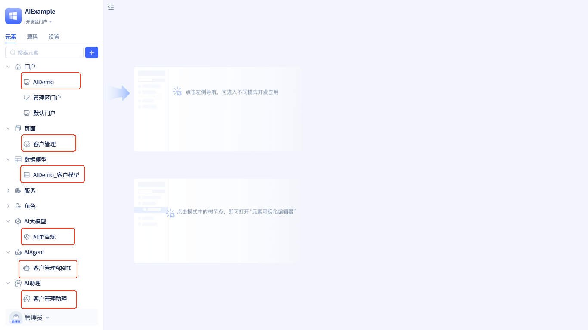
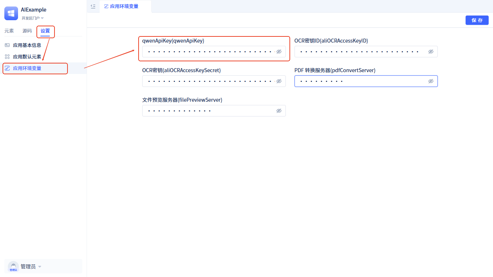
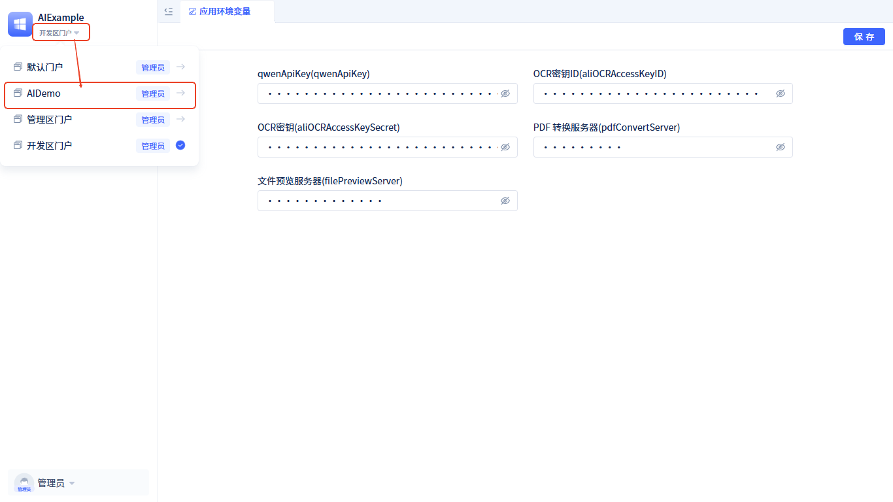

# Example Demo
This example demonstrates how to build an intelligent customer information management assistant that can understand users' natural language instructions and automatically perform CRUD operations on customer information.

**Running Effect Demo**:

**Assistant Process Design**:

- **Customer Management Agent**: AIAgent node responsible for understanding user requirements, determining specific data operation types and content through analyzing user descriptions, and outputting corresponding operation instructions.
- **Data Operation Type Judgment**: Conditional branch node that intelligently determines which processing flow should be executed next based on the operation type output by the Customer Management Agent.
- **Add Data Confirmation**: Chat area human-machine interaction node that displays the data content to be added to users when new data needs to be added, waiting for user confirmation.
- **Add Data**: Function call node that calls the business function for adding customer information, saving the confirmed data to the system. When the **Add Data Confirmation** node receives user approval, the process flows to this node.
- **Modify Data Confirmation**: Chat area human-machine interaction node that displays the modified data content to users when data needs to be modified, waiting for user confirmation.
- **Modify Data**: Function call node that calls the business function for modifying customer information, saving the confirmed modified data to the system. When the **Modify Data Confirmation** node receives user approval, the process flows to this node.
- **Delete Data Confirmation**: Workspace human-machine interaction node that pops up a delete confirmation dialog on the frontend page when data needs to be deleted, waiting for user operation.
- **Delete Data**: Function call node that calls the business function for deleting customer information, executing the data deletion operation. When the user clicks the `Delete` button in the confirmation box of **Delete Data Confirmation**, the system sends a "delete" instruction, and then the process flows to this node.

When users need to query data, the **Customer Management Agent** will directly trigger the customer list query function in the frontend page, so there is no need to separately reflect query operations in the process.

**Example Source Code Acquisition and Configuration**

Download address: <a href="https://jit-www.oss-accelerate.aliyuncs.com/AIDemo.zip">Demo Example Source Code</a>

**Source Code Import Steps**:

1. Enter the IDE development environment and switch to `Source Code` mode
2. Click ` + ` -> `Import Folder`, select the downloaded example source code for import
3. After import is complete, switch to the `Elements` view to see the following content:

If the element list is not displayed, please refresh the page to reload.

**Environment Configuration**:

This example uses the qwen-max-latest large model from Alibaba Cloud Bailian platform. You need to first <a href="https://bailian.console.aliyun.com/?tab=model#/api-key" target="_blank">apply for an API Key</a>, then configure it in the application environment variables:

1. Open `Settings` -> `Application Environment Variables`
2. Update the obtained API Key to the `qwenApiKey` variable
3. Save the configuration

**Running the Demo**:

After configuration is complete, enter the `AIDemo` portal to experience the complete customer information management assistant functionality.

