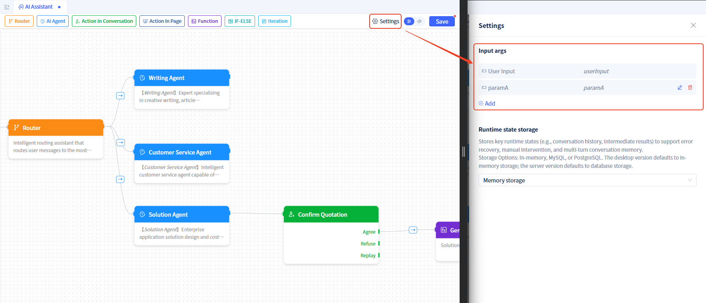
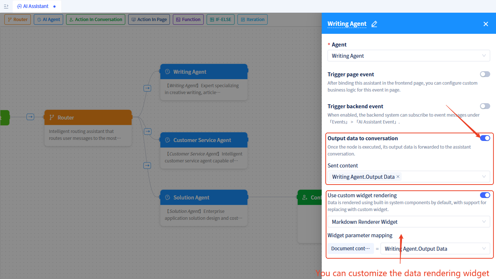

# AI Assistant Input and Output

## Input Parameters {#input-parameters}
Each assistant has a fixed input parameter: user input (userInput). In addition, you can customize other input parameters. These parameters need to be assigned values when using the assistant.
The setup steps are as follows:

Click the `Settings` button in the upper right corner of the process editor to open the settings window and add input parameters.

If the assistant has custom input parameters configured, these parameters need to be assigned values when [using AI assistants in portals or pages](../using-ai-in-portals-and-pages).

## Output Content {#message-output}

### Runtime Process Log Output
When [using AI assistants in portals or pages](../using-ai-in-portals-and-pages), you can specify the assistant to output runtime process log content with the following options:
- **Output Brief Process Logs**: Will not output assistant runtime process logs, and the large model in Agent nodes will only output simple runtime process logs. This mode has relatively simple output content and relatively faster execution.
- **Output Detailed Process Logs**: Outputs assistant runtime process logs, and the large model in Agent nodes will output detailed runtime processes and tool call logs. The logs output in this mode can be used for observation and debugging, but the execution process is relatively slower, so please choose carefully.
- **No Process Log Output**: Will not output runtime process logs.

### State Data Output
By configuring **Output Data to Dialog** on nodes, when the node runs, the specified [state data](./ai-assistant-state) will be sent to the dialog's reply area. Nodes that support this configuration include: AIAgent nodes, function call nodes, conditional branch nodes, and multi-task execution nodes.
The output data will use built-in controls for rendering by default, and you can also **use [custom controls](../frontend-ui-customization/custom-controls) for rendering**.

The configuration method is as follows:

### Chat Area Human-Machine Interaction Node Output
The **Data to Display** configured in [chat area human-machine interaction nodes](./process-orchestration-node-configuration#dialog-human-machine-interaction) will be output in the assistant dialog.

### Workspace Human-Machine Interaction Node Output
The **Operation Prompts** configured in [workspace human-machine interaction nodes](./process-orchestration-node-configuration#workspace-human-machine-interaction) will be output in the assistant dialog.

