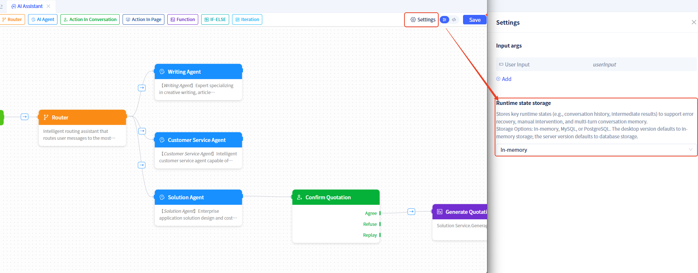

# AI Assistant Runtime State

Runtime state data is the "memory bank" during AI assistant process execution, storing all data generated by nodes. This data can be used by any node throughout the process, sent to the assistant dialog for display, and used for error recovery, human intervention, and multi-turn conversation memory.

## State data storage repository {#state-data-storage-repository}
We need to configure a persistent storage repository for it, with the following options:
- **In-memory**: Fast speed, but data is lost after restart, suitable for development and testing.
- **Relational Database**: Data persistence, supports complex queries, more powerful functionality, suitable for production environments. Currently supports [MySQL database](../data-modeling/manage-database-connections) and [PostgreSQL database](../data-modeling/manage-database-connections).

If not configured, the desktop version will use memory storage by default, and the service version will use the built-in database (MySQL) for storage.

The setup steps are as follows:

Click the `Settings` button in the upper right corner of the visual editor to open the settings window and configure the **Runtime state storage**.

## Runtime state data content {#state-data-content}
Runtime state data includes the following categories:
- **User Input**: Messages sent by users and custom parameters
- **Node Output**: Result data after each node execution
- **Intermediate Variables**: Process control data such as loop indices and loop items
- **User Feedback**: User operation results during human-machine interaction

## Data usage methods {#data-usage-methods}
Multiple usage scenarios for runtime state data in AI assistant processes:

- **Node Configuration**: Select data as input args when configuring nodes
- **Conditional Judgment**: Make judgments based on data values in conditional branches
- **Loop Processing**: Iterate through array-type data in loop nodes
- **Data Display**: Display data to users in chat areas or workspaces
- **Event Passing**: Pass as parameters to other components when events are triggered

## Data flow {#data-flow}
The data flow in AI assistants follows a clear pattern, with data being passed and accumulated between nodes, forming a complete execution context.

### Data input phase {#data-input-phase}
1. **User Input**: Messages sent by users are passed in as `userInput` parameters
2. **Custom Parameters**: Other input args configured through advanced settings
3. **Initial Data**: All input data is stored in runtime state for use by subsequent nodes

### Inter-node data transfer {#inter-node-data-transfer}
1. **Router Node**: Receives user input messages and passes them to the large model for content analysis

2. **AIAgent Node**: Reads input args from runtime state, passes them to the bound Agent for task processing, and stores the Agent's return results in runtime state.

3. **Function Node**: Reads function parameters from runtime state, passes them to the bound function, and stores the function's return value in runtime state.

4. **Action in page Node**: Reads data that needs to be displayed from runtime state, waits for user operations and input, and stores user operation results in runtime state.

