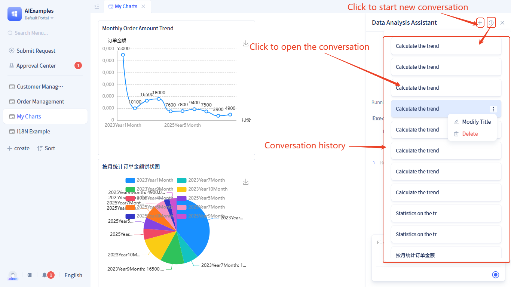

# Chat History

Chat history serves as the AI assistant's "complete memo" 📝, recording the content and status of each interaction, enabling the AI to provide more accurate responses based on historical context. Different chat histories are isolated from each other, ensuring accuracy and continuity of communication.

## Creating and managing conversations {#creating-and-managing-conversations}

- **New Conversation**: Click the ` + ` button in the top-right corner of the dialog box to start a new conversation
- **Auto-save**: Automatically saves after sending the first message, using the first 20 characters as the title
- **Modify Title**: Manually rename conversation titles
- **Delete Conversation**: Remove unwanted conversation records

## Using historical conversations {#using-historical-conversations}

### Basic operations {#basic-operations}
1. **View History**: Click on conversations in the left-side history list to select them
2. **Continue Conversation**: Ask questions directly in historical conversations, with AI responding based on that conversation's context
3. **Switch Conversations**: Switch to other conversations at any time, with each conversation's context being independent

### Use cases {#use-cases}
- Maintain continuity in long-term project discussions
- Review previous solutions and approaches
- Quickly switch between different topics without losing context
