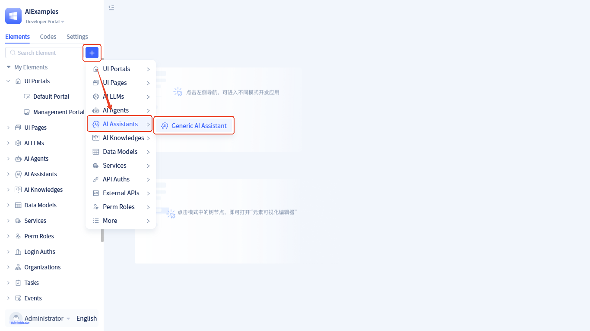
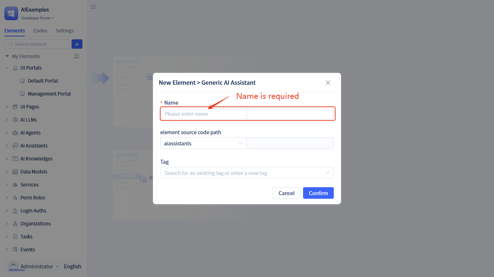

# Creating AI Assistant Elements

AI Assistant is an intelligent workflow system based on visual process orchestration that can understand users' natural language instructions and automatically execute complex business processes. It builds intelligent workflows through drag-and-drop operations, enabling human-machine collaborative intelligent applications without writing code.

## Creating AI assistant {#creating-ai-assistant}

The creation method is as follows:

Click +  → **AI Assistants** → **Generic AI Assistant**, open the assistant information form, fill out the form and click the `Confirm` button to create the assistant.

In the popup window, enter the **Name**, then click **Confirm** to complete creation. After creation is complete, the [Visual Orchestration](./process-orchestration-node-configuration) page will automatically open.

:::tip Naming Suggestions
- Use meaningful names, such as "Customer Service Assistant", "Order Processing Assistant"
- Avoid overly simple names, such as "Assistant 1", "Test Assistant"
- Names should reflect the assistant's main functionality or application scenario
:::

## AI assistant design principles {#ai-assistant-design-principles}

### Visual orchestration design {#visual-orchestration-design}

**[Visual Orchestration Design](./process-orchestration-node-configuration)**:
AI Assistant adopts the design concept of visual process orchestration, building complex business processes through intuitive drag-and-drop operations. This design lowers the development threshold, allowing business personnel to participate in AI application construction, achieving a "low-code" AI application development model.

### State-driven data flow {#state-driven-data-flow}

**[State-Driven Data Flow](./ai-assistant-state)**:
The entire system is centered around runtime state data, with data being passed and accumulated between nodes, forming a complete execution context. The data flow follows a clear pattern of "Input → Process → Output → Store", ensuring continuity and traceability of information in the process, supporting complex multi-turn conversations and state persistence.

### Event-driven extensibility {#event-driven-extensibility}

**[Event-Driven Extensibility](./ai-assistant-event)**:
Through a comprehensive event system, AI Assistants can flexibly integrate with frontend pages and backend business logic, supporting complex business scenarios and customization requirements. The event system enables AI Assistants to seamlessly integrate with existing systems, achieving true enterprise-level AI applications.
