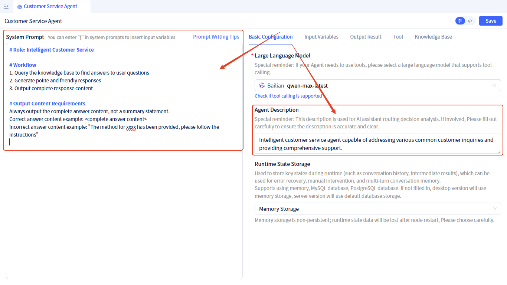

# Developing Conversational Multi-Task AI Assistant

This article demonstrates how to develop a conversational multi-task AI assistant through a comprehensive example that integrates content optimization, intelligent customer service, and system quotation capabilities. Complete sample source code is provided at the end of the article.

## Demo

import VideoPlayer from '@site/src/components/VideoPlayer';

<VideoPlayer relatePath="/docs/ai-multi-task-demo/multi_task_demo_en.mp4" />

## Development Steps

### Writing Agent

Create an AI Agent named **Writing Agent**. For the creation process, refer to: [Creating AI Agent](/docs/devguide/ai-agent/create-ai-agent).

After creation, configure the following:
- **Large Language Model**: Configure a [large language model](/docs/devguide/ai-llm/create-ai-llm) for the Agent
- **Agent Description**: "Expert specializing in creative writing, article composition, and content optimization."
- **Agent Prompt**:
```markdown
# Capabilities
1. Create content according to user requirements
2. Assist clients with article content optimization
```


### Customer Service Agent

Create a knowledge base element named **Customer Service Knowledge**. For the creation process, refer to: [Creating Knowledge Base](/docs/devguide/knowledge-base/create-knowledge-elements).

After creation, add <a href="https://jit-www.oss-accelerate.aliyuncs.com/docs/ai-multi-task-demo/customer-service-knowledge-en.md">Customer Service Knowledge Examples</a>. For the addition method, refer to: [Knowledge Base Document Management](/docs/devguide/knowledge-base/knowledge-base-document-management).

Create an AI Agent named **Customer Service Agent**. For the creation process, refer to: [Creating AI Agent](/docs/devguide/ai-agent/create-ai-agent).

After creation, configure the following:
- **Large Language Model**: Configure a [large language model](/docs/devguide/ai-llm/create-ai-llm) for the Agent
- **Agent Description**: "Intelligent customer service agent capable of addressing various common customer inquiries and providing comprehensive support."
- **Agent Prompt**:
```markdown
# Role: Intelligent Customer Service

# Workflow
1. Query the knowledge base to find answers to user questions
2. Generate polite and friendly responses
3. Output complete response content

# Output Content Requirements
Always output the complete answer content, not a summary statement.
Correct answer content example: <complete answer content>
Incorrect answer content example: "The method for xxxx has been provided, please follow the instructions"

```


- **Knowledge Base**: Add **Customer Service Knowledge** as the knowledge base for this Agent. For the addition method, refer to [Adding Knowledge Base to Agent](/docs/devguide/ai-agent/agent-knowledge-base)


### Solution Agent
Create a knowledge base element named **Quotation Knowledge**. For the creation process, refer to: [Creating Knowledge Base](/docs/devguide/knowledge-base/create-knowledge-elements).

After creation, add <a href="https://jit-www.oss-accelerate.aliyuncs.com/docs/ai-multi-task-demo/quotetion-knowledge-en.md">Quotation Knowledge Examples</a>. For the addition method, refer to: [Knowledge Base Document Management](/docs/devguide/knowledge-base/knowledge-base-document-management).

Create an AI Agent named **Solution Agent**. For the creation process, refer to: [Creating AI Agent](/docs/devguide/ai-agent/create-ai-agent).

After creation, configure the following:
- **Large Language Model**: Configure a [large language model](/docs/devguide/ai-llm/create-ai-llm) for the Agent
- **Agent Description**:
```text
Enterprise application solution design and cost estimation expert, developing solutions and quotations for enterprise application systems across various industries. Core areas include but are not limited to: Management Information Systems (such as OA, ERP, CRM) and Manufacturing Execution Systems (such as MES), specializing in cross-system integration, data collection and monitoring, and other complex scenarios.
```
- **Agent Prompt**:
```markdown
# Role: IT System Solution Expert
Possessing project management, cost accounting, and industry-specific professional knowledge, developing solutions and quotations for IT projects and application systems to support the company in winning projects and ensuring profitability.

## Workflow
1.  **Deconstruct Project Requirements**: Carefully analyze documents provided by clients such as tender documents, requirement specifications, technical proposals, etc., clarifying project scope, technical implementation approaches, functional module divisions, and delivery standards.
2.  **Workload Estimation**: Comprehensively apply various methods (such as analogy method, function point estimation, three-point estimation, WBS decomposition method) for resource input estimation, and collaborate with technical teams to assess complexity and risks.
3.  **Cost Accounting**: Query the quotation knowledge base to precisely calculate labor, direct (software/hardware, third-party services), and indirect costs, ensuring a solid quotation foundation.
4.  **Pricing and Solution Design**: Based on costs, profit targets, and market conditions, develop competitive pricing and diversified quotation strategies.
5.  **Prepare Quotation**: Write professional, clear, and comprehensive quotation documents, clearly defining scope and assumptions to mitigate future risks.
6. **Output Quotation Content**: Output the complete quotation document.

## Quotation Writing Guidelines (Customer-Facing)
The output content is professional quotation content that can be directly used in Word documents. Core requirements are: **professional language, clear structure, value-oriented, transparent details**.

**I. Project Overview and Construction Objectives**
*   **Opening Introduction**: Start from the client's industry background and business development perspective, elaborating on the importance and urgency of initiating this project.
*   **Current Status and Challenges**: In a professional and neutral tone, describe the efficiency bottlenecks, technical obstacles, or market opportunities existing in current business operations, naturally leading to the necessity of project implementation. For example: "The current system faces challenges in data processing efficiency and business support capabilities. To support future business growth, there is an urgent need to build a new generation of..."
*   **Project Vision and Objectives**: Clearly articulate the core business value and technical objectives expected to be achieved after successful project implementation, such as: aiming to improve operational efficiency, enhance customer experience, and open new revenue channels. This section should be persuasive, helping clients recognize the value of the project.

**II. Technical Solution and Implementation Method**
*   **Implementation Methodology**: Explain the planned project management approach (such as agile iteration, waterfall model) and briefly explain how this approach ensures project success.
*   **Technical Architecture Selection**: Introduce the core technical architecture design and selected main technical platforms, software/hardware products (key product models and versions can be listed), reflecting technical advancement and reliability.
*   **Work Scope Definition**:
    *   **Included Service Scope**: Detail and professionally list all work content to be provided in this project, such as: in-depth business requirement research, system architecture design, application software development, hardware equipment supply and debugging, system integration, data migration, user training, go-live support, etc.
    *   **Responsibility Boundaries and Assumptions**: Clearly list prerequisite conditions to be provided by the client (such as venue, power, network) and work outside the scope of this project (such as third-party interface development not covered by this system, free operation and maintenance after project acceptance, etc.), to ensure mutual understanding and effectively manage scope creep.

**III. Quotation Details**
*   **Format Requirements**: Must use clearly structured tables for presentation, output all costs in one table, do not split into multiple tables.
*   **Detail Level**: Quotation needs to be broken down to traceable minimum units, avoid package pricing, reflecting reasonableness and transparency.
*   **Cost Composition**:
    *   **Consulting Service Fee**: Fees for preliminary consulting and analysis work.
    *   **Software Development Fee**: Detailed listing by core functional modules or daily unit price × workload.
    *   **Hardware Equipment Fee**: List all equipment names, models, key configurations, quantities, unit prices, and total prices in inventory format.
    *   **Software License Fee**: License fee inventory for commercial software such as operating systems, databases, middleware, etc.
    *   **Implementation and Integration Fee**: System deployment, configuration, data migration, integration testing, etc.
    *   **Training Fee**: Training course design and execution fees.
    *   **Technical Service and After-sales**: Clearly specify service content and corresponding fees within the warranty period (such as one year).
*   **Tax Explanation**: Independent section clearly listing pre-tax total price, applicable tax rate (such as VAT 6% or 13%), tax amount, and total amount including tax.

## Special Important Regulations
- In the cost composition of quotation details, software development fees must be detailed by listing which functional modules, the workload and fees required for each functional module, do not use a single total fee.
- In the cost composition of quotation details, hardware equipment fees must be detailed by listing which equipment, the quantity, unit price and total price of each equipment, do not use a single total fee.

## Output Requirements
Output complete quotation content, not a summary statement.

```


- **Knowledge Base**: Add **Quotation Knowledge** as the knowledge base for this Agent. For the addition method, refer to [Adding Knowledge Base to Agent](/docs/devguide/ai-agent/agent-knowledge-base).


### Developing AI Assistant

Develop an AI assistant with the following process design:


**Process Architecture**:
1. **Start Node** → **Routing**: Start the process and distribute tasks
2. **Routing** → **Three AI Agent Nodes**: Intelligently route to corresponding professional Agents based on user needs
   - **Writing Agent**: Handle content optimization related tasks. Node configuration as follows:
     - Bind Writing Agent
     - Send Writing Agent output content to assistant dialog
     - Use Markdown control to render output content


   - **Customer Service Agent**: Handle customer inquiries and problem solving. Node configuration as follows:
     - Bind Customer Service Agent
     - Send Customer Service Agent output content to assistant dialog
     - Use Markdown control to render output content

   - **Solution Agent**: Analyze requirements and generate quotation content. Node binds Solution Agent.


3. **Solution Agent** → **Confirm Quotation** ([Dialog Human-Machine Interaction Node](/docs/devguide/ai-assistant/process-orchestration-node-configuration#action-in-conversation)): Wait for manual confirmation after quotation completion.
The Confirm Quotation node displays the quotation file content output by the Solution Agent, using Markdown control for rendering.


4. **Confirm Quotation** → **Generate Quotation** (`Function Node`): 

Generate Quotation node configuration as follows:
- Bind Service: `Solution Service.Generate Quotation`
- Send quotation file attachment to assistant dialog


After confirmation, pass in quotation file content and automatically generate Word quotation file.


### Implementing Generate Quotation Function

Create a service named **Solution Service**. For the creation method, refer to: [Creating Service Elements](/docs/devguide/business-logic-development/creating-service-elements).

Create a new function named **Generate Quotation** (generateQuotation) in this service, accepting one parameter: **Quotation Content** (quotationContent). This function will generate a Word file based on the quotation file content and return Word file information. For the function creation method, refer to: [Creating Service Functions](/docs/devguide/business-logic-development/creating-service-elements#create-service-functions).

Service source code as follows:
```python
import io
import hashlib
import re
from datetime import datetime
from docx import Document
from docx.shared import Inches, Pt
from docx.enum.text import WD_ALIGN_PARAGRAPH
from docx.enum.style import WD_STYLE_TYPE
from services.NormalType import NormalService

class SolutionSvc(NormalService):

    def generateQuotation(self, quotationContent: str) -> str:
        """
        Generate quotation file as a Word document, supporting Markdown format
        
        Args:
            quotationContent (str): Quotation content in Markdown format
            
        Returns:
            str: Uploaded file information, including file URL and other information
        """
        try:
            # Create new Word document
            document = Document()
            
            # Set document styles
            self._setup_document_styles(document)
            
            # Parse Markdown content and convert to Word format
            self._parse_markdown_to_word(document, quotationContent.value)
            
            # Convert Document object to binary data
            doc_buffer = io.BytesIO()
            document.save(doc_buffer)
            doc_binary_data = doc_buffer.getvalue()
            doc_buffer.close()
            
            # Generate file name
            timestamp = datetime.now().strftime("%Y%m%d_%H%M%S")
            file_name = f"Quotation_{timestamp}.docx"
            
            # Upload file with 30-day expiration
            file_info = self.uploadByFile(
                file_name, 
                data=doc_binary_data, 
                contentType="application/vnd.openxmlformats-officedocument.wordprocessingml.document"
            )
            
            return [file_info]
            
        except Exception as e:
            error_msg = f"Error occurred while generating quotation: {str(e)}"
            print(error_msg)
            return [{"error": error_msg}]
    
    def _setup_document_styles(self, document):
        """Set up document styles"""
        styles = document.styles
        
        # Set heading styles
        for i in range(1, 7):
            try:
                heading_style = styles[f'Heading {i}']
            except KeyError:
                heading_style = styles.add_style(f'Heading {i}', WD_STYLE_TYPE.PARAGRAPH)
            
            if i == 1:
                heading_style.font.size = Pt(18)
                heading_style.font.bold = True
            elif i == 2:
                heading_style.font.size = Pt(16)
                heading_style.font.bold = True
            elif i == 3:
                heading_style.font.size = Pt(14)
                heading_style.font.bold = True
            else:
                heading_style.font.size = Pt(12)
                heading_style.font.bold = True
    
    def _parse_markdown_to_word(self, document, markdown_content):
        """Parse Markdown content and convert to Word format"""
        lines = markdown_content.split('\n')
        i = 0
        
        while i < len(lines):
            line = lines[i].strip()
            
            if not line:
                i += 1
                continue
            
            # Handle headings
            if line.startswith('#'):
                level = len(line) - len(line.lstrip('#'))
                title_text = line.lstrip('#').strip()
                if title_text:
                    heading = document.add_heading(title_text, level=min(level, 6))
                    heading.style = f'Heading {min(level, 6)}'
            
            # Handle tables
            elif line.startswith('|') and '|' in line[1:]:
                table_data = self._parse_table(lines, i)
                if table_data:
                    self._create_table(document, table_data)
                    i += len(table_data) - 1
            
            # Handle lists
            elif line.startswith(('-', '*', '+')) or re.match(r'^\d+\.', line):
                list_items = self._parse_list(lines, i)
                self._create_list(document, list_items)
                i += len(list_items) - 1
            
            # Handle code blocks
            elif line.startswith('```'):
                code_block = self._parse_code_block(lines, i)
                if code_block:
                    self._create_code_block(document, code_block)
                    i += len(code_block) + 1
            
            # Handle regular paragraphs
            else:
                paragraph = document.add_paragraph()
                self._format_text(paragraph, line)
            
            i += 1
    
    def _parse_table(self, lines, start_index):
        """Parse table data from markdown lines"""
        table_data = []
        i = start_index
        
        while i < len(lines):
            line = lines[i].strip()
            if not line.startswith('|'):
                break
            
            # Skip separator lines
            if re.match(r'^\|[\s\-\|]+\|$', line):
                i += 1
                continue
            
            # Parse table rows
            cells = [cell.strip() for cell in line.split('|')[1:-1]]  # Remove first and last empty elements
            if cells:
                table_data.append(cells)
            
            i += 1
        
        return table_data
    
    def _create_table(self, document, table_data):
        """Create Word table from parsed data"""
        if not table_data:
            return
        
        table = document.add_table(rows=len(table_data), cols=len(table_data[0]))
        table.style = 'Table Grid'
        
        for i, row_data in enumerate(table_data):
            row = table.rows[i]
            for j, cell_data in enumerate(row_data):
                if j < len(row.cells):
                    cell = row.cells[j]
                    cell.text = cell_data
                    # Set table cell styles
                    for paragraph in cell.paragraphs:
                        paragraph.alignment = WD_ALIGN_PARAGRAPH.CENTER
    
    def _parse_list(self, lines, start_index):
        """Parse list items from markdown lines"""
        list_items = []
        i = start_index
        
        while i < len(lines):
            line = lines[i].strip()
            if not line or (not line.startswith(('-', '*', '+')) and not re.match(r'^\d+\.', line)):
                break
            
            list_items.append(line)
            i += 1
        
        return list_items
    
    def _create_list(self, document, list_items):
        """Create Word list from parsed items"""
        for item in list_items:
            # Remove list markers
            if re.match(r'^\d+\.', item):
                text = re.sub(r'^\d+\.\s*', '', item)
                document.add_paragraph(text, style='List Number')
            else:
                text = re.sub(r'^[-*+]\s*', '', item)
                document.add_paragraph(text, style='List Bullet')
    
    def _parse_code_block(self, lines, start_index):
        """Parse code block from markdown lines"""
        code_lines = []
        i = start_index + 1
        
        while i < len(lines):
            line = lines[i]
            if line.strip().startswith('```'):
                break
            code_lines.append(line)
            i += 1
        
        return code_lines
    
    def _create_code_block(self, document, code_lines):
        """Create code block in Word document"""
        code_text = '\n'.join(code_lines)
        paragraph = document.add_paragraph()
        run = paragraph.add_run(code_text)
        run.font.name = 'Courier New'
        run.font.size = Pt(10)
        
        # Set code block background color (gray)
        paragraph.paragraph_format.left_indent = Inches(0.5)
        paragraph.paragraph_format.right_indent = Inches(0.5)
    
    def _format_text(self, paragraph, text):
        """Format text, handling bold, italic, etc."""
        # Handle bold **text** or __text__
        text = re.sub(r'\*\*(.*?)\*\*', r'**\1**', text)
        text = re.sub(r'__(.*?)__', r'**\1**', text)
        
        # Handle italic *text* or _text_
        text = re.sub(r'\*(.*?)\*', r'*\1*', text)
        text = re.sub(r'_(.*?)_', r'*\1*', text)
        
        # Split text and apply formatting
        parts = re.split(r'(\*\*.*?\*\*|\*.*?\*)', text)
        
        for part in parts:
            if part.startswith('**') and part.endswith('**'):
                run = paragraph.add_run(part[2:-2])
                run.bold = True
            elif part.startswith('*') and part.endswith('*'):
                run = paragraph.add_run(part[1:-1])
                run.italic = True
            else:
                paragraph.add_run(part)

    def uploadByFile(
            self, fileName, data=None, contentType="application/octet-stream"
        ):
        # Upload file
        # app is a global variable, no need to import
        storage = app.getElement("storages.Default")
        md5 = hashlib.md5(data).hexdigest()
        resp = storage.uploadByFile(md5, data, contentType)
        row = {
            "uid": md5,
            "name": md5,
            "storeFullName": "storages.Default",
            "uploadTime": datetime.now().strftime("%Y-%m-%d %H:%M:%S"),
            "md5": md5,
            "fileName": fileName,
            "url": resp["url"],
        }
        return row

```

At this point, all components of the assistant have been developed. We can use this assistant in portals. For configuration method, refer to: [Using AI Assistant in Portals](/docs/devguide/using-ai-in-portals-and-pages/using-ai-assistants-in-portals).

:::tip Tip
An AI assistant can handle multiple different types of tasks. It is recommended to enable independent conversation processing flows for each task type.
:::

## Example Source Code

<a href="https://jit-www.oss-accelerate.aliyuncs.com/docs/ai-multi-task-demo/whwy.MultiTaskAssistantDemoEn.0_0_0.zip">Download Complete Sample Source Code</a>.

This example uses the qwen-max-latest large model from Alibaba Cloud Bailian platform. You need to first <a href="https://bailian.console.aliyun.com/?tab=model#/api-key" target="_blank">apply for an API Key</a>, then configure it in the application environment variables:

。


