# Developing Human-AI Collaborative Enterprise Assistant Applications with UI Page Integration

## Product Core Features Overview

Traditional AI development platforms have a fundamental limitation: they can only run on the backend and cannot deeply interact with user interfaces. This is like asking a blind person to do work that requires visual judgment - the results are predictable.

**JitAi's innovative breakthrough** lies in enabling AI to truly "see" and "operate" user interfaces, achieving deep integration and collaboration between AI and UI pages. AI can not only understand user operations on pages but also dynamically adjust its decisions based on user behavior.

**Core Value**: AI handles intelligent decision-making, humans handle quality control, and the interface enables real-time interaction. The perfect combination of these three elements makes AI applications truly practical and reliable.

**Full-stack AI Capabilities**: Breaking through frontend-backend boundaries, enabling AI to truly operate frontend pages with "eyes" and "hands" capabilities.

**Visual Process Orchestration**: Build complex human-AI collaboration workflows through drag-and-drop without writing code.

## Technical Implementation Analysis

### Deep Integration of AI with Frontend

#### Page Data as AI Context

**Technical Principle**: Wrap page functions into tools that AI can call, enabling AI to obtain user operation data in real-time.

**Implementation Method**: Page data directly serves as AI input parameters, with AI obtaining page state through tool invocation.

**Application Value**: AI can dynamically perceive user behavior, intelligently adjust decisions, and achieve true context awareness.

### Human-Machine Collaboration Node Design

#### Dialog Area Human-Machine Interaction Node

**Technical Features**: AI and users engage in multi-turn dialogue communication through dialog boxes.

**Collaboration Mode**: Gradually clarify requirements, resolve issues, and confirm results through dialogue.

**Application Value**: Particularly suitable for requirement clarification and result confirmation scenarios, ensuring AI fully understands user intent.

#### Workspace Human-Machine Interaction Node

**Technical Features**: AI pauses execution and waits for users to complete operations on frontend pages.

**Collaboration Mode**: AI provides suggestions, users make final decisions, achieving expert advisor-style collaboration.

**Application Value**: Particularly suitable for complex business logic requiring human confirmation, such as approval processes and quality checks.

### Event-Driven Collaboration Mechanism

**Technical Implementation**: Pages subscribe to various AI assistant events (execution start, completion, exceptions, etc.).

**Collaboration Flow**: AI executes operations → triggers events → pages respond immediately, achieving real-time synchronization.

**Application Value**: Users can see AI's work status in real-time and understand execution progress.

## Demonstrating Collaboration Features Through AI Grading Case Study

### Case Background and Process

**Business Scenario**: Educational institution teachers need to grade exams, with traditional manual grading being labor-intensive and error-prone.

**Core Requirements**: AI helps teachers with intelligent grading, with key quality control handled by teachers, improving efficiency while ensuring quality.

**Technical Challenge**: How to significantly improve efficiency while ensuring quality? How to enable seamless collaboration between AI and teachers?

**AI Automatic Scoring + Human Review Mode**

**Step 1: AI-Dominated Phase**
The grading Agent automatically scores each question and generates scoring rationale, greatly improving grading efficiency.

**Step 2: Human-Machine Collaboration Node**
After AI grading is complete, the process pauses through the dialog area human-machine interaction node, outputting grading results to the dialog box for teacher confirmation.
If teachers find any score inappropriate, they can continue dialoguing with AI to request re-grading.

**Step 3: UI Page Collaboration**
If teachers find the scores appropriate and confirm, the grading results are automatically updated to the page grading form.

### Effect Demonstration

import VideoPlayer from '@site/src/components/VideoPlayer';

<VideoPlayer relatePath="/docs/ai-grade-demo/demo.mp4" />

## Detailed Development Steps

### Prerequisites

- **Question Bank Table** (questionModel)
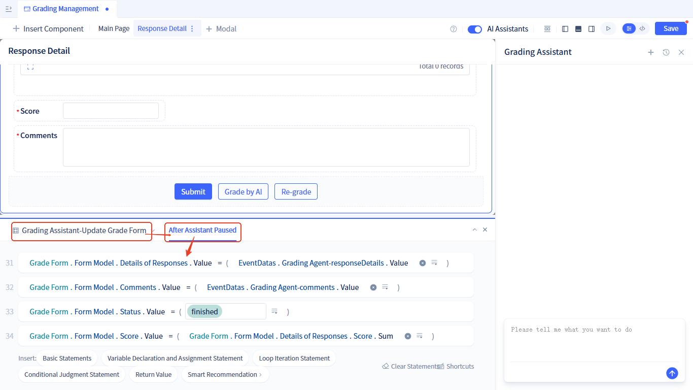

- **Paper Table** (testTable):
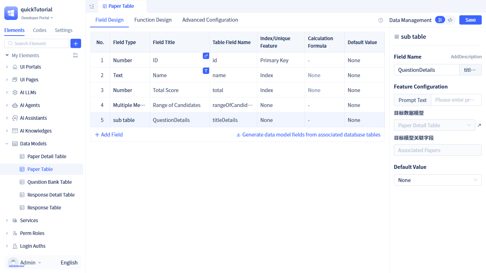

- **Paper Detail Model** (detailedTitleOfTheTestPaper):
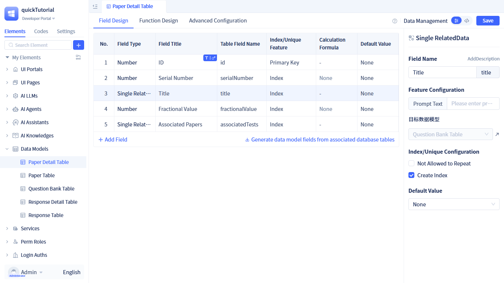

- **Response Table** (responseModel):
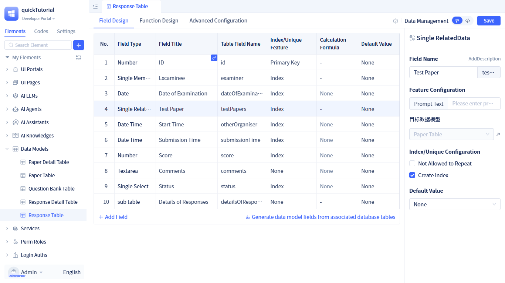

- **Response Detail Table** (responseDetailModel):
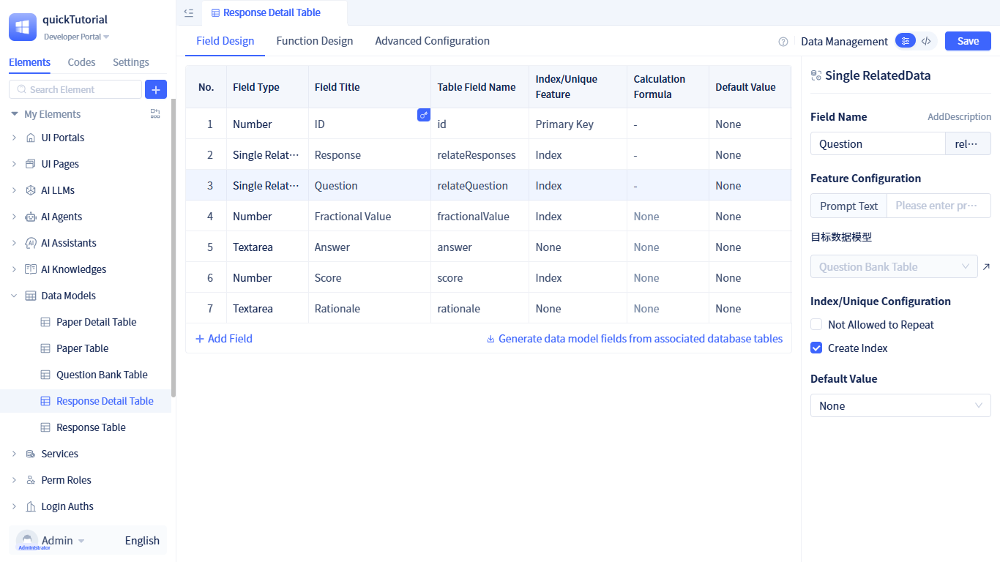

- **Grading Management Page** (bookreadingManagement): Displays candidate answer sheet list, clicking on completed answer sheets opens the grading form, showing exam information, questions, and candidate answers.

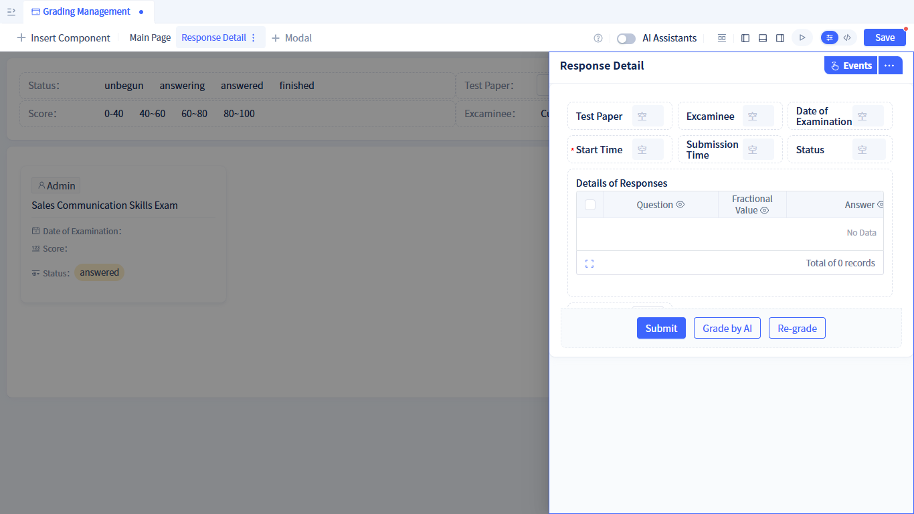

We provide [complete source code](#source-code) for the above data models and page structure, which can be downloaded and used directly.

Next, we'll add AI grading functionality to the Grading Management Page.

### Developing the Grading Agent

The grading Agent's workflow is as follows:
Obtain answer details from the page, score each item, provide scores and rationale and update them to answer details; then provide an overall comment based on the overall scoring situation; finally output answer details with scores and rationale along with the overall comment.

- **Create Grading Agent**: Refer to [Creating AI Agent](../../ai-agent/create-ai-agent) for the creation process. After creation, [configure the large model](../../ai-agent/create-ai-agent#select-model-and-configure-parameters).
- **Write Prompt**:
```markdown
# Role: Grading Expert

# Core Task
Grade candidate responses question by question, providing scores and rationale for each question. If a question is not answered, it receives 0 points. After grading all questions, provide an overall comment.

# Workflow
1. Call the `pages.bookreadingManagement.getVariableValue` tool with parameter 'Form4.formData' to get the value of  exam result, which contains the candidate response information, where `detailsOfResponses` contains the detailed answers.
2. Grade each response detail from step 1 and provide rationale. Grading method: Compare detail's `relateQuestion.standardAnswers` with detail's `answer`, combined with detail's `fractionalValue` to give a fair and objective score, and provide grading rationale. Update the score (score field) and rationale (rationale field) in the response details, return the updated response details
3. Provide an overall comment based on all question responses

# Important Constraints
If any question response violates the following conditions, all question scores will be 0, even if other questions are answered very accurately:
1. Sales scripts must be polite, respectful to customers, and uphold customer-first principles; responses that contain implications or insults to customers are strictly prohibited
2. Promote correct values, avoid sensitive content and content that violates socialist core values
3. Maintain a positive attitude and patience, avoid emotional responses

# Special Requirements for Output Results
- Data should be as simple as possible while meeting requirements
- The primary key ID field value in response details must be the id value from response details, do not construct it yourself
- The relateQuestion field value in response details must be the relateQuestion field value from response details, only need id and problem attributes
- The relateResponses field value in response details must be the relateResponses field value from response details, only need id attribute

# Output Result Example:
{
  "output": [
    {
      "id": 1,
      "relateResponses": {"id": 27},
      "relateQuestion": {"id": 542, "problem": "How are your service fees calculated? Are there flexible payment options?"},
      "fractionalValue": 20,
      "answer": "Monthly payment",
      "score": 5,
      "rationale": "The answer is too brief, does not explain the fee calculation method and preferential policies in detail, and does not match the core content of the standard answer."
    }
  ],
  "comments": "xxxxx"
}

Note: This is sample data only, not your final return data
```

- **Configure Output Results**: There are two output parameters:
    - responseDetails (output): Multi-row data of the **Response Detail Table**
    - comments (comments): Overall comment on the answer sheet
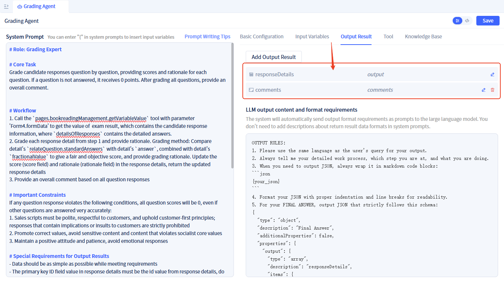

Configuration method reference: [Configure Output Parameters](../../ai-agent/agent-input-output#configure-output-results)

- **Configure Tool Invocation**: Add the **Grading Management Page** - `Get Variable Value` as a tool, through which the Agent obtains answer detail data from the grading form on the page.
Configuration method reference: [Agent Add Page Tools](../../ai-agent/agent-tools#agent-call-page-functions)。

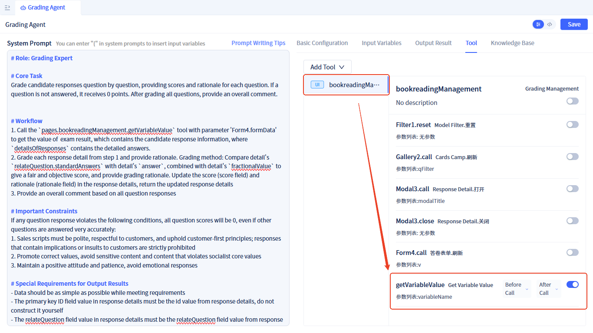


### Developing the Grading Assistant

- **Create Grading Assistant**: Refer to [Creating AI Assistant](../create-ai-assistant) for creation method

- **Orchestrate Assistant Process**:
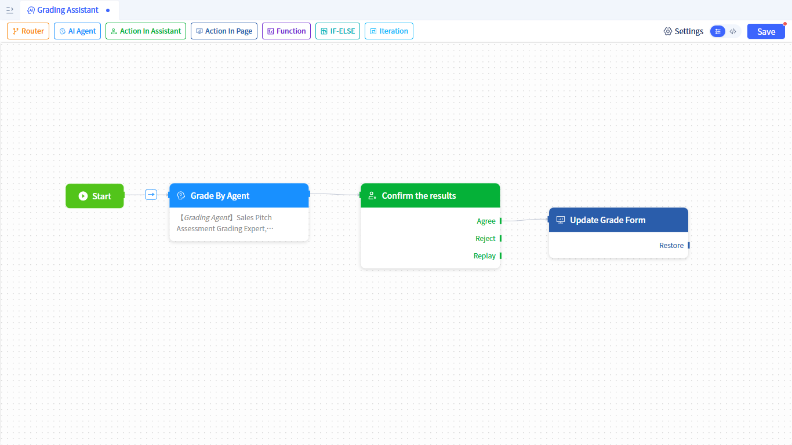

Process steps: `Start` -> `Grading By Agent` -> `Confirm Scores` -> `Update Grading Form`
    - **Grading By Agent**: [AI Agent Node](../process-orchestration-node-configuration#ai-agent), bound to the Grading Agent.
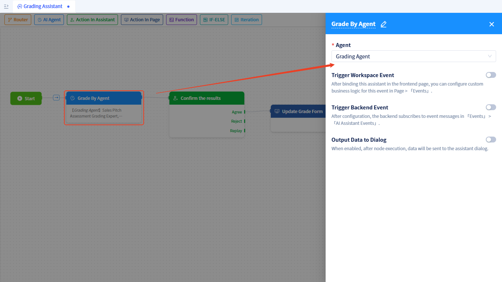
    - **Confirm results**: [Dialog Area Human-Machine Interaction Node](../process-orchestration-node-configuration#dialog-human-machine-interaction), displays answer details and comments output by the grading Agent, waits for human confirmation, then updates the grading form after confirmation.
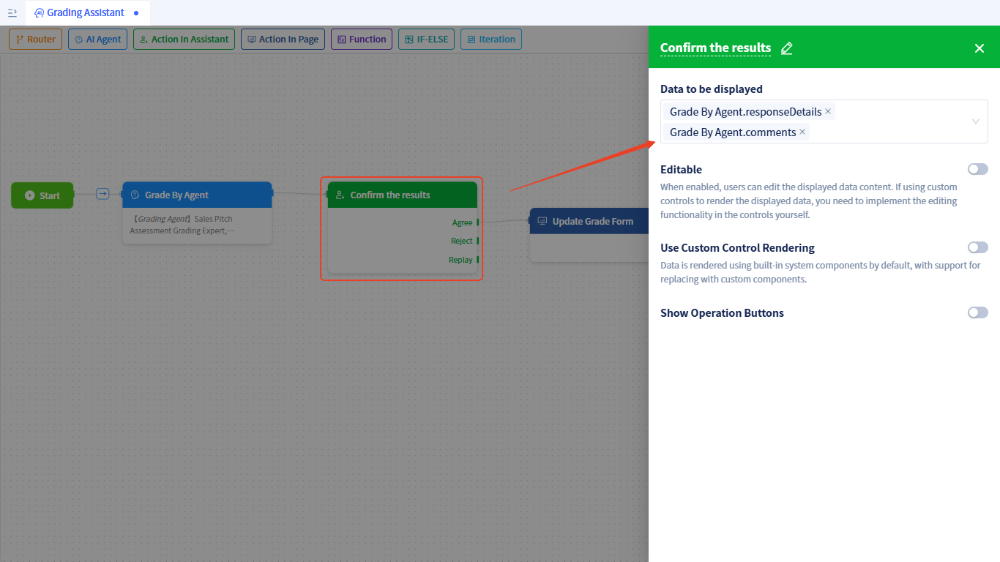
    - **Update Grading Form**: [Workspace Human-Machine Interaction Node](../process-orchestration-node-configuration#workspace-human-machine-interaction), pauses the process and outputs answer details and comments to the page. Set a friendly prompt message to guide users on next steps.

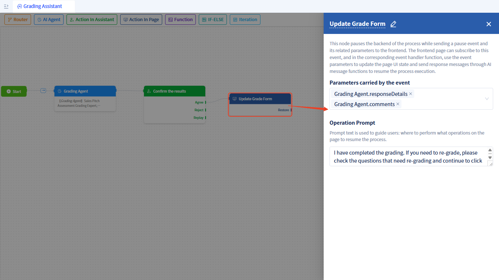

### Using the Grading Assistant on the Grading Page

[Enable AI Assistant](../../using-ai-in-portals-and-pages/using-ai-assistants-in-component-pages#enable-ai-assistant) and bind the grading assistant.

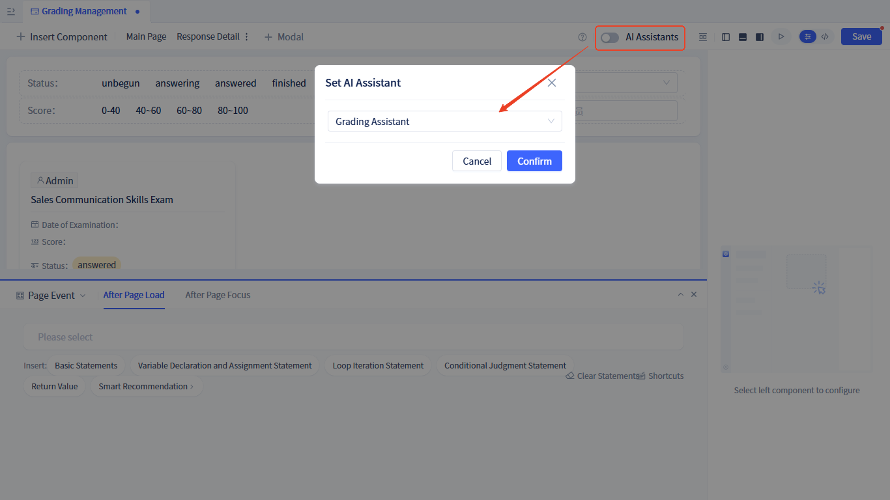

Add an `Grade By AI` button to the grading form, which sends an AI message: 'Grade the current exam paper' when clicked.

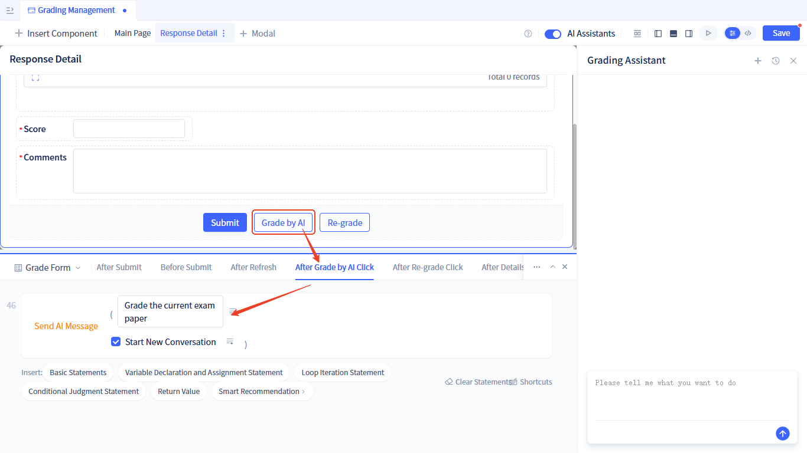

Subscribe to the pause event of the grading assistant - update grading form node, updating the answer details, total score, overall comments, and answer sheet status of the grading form.

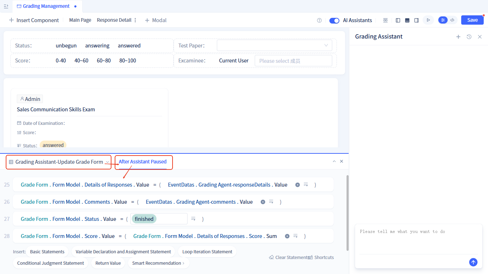


At this point, we have completed the development of the AI grading functionality. Isn't it simple?


### Example Source Code {#source-code}

Download link: <a href="https://jit-www.oss-cn-beijing.aliyuncs.com/docs/ai-grade-demo/whwy.quickTutorialEn.0_0_0.zip">AI Grade Demo Source Code</a>.

Enter the [JitNode Console](../../creating-and-publishing-applications/runtime-environment-management#node-local-default-runtime-environment) and import directly.

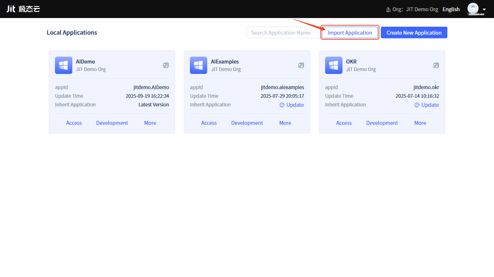