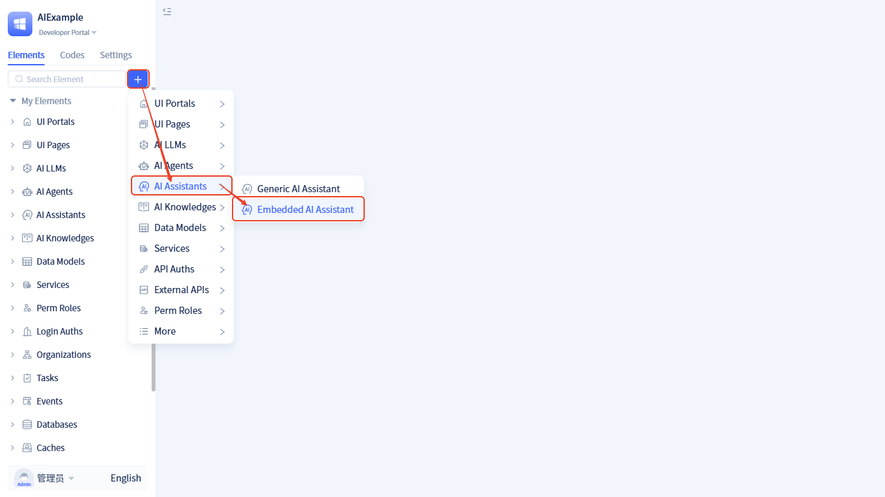
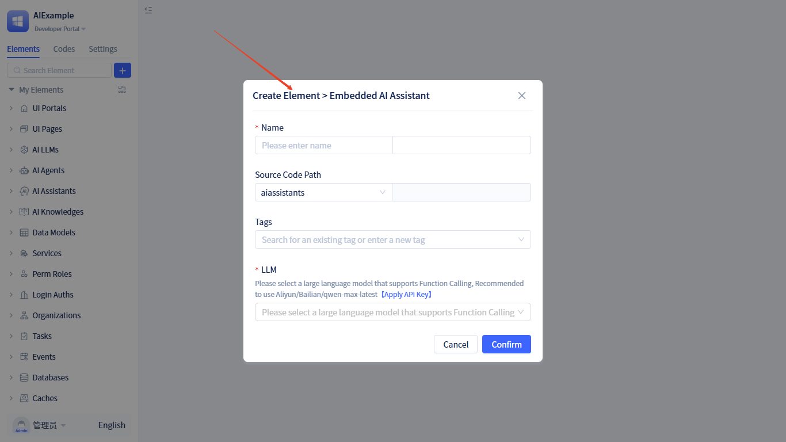
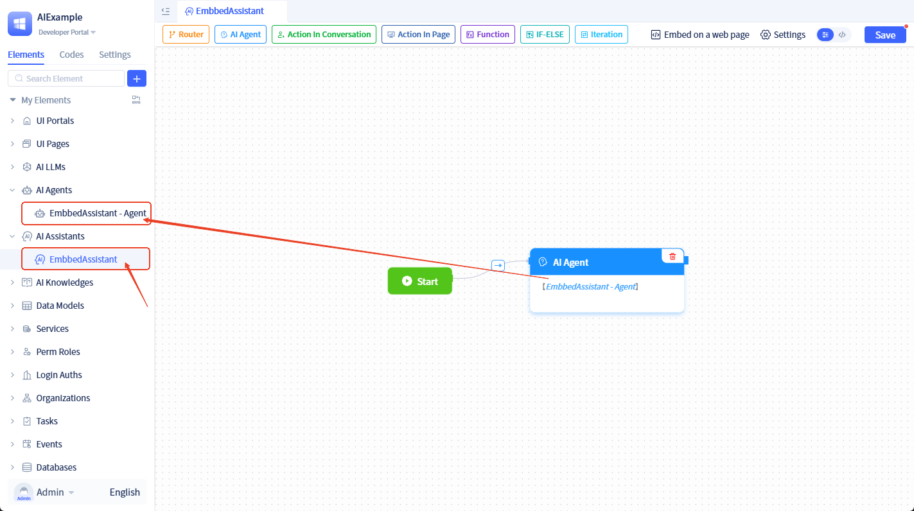
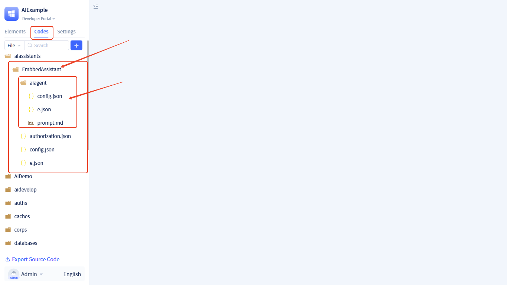
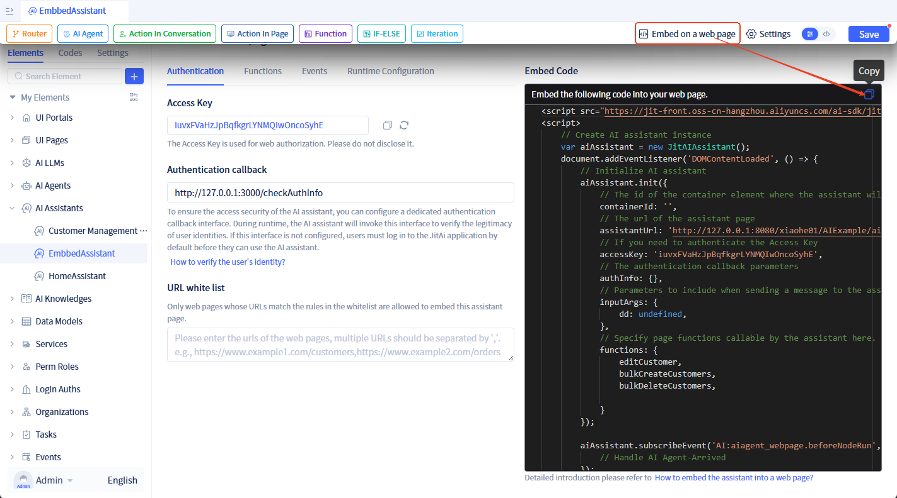
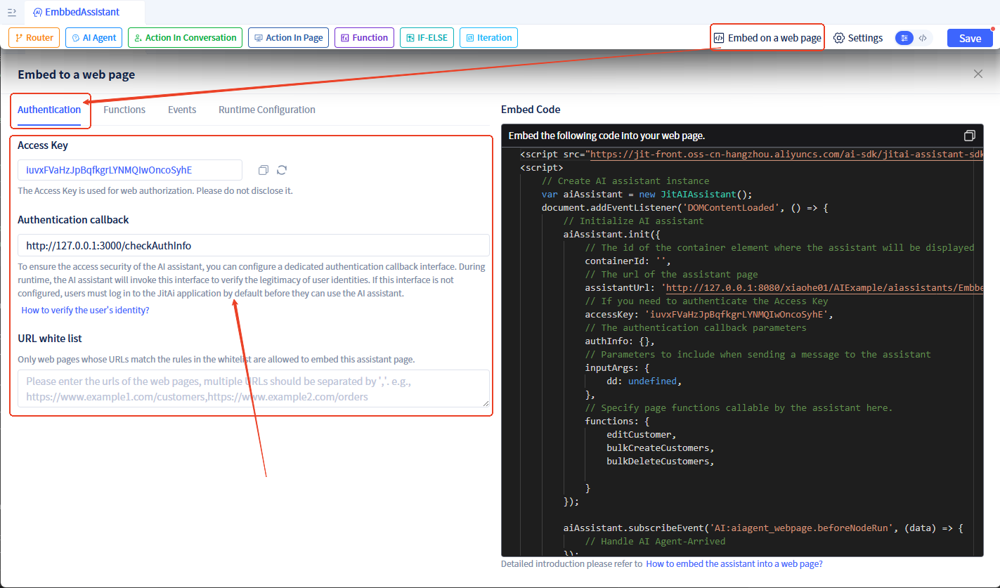
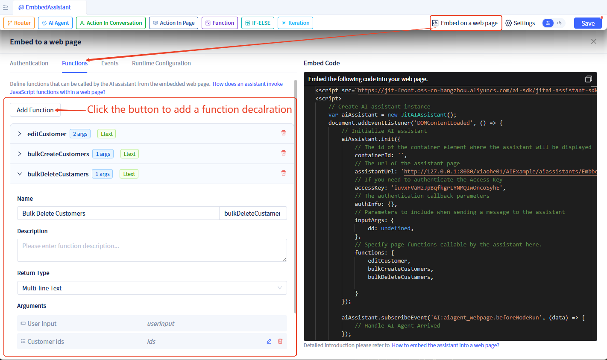
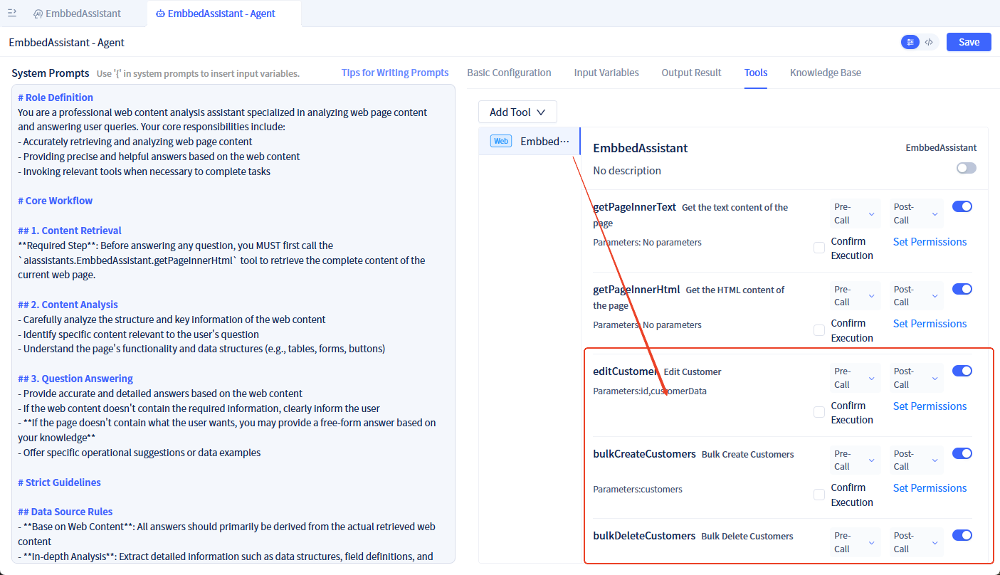
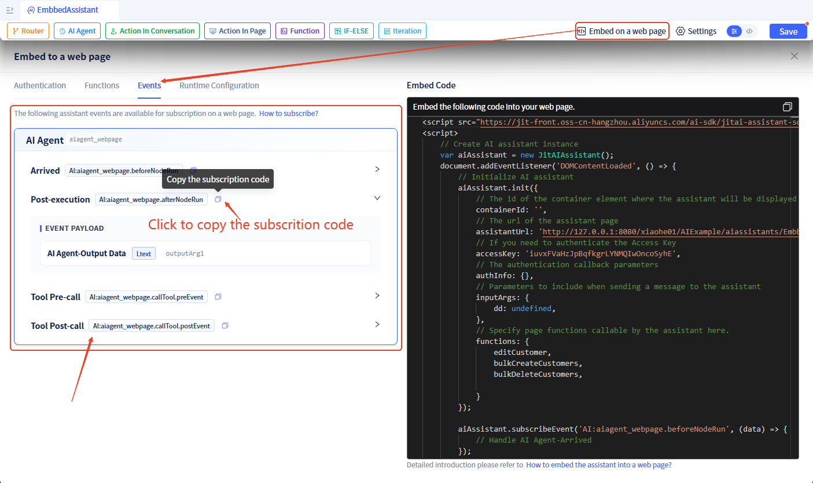

# Embedded AI Assistant

## What is an Embedded AI Assistant {#what-is-embedded-ai-assistant}

In real-world enterprise application scenarios, there is often a need to integrate AI capabilities into existing websites and systems. An embedded AI assistant is an AI assistant that can be embedded into any external web page. Unlike regular AI assistant pages, it is specifically designed for external integration scenarios and supports security features such as cross-origin communication and authorization verification.

## Core Advantages {#core-advantages}

Unlike other AI products on the market, JitAi's embedded AI assistant enables **deep bidirectional interaction between web pages and AI**. Traditional AI products can only handle simple conversational Q&A, while the embedded AI assistant adds two core capabilities on top of that:

1. **AI Controls Web Pages**: The AI assistant can understand conversational intent and proactively invoke functions in the web page (such as submitting forms, deleting data, navigating pages, etc.)
2. **Web Pages Drive AI**: Web pages can actively trigger AI to execute tasks and monitor AI execution processes and results in real-time

**What does this mean?**

Our solution makes AI a true "intelligent operator" of web pages, not just a chat window. For example:
- When a user says "help me delete these 3 customers", the AI can not only understand but also directly invoke the delete function to complete the operation
- When a user clicks the "Intelligent Analysis" button on the web page, the AI immediately starts analyzing data and returns results

This level of deep integration capability is currently unavailable in other AI products on the market.

## Integration Process {#integration-process}

Integrating the AI assistant into an external web page requires only three steps:

1. **Create an Embedded AI Assistant**: Create an AI assistant page specifically for embedding, and obtain the access URL and Access Key
2. **Import and Initialize the SDK in Your Web Page**: Embed the AI assistant into your web page with a few lines of code
3. **Configure Bidirectional Interaction (Optional)**: Configure advanced capabilities such as AI assistant calling web page functions and web pages controlling AI as needed

### Step 1: Create an Embedded AI Assistant Page {#creating-embedded-ai-assistant}

**Creation Steps:**

1. Click <span style={{ background:"#3d65fd", display: "inline-block", borderRadius: "8px", textAlign: "center", lineHeight: "100%", color: "#ffffff", fontSize: "24px", padding: "0px 10px 5px" }}>+</span>  → **AI Assistant** → **Embedded AI Assistant**



2. Fill in the assistant information (assistant name, description, etc.) and click the "Confirm" button to create the assistant



3. After creation is complete, the system will automatically generate:
   - An embedded AI assistant element
   - An [AI Agent element](/docs/devguide/ai-agent/create-ai-agent) (named `{Assistant Name}-Agent`)

The assistant contains an [AI Agent node](/docs/devguide/ai-assistant/process-orchestration-node-configuration#ai-agent), which is bound to the newly generated AI Agent element.



The source code of the newly generated AI Agent element is in the assistant element directory, with the following source code directory structure:



### Step 2: Embed the AI Assistant into an External Web Page {#how-to-embeded-to-a-web-page}

After creating an embedded AI assistant, you can embed it into your web page using the JS SDK.

**Get the Embed Code:**

Click "Embed into Web Page" at the top of the editor to see the automatically generated embed code:



**Embed into Your Web Page:**

Copy the code from the above image into your web page. Note: You need to replace `containerId` with the actual id of the div element in your web page.

Example code:

```html
<!DOCTYPE html>
<html>
<head>
    <title>My Web Page</title>
</head>
<body>
    <!-- Your web page content -->
    <div id="ai-assistant-container" style="width: 400px; height: 600px;"></div>

    <!-- Import JitAi SDK -->
    <script src="https://jit-front.oss-cn-hangzhou.aliyuncs.com/ai-sdk/jitai-assistant-sdk.min.js"></script>
    <script>
        var aiAssistant = new JitAIAssistant();
        document.addEventListener('DOMContentLoaded', () => {
            aiAssistant.init({
                containerId: 'ai-assistant-container',  // Container ID
                assistantUrl: 'YOUR_ASSISTANT_URL',     // Replace with your AI assistant URL
                accessKey: 'YOUR_ACCESS_KEY'            // Replace with your Access Key for web page authentication
            });
        });
    </script>
</body>
</html>
```

:::info How to Obtain assistantUrl and accessKey
- **assistantUrl**: Can be found in the embed code of the embedded AI assistant, formatted as `http://domain/organization-id/app-id/assistant-path`
- **accessKey**: Automatically generated when creating the assistant, can be viewed and refreshed in the configuration
:::

### Step 3: Configure Bidirectional Interaction (Optional) {#configure-interaction}

After completing the basic embedding, the AI assistant can work normally. If you need to implement more advanced bidirectional interaction capabilities, you can continue to configure the following features.

## Authentication {#authentication}

### Web page authentication {#web-page-authentication}
To ensure security, you can configure the following access control policies:

**Access Key Verification**: External web pages need to carry the correct Access Key to use the AI assistant. The Access Key is used for web page authentication to verify whether the web page has permission to access the AI assistant. An Access Key is automatically generated after creating the assistant, and you can refresh and replace it in the configuration.

When embedding an AI assistant into a page, it is necessary to carry this Access Key. For example:

```javascript
var aiAssistant = new JitAIAssistant();
aiAssistant.init({
    ...,
    accessKey: 'YOUR_ACCESS_KEY',
    ...
});
```

**URL Whitelist**: Only web pages with URLs matching the whitelist can embed the assistant; if no whitelist is set, all web pages can embed it.

### User authentication  {#user-authentication}

**Authentication Callback**: To ensure the access security of the AI assistant, you can configure a dedicated authentication callback interface. During runtime, the AI assistant will invoke this interface to verify the legitimacy of user identities. If this interface is not configured, users must log in to the JitAi application by default before they can use the AI assistant.

The AI assistant will call this interface via POST, passing `authInfo` in JSON format with the following parameter format:
```json
{
    "authInfo": "xxxx"
}
```
The content of `authInfo` is what you pass in when calling the JS SDK, and the format is defined by you. Example:
```javascript
var aiAssistant = new JitAIAssistant();
aiAssistant.init({
    containerId: 'YOUR_CONTAINER_ID',
    assistantUrl: 'YOUR_ASSISTANT_URL',
    accessKey: 'YOUR_TOKEN',
    authInfo: "",  // Authentication information
    ...
});
```

The interface needs to return the verification result in the following JSON format:
- **success**: boolean, whether authentication passed
- **userInfo**: object, user information returned when authentication passes
  - userName: string, username, must be returned
  - userNick: string, user nickname, optional
- **message**: string, error message returned when authentication fails

Example:
```json
{
    "success": true | false,  // Whether authentication passed
    "userInfo": {         // User information returned when authentication passes
        "userName": "",   // Username
        "userNick": ""    // User nickname
    },
    "message": "xxx"      // Error message returned when authentication fails
}
```

- **Web Page Whitelist**: Only web pages with URLs matching the whitelist can embed the assistant; if no whitelist is set, all web pages can embed it.




## Allow AI to Call JavaScript Functions in Web Pages {#how-to-call-page-functions}

If you want the AI assistant to be able to call functions in your web page, configure as follows:

**Step 1: Declare Callable Functions**

In the embedded AI assistant, two built-in tools are available for AI to call:
- getPageInnerText: Get text content from the web page
- getPageInnerHtml: Get HTML content from the web page

In addition to these, developers can declare other functions:



Once declared, functions are automatically registered in the corresponding Agent as callable tools:



**Step 2: Implement These Functions in Your Web Page and Pass Them to the SDK**

```javascript
<script src="https://jit-front.oss-cn-hangzhou.aliyuncs.com/ai-sdk/jitai-assistant-sdk.min.js"></script>
<script>
    // Implement functions that can be called by AI

    function editCustomer(id, info) {
        // todo: Edit Customers
        return { success: true };
    }

    function bulkCreateCustomers(customers) {
        // todo: Bulk Create Customers
        return { success: true };
    }

    function bulkDeleteCustomers(customerIds) {
        // todo: Bulk Delete Customers
        return { success: true };
    }

    // Pass functions during initialization
    var aiAssistant = new JitAIAssistant();
    aiAssistant.init({
        containerId: 'YOUR_CONTAINER_ID',
        assistantUrl: 'YOUR_ASSISTANT_URL',
        accessKey: 'YOUR_ACCESS_KEY',
        // ...
        functions: {     // Pass callable functions
            editCustomer,
            bulkCreateCustomers,
            bulkDeleteCustomers
        }
    });
</script>
```

:::warning Note
Function names in the web page must match the function names declared in the JitAi platform.
:::

## Subscribe to AI Events in Web Pages {#subscribe-ai-events}

If you need to monitor AI execution processes (such as displaying loading status, obtaining execution results, etc.), you can subscribe to AI events:

```javascript
var aiAssistant = new JitAIAssistant();
aiAssistant.init({...}); // Initialize

// Subscribe to events
aiAssistant.subscribeEvent('AI:aiagent_webpage.afterNodeRun', (data) => {
    console.log('AI node execution completed', data);
    // Your processing logic
});
```

All subscribable events can be viewed in the **Events** tab of the JitAi platform:



For a detailed list of events and descriptions, please refer to the [AI Assistant Events Documentation](/docs/devguide/ai-assistant/ai-assistant-event#frontend-page-events).

## Runtime Configuration {#runtime-config}

- **Container id**: The id of the container element in the web page used to display the assistant.
- **Welcome Message**: Configure a brief greeting message displayed when users open or first enter the AI assistant interface.
- **Prologues**: Conversation templates that guide users into the topic, inspire the scope of questions, and accelerate intent collection.
- **Output Runtime Logs**: Specify the [log content](/docs/devguide/ai-assistant/ai-assistant-input-output#message-output) output during assistant runtime.
- **Input Parameters**: When sending messages during AI assistant runtime, you can carry additional parameters, which need to be set in advance in the assistant. Setting method reference: [Custom Input Parameters](/docs/devguide/ai-assistant/ai-assistant-input-output#input-args).


```javascript
var aiAssistant = new JitAIAssistant();
aiAssistant.init({
    containerId: 'YOUR_CONTAINER_ID',
    assistantUrl: 'YOUR_ASSISTANT_URL',
    accessKey: 'YOUR_ACCESS_KEY',
    // Welcome message displayed when assistant initializes
    welcomeMessage: "Hi there! I'm your Web Page Assistant~ I can help you summarize long articles, translate foreign-language content, or answer any questions you have about a page. Just let me know what you need help with!​😊",
    // Prologues displayed when assistant initializes
    prologues: ["Summarize the content of this page"],
    // Assistant output log type
    logContent: "LLM_CONCISE_LOG"
    // ...
});
```

## Send Messages to AI from Web Pages {#send-message-to-ai}

You can have buttons or other actions in your web page trigger AI to execute tasks:

```html
<body>
    <button onclick="searchWithAI('Query this month\'s sales data')">Intelligent Query</button>
    
    <div id="ai-assistant-container"></div>

    <script src="https://jit-front.oss-cn-hangzhou.aliyuncs.com/ai-sdk/jitai-assistant-sdk.min.js"></script>
    <script>
        var aiAssistant = new JitAIAssistant();
        aiAssistant.init({...}); // Initialize

        function searchWithAI(query) {
            aiAssistant.sendMessage(query);  // Send message to AI
        }
    </script>
</body>
```


## JS SDK {#js-sdk}

### Import SDK {#import-sdk}

Import the SDK file in your HTML page:

```html
<script src="https://jit-front.oss-cn-hangzhou.aliyuncs.com/ai-sdk/jitai-assistant-sdk.min.js"></script>
```

### API Reference {#api-reference}

#### Create Instance {#create-instance}

```javascript
var aiAssistant = new JitAIAssistant();
```

Create an AI assistant instance object.

#### init(options) {#init-method}

Initialize the AI assistant and embed it into the specified container.

**Parameter Description:**

| Parameter Name | Type | Required | Description |
|--------|------|------|------|
| containerId | string | Yes | The ID of the HTML container element that hosts the AI assistant |
| assistantUrl | string | Yes | The complete URL address of the AI assistant page |
| accessKey | string | Yes | Access Key for web page authentication to verify whether the web page has permission to use the AI assistant |
| authInfo | string | No | Authentication information for the authentication callback interface |
| welcomeMessage | string | No | Set the [welcome message](/docs/devguide/ai-assistant/welcome-message-and-opening) for the assistant |
| prologues | array | No | Set the [prologues](/docs/devguide/ai-assistant/welcome-message-and-opening) for the assistant |
| logContent | string | No | Specify the [log content](/docs/devguide/ai-assistant/ai-assistant-input-output#message-output) output during assistant runtime |
| inputArgs | object | No | Assign values to the assistant's [input parameters](/docs/devguide/ai-assistant/ai-assistant-input-output#input-args) |
| functions | object | No | Collection of JavaScript functions in the web page that the AI assistant can call |

**Example:**

```javascript
aiAssistant.init({
    containerId: 'ai-assistant-container',
    assistantUrl: 'http://127.0.0.1:8080/xiaohe01/AIExample/aiassistants/EmbbedAssistant',  
    accessKey: 'iuvxFVaHzJpBqfkgrLYNMQIwOncoSyhE',
    authInfo: 'user-token-xxx',
    welcomeMessage: "Hi there! I'm your Web Page Assistant~ I can help you summarize long articles, translate foreign-language content, or answer any questions you have about a page. Just let me know what you need help with!​😊",
    prologues: ["Summarize the content of this page"],
    logContent: "LLM_CONCISE_LOG",
    inputArgs: {
        currentPage: 'home'
    },
    functions: {
        bulkDeleteCustomers
    }
});
```

#### sendMessage(message, inputArgs) {#send-message-method}

Send a message to the AI assistant.

**Parameter Description:**

| Parameter Name | Type | Required | Description |
|--------|------|------|------|
| message | string | Yes | The message content to send |
| openNewConversation| 1 | 0 | No | Start a new conversation?​ |
| inputArgs | object | No | Input parameters carried when sending the message, will override inputArgs set during init |

**Example:**

```javascript
// Send a simple message
aiAssistant.sendMessage('Help me query last week\'s sales data');

// Send message with parameters
aiAssistant.sendMessage('Analyze user behavior', 0, {
    userId: '12345',
    dateRange: 'last7days'
});
```

#### subscribeEvent(eventName, callback) {#subscribe-event-method}

Subscribe to events from the AI assistant.

**Parameter Description:**

| Parameter Name | Type | Required | Description |
|--------|------|------|------|
| eventName | string | Yes | Event name, formatted as `AI:{element_name}.{event_name}` |
| callback | function | Yes | Event callback function that receives event data as a parameter |

**Example:**

```javascript
// Subscribe to AI Agent node execution completion event
aiAssistant.subscribeEvent('AI:aiagent_webpage.afterNodeRun', (data) => {
    console.log('Node execution completed', data);
});

// Subscribe to multiple events
aiAssistant.subscribeEvent('AI:aiagent_webpage.beforeNodeRun', (data) => {
    console.log('Node started running', data);
});

aiAssistant.subscribeEvent('AI:aiagent_webpage.onError', (data) => {
    console.error('Runtime error', data);
});
```

### Complete Example {#complete-example}

The following is a complete example of using an embedded AI assistant, demonstrating how to integrate all features:

```html
<!DOCTYPE html>
<html>
<head>
    <meta charset="UTF-8">
    <title>Embedded AI Assistant Example</title>
    <style>
        #ai-assistant-container {
            width: 400px;
            height: 600px;
            border: 1px solid #e0e0e0;
            border-radius: 8px;
        }
    </style>
</head>
<body>
    <h1>Customer Management System</h1>
    
    <button onclick="analyzeData()">Intelligent Data Analysis</button>
    <button onclick="askAI('Help me count the number of new customers today')">Query New Customers</button>
    
    <!-- AI Assistant Container -->
    <div id="ai-assistant-container"></div>

    <!-- Import JitAi SDK -->
    <script src="https://jit-front.oss-cn-hangzhou.aliyuncs.com/ai-sdk/jitai-assistant-sdk.min.js"></script>
    <script>
        // Define web page functions for AI to call
        function editCustomer(id, info) {
            console.log('Edit customer:', id, info);
            // Implement customer editing logic
            return { success: true, message: 'Customer information updated' };
        }

        function bulkDeleteCustomers(customerIds) {
            console.log('Bulk delete customers:', customerIds);
            // Implement bulk delete logic
            return { success: true, deletedCount: customerIds.length };
        }

        function getCustomerList() {
            // Return customer list
            return {
                success: true,
                data: [
                    { id: 1, name: 'Zhang San', phone: '13800138000' },
                    { id: 2, name: 'Li Si', phone: '13900139000' }
                ]
            };
        }

        // Create AI assistant instance
        var aiAssistant = new JitAIAssistant();

        // Initialize after page loads
        document.addEventListener('DOMContentLoaded', () => {
            aiAssistant.init({
                containerId: 'ai-assistant-container',
                assistantUrl: 'http://127.0.0.1:8080/xiaohe01/AIExample/aiassistants/CustomerAssistant',
                accessKey: 'your-access-key-here',
                authInfo: 'user-session-token',
                welcomeMessage: 'Hello! I am your customer management assistant. I can help you query, edit, and delete customer information.',
                prologues: [
                    'Query all customers',
                    'Count number of customers',
                    'Delete specified customer'
                ],
                logContent: 'LLM_CONCISE_LOG',
                inputArgs: {
                    currentUser: 'admin',
                    department: 'sales'
                },
                functions: {
                    editCustomer,
                    bulkDeleteCustomers,
                    getCustomerList
                }
            });

            // Subscribe to events
            aiAssistant.subscribeEvent('AI:customer_agent.afterNodeRun', (data) => {
                console.log('AI task completed:', data);
                // You can update page UI here
            });

            aiAssistant.subscribeEvent('AI:customer_agent.onError', (data) => {
                console.error('AI task error:', data);
                alert('Operation failed, please try again');
            });
        });

        // Web page actively triggers AI analysis
        function analyzeData() {
            aiAssistant.sendMessage('Please help me analyze the characteristics of current customer data', 1, {
                analysisType: 'comprehensive'
            });
        }

        // Web page actively asks AI
        function askAI(question) {
            aiAssistant.sendMessage(question);
        }
    </script>
</body>
</html>
```
