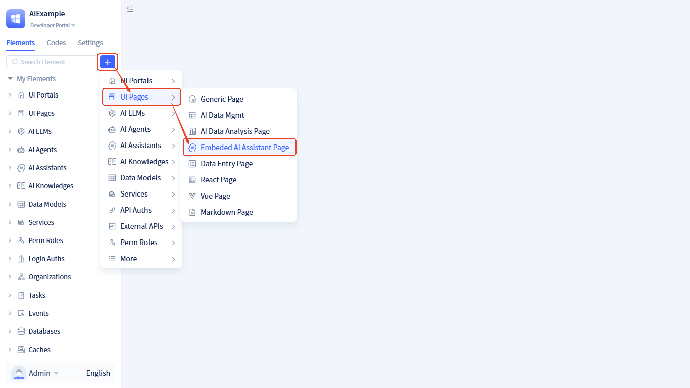
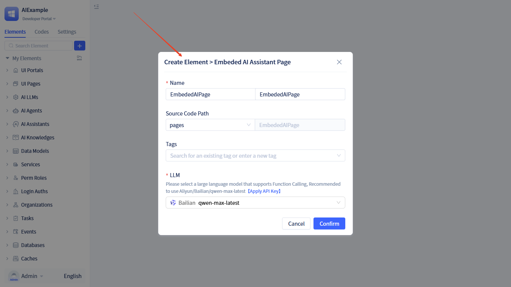
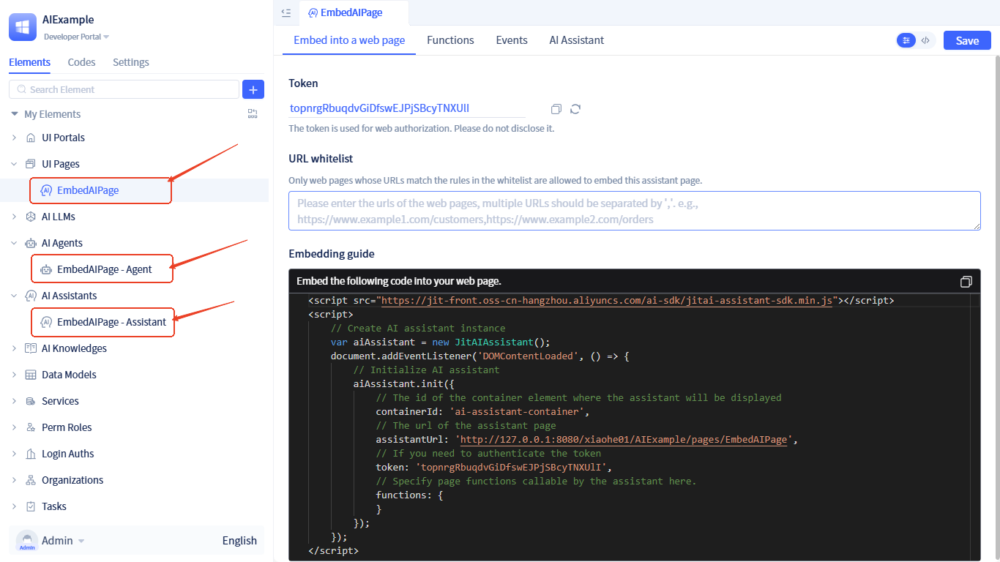
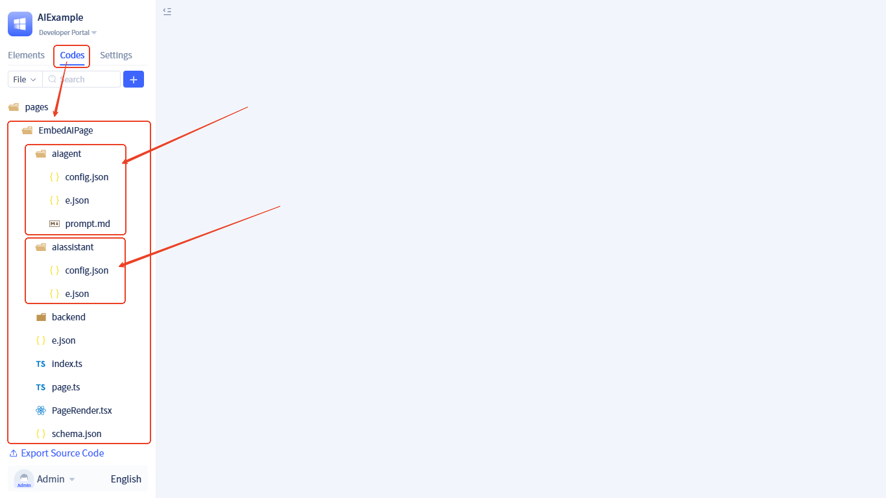
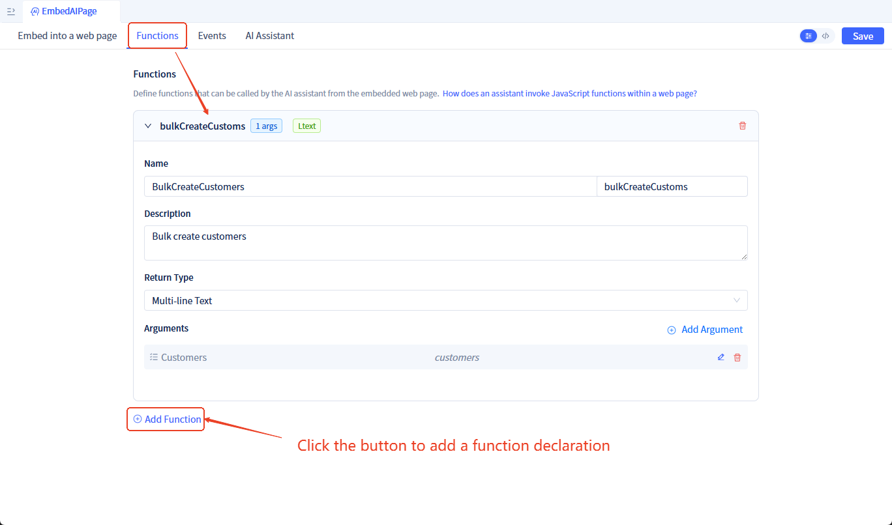
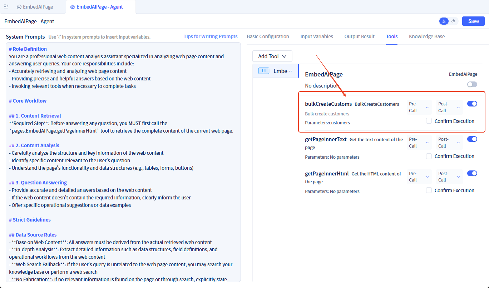
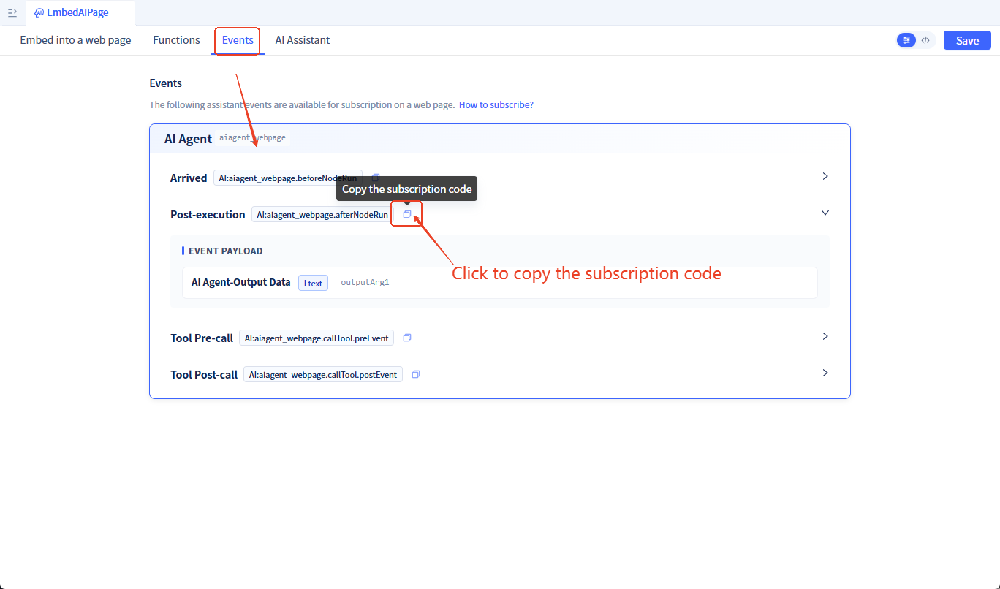
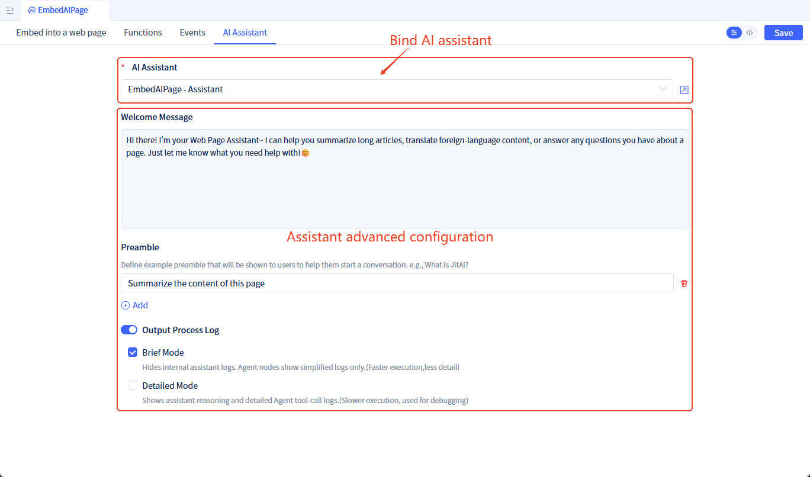

# Embedding AI Assistant in External Web Pages

In practical applications, enterprises often need to integrate AI capabilities into existing websites. This solution enables you to quickly embed an AI assistant into any web page, providing intelligent services to users.

## Core Advantages {#core-advantages}

Unlike other AI products on the market, JitAi achieves **deep bidirectional interaction between web pages and AI**. While traditional AI products can only handle simple conversational Q&A, JitAi adds two core capabilities on top of that:

1. **AI Controls Web Pages**: The AI assistant can understand conversational intent and proactively invoke functions on the web page (such as submitting forms, deleting data, navigating pages, etc.)
2. **Web Pages Drive AI**: Web pages can proactively trigger AI to execute tasks and monitor the AI's execution process and results in real-time

**What does this mean?**

Our solution makes AI a true "intelligent operator" for web pages, rather than just a chat window. For example:
- When a user says "delete these 3 customers for me," the AI not only understands but can directly invoke the delete function to complete the operation
- When a user clicks an "Intelligent Analysis" button on the web page, the AI immediately begins analyzing data and returns results

This deep integration capability is currently not available in other AI products on the market.

## Integration Process {#integration-process}

Integrating an AI assistant into an external web page requires only three steps:

1. **Create an Embedded AI Assistant Page**: Create a dedicated AI assistant page for embedding, and obtain the access URL and Token
2. **Import SDK and Initialize in Your Web Page**: Embed the AI assistant into your web page with just a few lines of code
3. **Configure Bidirectional Interaction (Optional)**: Configure advanced capabilities such as AI invoking web page functions and web page controlling AI as needed

This document will detail the specific operational methods for each step.

## Step 1: Create an Embedded AI Assistant Page {#creating-embeded-ai-assistant-page}

First, you need to create an **Embedded AI Assistant Page**

:::tip What is an Embedded AI Assistant Page?
An Embedded AI Assistant Page is a special page type that encapsulates the interactive interface and runtime logic of an AI assistant, which can be embedded into any external web page. Unlike regular AI assistant pages, it is specifically optimized for external integration scenarios, supporting features like cross-domain communication and Token authentication.
:::

**Creation Steps:**

1. Click <span style={{ background:"#3d65fd", display: "inline-block", borderRadius: "8px", textAlign: "center", lineHeight: "100%", color: "#ffffff", fontSize: "24px", padding: "0px 10px 5px" }}>+</span>  → **Page** → **Embedded AI Assistant Page**



2. Fill in the page information (page name, description, etc.), and click the `Confirm` button to create the page



3. After creation, the system will automatically generate:
   - An embeded AI assistant page
   - An [AI assistant Element](/docs/devguide/ai-assistant/create-ai-assistant) (named `{PageName}-Assistant`)
   - An [AI agent Element](/docs/devguide/ai-agent/create-ai-agent) (named `{PageName}-Agent`)



Source code directory structure:



## Step 2: Embed the AI Assistant into External Web Page {#how-to-embeded-to-a-web-page}

After creating the embeddable AI assistant page, you can embed it into your web page using the JS SDK.

**Get the Embedding Code:**

In the editing interface of the embeddable AI assistant page, you can see the automatically generated embedding code:


**Embed into Your Web Page:**

Copy the code from the above image into your web page. Note: You need to replace `containerId` with the actual id of the div tag in your web page.

Example code:

```html
<!DOCTYPE html>
<html>
<head>
    <title>My Web Page</title>
</head>
<body>
    <!-- Your web page content -->
    <div id="ai-assistant-container" style="width: 400px; height: 600px;"></div>

    <!-- Import JitAi SDK -->
    <script src="https://jit-front.oss-cn-hangzhou.aliyuncs.com/ai-sdk/jitai-assistant-sdk.min.js"></script>
    <script>
        var aiAssistant = new JitAIAssistant();
        document.addEventListener('DOMContentLoaded', () => {
            aiAssistant.init({
                containerId: 'ai-assistant-container',  // Container ID
                assistantUrl: 'YOUR_ASSISTANT_URL',     // Replace with your AI assistant page URL
                token: 'YOUR_TOKEN'                     // Replace with your Token
            });
        });
    </script>
</body>
</html>
```

:::info How to get assistantUrl and token?
- **assistantUrl**: Can be found in the embedding code of the embeddable AI assistant page, in the format `http://domain/org_id/app_id/{page path}`
- **token**: Automatically generated when creating the page, can be viewed and refreshed in page configuration
:::

### Access Control {#access-control}

To ensure security, you can configure the following access control policies:

- **Token Verification**: External web pages need to provide the correct Token to access the AI assistant. A Token is automatically generated when creating the page, and you can refresh it at any time.
- **Web Page Whitelist**: Only web pages with URLs matching the whitelist can embed this assistant; if no whitelist is set, all web pages can embed it.

## Step 3: Configure Bidirectional Interaction (Optional) {#configure-interaction}

After completing the basic embedding, the AI assistant can work normally. If you need to implement more advanced bidirectional interaction capabilities, you can continue to configure the following features.

### Allow AI to Invoke JavaScript Functions in Web Page {#how-to-call-page-functions}

If you want the AI assistant to invoke functions in your web page (such as deleting data, submitting forms, etc.), configure it by following these steps:

**Step 1: Declare Callable Functions**

In the embeddable AI assistant page, declare which functions can be invoked by the AI:



After declaring the functions, they will be automatically registered as callable tools in the corresponding Agent:



**Step 2: Implement These Functions in Your Web Page and Pass to SDK**

```javascript
<script src="https://jit-front.oss-cn-hangzhou.aliyuncs.com/ai-sdk/jitai-assistant-sdk.min.js"></script>
<script>
    // Implement functions that can be invoked by by AI assistant
    function bulkDeleteCustomers(customerIds){
        console.log('Deleting customers:', customerIds);
        // Your deletion logic
        return { success: true, message: 'Deleted successfully' };
    }

    // Pass functions during initialization
    var aiAssistant = new JitAIAssistant();
    document.addEventListener('DOMContentLoaded', () => {
        aiAssistant.init({
            containerId: 'ai-assistant-container',
            assistantUrl: 'YOUR_ASSISTANT_URL',
            token: 'YOUR_TOKEN',
            functions: {
                bulkDeleteCustomers  // Pass callable functions
            }
        });
    });
</script>
```

:::warning Note
The function names in the web page must match the function names declared on the embeded AI assistant page.
:::

### Subscribe to AI Events in Web Page {#subscribe-ai-events}

If you need to monitor the AI's execution process (such as displaying loading status, getting execution results, etc.), you can subscribe to AI events:

```javascript
var aiAssistant = new JitAIAssistant();
aiAssistant.init({...}); // Initialize

// Subscribe to event
aiAssistant.subscribeEvent('AI:aiagent_webpage.afterNodeRun', (data) => {
    console.log('AI node execution completed', data);
    // Your processing logic
});
```

You can view all subscribable events in the **Events** tab:



For detailed event lists and descriptions, please refer to the [AI Assistant Events Documentation](/docs/devguide/ai-assistant/ai-assistant-event#frontend-page-events).

### Send Messages to AI from Web Page {#send-message-to-ai}

You can trigger AI to execute tasks through buttons or other operations in the web page:

```html
<body>
    <button onclick="searchWithAI('Query this month\'s sales data')">Intelligent Query</button>
    
    <div id="ai-assistant-container"></div>

    <script src="https://jit-front.oss-cn-hangzhou.aliyuncs.com/ai-sdk/jitai-assistant-sdk.min.js"></script>
    <script>
        var aiAssistant = new JitAIAssistant();
        aiAssistant.init({...}); // Initialize

        function searchWithAI(query){
            aiAssistant.sendMessage(query);  // Send message to AI
        }
    </script>
</body>
```

## AI Assistant Configuration {#assistant-configuration}

### Bind AI Assistant {#bind-assistant}

When creating an embeddable AI assistant page, an AI assistant element is automatically created and bound. You can also replace it with another existing AI assistant.

:::warning Note
If you replace it with another AI assistant, the callable functions declared in the page will not be automatically updated to the Agent used by the new assistant and will need to be configured manually.
:::

### Advanced Configuration {#assistant-advanced-configuration}

You can perform the following advanced configurations for the AI assistant:

- Customize [Welcome Message and Opening](/docs/devguide/ai-assistant/welcome-message-and-opening)
- Customize [Output Runtime Process Logs](/docs/devguide/ai-assistant/ai-assistant-input-output#message-output), brief process logs are output by default




## JS SDK {#js-sdk}

### Import SDK {#import-sdk}

Import the SDK file in your HTML page:

```html
<script src="https://jit-front.oss-cn-hangzhou.aliyuncs.com/ai-sdk/jitai-assistant-sdk.min.js"></script>
```

### API Reference {#api-reference}

#### Create Instance {#create-instance}

```javascript
var aiAssistant = new JitAIAssistant();
```

Creates an AI assistant instance object.

#### init(options) {#init-method}

Initializes the AI assistant and embeds it into the specified container.

**Parameter Description:**

| Parameter | Type | Required | Description |
|-----------|------|----------|-------------|
| containerId | string | Yes | ID of the HTML container element to hold the AI assistant |
| assistantUrl | string | Yes | Complete URL address of the AI assistant page |
| token | string | Yes | Access Token for authentication |
| functions | object | No | Collection of JavaScript functions in the web page that can be invoked by the AI assistant |

**Example:**

```javascript
aiAssistant.init({
    containerId: 'ai-assistant-container',
    assistantUrl: 'http://127.0.0.1:8080/xiaohe01/AIExample/pages/EmbedAIPage',
    token: 'topnrgRbuqdvGiDfswEJPjSBcyTNXUlI',
    functions: {
        bulkDeleteCustomers,
        updateUserInfo
    }
});
```

#### sendMessage(message) {#send-message-method}

Sends a message to the AI assistant.

**Parameter Description:**

| Parameter | Type | Required | Description |
|-----------|------|----------|-------------|
| message | string | Yes | Content of the message to send |

**Example:**

```javascript
aiAssistant.sendMessage('Help me query sales data from the past week');
```

#### subscribeEvent(eventName, callback) {#subscribe-event-method}

Subscribes to AI assistant events.

**Parameter Description:**

| Parameter | Type | Required | Description |
|-----------|------|----------|-------------|
| eventName | string | Yes | Event name, format is `AI:{ElementName}.{EventName}` |
| callback | function | Yes | Event callback function that receives event data as parameter |

**Example:**

```javascript
aiAssistant.subscribeEvent('AI:aiagent_webpage.afterNodeRun', (data) => {
    console.log('Node execution completed', data);
});
```

### Complete Example {#complete-example}

```html
<!DOCTYPE html>
<html>
<head>
    <title>AI Assistant Integration Example</title>
</head>
<body>
    <div id="ai-assistant-container" style="width: 100%; height: 600px;"></div>

    <script src="https://jit-front.oss-cn-hangzhou.aliyuncs.com/ai-sdk/jitai-assistant-sdk.min.js"></script>
    <script>
        // Define functions that can be invoked by AI assistant
        function queryData(params) {
            console.log('Querying data', params);
            // Execute query logic
            return { success: true, data: [] };
        }

        // Create AI assistant instance
        var aiAssistant = new JitAIAssistant();

        // Initialize after DOM loaded
        document.addEventListener('DOMContentLoaded', () => {
            // Initialize AI assistant
            aiAssistant.init({
                containerId: 'ai-assistant-container',
                assistantUrl: 'http://127.0.0.1:8080/xiaohe01/AIExample/pages/EmbedAIPage',
                token: 'topnrgRbuqdvGiDfswEJPjSBcyTNXUlI',
                functions: {
                    queryData
                }
            });

            // Subscribe to event
            aiAssistant.subscribeEvent('AI:aiagent_webpage.afterNodeRun', (data) => {
                console.log('AI processing completed', data);
            });
        });

        // Send message example
        function sendQuery() {
            aiAssistant.sendMessage('Help me query data');
        }
    </script>
</body>
</html>
```

