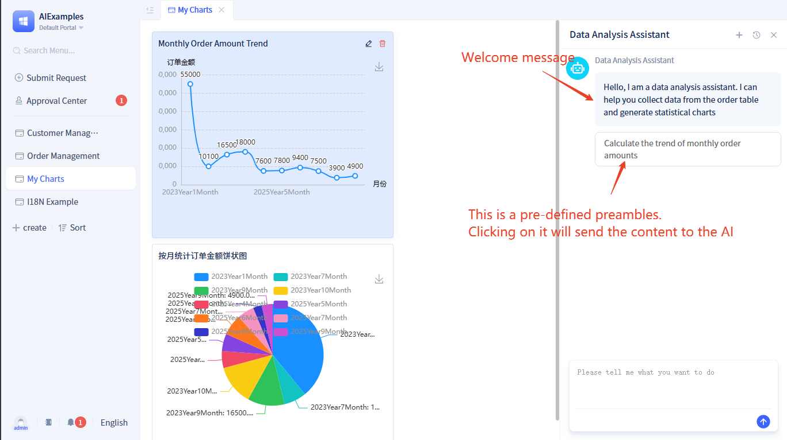

# Welcome Message and Preamble

When [using AI assistants in portals and pages](../using-ai-in-portals-and-pages), you can flexibly configure welcome messages and opening statements.

## Welcome message configuration {#welcome-message-configuration}

**Welcome Message**: A brief greeting and guidance text displayed when users open or first enter the AI assistant interface before entering any content. It conveys a friendly, professional, and consistent brand image; outlines what the assistant can and cannot do to reduce expectations gap.

## Preamble configuration {#preamble-configuration}

**Preamble**: Provides preset questions with the purpose of offering clickable or copyable question examples to guide users into topics, inspire the scope of questions, accelerate intent collection, and improve conversation conversion.

