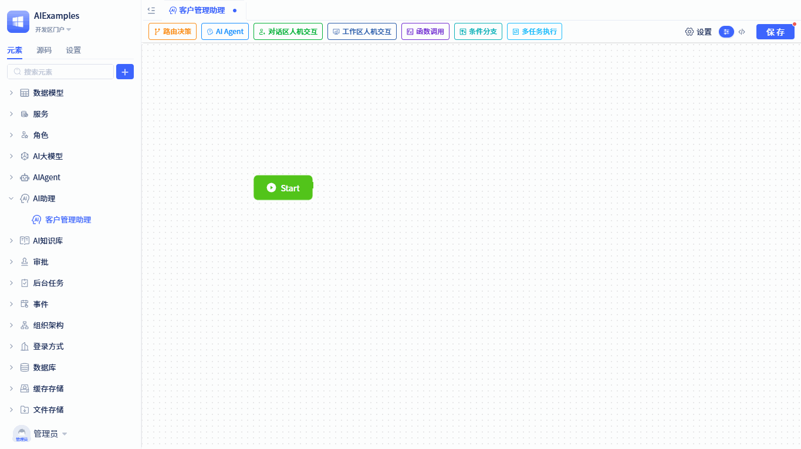
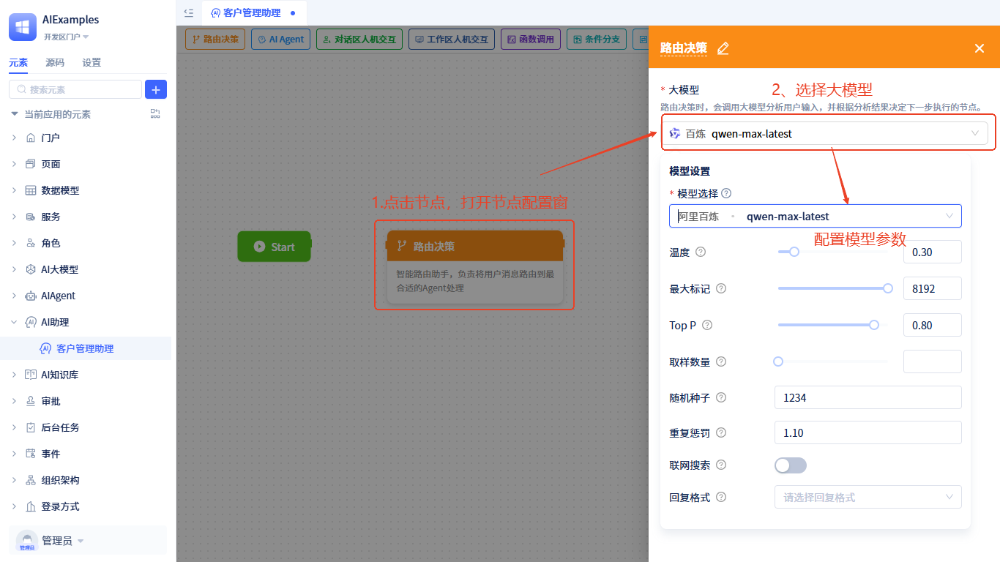
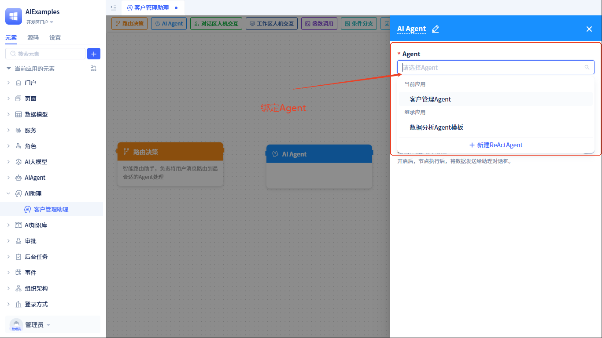

# Process Orchestration and Node Configuration

## Visual Orchestration {#visual-orchestration}
The AI assistant's visual orchestration tool allows you to design complex business processes through intuitive drag-and-drop operations, building intelligent workflows without writing code.

**Adding Nodes**:
1. Select the required node type from the top toolbar
2. Drag to the appropriate position on the canvas
3. Release the mouse to complete node addition

**Connecting Nodes**:
1. Hover the mouse over the output port of the source node
2. Hold the left mouse button and drag to the input port of the target node
3. Release the mouse to establish the connection

:::tip Orchestration Tips
- **Reasonable Layout**: Place related nodes in close proximity to maintain clear process flow
- **Naming Conventions**: Set meaningful names for nodes to facilitate subsequent maintenance
:::

## Node Types Explained

### Start Node {#start-node}
This is the starting point of the workflow, like the entry point of a project. It receives user input and other [input parameters](./ai-assistant-input-output#input-parameters), stores this information in [state data](./ai-assistant-state), and then begins task execution.
Each AI assistant can only have one start node, which is automatically generated after creating the assistant, so you don't need to add it manually.

### Routing Decision {#routing-decision}
This node is intelligent and can decide which AI assistant to call next for processing based on the user's message content.
:::tip Note
The next step after a routing decision node can only be an AIAgent node, not other types.
:::
During routing decisions, it calls a large language model to analyze user input and then intelligently selects the most appropriate processing path.

**Binding Large Language Model**: Routing decisions require a large language model to help with analysis, so we need to configure one for it. The configuration method is as follows:

Click on the routing decision node in the process, and a configuration window will open on the right side; select a [large language model](../ai-llm/create-ai-llm) and configure the parameters to complete the setup.

**Input Message Configuration**: The routing decision node has an input parameter that determines the next step during runtime based on this parameter; we need to assign a value to this parameter. The configuration method is as follows:

The input configuration window will automatically pop up when connecting from other nodes to the routing decision node, and can also be opened later by clicking the ` → ` button on the connection. You can pass variables from the assistant's "memory" to it.

### AIAgent {#ai-agent}
The AIAgent node calls a specific AIAgent to handle particular tasks.
We need to bind an [AIAgent](../ai-agent/create-ai-agent) to this node. The configuration method is as follows:

**Input Parameter Configuration**: When the node runs, it will call the Agent and pass in [parameters required by the Agent](../ai-agent/agent-input-output#configure-input-variables).
We need to assign values to these parameters. The configuration method is as follows:

Click the ` → ` button on the connection to open the input parameter configuration window. The left side shows the variables required by the Agent, and the right side allows you to select data from [runtime state data](./ai-assistant-state.md#state-data-content) to assign values to the Agent's variables.
After this node completes execution, it will store the [Agent's output results](../ai-agent/agent-input-output#configure-output-results) in the runtime state for use by other nodes.

### Dialog Area Human-Machine Interaction {#dialog-human-machine-interaction}
**What is the Dialog Area**: The dialog area is an AI dialog box where users chat with the assistant.

When the task flow runs to this node, it will pause and display data in the dialog box. The flow can only continue after the user confirms the data and performs corresponding operations. If there is no next node, the flow automatically ends.
At this node, users can perform operations such as **approve**, **reject**, **reply**, and **edit data** (editing functionality needs to be enabled).
During runtime, after performing **approve**, **reject**, **reply**, and **edit data** operations, the flow will resume and trigger [dialog area human-machine interaction events](./ai-assistant-event#chat-area-human-machine-interaction-events).

Node Configuration Details:
- **Data to Display**: You can freely define the data content that needs user confirmation, sourced from [runtime state data](./ai-assistant-state.md#state-data-content).
- **Editable**: When enabled, users can edit the displayed data, and the edited data will automatically update to the runtime state.
- **Use Custom Control Rendering**: By default, it uses the platform's built-in data rendering controls to display data, but you can also use [custom controls](../frontend-ui-customization/custom-controls) for rendering.
- **Display Operation Buttons**: You can customize operation buttons at this node, which can trigger [dialog area human-machine interaction events](./ai-assistant-event#chat-area-human-machine-interaction-events) when clicked.

Runtime effect is as follows:

### Workspace Human-Machine Interaction {#workspace-human-machine-interaction}
Complementing the assistant dialog area is a **workspace**: the functional page where users work.

The workspace refers to the frontend page where users work.
When the task flow runs to this node, the backend of the flow will pause and send pause events and related information to the frontend. In the workspace, you can [subscribe to post-pause events](../ai-assitant/ai-assistant-event#workspace-human-machine-interaction-events). In the corresponding event handler function, use event parameters to update the page UI state, then wait for users to perform related operations to resume the flow.

Node Configuration Details:
- **Parameters Carried by Events**: Parameters carried by the assistant when sending pause events to the frontend workspace, selected from [runtime state data](./ai-assistant-state#state-data-content), which the frontend can use to update UI state.
- **Operation Instructions**: A prompt to guide users, telling them where on the page to perform what operations to resume the flow; the prompt will be displayed in the assistant dialog box.

**Resume Flow**: Subscribe to this node's pause event in the workspace, perform related processing logic, then call the [Send AI Message](../using-ai-in-portals-and-pages/using-ai-assistants-in-component-pages#send-ai-message) function to resume the flow. The sent message content will be stored as the node's output parameter in the runtime state data for use by other nodes.

### Function Call {#function-call}
This node is used to call model/service functions to process, clean, or calculate data in the runtime state.
This node needs to bind a service/model function. When the task flow runs to this node, it will call the bound function and store the function's return value in the runtime state data for use by other nodes.

**Binding Function**:

**Input Parameter Configuration**: The input parameters of the function call node are the parameters of its bound function. The parameter configuration method is the same as the [AIAgent node](#ai-agent) input parameter configuration method.

### Conditional Branch {#conditional-branch}
Determines the next step of the flow based on the data situation in the current assistant state.

**Conditional Branch Configuration Details**:
- **Conditional Expression**: Use simple logical expressions to evaluate data
- **Supported Operators**: Equal, not equal, greater than, less than, contains, is empty, etc.
- **Multi-condition Combination**: Can use "and" and "or" to combine multiple conditions
- **Conditional Branches**: Can set multiple branches to take different paths when different conditions are met

### Multi-task Execution {#multi-task-execution}
This node is used to cyclically execute specific tasks, requiring setting a loop variable selected from `multi-row data` or `list` type data in the assistant runtime state.

**Multi-task Execution Configuration Details**:
- **Loop Variable Selection**: Select the data to be processed in a loop, must be `multi-row data` or `list` type
- **Loop Execution Branch**: Set the task flow to execute during each loop iteration
- **Loop End Branch**: Set the flow direction after all loops are completed

This node has two branches: **Loop Execution**: Iterate through the loop variable and execute a task sequentially; **Loop End**: The flow direction after loop completion.

**Loop Variable Description**:
When this node runs, it will store two pieces of data in the runtime state:
- **`Loop Index`**: The sequence number of the current loop (starting from 0)
- **`Loop Item`**: The data item currently being processed in the loop
- **Use Case**: In the loop execution branch, you can access current loop information through these two variables

## Full Code Development {#full-code-development}
Click the `</>` button in the top right corner of the assistant editor to switch to source code editing mode.
In source code mode, the left side displays source code files, and clicking on a source code file shows its content on the right side.
- **e.json**: The assistant element declaration file, where "inputArgs" stores custom input parameter configuration

- **config.json**: The assistant element flow configuration, recording flow nodes and connection directions.

