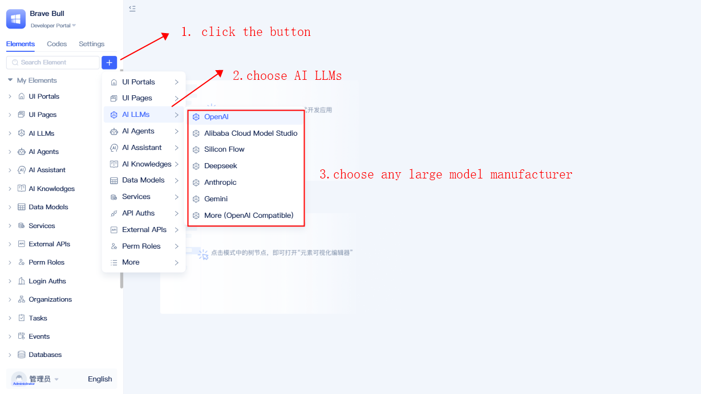
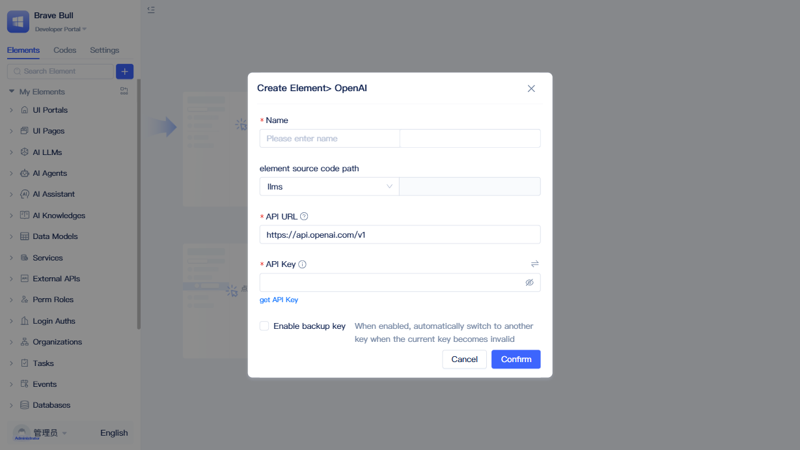
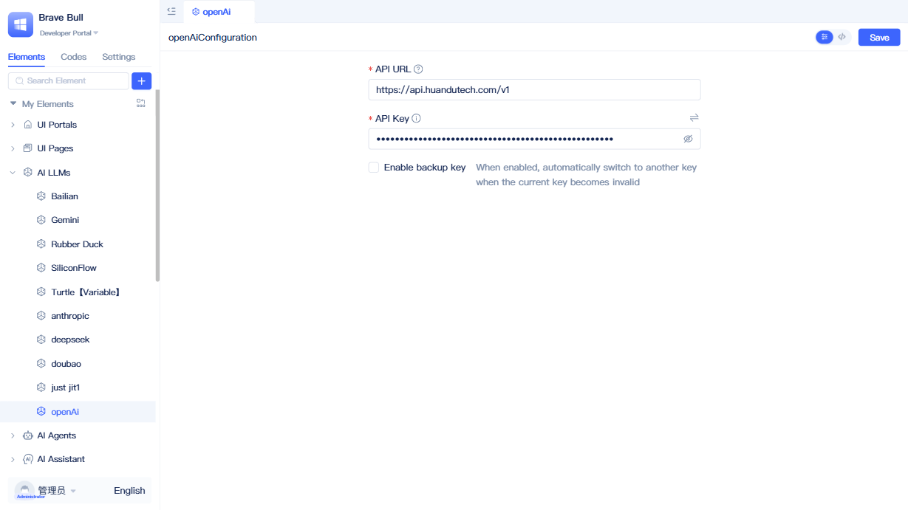
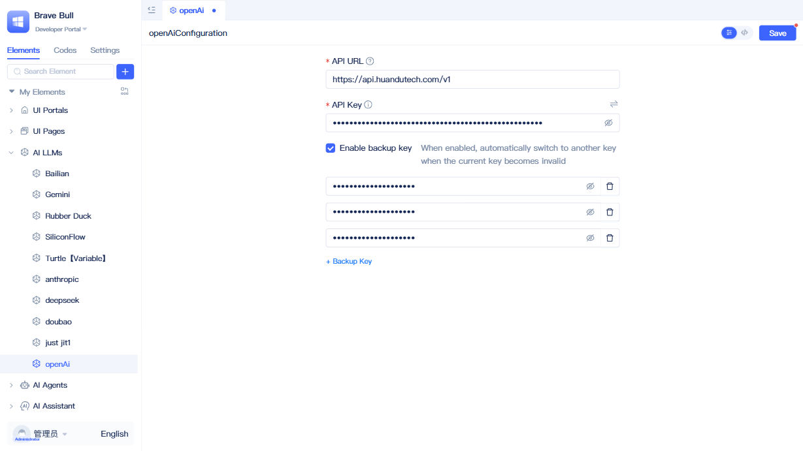
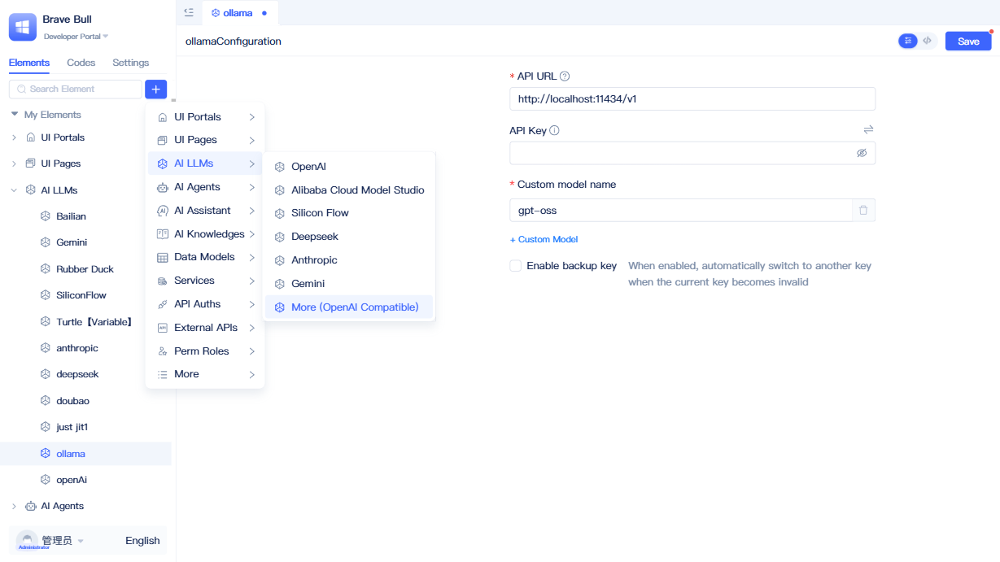
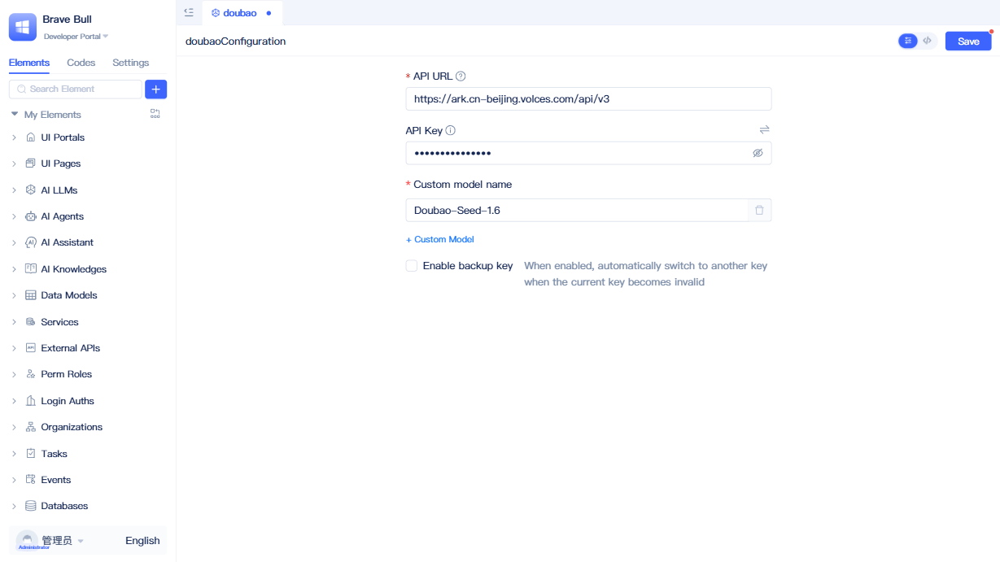

# Creating AI LLM Elements {#create-ai-llm}
As AI technology rapidly advances, modern application systems are experiencing an intelligent transformation. However, developers often face decision paralysis and integration challenges when confronted with numerous AI service providers and constantly evolving model versions.

LLM vendor elements serve as JitAi platform's unified AI integration solution to address these challenges. Whether you're building intelligent [AI Knowledge Bases](../knowledge-base/create-knowledge-elements), developing AI assistants, or creating autonomous decision-making agents, they provide stable and reliable LLM service support.

## Mainstream LLM Vendor Support List {#mainstream-llm-vendor-support-list}
*   Anthropic
*   Alibaba Cloud Bailian
*   Deepseek
*   Gemini
*   OpenAI
*   SiliconFlow
*   OpenAI Compatible

## Creating LLM vendor elements {#creating-llm-vendor-elements}

Click the `+` button next to the search box in the element directory tree, select `AI LLMs` from the popup menu, then choose the appropriate LLM vendor based on your requirements. After making your selection, the following dialog will appear.

In the dialog, enter the name, then visit the corresponding model vendor's configuration page to obtain an API Key (if you're unsure of the address, click `Get API Key` in the bottom left corner), enter the API Key here, and click the `Save` button to complete the creation.
API Keys can be configured using environment variables by clicking the button in the top right corner to prevent exposure.
:::tip
The API URL typically doesn't require modification, as default configurations for each vendor are pre-filled.
:::

Once created, the element will appear in the left element tree.

## Retry and backup API key mechanism {#retry-backup-api-key-mechanism}
To prevent model call failures caused by single key rate limits, excessive requests, and other constraints, we provide retry and multi-key mechanisms. The system performs a maximum of 3 retries with exponential backoff: 1 second, 2 seconds, and 4 seconds respectively. When multiple API Keys are configured, each retry rotates through backup API Keys. This ensures the system doesn't repeatedly attempt calls on the same failed key, but intelligently switches to backup keys to improve success rates. With only one API Key, the system will attempt 4 times total (1 initial call + 3 retries).

Click `Enable Backup Keys` → `+Backup Key` in the interface to add a key input field, enter your backup key, then click `Save`.

## Private LLM integration {#private-llm-integration}
For enhanced information security, developers may deploy private models, which the platform fully supports through seamless integration.

Private models connect using OpenAI Compatible elements. Using Ollama as an example, the default address is `http://localhost:11434/v1`. If an API Key is required, enter it accordingly. Note that private models require enabling the `Enable Custom Model` configuration and specifying the complete model name, such as: qwen3:0.6b, nomic-embed-text.

:::tip
Any vendor supporting OpenAI-compatible interfaces can utilize OpenAI Compatible elements for connection. The figure below demonstrates Volcano Engine's Doubao as a reference implementation.
:::

