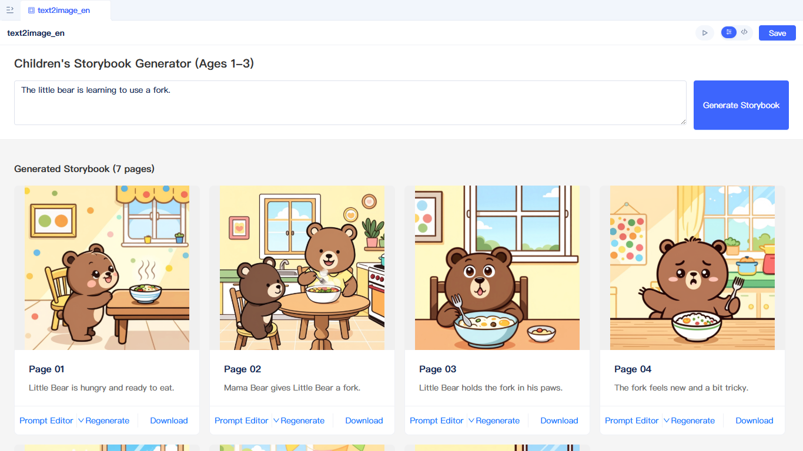
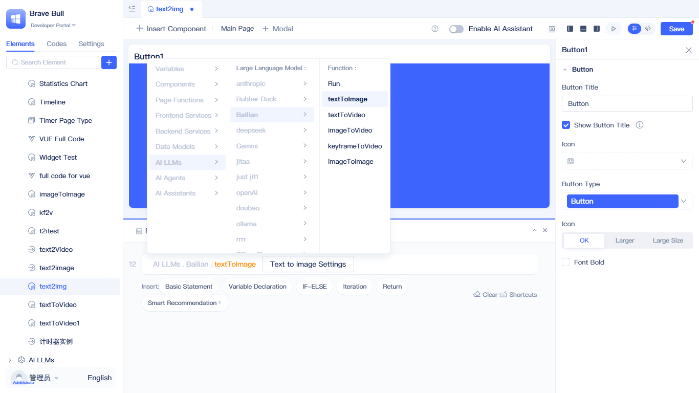
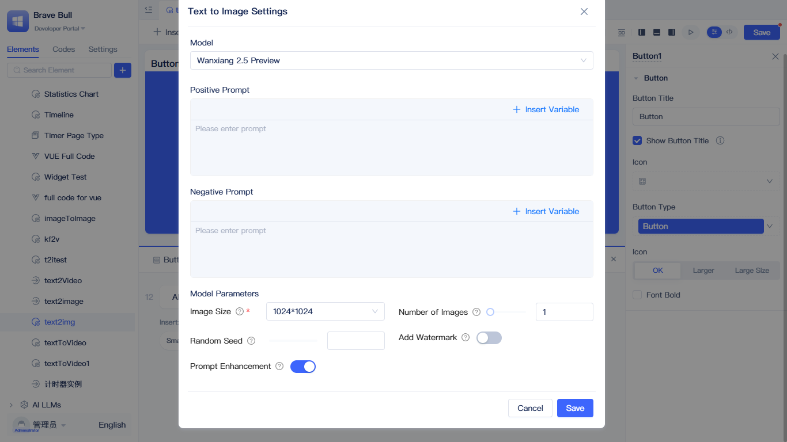
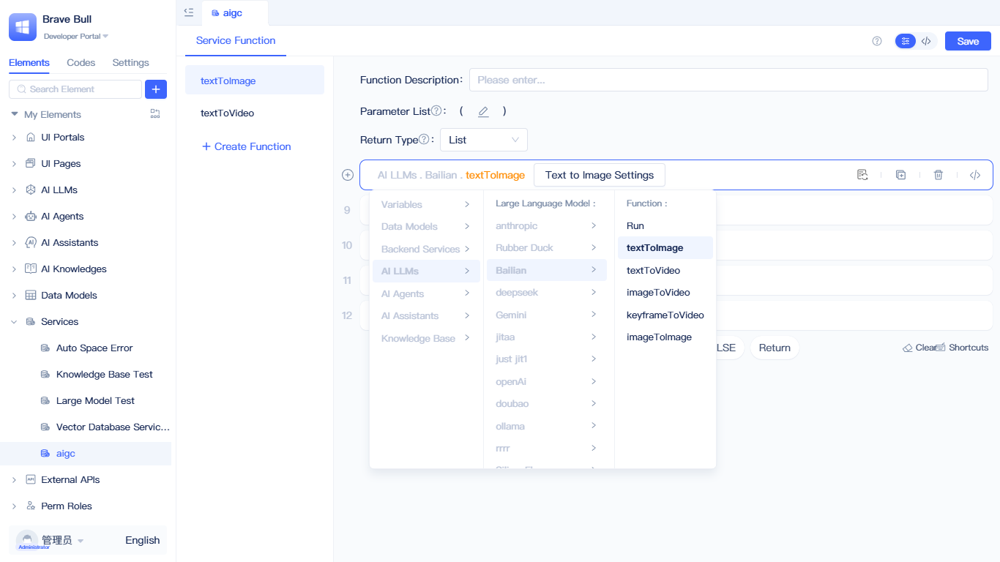
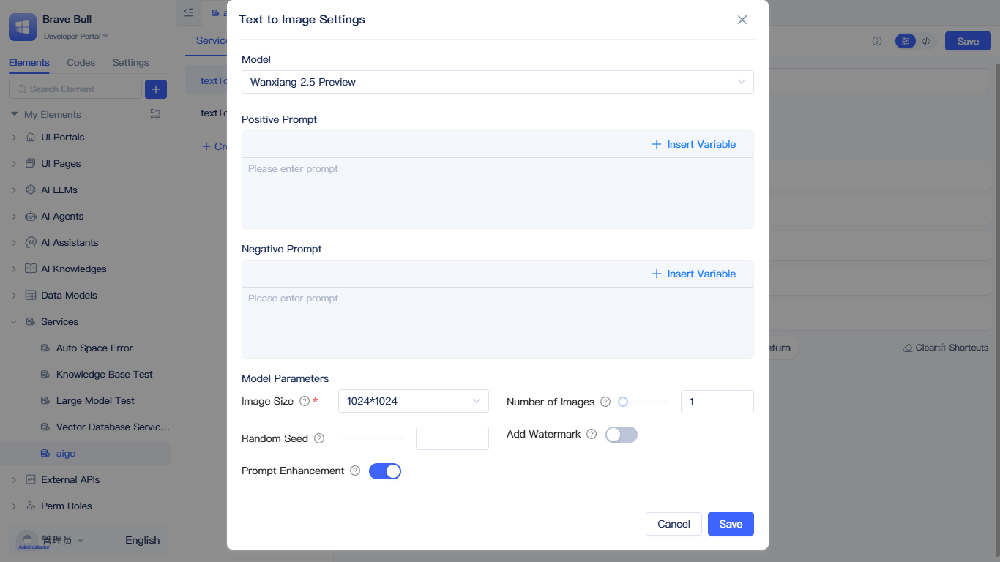
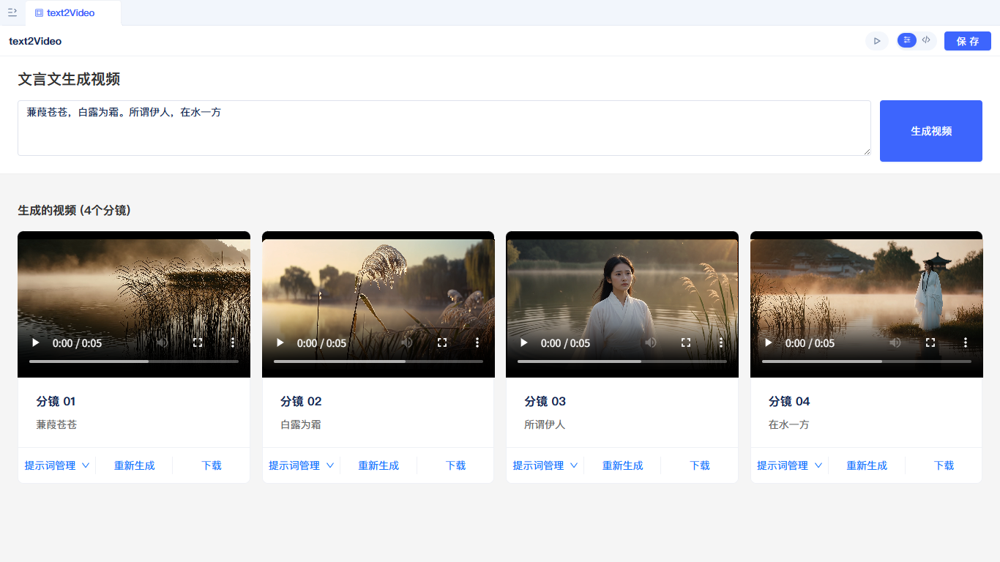

import VideoPlayer from '@site/src/components/VideoPlayer';

# Implementing Multimodal AIGC {#implementing-multimodal-aigc}

Multimodal AIGC (AI-Generated Content) refers to the capability of leveraging artificial intelligence to automatically generate various forms of content—such as images and videos—based on text prompts. The JitAi platform deeply integrates multimodal generation capabilities, enabling developers to effortlessly implement innovative features like text-to-image and text-to-video in their applications.

:::tip
The current version supports only the **Alibaba Cloud Bailian** platform's Wanx series models. Please ensure that Bailian API keys are configured in the system before use. Support for additional LLM vendors is under development.
:::

## Bailian {#bailian}

### Text-to-image {#text-to-image}

#### Example {#text-to-image-example}

Imagine entering a story text and having the system automatically generate matching illustrations for a picture book—this is a real-world application of the JitAi platform's text-to-image capabilities.

Taking children's picture book creation as an example, we've implemented an intelligent text-to-image workflow: through 5 AI processing stages (story segmentation → character design → scene design → illustration style → prompt optimization), the system progressively transforms ordinary story text into professional text-to-image prompts, ultimately generating batches of illustrations with consistent style and coherent narrative. The entire process requires no manual intervention and can complete in minutes what would otherwise take designers hours or even days.

This example demonstrates the core advantage of the JitAi platform: **building complex AI workflows by chaining multiple LLM calls**. You can combine capabilities like text generation, logical reasoning, and image generation like building blocks to create your own AIGC applications.

#### Calling text-to-image in pages {#calling-text-to-image-in-pages}

You can quickly integrate text-to-image functionality in pages.

Open the event panel in the page, create a new basic statement, select `AI Large Language Model` - `Bailian LLM Instance` - `Text-to-Image`, and the corresponding function call code will be generated. Click the `Text-to-Image` button in the code to open the text-to-image configuration panel.

In the configuration panel, select an appropriate model and configure the prompt and model parameters, then click OK to complete the configuration. For detailed parameter descriptions, refer to [Text-to-image parameters](#text-to-image-parameters).

#### Calling text-to-image in backend functions {#calling-text-to-image-in-backend-functions}

Text-to-image functionality can be called in backend functions (services, model functions, tasks, and events).

In the backend function panel, create a new basic statement, select `AI Large Language Model` - `Bailian LLM Instance` - `Text-to-Image`, and the corresponding function call code will be generated. Click the `Text-to-Image` button in the code to open the text-to-image configuration panel.

In the configuration panel, select an appropriate model and configure the prompt and model parameters, then click OK to complete the configuration. For detailed parameter descriptions, refer to [Text-to-image parameters](#text-to-image-parameters).

### Text-to-video {#text-to-video}

#### Example {#text-to-video-example}

<VideoPlayer
  url="https://jit-www.oss-cn-beijing.aliyuncs.com/text-to-video-example.mp4"
  controls={true}
  autoplay={false}
  muted={false}
  loop={false}
/>

Text-to-video goes beyond simply converting text to video—it's a creative process that transforms static text into dynamic visual narratives.

Taking classical poetry visualization as an example, we've built a professional text-to-video workflow: through 5 specialized AI processing stages (paragraph segmentation → script writing → cinematography design → visual effects post-production → prompt optimization), the system progressively transforms classical poetry or classical Chinese text into professional, cinema-grade video prompts. Each stage simulates real film production workflows—from storyboard design and camera language planning to lighting and color grading—ultimately generating batches of short video clips with consistent style and smooth cinematography.

Compared to traditional video production, which requires collaboration across multiple stages like scriptwriting, directing, cinematography, and post-production, this workflow encodes professional knowledge into AI prompts, enabling ordinary users to create professional-quality video content. This is the unique value of the JitAi platform: **condensing complex professional knowledge into reusable AI workflows, democratizing content creation**.

#### Calling text-to-video in pages {#calling-text-to-video-in-pages}

Usage is consistent with text-to-image. Refer to [Calling text-to-image in pages](#calling-text-to-image-in-pages). For configuration parameters, refer to [Text-to-video parameters](#text-to-video-parameters).

#### Calling text-to-video in backend functions {#calling-text-to-video-in-backend-functions}

Usage is consistent with text-to-image. Refer to [Calling text-to-image in backend functions](#calling-text-to-image-in-backend-functions). For configuration parameters, refer to [Text-to-video parameters](#text-to-video-parameters).

### Image-to-image {#image-to-image}

Image-to-image supports image editing and creation based on reference images, including **single-image editing** and **multi-reference image generation** modes. By inputting images and text prompts, you can achieve creative functions like image style transfer, element replacement, and multi-image fusion.

#### Calling image-to-image in pages {#calling-image-to-image-in-pages}

Usage is consistent with text-to-image. Refer to [Calling text-to-image in pages](#calling-text-to-image-in-pages). For configuration parameters, refer to [Image-to-image parameters](#image-to-image-parameters).

#### Calling image-to-image in backend functions {#calling-image-to-image-in-backend-functions}

Usage is consistent with text-to-image. Refer to [Calling text-to-image in backend functions](#calling-text-to-image-in-backend-functions). For configuration parameters, refer to [Image-to-image parameters](#image-to-image-parameters).

### Image-to-video {#image-to-video}

Image-to-video supports generating dynamic video content based on a first-frame image. By uploading an image as the starting frame and combining it with text prompts or effect templates, the system automatically generates smooth video animations. This feature is particularly suitable for adding dynamic effects to static images, creating product showcases, character animations, and more.

#### Calling image-to-video in pages {#calling-image-to-video-in-pages}

Usage is consistent with text-to-image. Refer to [Calling text-to-image in pages](#calling-text-to-image-in-pages). For configuration parameters, refer to [Image-to-video parameters](#image-to-video-parameters).

#### Calling image-to-video in backend functions {#calling-image-to-video-in-backend-functions}

Usage is consistent with text-to-image. Refer to [Calling text-to-image in backend functions](#calling-text-to-image-in-backend-functions). For configuration parameters, refer to [Image-to-video parameters](#image-to-video-parameters).

### Keyframe-to-video {#keyframe-to-video}

Keyframe-to-video supports automatically generating intermediate transition animations by specifying first and last frame keyframe images. This feature enables precise control over the video's starting and ending frames, making it suitable for creating transition animations, state change demonstrations, and other video content that requires clear start and end states.

#### Calling keyframe-to-video in pages {#calling-keyframe-to-video-in-pages}

Usage is consistent with text-to-image. Refer to [Calling text-to-image in pages](#calling-text-to-image-in-pages). For configuration parameters, refer to [Keyframe-to-video parameters](#keyframe-to-video-parameters).

#### Calling keyframe-to-video in backend functions {#calling-keyframe-to-video-in-backend-functions}

Usage is consistent with text-to-image. Refer to [Calling text-to-image in backend functions](#calling-text-to-image-in-backend-functions). For configuration parameters, refer to [Keyframe-to-video parameters](#keyframe-to-video-parameters).

### Parameter reference {#parameter-reference}

#### Text-to-image parameters {#text-to-image-parameters}

##### Model selection {#image-model-selection}

The system supports 6 text-to-image models from the Wanx series. Choose an appropriate model based on different scenarios:

| Model Name | Features | Use Cases |
|---------|------|---------|
| **wan2.5-t2i-preview** | Supports free-form dimensions (768×768 to 1440×1440) Aspect ratio 1:4 to 4:1 | Creative designs requiring special dimensions (e.g., tall images, wide images) |
| **wan2.2-t2i-flash** | 50% speed improvement, ultra-fast generation | Rapid iteration and batch generation scenarios |
| **wan2.2-t2i-plus** | Comprehensive stability and success rate improvements | Commercial projects and scenarios with high quality requirements |
| **wanx2.1-t2i-turbo** | Fast generation speed | Rapid prototyping and preview effects |
| **wanx2.1-t2i-plus** | High-quality image generation | Professional design and refined creation |
| **wanx2.0-t2i-turbo** | Classic version, stable and reliable | General image generation needs |

##### Configuration parameters {#image-config-params}

The following parameters can be configured in the configuration panel:

- **Positive prompt (prompt)** *: Describes the desired image content, supports variable insertion
- **Negative prompt (negative_prompt)**: Specifies elements to avoid
- **Image size (size)** *: Size of the generated image, e.g., 1024×1024, 1280×720
- **Generation count (n)**: Number of images to generate in one batch, range 1-4
- **Random seed (seed)**: Fixed seed for reproducible results
- **Watermark setting (watermark)**: Whether to add a watermark to generated images
- **Intelligent prompt rewriting (prompt_extend)**: Uses LLM to optimize prompts, significantly improves results for short prompts

:::tip
Different models support slightly different parameters. The configuration panel automatically displays available parameters based on the selected model. For detailed parameter descriptions, refer to the [Tongyi Wanxiang Text-to-Image Official Documentation](https://help.aliyun.com/zh/model-studio/text-to-image-v2-api-reference)
:::

#### Text-to-video parameters {#text-to-video-parameters}

##### Model selection {#video-model-selection}

The system supports 4 text-to-video models from the Wanx series. Choose an appropriate model based on different needs:

| Model Name | Audio Support | Resolution | Duration | Features | Use Cases |
|---------|---------|-------|------|------|---------|
| **wan2.5-t2v-preview** | ✅ Audio video | 480P/720P/1080P | 5s/10s | Supports auto audio and custom audio | Promotional videos and educational content requiring audio-visual synchronization |
| **wan2.2-t2v-plus** | ❌ Silent video | 480P/1080P | 5s | 50% stability improvement, faster speed | Commercial projects and batch generation |
| **wanx2.1-t2v-turbo** | ❌ Silent video | 480P/720P | 5s | Fast generation speed | Rapid iteration and prototyping |
| **wanx2.1-t2v-plus** | ❌ Silent video | 720P | 5s | High-quality video generation | Refined creation and professional design |

:::tip Audio video
Only the **wan2.5-t2v-preview** model supports audio functionality (auto audio or custom audio). Other models generate silent videos.
:::

##### Configuration parameters {#video-config-params}

The following parameters can be configured in the configuration panel:

- **Positive prompt (prompt)** *: Describes the desired video content, should include scene, action, camera angles, and other elements
- **Negative prompt (negative_prompt)**: Specifies elements or effects to avoid
- **Video resolution (size)**: e.g., 1280×720 (720P), 1920×1080 (1080P)
- **Video duration (duration)**: 5 seconds or 10 seconds (wan2.5 supports 10 seconds, other models only 5 seconds)
- **Custom audio (audio_url)**: Upload custom audio file (5-12 seconds), only wan2.5 supported
- **Auto audio (audio)**: Model automatically generates matching background audio, only wan2.5 supported
- **Watermark setting (watermark)**: Whether to add a watermark to generated videos
- **Intelligent prompt rewriting (prompt_optimizer)**: Uses LLM to optimize prompts, improving generation results

:::warning Important notes
- Text-to-video uses asynchronous calls and typically takes 1-5 minutes
- The returned `video_url` is retained for only **24 hours**. Please download and store it in permanent storage promptly
- Billing is based on video duration in seconds, and charges apply only when the task succeeds
:::

:::tip
Different models support slightly different parameters. The configuration panel automatically displays available parameters based on the selected model. For detailed parameter descriptions, refer to the [Tongyi Wanxiang Text-to-Video Official Documentation](https://help.aliyun.com/zh/model-studio/text-to-video-api-reference)
:::

#### Image-to-image parameters {#image-to-image-parameters}

##### Model selection {#image-to-image-model-selection}

The system supports image-to-image models from the Wanx series:

| Model Name | Features | Use Cases |
|---------|------|---------|
| **wan2.5-i2i-preview** | Supports single-image editing and multi-reference image generation Maintains input image aspect ratio | Image style transfer, element replacement, multi-image fusion creation |

##### Configuration parameters {#image-to-image-config-params}

The following parameters can be configured in the configuration panel:

- **Input images (images)** *:
  - **Single-image editing**: Input a single image URL or select a variable
  - **Multi-reference image generation**: Input a JitList variable or multiple image URLs
- **Positive prompt (prompt)** *: Describes the desired image editing effect or generated content, supports variable insertion
- **Negative prompt (negative_prompt)**: Specifies elements to avoid
- **Generation count (n)**: Number of images to generate in one batch, range 1-4
- **Random seed (seed)**: Fixed seed for reproducible results, range 0-4294967290
- **Watermark setting (watermark)**: Whether to add a watermark to generated images

:::warning Important notes
- Image-to-image uses asynchronous calls and typically takes 1-2 minutes
- The returned image URLs are retained for only **24 hours**. Please download and store them in permanent storage promptly
- Billing is based on the number of successfully generated images
:::

:::tip
For detailed parameter descriptions, refer to the [Tongyi Wanxiang Image-to-Image Official Documentation](https://help.aliyun.com/zh/model-studio/wan2-5-image-edit-api-reference)
:::

#### Image-to-video parameters {#image-to-video-parameters}

##### Model selection {#image-to-video-model-selection}

The system supports multiple image-to-video models from the Wanx series. Choose an appropriate model based on different needs:

| Model Name | Audio Support | Resolution | Duration | Features | Use Cases |
|---------|---------|-------|------|------|---------|
| **wan2.5-i2v-preview** | ✅ Audio video | 480P/720P/1080P | 5s/10s | Supports audio and effect templates | Animating static images, product showcases |
| **wan2.2-i2v-plus** | ❌ Silent video | 480P/1080P | 5s | Improved stability and faster speed | Commercial projects and batch generation |
| **wan2.2-i2v-flash** | ❌ Silent video | 480P/720P/1080P | 5s | Ultra-fast generation | Quick preview and prototyping |
| **wanx2.1-i2v-turbo** | ❌ Silent video | 480P/720P | 5s | Fast generation speed | Rapid iteration |
| **wanx2.1-i2v-plus** | ❌ Silent video | 720P | 5s | High-quality video generation | Refined creation |

:::tip Audio video
Only the **wan2.5-i2v-preview** model supports audio functionality (auto audio or custom audio). Other models generate silent videos.
:::

##### Configuration parameters {#image-to-video-config-params}

The following parameters can be configured in the configuration panel:

- **First frame image URL (img_url)** *: Starting frame image for the video, supports URL or variable
- **Effect template (template)**: Select preset animation effects, options include:
  - **General effects**: Magic floating (flying), stress relief squeeze (squish), spinning circle (rotation), poke fun (poke), balloon inflation (balloon), giving roses (rose), crystal rose (crystalrose)
  - **Single-person effects**: Funky dance (dance1), midnight disco (dance2), star shake moment (dance3), finger rhythm (dance4), dance switch (dance5), mermaid awakening (mermaid), academic coronation (graduation), giant beast pursuit (dragon), money falling from sky (money), jellyfish encounter (jellyfish), pupil travel (pupil)
  - **Two-person effects**: Loving hug (hug), French kiss (frenchkiss), double heartbeat (coupleheart)
- **Positive prompt (prompt)**: Describes the desired video animation effect (optional when using effect templates)
- **Negative prompt (negative_prompt)**: Specifies elements or effects to avoid
- **Video resolution (resolution)**: e.g., 480P, 720P, 1080P
- **Video duration (duration)**: 5 seconds or 10 seconds (wan2.5 supports 10 seconds, other models only 5 seconds)
- **Custom audio (audio_url)**: Upload custom audio file (5-12 seconds), only wan2.5 supported
- **Auto audio (audio)**: Model automatically generates matching background audio, only wan2.5 supported
- **Watermark setting (watermark)**: Whether to add a watermark to generated videos
- **Intelligent prompt rewriting (prompt_optimizer)**: Uses LLM to optimize prompts, improving generation results

:::warning Important notes
- Image-to-video uses asynchronous calls and typically takes 1-5 minutes
- The returned `video_url` is retained for only **24 hours**. Please download and store it in permanent storage promptly
- Billing is based on video duration in seconds, and charges apply only when the task succeeds
:::

:::tip
Different models support slightly different parameters. The configuration panel automatically displays available parameters based on the selected model. For detailed parameter descriptions, refer to the [Tongyi Wanxiang Image-to-Video Official Documentation](https://help.aliyun.com/zh/model-studio/image-to-video-api-reference)
:::

#### Keyframe-to-video parameters {#keyframe-to-video-parameters}

##### Model selection {#keyframe-to-video-model-selection}

The system supports keyframe-to-video models from the Wanx series:

| Model Name | Resolution | Duration | Features | Use Cases |
|---------|-------|------|------|---------|
| **wan2.2-kf2v-flash** | 480P/720P/1080P | 5s | Ultra-fast generation, supports effect templates | Transition animations, state change demonstrations |
| **wanx2.1-kf2v-plus** | 720P | 5s | High-quality video generation | Refined creation and professional design |

##### Configuration parameters {#keyframe-to-video-config-params}

The following parameters can be configured in the configuration panel:

- **First frame image URL (first_frame_image_url)** *: Starting frame image for the video, supports URL or variable
- **Last frame image URL (last_frame_image_url)**: Ending frame image for the video, supports URL or variable (optional)
- **Effect template (template)**: Select preset animation effects, options include:
  - Tang dynasty elegance (hanfu-1)
  - Mecha transformation (solaron)
  - Shining cover (magazine)
  - Mechanical awakening (mech1)
  - Cyber appearance (mech2)
- **Positive prompt (prompt)**: Describes the desired video transition effect (optional when using effect templates)
- **Negative prompt (negative_prompt)**: Specifies elements or effects to avoid
- **Video resolution (resolution)**: e.g., 480P, 720P, 1080P (wan2.2-kf2v-flash supported) or 720P (wanx2.1-kf2v-plus)
- **Video duration (duration)**: Fixed at 5 seconds
- **Watermark setting (watermark)**: Whether to add a watermark to generated videos
- **Intelligent prompt rewriting (prompt_optimizer)**: Uses LLM to optimize prompts, improving generation results

:::warning Important notes
- Keyframe-to-video uses asynchronous calls and typically takes 1-5 minutes
- The returned `video_url` is retained for only **24 hours**. Please download and store it in permanent storage promptly
- Billing is based on video duration in seconds, and charges apply only when the task succeeds
- If no last frame image is provided, the system will generate the video based only on the first frame
:::

:::tip
For detailed parameter descriptions, refer to the [Tongyi Wanxiang Keyframe-to-Video Official Documentation](https://help.aliyun.com/zh/model-studio/image-to-video-by-first-and-last-frame-api-reference)
:::

## OpenAI {#openai}
Coming soon...
