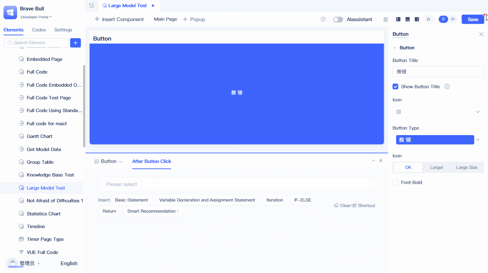
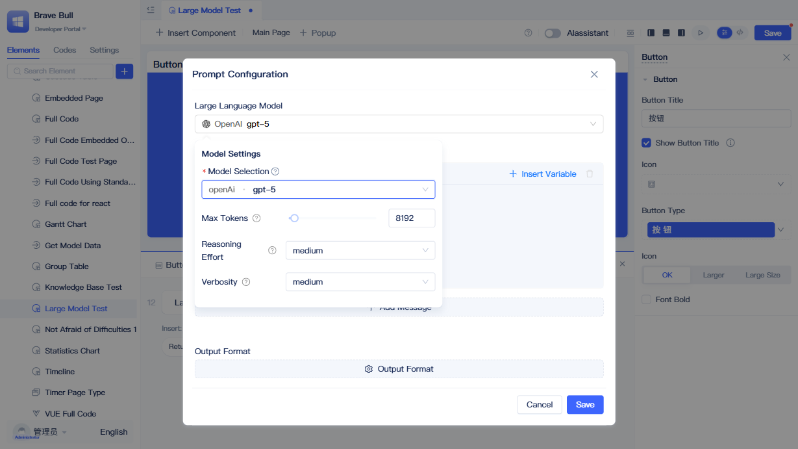
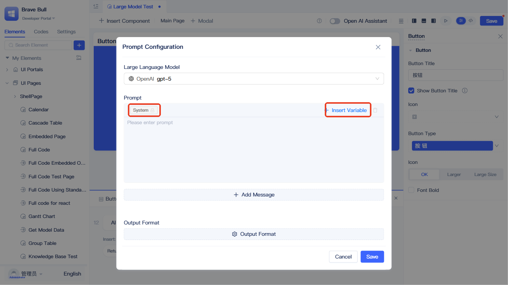
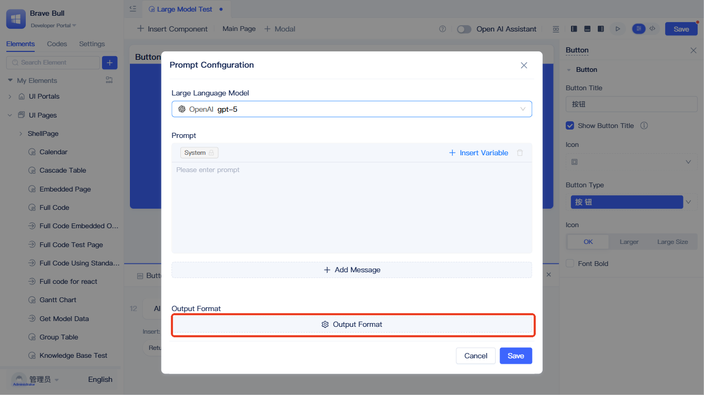
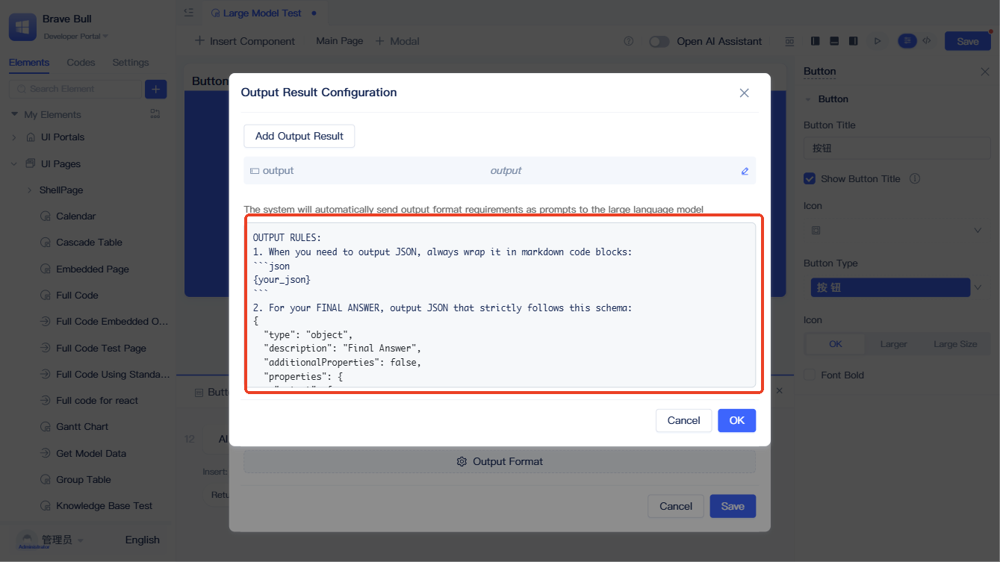
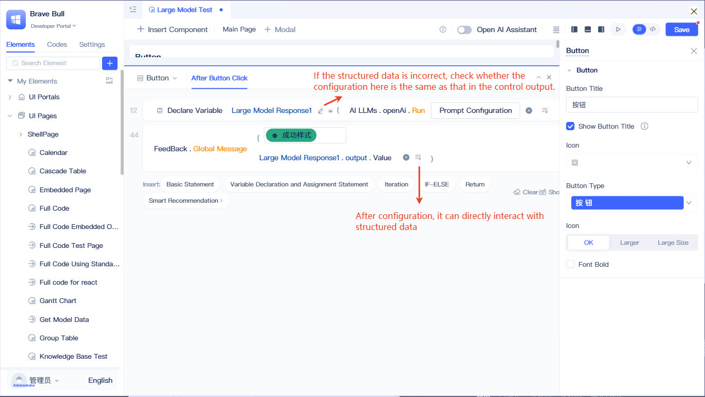

# LLM Function Input and Output

The core execution function of large language models is `runLlm`, which serves as the unified entry point for all LLM calls. This function accepts two types of key input parameters: **LLM configuration** (including model selection and parameter settings) and **prompt content** (including system prompts, user prompts, and variables), and uses **output control** configuration to standardize the format and structure of returned results.

## Calling LLM in pages {#call-llm-in-pages}
In page functions and event function logic, developers can use the runtime functions of LLM vendor elements to invoke LLMs and retrieve their return values. These configurations will ultimately serve as input parameters for the `runLlm` function.



Click `Events` in the top right corner of the component, then click the `Please Select` text on the blank statement in the event panel, and select `LLM` - `LLM Vendor` from the menu. Once completed, an LLM vendor runtime function will be generated. Click `Prompt Configuration` to open the LLM `Prompt Configuration` panel.

### Function input 1: Setting the language model {#setting-language-model}


In the `Prompt Configuration` dialog, first select the LLM you want to use. Click the LLM selection box and choose the appropriate model from the dropdown menu. After selecting a model, the system will automatically populate the corresponding model parameters, which you can modify based on the specific model characteristics. This model configuration information will serve as the `llmConfig` portion within the `config` parameter of the `runLlm` function.
:::tip
Different models support different configuration parameters, though most support temperature settings. Temperature is one of the most important parameters—you can adjust it based on your use case to control the randomness of the model's output.
:::

### Function input 2: Using prompts {#using-prompts}
Prompts are critical to determining LLM output quality and constitute the core input content of the `runLlm` function. System prompts are always provided first and are typically used to define the model's role, behavioral guidelines, tone, safety restrictions, and other foundational instructions. User prompts follow as the second input and generally describe the user's intent, requirements, and context.



Click `+Add Message` to add new prompt input fields. Use the dropdown menu in the top left corner to switch between prompt types. System prompts cannot be changed in type or deleted. You can organize your prompt content according to the LLM's purpose and enter it into the appropriate prompt type fields.
Click the `Insert Variable` button in the top right corner to insert page variables into your prompts. Variables enable dynamic prompt content that can control LLM output behavior. These variables will be passed as the `context` parameter of the `runLlm` function to enable dynamic variable substitution.


#### Intelligent link parsing {#intelligent-link-parsing}
When you include links in your prompts, the system automatically recognizes and processes them, fetching the content and merging it directly into the prompt before sending it to the LLM.

:::tip
Image links require multimodal or vision-capable LLMs (such as qwen-vl-max-latest or GPT-4o) to correctly recognize and analyze image content. Pure text models will skip image links.
:::

#### Usage example {#usage-example}
Simply include links directly in your prompt content:

```
Please analyze this technical document: https://example.com/tech-report.pdf
Also refer to information from this webpage: https://example.com/guide.html
```

The system will automatically retrieve the content from these links and merge it into the prompt before sending it to the LLM for analysis.

:::tip Supported link types and limitations
- **Text Documents**: Plain text, HTML web pages, Markdown - up to 4,096 characters
- **PDF Documents**: Extracts text content from the first 10 pages - up to 4,096 characters
- **Image Files**: JPEG, PNG, WebP, GIF, BMP, TIFF - automatically compressed to 1024×1024 pixels
- **Processing Limits**: Maximum 5 links per request, maximum 5MB per file, 10-second request timeout
:::


### Function output: Output control {#output-control}
To control the format of the `runLlm` function's return results, you don't need to describe it in the prompts—simply use the `Output Control` configuration shown below. These configurations will serve as the `outputArgs` portion within the `config` parameter, instructing the function to return structured data.



For example, the figure shows extracting name, phone number, and address from express delivery information.

To configure the LLM to output these three pieces of information in a structured format, click `Output Format`, then click `Add Output Result` in the popup panel, and fill in the name, title, and type according to your business needs. The field names should align with or relate to your business terminology. For example, to extract a `name`, add a `name` output field. The system will generate a standard `Output Control` prompt based on this configuration, as shown below.



:::tip
If no output control is configured, the default output format is plain text.
:::
After configuration, you can use the structured data returned by the `runLlm` function to interact with other business logic in your function statements.



:::warning Note
If the LLM returns data with the correct structure but you still cannot retrieve the structured values, check the location indicated by the pencil icon in the figure to ensure the configuration matches the `Output Format` settings in the LLM prompt.
:::

## Calling LLM in backend functions {#call-llm-in-backend-functions}
The `runLlm` function can be used not only in frontend pages but also in backend functions (service functions, model functions, event functions, and task functions), with consistent input and output parameters.

Configuration reference: [Calling LLM in pages](#call-llm-in-pages)

## LLM programming interface {#llm-programming-interface}
### runLlm {#runllm}
`runLlm` is the core function of the LLM module. It accepts configuration parameters (`config`) and context variables (`context`) as input and returns the LLM's response. All model settings, prompt content, and output formats configured through the interface are ultimately converted into call parameters for this function. [API Documentation](../../reference/framework/JitAi/ai-large-models#runllm)

### embedDocuments {#embeddocuments}
Document vectorization method for ai-llm, used to convert text lists into high-dimensional vector representations. [API Documentation](../../reference/framework/JitAi/ai-large-models#embeddocuments)

### rerankDocuments {#rerankdocuments}
Document reranking method for ai-llm, used to reorder candidate documents based on a query text. [API Documentation](../../reference/framework/JitAi/ai-large-models#rerankdocuments)


