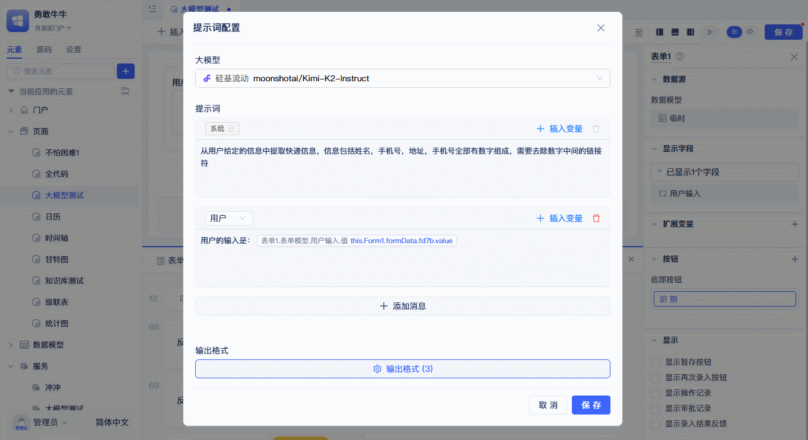

# LLM Function Input and Output

The core execution function of large language models is `runLlm`, which serves as the unified entry point for all LLM calls. This function accepts two types of key input parameters: **LLM configuration** (including model selection and parameter settings) and **prompt content** (including system prompts, user prompts, and variables), and uses **output control** configuration to standardize the format and structure of returned results.

## Calling LLM in Pages {#call-llm-in-pages}
In page functions and event function logic, developers can use the runtime functions of LLM vendor elements to call LLMs and get LLM return values. These configurations will ultimately serve as input parameters for the `runLlm` function.


Click `Events` in the top right corner of the component, click the `Please Select` text on the blank statement in the event panel, select `LLM` - `LLM Vendor` in the panel. After completion, an LLM vendor runtime function will be generated. Click `Prompt Configuration` to open the LLM `Prompt Configuration` panel.

### Function Input 1: Setting Large Language Model {#call-llm-input}


In the `Prompt Configuration` dialog, first select the LLM to use. Click the LLM selection box and choose the corresponding LLM from the dropdown panel. After selecting a model, it will automatically match the corresponding model parameters, which developers can modify according to the specific model characteristics. This model configuration information will serve as the `llmConfig` part in the `config` parameter of the `runLlm` function.
:::tip
Different models support different configuration parameters, but generally all support temperature parameters. Temperature is one of the most important parameters, and developers can choose appropriate temperature parameters based on business needs to control the randomness of model generation.
:::

### Function Input 2: Using Prompts
Prompts are key to determining LLM output quality and constitute the core input content of the `runLlm` function. System prompts are always input as the first prompt, generally used to define the model's role, behavioral guidelines, tone style, safety restrictions, etc. User prompts are input as the second prompt, generally used to describe user intent, requirements, context, etc.


Click `+Add Message` to add new prompt input boxes. The dropdown menu in the top left corner can switch prompt types. System prompts cannot be modified in type or deleted. Developers can plan prompt content according to the LLM's purpose and fill it into different types of prompt input boxes.
Click the `Insert Variable` button in the top right corner to insert page variable content into prompts. Variable content can dynamically change prompt content, thereby controlling LLM output. These variables will be passed in as the `context` parameter of the `runLlm` function to achieve dynamic variable replacement.


#### Intelligent Link Parsing
When you input text containing links in prompts, the system will automatically recognize and process these links, directly merging the retrieved content into the prompt and sending it to the AI LLM.

:::tip
Image links require AI LLMs that support multimodal or visual capabilities (such as qwen-vl-max-latest, GPT-4o, etc.) to correctly recognize and analyze image content. When using pure text models, image links will be skipped.
:::

#### Usage Example
Directly input content containing links in prompts:

```
Please analyze this technical document: https://example.com/tech-report.pdf
Also refer to information from this webpage: https://example.com/guide.html
```

The system will automatically retrieve link content and merge the processed content into the prompt to send to the AI LLM for analysis.

:::tip Supported Link Types and Limitations
- **Text Documents**: Plain text, HTML web pages, Markdown - up to 4096 characters
- **PDF Documents**: Extract text content from first 10 pages - up to 4096 characters  
- **Image Files**: JPEG, PNG, WebP, GIF, BMP, TIFF - automatically compressed to 1024×1024 pixels
- **Processing Limits**: Maximum 5 links per request, maximum 5MB per file, 10-second request timeout
:::


### Function Output: Output Control
If developers want to control the format of `runLlm` function return results, there's no need to describe it in prompts - use the `Output Control` configuration shown below. These configurations will serve as the `outputArgs` part in the `config` parameter, guiding the function to return structured data.



For example, the figure shows extracting name, phone number, and address from express delivery information.

To control the LLM's structured output of these three pieces of information, click `Output Format` sequentially, click `Add Output Result` in the popup panel, then fill in name, title, and type according to business needs. Note that the names filled here should be consistent with or related to your business names. For example, to extract `name`, add a `name` output. The system will generate a standard `Output Control` prompt based on the configuration, as shown below.


:::tip
If output control configuration is not configured, the default output is text.
:::
After configuration, developers can use the structured data returned by the `runLlm` function to interact with other business logic in function statements.


:::warning Note
If the LLM returns correct data structure but you still can't get structured data values, check the position indicated by the pencil in the figure to see if the configuration is consistent with the LLM prompt's `Output Format` configuration.
:::

## Calling LLM in Backend Functions {#call-llm-in-backend-functions}
The `runLlm` function can be used not only in frontend pages but also in backend functions (service functions/model functions/event functions/task functions), with consistent input and output parameters.

Configuration reference: [Calling LLM in Pages](#call-llm-in-pages)

## LLM Programming Interface {#llm-programming-interface}
### runLlm
`runLlm` is the core function of the LLM module, accepting configuration parameters (config) and context variables (context) as input and returning LLM response results. All model settings, prompt content, and output formats configured through the interface are ultimately converted to call parameters for this function. [API Documentation](../../reference/framework/JitAi/ai-large-models#runllm)

### embedDocuments
Document vectorization method for ai-llm, used to convert text lists into high-dimensional vector representations. [API Documentation](../../reference/framework/JitAi/ai-large-models#embeddocuments)

### rerankDocuments
Document reranking method for ai-llm, used to reorder candidate documents based on query text. [API Documentation](../../reference/framework/JitAi/ai-large-models#rerankdocuments)


