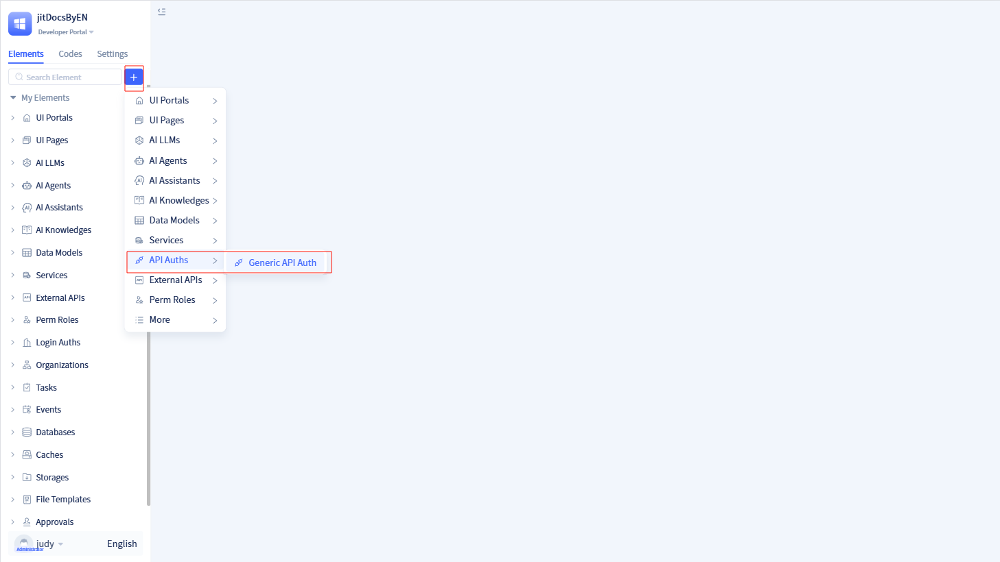
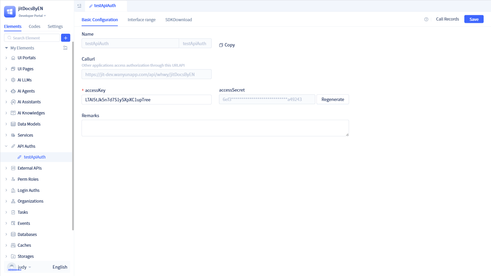

# Creating API Authorization Elements
API Authorization is the process of controlling access permissions to interfaces (APIs), designed to ensure that only authorized external callers can access specific resources or perform specific operations.

## Creating New API Authorization {#api-authorization-creation}

Click the `+` button on the left element tree to open a popup. Move your mouse to "More" and you will see "API Authorization". Click "Standard Authorization" within "API Authorization" to open the new standard authorization popup page.

In the new standard authorization popup page, fill in the API authorization name and accessKey, then click `Save` to create a new API authorization.

:::tip Tip
The accessKey is the secret key for API authorization, consisting of an 8-32 character string of letters or numbers, and cannot contain special characters.

Before creating API authorization, the system will first generate an accessSecret based on the accessKey. The accessKey and accessSecret are the credentials for API authorization access.

:::

## API Authorization Details {#api-authorization-detail}

After developers click `Confirm` in the new API authorization popup, the page will redirect to the authorization list page and display the newly created authorization information. Alternatively, you can view all created authorization information by clicking `API Authorization` in the left element tree.

In the API details page, you can view authorization information including authorization name, accessKey, accessSecret, call address, authorized interfaces, and other information. The `call URL` is the call address for the authorized interface, which callers can use to make calls. `Authorized interfaces` can authorize service functions and other elements in the current application.

There is a `Copy` button in the upper left corner of the authorization details page. Clicking `Copy` will copy the authorization information to the clipboard.

:::warning Note

On the authorization page, developers can modify the accessKey. After modifying the accessKey, please make sure to regenerate a new accessSecret, otherwise validation will fail.

:::

## Call Records

When callers initiate calls, JitAi will generate call records.

In the authorized API's visual editor, click `Call Records` in the upper right corner to open the call records popup.

In the call records popup, you can view information such as interface address, call time, call IP, call results, and can also filter by call result status and call time.