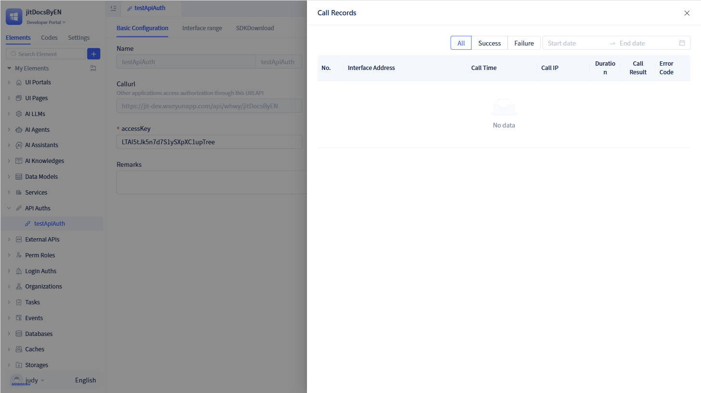

# Creating API Authorization Elements

API Authorization is a mechanism for controlling access permissions to interfaces (APIs), ensuring that only authorized external callers can access specific resources or perform designated operations.

## Creating new API authorization {#api-authorization-creation}

Click the `+` button in the element tree on the left to open a dialog. to reveal "API Auths", then click "Generic API Auth" to open the creation dialog.

In the generic API auth creation dialog, enter the API name and accessKey, then click `Save` to create a new API authorization.

:::tip Tip
The accessKey serves as the authentication key for API authorization. It must be an 8-32 character string containing only letters or numbers—special characters are not permitted.

When creating API authorization, the system automatically generates an accessSecret based on the accessKey. Both the accessKey and accessSecret serve as authentication credentials for API access.

:::

## API authorization details {#api-authorization-detail}

After clicking `Confirm` in the creation dialog, the page redirects to the authorization list, displaying the newly created authorization. You can also view all created authorizations by clicking `API Auths` in the element tree on the left.

The authorization details page displays comprehensive information, including the authorization name, accessKey, accessSecret, call URL, and authorized interfaces. The `Callurl` represents the endpoint that external callers use to make requests.

A `Copy` button located in the upper left corner of the authorization details page allows you to copy the authorization information to your clipboard.

:::warning Note

You can modify the accessKey on the authorization page. However, after modifying the accessKey, you must regenerate a new accessSecret, otherwise authentication will fail.

:::

## Call records {#call-records}

JitAi generates call records whenever external callers make requests.

In the authorized API's visual editor, click `Call Records` in the upper right corner to open the call records dialog.

The call records dialog displays information such as interface address, call time, caller IP, call results, and provides filtering options by result status and call time.