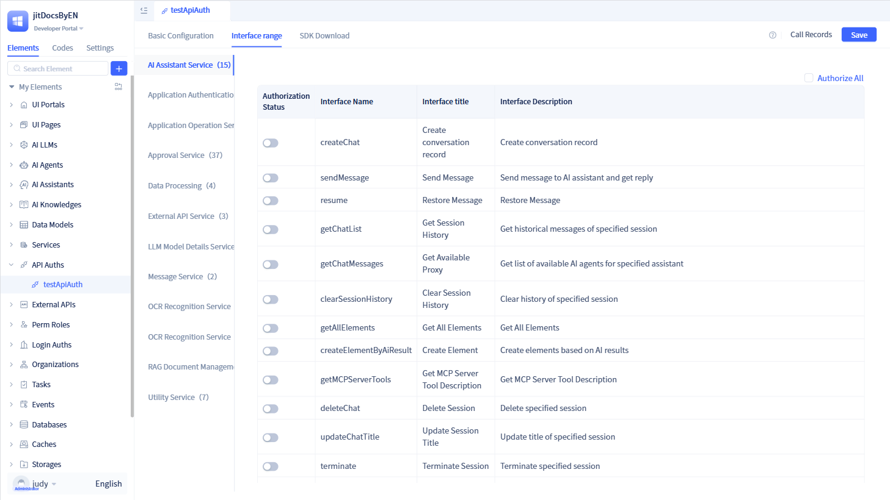

# API Exposure Examples for Various Elements

After creating API authorization elements and configuring authorization information, you can expose system functions such as service functions, data models, large model functions, agents, AI assistants, approval workflows, and other features to external access. Currently, the system only supports API authorization for service functions.

## API Authorization for Service Functions {#service-function-api-authorization}

API authorization for service functions means exposing service functions for external calls. In the authorization details page, click the `Service` tab to perform API authorization for service functions.

Each function in the service can be authorized independently by turning on the `Authorization Status` switch in front of the corresponding interface name, or you can click `Authorize All` in the upper right corner to expose all functions.

## API Authorization for Data Models {#data-model-api-authorization}

Coming soon...

## API Authorization for Large Language Model Functions {#large-language-model-function-api-authorization}

Coming soon...

## API Authorization for AI Agents {#agent-api-authorization}

Coming soon...

## API Authorization for AI Assistants {#ai-assistant-api-authorization}

Coming soon...

## API Authorization for Approval Processes {#approval-process-api-authorization}

Coming soon...
