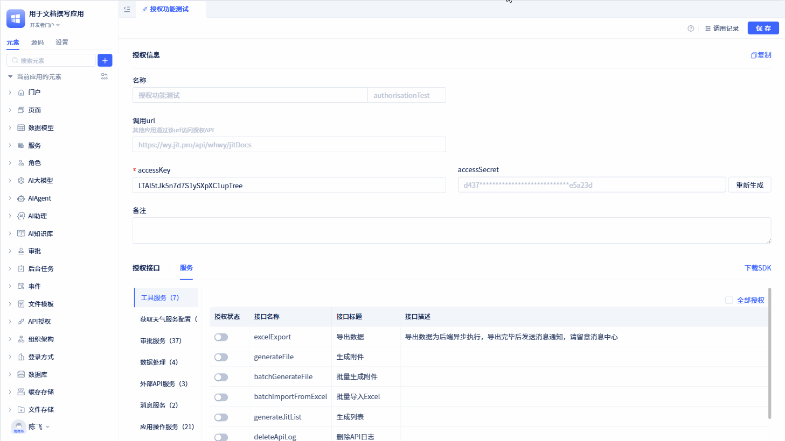

# Using Cross-App Service Elements to Call Authorized Element APIs

When the caller is also a JitAi application, in addition to implementing through SDK, you can also directly use [Cross-App Service Elements](../business-logic-development/creating-service-elements#use-cross-app-service-elements-to-call-authorized-interfaces) to call interfaces exposed by the authorization party.

Click the `Copy` button on the authorization details page, and paste the copied authorization information into the cross-app service element.

