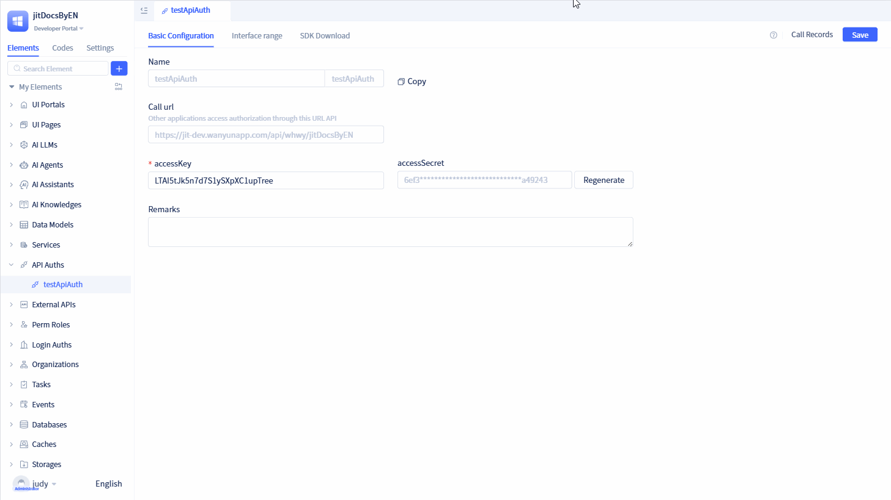

# Using Cross-App Service Elements to Call Authorized Element APIs

When your caller is also a JitAi application, in addition to using the SDK approach, you can directly leverage [Cross-App Service Elements](../business-logic-development/creating-service-elements#use-cross-app-service-elements-to-call-authorized-apis) to invoke authorized interfaces.

## Using cross-app service elements {#using-cross-app-service-elements}

On the authorization details page, click the `Copy` button, then paste the authorization information into your cross-app service element.

